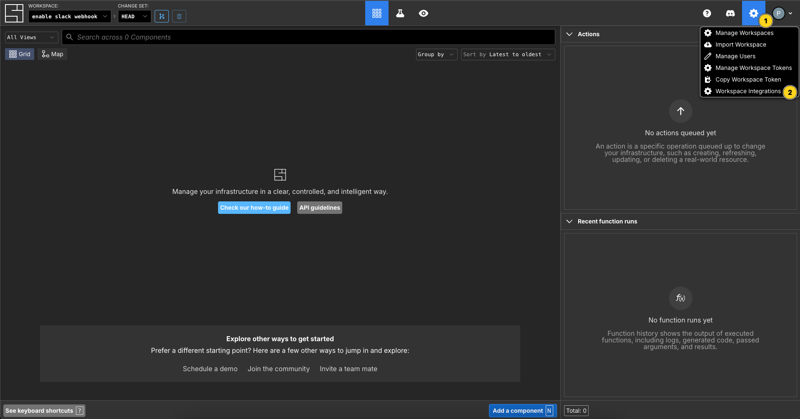

---
outline:
  level: [2, 3, 4]
---

# Slack Webhook for Change Set Notifications

As part of the work to enable
[fine-grained access control](https://www.systeminit.com/blog/announcing-fine-grained-access-control),
you can now use a [Slack webhook](https://api.slack.com/messaging/webhooks) to
receive notifications about change set interactions. A webhook integration is
required per workspace. The notifications that are supported are:

- Change Set approval requested
- Change Set approval withdrawn
- Approval granted
- Approval rejected
- Change Set applied

## Creating the Integration

A Slack webhook integration can be created by following the steps below:

- Go to the `Workspace Settings` menu
- Click on `Workspace Integrations`
- Paste the webhook URL into the `Slack Webhook Url` field in the integrations
  modal.

Please note: The Slack webhook URL is available for all users of the workspace to
see, but changing a Slack webhook is limited to
[workspace owners and approvers](https://docs.systeminit.com/reference/authorization-roles).

All changes to the Slack webhook will be logged in the workspace audit log.
