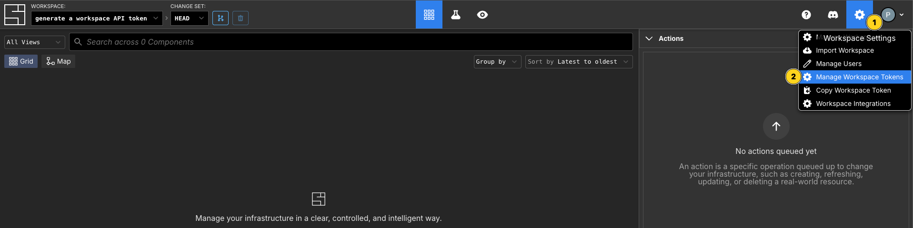
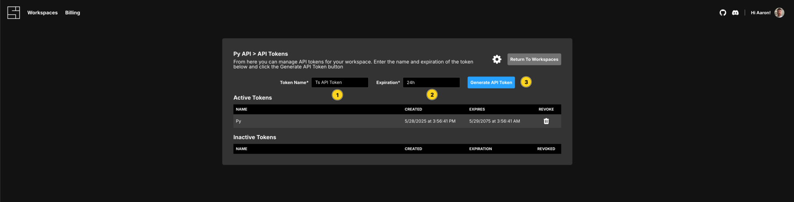
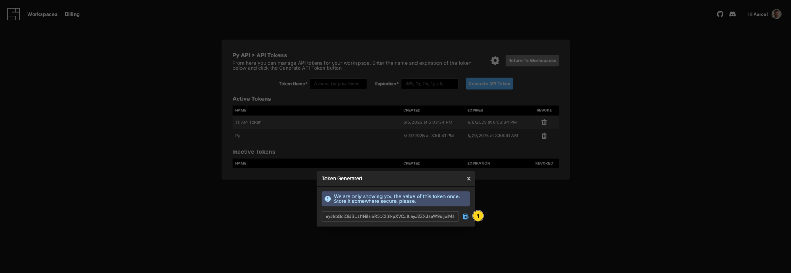
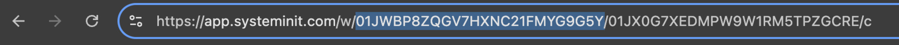

---
outline:
  level: [2, 3, 4]
---

# Create an API token for your workspace

Click the Cog icon in the top right corner of the workspace, then select `Manage Workspace Tokens`.

Enter a `Token Name` and a value in the `Expiration` field, and click `Generate API Token`. The Expiration values should be provided like `1d`, `1w`, `1m`, `1y` or `24h`, `48h`, `72h` for example.

Copy the generated token and save it somewhere safe. You will not be able to see it again.

## Get your Workspace ID

To get your `Workspace Id`, view the URL in the browser address bar. The `Workspace Id` is the string of characters after `/w/`.

