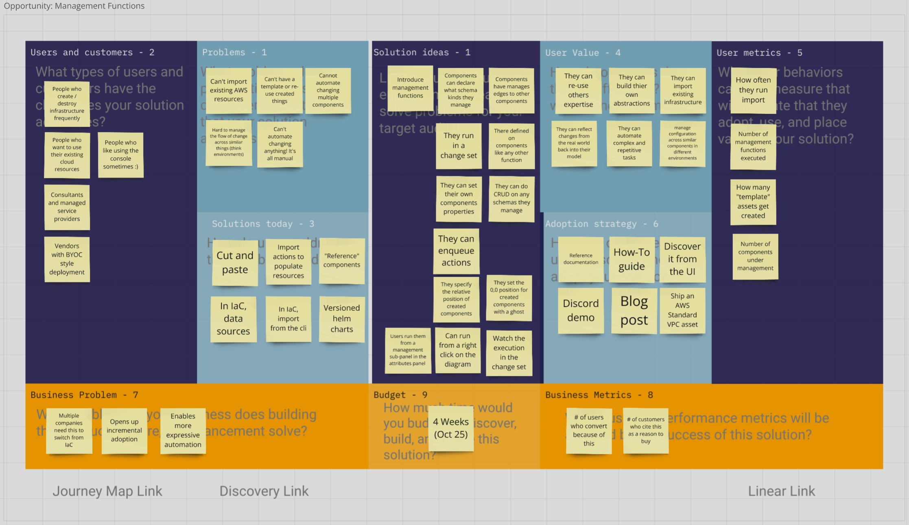
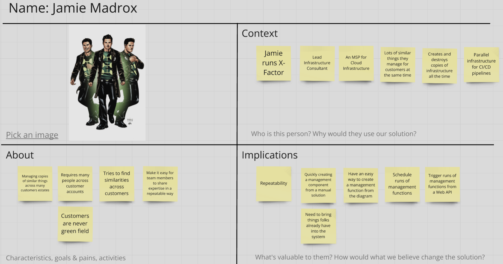
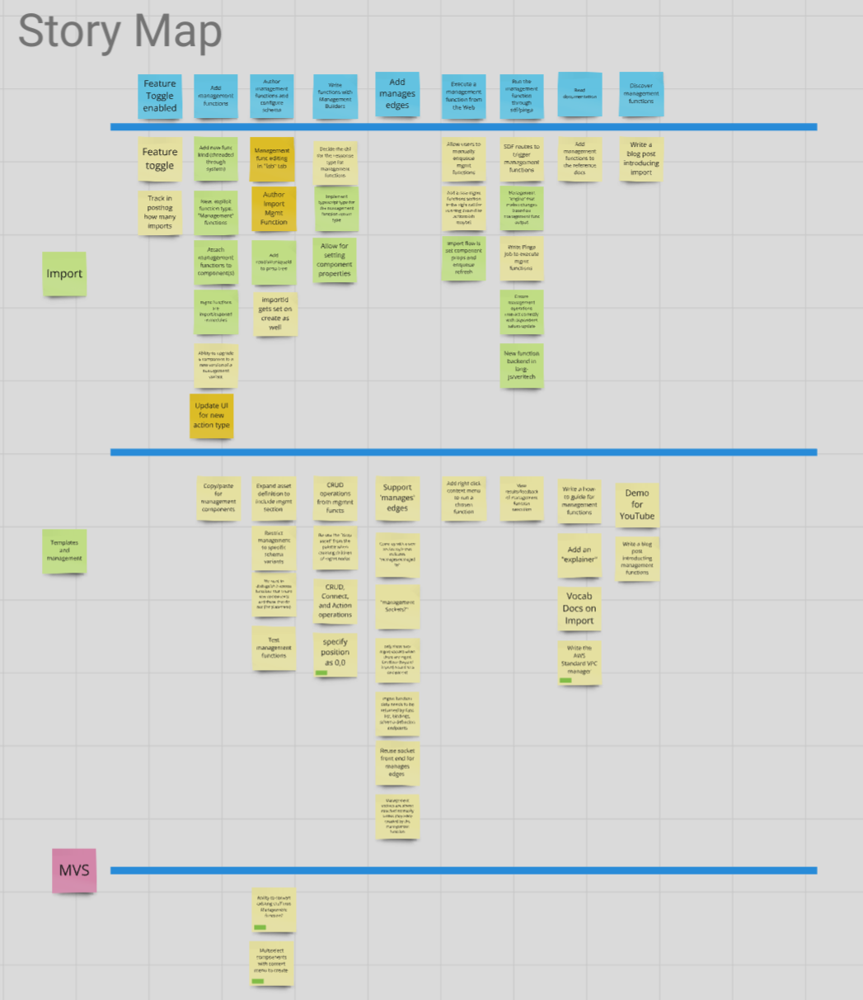
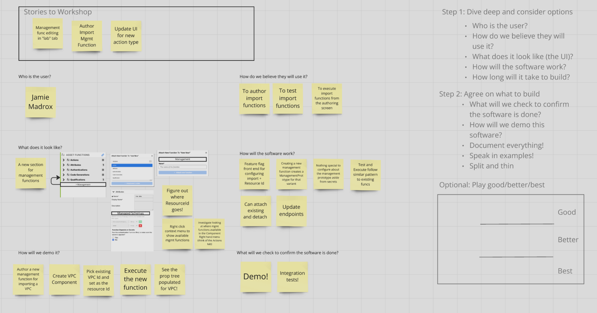

---
outline:
  level: [2, 3, 4]
---

# Working on System Initiative

The System Initiative software is [open
source](https://systeminit.com/open-source), and we try to work in public as
much as possible. Our goal with this section is to help you understand how we
work as a product and engineering team to help you find ways to collaborate
with us: by writing code, by giving feedback, or by just talking with each other
on [Discord](https://discord.gg/system-init).

## How We Decide What To Do

When we're deciding what we should work on or what we will accept as an outside
contribution, we're always looking at it through 3 lenses:

* Product, which is responsible for deciding what our priorities are, and what
directions we should pursue.
* Engineering, which is responsible for deciding how the technology will be built
and maintained.
* User Experience, which is responsible for deciding how the product is experienced
by the user.

All three exercise their responsibility primarily through editorial control
rather than directing every detail of anybody's work. We will sometimes refer
to these people as the Triad.

Ultimately, it is up to our Product team to decide what goes into System
Initiative. In practice, it's a consensus between Product, Engineering,
and User Experience.

### Storytelling

System Initiative's product and engineering process is centered around
collaborative storytelling. We don't think in terms of specific features, we think
in terms of outcomes we want to deliver to users and then work together to
find the best answer.

We tell stories about those outcomes to each other at various levels of scale:

* The [Roadmap](https://docs.systeminit.com/roadmap/) contains high-level
  themes, which we use to focus the team on what's most important.
* Then, we find Opportunities to improve the product within those themes, which we
  then evaluate using an Opportunity Canvas.
* If we pursue an Opportunity, we build a Persona and a Story Map.
  A Persona helps us refine who we are solving the problem for, and the Story Map
  charts the course for all the tasks we need to accomplish to deliver on
  the Opportunity.
* We then assess the Story Map and decide what the right next set of work is to do
  by running Workshops.

### Roadmap Themes

System Initiative's [Roadmap](https://docs.systeminit.com/roadmap/) contains the
high-level themes we're focused on. Typically, these are themes that will run for
a long time - think on the level of quarters at least, but more frequently, a year
or more.

### Opportunities

Opportunities let us explore what problems we are trying to solve, who we are
solving them for, how they solve the problem today, and what value that will get
out of our solution, and how we'll understand if we deliver on that
value. They also clarify why this opportunity matters for System Initiative as
a business.

Each opportunity is assigned either a budget or a deadline, and both are
decided collectively by the engineers, product folks, and UX designers involved. Budgets give our imaginations boundaries - there
isn’t enough time to build everything we want, so we need a way to focus on what
we think will prove that the solution meets the outcome. We sometimes
extend budgets if needed, and sometimes, we even scrap an
opportunity if we learn that the solution is not working out.

Deadlines, however, are high-integrity commitments we make to each
other. They’re usually driven by a need for high coordination, such as customer
commitments, special events (like our launch), etc. We do everything in our
power not to miss a deadline.

### Personas

We build a new persona for each opportunity we work on. These help us clarify
exactly who we are solving the problem for, and help to spur our imaginations
about what would make a great outcome for them.

### Story Maps

Story maps are a living reference for executing an opportunity. They are
made up of all the different tasks (of all shapes and sizes), the team can
imagine needing to be done to accomplish the outcome described in the
opportunity. Those tasks get sorted into a narrative flow, expressed as a backbone running across the top of the map. Then they are
broken down into slices, allowing us to deliver the story incrementally.

### Workshops

As we work on the opportunity, we refer back to the map frequently - we take
a small piece of work, informed by what we learned previously, and then
get clarity on how we want to execute on the next step by running a Workshop.

We ask ourselves who the user is, how they will use this next piece of work,
what it looks like, how the software will work, how we will demo it,
and what will we check to confirm the software is done.

With that in hand, an engineering team can get to work.

## How You Can Participate

For every opportunity we take, we aim to:

* Publish a blog that walks you through the opportunity
* Publish a video walk-through of the opportunity, persona, and story map
* Update the Roadmap
* Post weekly demos to YouTube and our [Changelog](../changelog/index.md)

The simplest way to participate is to give us feedback on
[Discord](https://discord.gg/system-init).

If you'd like to make a larger contribution, you can contact
us on Discord, and we can run this process together. It will help us align on
the solution before you start writing code and ensure we're all aligned
before you invest a lot of time.
