---
outline:
  level: [2, 3, 4]
---

# How to deploy an application to AWS ECS

This how-to assumes:

- Basic [familiarity with System Initiative](../tutorials/getting-started)
- You have completed the
  [build an AWS VPC with System Initiative tutorial](./aws-vpc) (and not deleted
  the resulting resources)

It will teach you how to create an AWS ECS cluster and deploy an application to
it with System Initiative.

We will cover:

- The creation of an ECS cluster with a deployed service
- An AWS Application Load Balancer
- The networking required to allow the ECS service to service traffic to the
  load balancer

## Setup

All activities in this how-to happen within a configured VPC, AWS Region and AWS
Credential.

Start in a Change Set named `ECS How-to`.

## Walkthrough

### What it will look like

When you are through with this guide, you should have Components that look like
this in your Diagram:

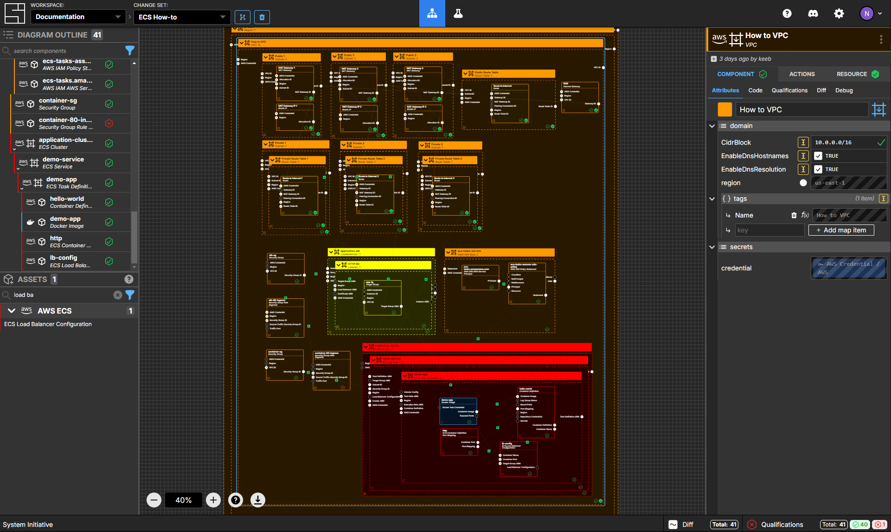

### Create a Loadbalancer Component

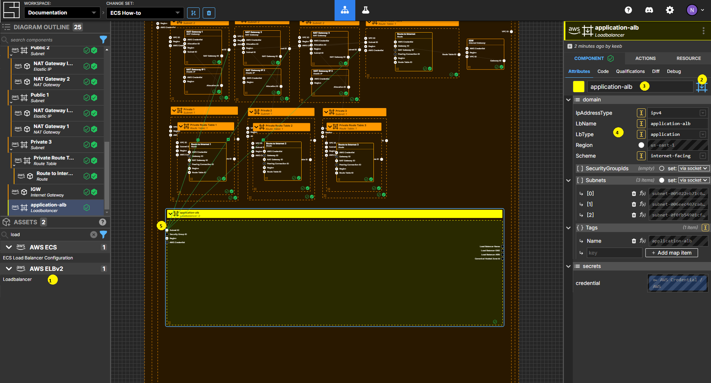

Add a `AWS::ElasticLoadBalancingV2::LoadBalancer` to your `VPC How-to` vpc frame.

Set the Component type to `Down Frame`.

Set the Component name to `application-alb`.

Set the `IpAddressType` to `ipv4`.

Set the `Name` to `application-alb`.

Set the `Scheme` to `internet-facing`.

Set the `Type` to `application`.

Connect the `Subnet Id` Output Socket of each of the public subnet Components to
the `Subnets` Input Socket of the `application-alb` Component.

### Create a Security Group Component for the Loadbalancer

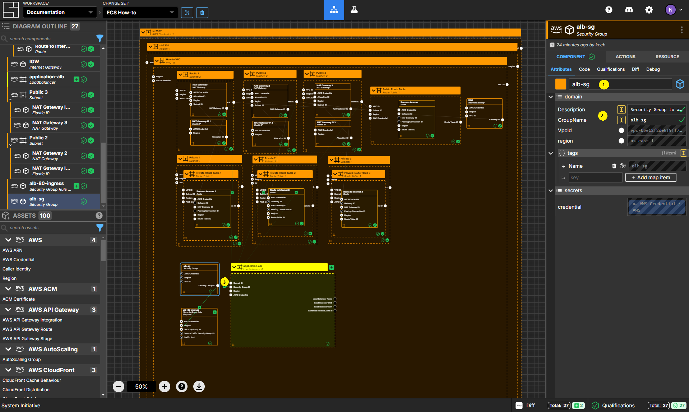

Add a `AWS::EC2::SecurityGroup` to your `VPC How-to` vpc frame.

Set the Component name to `alb-sg`.

Set the `GroupDescription` to be `Security Group to allow access to the Loadbalancer`

Set the `GroupName` to `alb-sg`.

Connect the `Group Id` Output Socket of `alb-sg` Component to the
`Security Groups` Input Socket of the `application-alb` frame.

### Create a Security Group Ingress Rule Component

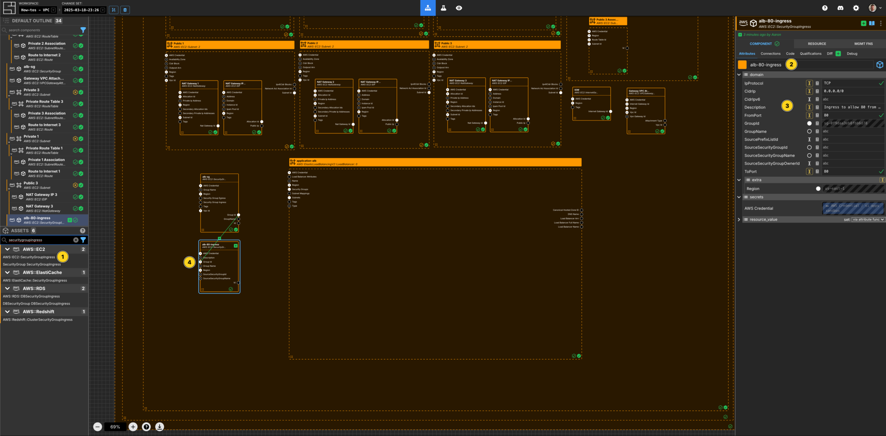

Add a `AWS::EC2::SecurityGroupIngress` Component to your `VPC How-to` vpc frame.

Set the Component name to `alb-80-ingress`.

Set the `IpProtocol` to `TCP`.

Set `CidrIp` to be `0.0.0.0/0`.

Set the `Description` to `Ingress to allow 80 from the world`.

Set `FromPort` to be `80`.

Set `ToPort` to be `80`.

Connect the `Group Id` Output Socket of `alb-sg` Component to the
`Group Id` Input Socket of this `alb-80-ingress` Component.

### Create a Listener Component

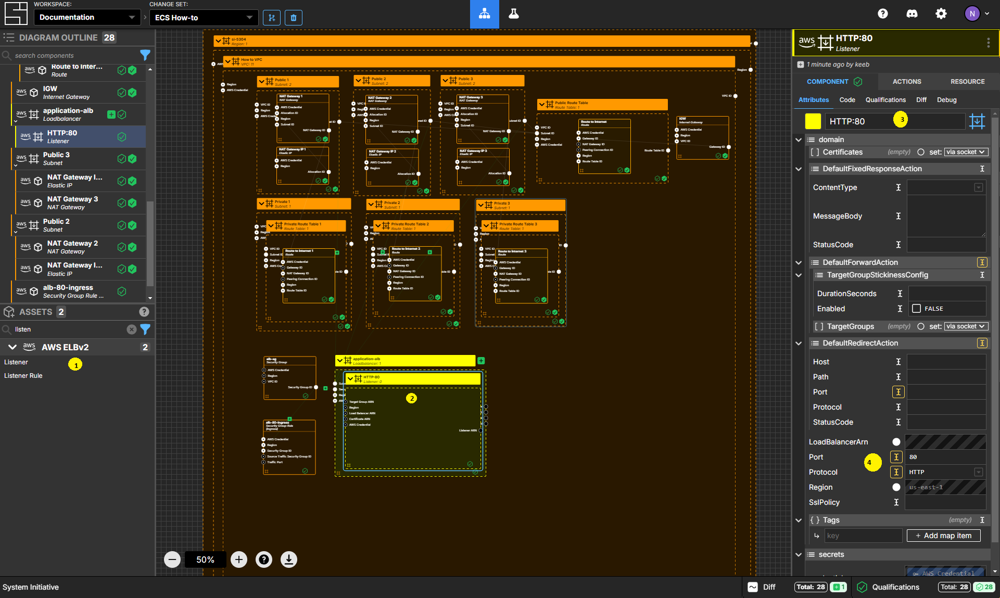

Add a `AWS::ElasticLoadBalancingV2::Listener` Component to your `application-alb` loadbalancer frame.

Set the Component type to `Down Frame`.

Set the Component name to `HTTP:80`.

Set the `Port` to be `80`.

Set the `Protocol` to be `HTTP`.

Resize the frame to be large enough to fit another Component.

### Create a Target Group

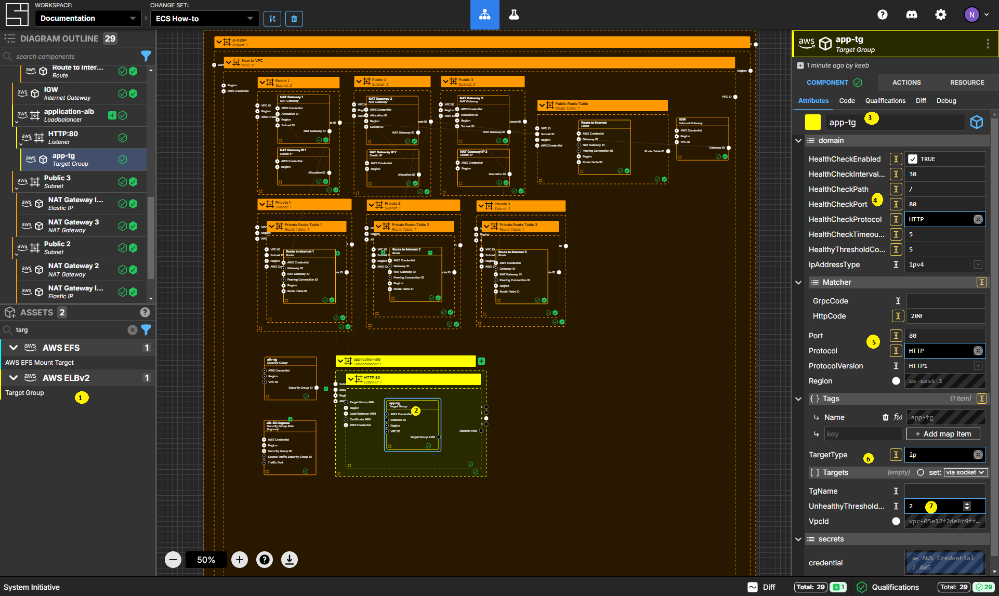

Add a `AWS::ElasticLoadBalancingV2::TargetGroup` Component to your `Listener` frame.

Set the Component name to `app-tg`.

Set `HealthCheckEnabled` to `TRUE`.

Set `HealthCheckIntervalSeconds` to `30` seconds.

Set `HealthCheckPath` to `/`.

Set `HealthCheckPort` to `80`.

Set `HealthCheckProtocol` to `HTTP`.

Set `HealthCheckTimeoutSeconds` to `5`.

Set `HealthyThresholdCount` to `5`.

Set `IpAddressType` to `ipv4`

Set `Name` to be `app-tg`.

Set `Port` to `80`.

Set `Protocol` to `HTTP`.

Set `ProtocolVersion` to `HTTP1`

Set `TargetType` to `ip`.

Set `UnhealthyThresholdCount` to be `2`.

Set `HttpCode` to `200`.

### Create a Listener Default Action

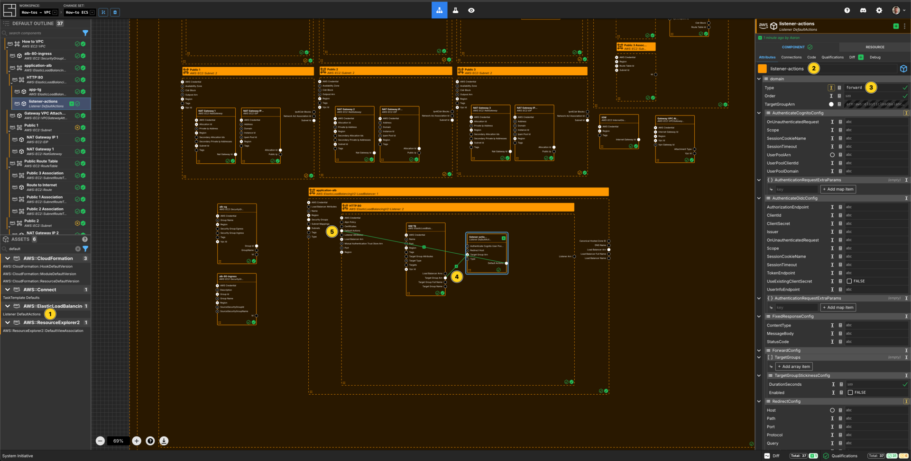

Add a `Listener DefaultActions` Component to your `Listener` frame.

Set the Component name to `listener-actions`.

Set `Type` to `forward`.

Connect the `Target Group Arn` Output Socket of the `app-tg` Component to the
`Target Group Arn` Input Socket of the `listener-actions` Component.

Connect the `Default Actions` Output Socket of the `listener-actions` Component to the `Default Actions` Input Socket of the `HTTP:80` Listener Component.

### Create an IAM Role

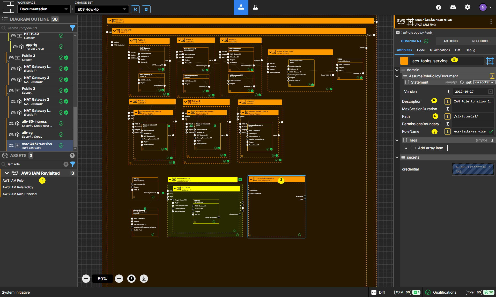

Add an `AWS::IAM::Role` Component to your `VPC How-to` vpc frame.

Set the Component name to `ecs-tasks-service`.

Set the `RoleName` to `ecs-tasks-service`.

Set the `Path` to `/si-tutorial/`.

Set the `Description` to `IAM Role to allow ECS to spawn tasks`.

### Create an AWS IAM Policy Statement

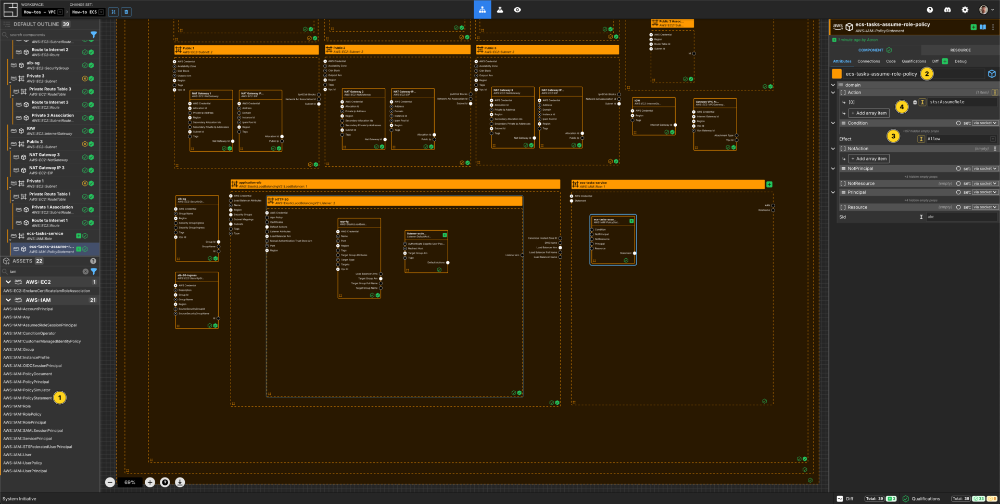

Add an `AWS::IAM::PolicyStatement` within the `ecs-tasks-service` AWS IAM Role
frame.

Set the Component name to `ecs-tasks-assume-role-policy`.

Add an array item to the `Action` array.

Set the `[0]` value for the `Action` array to `sts:AssumeRole`.

Set the `Effect` to `Allow`.

### Create an AWS IAM Service Principal

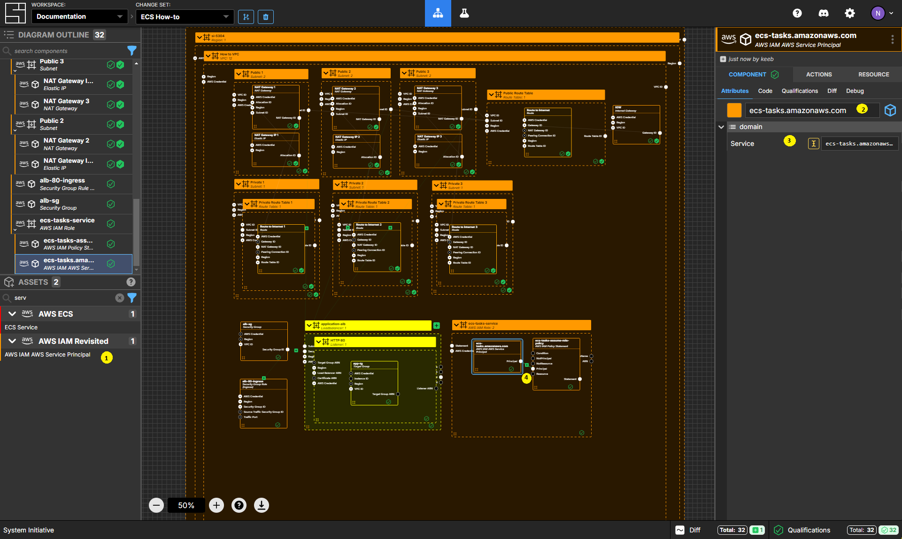

Add an `AWS::IAM::ServicePrincipal` within the `ecs-tasks-service` AWS IAM Role
frame.

Set the Component name to `ecs-tasks.amazonaws.com`.

Set the `Service` to `ecs-tasks.amazonaws.com`.

Connect the `Principal` Output Socket of the `ecs-tasks.amazonaws.com` AWS IAM Service Principal to the `Principal` Input Socket of your `ecs-tasks-assume-role-policy` AWS IAM Policy Statement.

### Create a Security Group Component for the Application

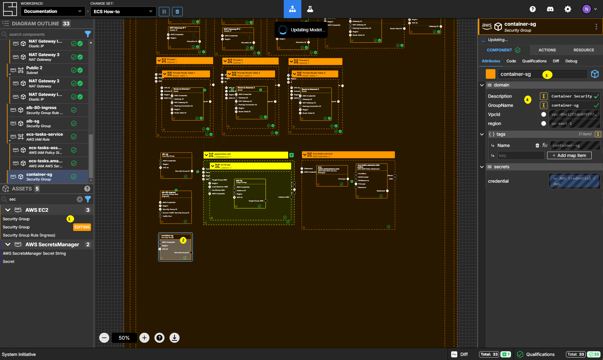

Add a `AWS::EC2::SecurityGroup` to your `VPC How-to` vpc frame.

Set the Component name to `container-sg`

Set the `GroupDescription` to be `Container Security Group`

Set the `GroupName` to `container-sg`.

### Create an Ingress Rule Component for the Application

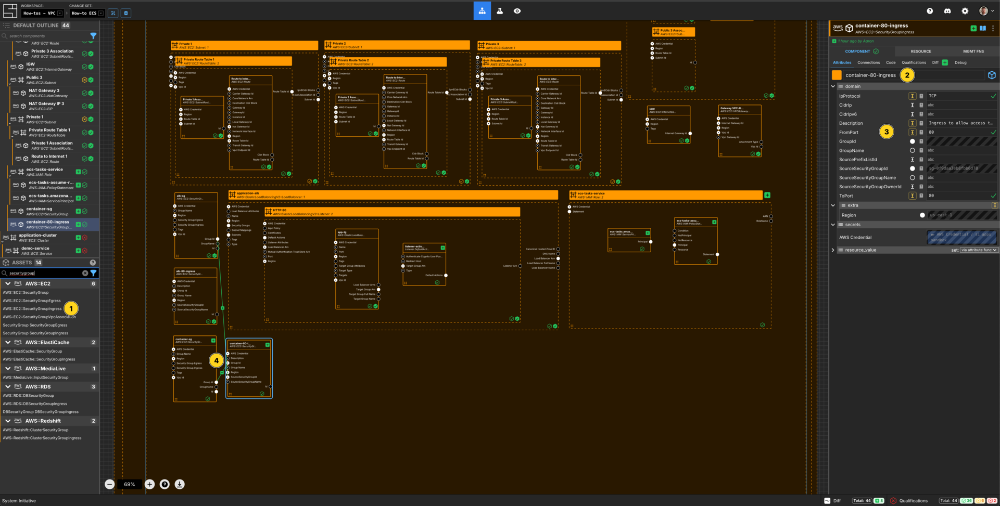

Add a `AWS::EC2::SecurityGroupIngress` to your `VPC How-to` vpc frame.

Set the Component name to be `container-80-ingress`.

Set the `IpProtocol` to `TCP`.

Set the `Description` to be `Ingress to allow access to port 80`.

Set `FromPort` to be `80`.

Set `ToPort` to be `80`.

Connect the `Group Id` Output Socket of `container-sg` Component to the
`Group Id` Input Socket of this`container-80-ingress` Component.

Connect the `Group Id` Output Socket of `alb-sg` Component to the
`SourceSecurityGroupId` Input Socket of this `container-80-ingress`
Component.

### Create an ECS Cluster

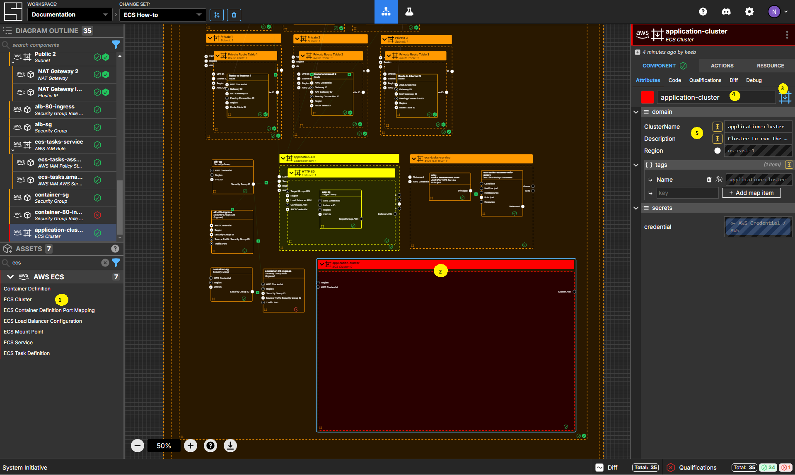

Add an `AWS::ECS::Cluster` to your `VPC How-to` vpc frame.

Set the Component type to be `Down Frame`.

Set the Component name to `application-cluster`.

Set the `ClusterName` to `application-cluster`.

### Create a ECS Capacity Provider Strategy

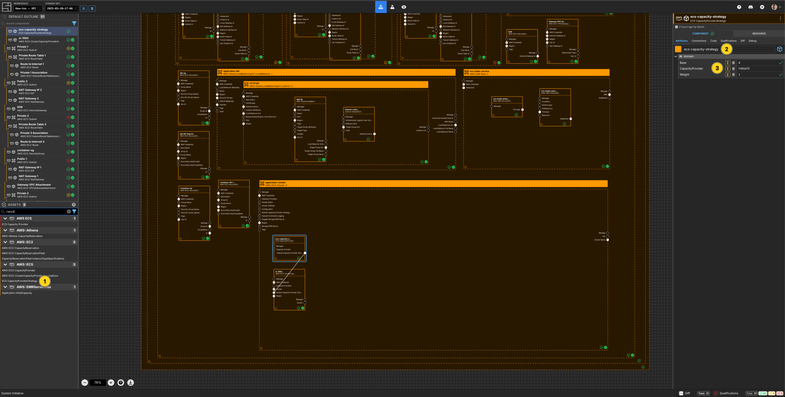

Add a `ECS CapacityProviderStrategy` component to the `application-cluster` frame.

Set the Component name to `ecs-capacity-strategy`.

Set `Base` to `0`.

Set `CapacityProvider` to `FARGATE`.

Set `Weight` to `1`.

### Create a ECS Cluster Capacity Provider Association

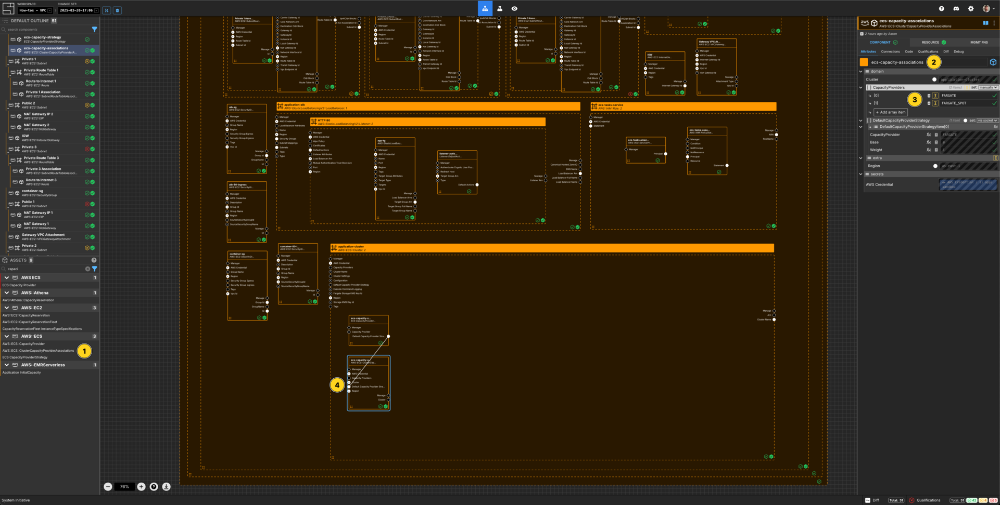

Add an `AWS::ECS::ClusterCapacityProviderAssociations` Component to the `application-cluster` frame.

Set the Component name to `ecs-capacity-associations`.

Add two array items to the `CapacityProviders` array.

Set the `[0]` value for the `CapacityProviders` array to `FARGATE`.

Set the `[1]` value for the `CapacityProviders` array to `FARGATE_SPOT`.

Connect the `Default Capacity Provider Strategy` Output Socket of the `ecs-capacity-strategy` Component to the `Default Capacity Provider Strategy` Input Socket of this `ecs-capacity-associations` Component.

### Create an ECS Service

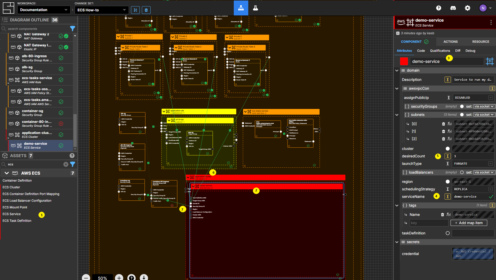

Add an `AWS::ECS::Service` to your `application-cluster` cluster frame.

Set the Component type to be `Up Frame`.

Set the Component name to `demo-service`.

Set the `DesiredCount` to be `1`.

Set the `ServiceName` to `demo-service`.

Connect the `Subnet ID` Output Socket of each of the private subnet Components
to the `Network Awsvpc Security Groups` Input Socket of this `demo-service` Component.

Connect the `Id` Output Socket of `container-sg` Component to the
`Network Awsvpc Security Groups` Input Socket of this `demo-service` Component.

### Create an ECS Task Definition

Add an `AWS::ECS::TaskDefinition` to your `demo-service` service frame.

Set the Component type to be `Frame Up`.

Set the Component name to `demo-app`.

Set `Cpu` to be `256`.

Set the `Family` to be `demo-app`.

Set `Memory` to be `512`.

Set `NetworkMode` to be `awsvpc`.

Click `set: manually` on `RequiresCompatibilities`, then `Add array item`.

In item [0] add the value `FARGATE`.

Connect the `Task Definition Arn` Output Socket of the TaskDefition to the `Task Defition` input Socket of the ECS Service.

Connect the `ARN` Output Socket of the `ecs-tasks-service` AWS IAM Role to the `Task Role ARN` Input Socket of your `demo-app` ECS Task Definition.

### Create a Container Definition

Add a `TaskDefinition ContainerDefinitions` Component to your `demo-app` frame.

Set the Component name to `hello-world`.

Set `Name` to `hello-world`.

Set `Essential` to `TRUE`.

### Create a Docker Image

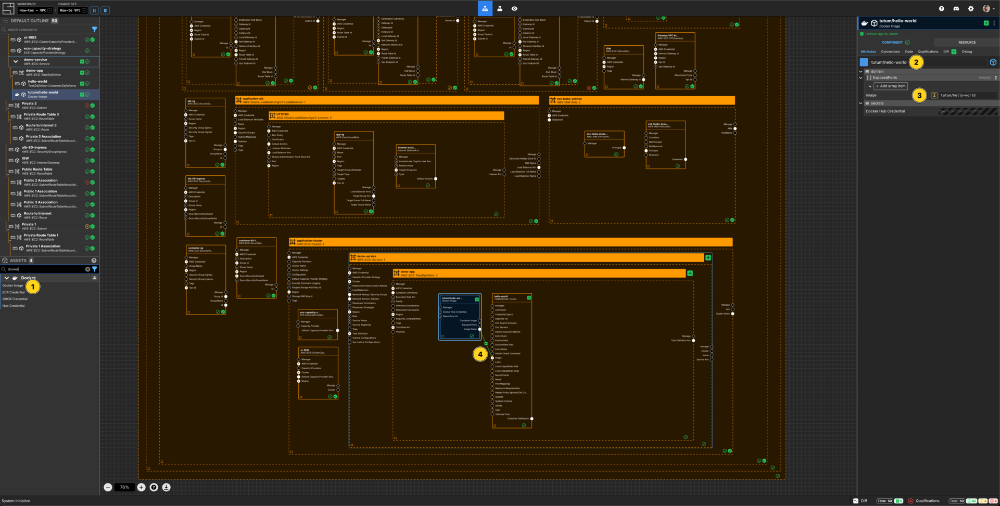

Add a `Docker Image` Component to your `demo-app` frame.

Set the Component name to `tutum/hello-world`.

Set `image` to be `tutum/hello-world`.

Connect the `Image Name` Output Socket of this `tutum/hello-world` Docker Image to the `Image` Input Socket of the `hello-world` Container Defintion.

### Create an ECS Container Definition Port Mapping

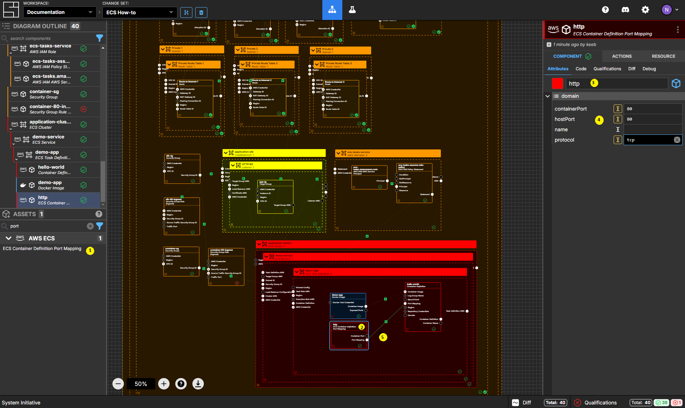

Add a `ContainerDefinitions PortMappings` Component to the `demo-app` frame.

Set the Component name to be `http`.

Set the `ContainerPort` to be `80`.

Set the `HostPort` to be `80`.

Set the `Name` to be `http`.

Set the `Protocol` to be `tcp`.

Connect the `Port Mappings` Output Socket of this `http` ECS ContainerDefintions PortMappings Component to the `Port Mappings` Input Socket of the `hello-world` TeskDefinition ContainerDefintions Component.

### Create a ECS Load Balancer Configuration

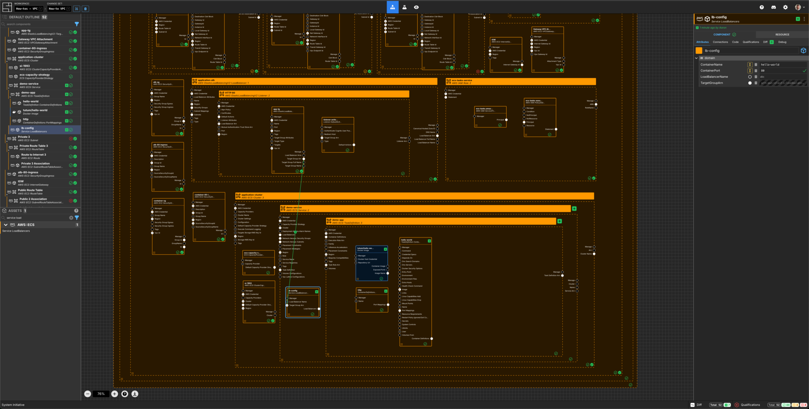

Add a `Service LoadBalancers` Component to the `demo-service` frame.

Set the Component name to be `lb-config`.

Set the `ContainerName` to be `hello-world`.

Set the `ContainerPort` to `80`.

Connect the `Target Group Arn` Output Socket of the `app-tg` Target Group to the
`Target Group Arn` Input Socket of this `lb-config` Component.

### Apply your Change Set

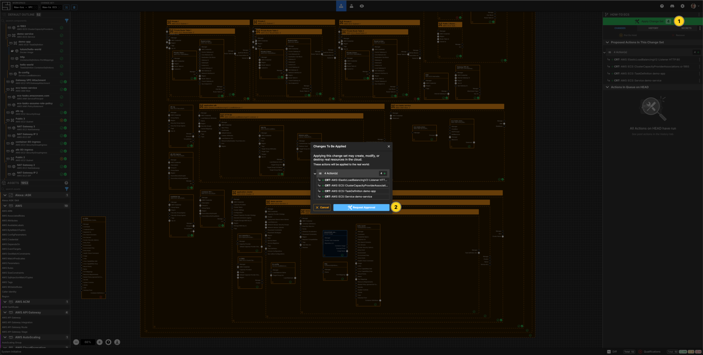

Press `Escape` or click anywhere on the canvas background to select the
Workspace.

Click the `Apply Change Set` button.

Click the `Request Approval` button.

Click the `Approve Request` button.

Click `Apply Change Set` to:

- Create 2 Security Groups and associated ingress rules
- Create an application load balancer, a listener and a target group
- Create an IAM Role and IAM Instance Profile
- Create an ECS Cluser and the associated service with a running task

### Explore your resources

Review the completed AWS resources by clicking the `Resource` sub-panel for each
of your new resources.

### Clean Up

Create a new Change Set called `Clean up How-to`

Delete your `VPC How-to` VPC frame. All of the Components inside will be marked
for deletion.

Click `Apply Change Set`.

All your new resources should be deleted from your AWS account.

## Vocabulary
In this guide bits of System Initiative Vocabulary will be shown with a capital letter. 
All definitions for these can be found here: [System Initative - Vocabulary](https://docs.systeminit.com/reference/vocabulary) 