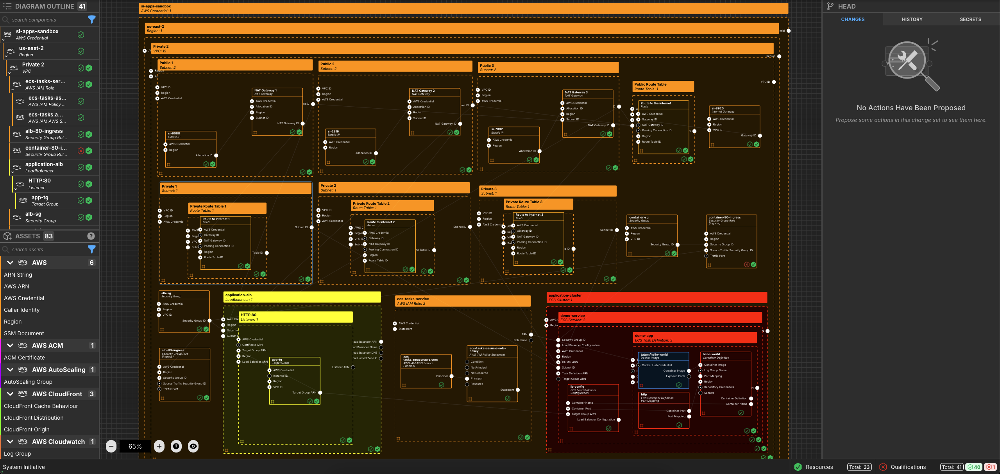

---
outline:
  level: [2, 3, 4]
---

# How to deploy an application to AWS ECS

This how-to assumes:

- Basic [familiarity with System Initiative](../tutorials/getting-started)
- You have completed the
  [build an AWS VPC with System Initiative tutorial](./aws-vpc) (and not deleted
  the resulting resources)

It will teach you how to create an AWS ECS cluster and deploy an application to
it with System Initiative.

We will cover:

- The creation of an ECS cluster with a deployed service
- An AWS Application Load Balancer
- The networking required to allow the ECS service to service traffic to the
  load balancer

## Setup

All activities in this how-to happen within a configured VPC, AWS Region and AWS
Credential.

Start in a change set named `ECS How-to`.

## Walkthrough

### What it will look like

When you are through with this guide, you should have components that look like
this in your diagram:

### Create a Loadbalancer component

Add a `Loadbalancer` to your `VPC How-to` vpc frame.

Set the component type to be `Configuration Frame (down)`.

Set the component name to `application-alb`.

Set the `LbName` to `application-alb`.

Set the `IpAddressType` to be `ipv4`.

Set the `LbType` to be `application`.

Set the `Scheme` to be `internet-facing`.

Connect the `Subnet ID` output socket of each of the public subnet components to
the `Subnet ID` input socket of the `application-alb` component.

### Create an EC2 security group component for the Loadbalancer

Add a `Security Group` to your `VPC How-to` vpc frame.

Set the component name to `alb-sg`.

Set the `GroupName` to `alb-sg`.

Set the `Description` to be `Security Group to allow access to the Loadbalancer`

Connect the `Security Group ID` output socket of `alb-sg` component to the
`Security Group ID` input socket of the `application-alb` frame.

### Create an Ec2 Ingress Rule component

Add a `Security Group Rule (Ingress)` to your `VPC How-to` vpc frame.

Set the component name to be `alb-80-ingress`.

Set the `Description` to be `Ingress to allow 80 from the world`.

Set the `TrafficPort` to be `80/tcp`.

Add an `IpRange` array item.

Set the `IP Range [CIDR]` to be `0.0.0.0/0` and the `Description` to be
`The world`.

Connect the `Security Group ID` output socket of `alb-sg` component to the
`Security Group ID` input socket of this `alb-80-ingress` component.

### Create a Listener component

Add a `Listener` component to your `application-alb` loadbalancer frame.

Set the component name to `HTTP:80`.

Set the `Port` to be `80`.

Set the `Protocol` to be `HTTP`.

Resize the frame to be large enough to fit another component.

### Create a Target Group

Add a `Target Group` component to your `Listener` frame.

Set the component name to `app-tg`.

Set `TgName` to be `app-tg`.

Set `HealthCheckEnabled` to be enabled.

Set `HealthCheckIntervalSeconds` to `30` seconds.

Set `HealthCheckPath` to be `/`.

Set `HealthCheckPort` to be `80`.

Set `HealthCheckProtocol` to be `HTTP`.

Set `HealthCheckTimeoutSeconds` to be `5`.

Set `HealthyThresholdCount` to be `5`.

Set `HttpCode` to be `200`.

Set `Port` to be `80`.

Set `Protocol` to be `HTTP`.

Set `TargetType` to be `ip`.

Set `UnhealthyThresholdCount` to be `2`.

Connect the `Target Group ARN` output socket of `app-tg` component to the
`Target Group ARN` input socket of the `HTTP:80` frame.

### Create an IAM Role

Add an `AWS IAM Role` component to your `VPC How-to` vpc frame.

Set the component name to `ecs-tasks-service`.

Set the `RoleName` to `ecs-tasks-service`.

Set the `Description` to `IAM Role to allow ECS to spawn tasks`.

Set the `Path` to `/si-tutorial/`.

### Create an Assume Role Policy

Add an `AWS IAM Policy Statement` within the `ecs-tasks-service` AWS IAM Role
frame.

Set the component name to `ecs-tasks-assume-role-policy`.

Set the `Effect` to `Allow`.

Add an array item to the `Action` array.

Set the `[0]` value for the `Action` array to `sts:AssumeRole`.

### Create an AWS IAM AWS Service Principal

Add an `AWS IAM Service Principal` within the `ecs-tasks-service` AWS IAM Role
frame.

Set the component name to `ecs-tasks.amazonaws.com`.

Set the `Service` to `ecs-tasks.amazonaws.com`.

Connect the `Principal` output socket of the `ecs-tasks.amazonaws.com` AWS IAM
AWS Service Principal to the `Principal` input socket of your
`ecs-tasks-assume-role-policy` AWS IAM Policy Statement.

### Create a Security Group component for the Application

Add a `Security Group` to your `VPC How-to` vpc frame.

Set the component name to `container-sg`

Set the `GroupName` to `container-sg`.

Set the `Description` to be `Container Security Group`

### Create an Ec2 Ingress Rule component

Add a `Security Group Rule (Ingress)` to your `VPC How-to` vpc frame.

Set the component name to be `container-80-ingress`.

Set the `Description` to be `Ingress to allow access to port 80`.

Set the `TrafficPort` to be `80/tcp`.

Connect the `Security Group ID` output socket of `container-sg` component to the
`Security Group ID` input socket of this`container-80-ingress` component.

Connect the `Security Group ID` output socket of `alb-sg` component to the
`Source Traffic Security Group ID` input socket of this `container-80-ingress`
component.

### Create an ECS Cluster

Add an `ECS Cluster` to your `VPC How-to` vpc frame.

Set the component type to be `Configuration Frame (down)`.

Set the component name to `application-cluster`.

Set the `ClusterName` to `application-cluster`.

Set the `Description` to be `Cluster to run the Tutorial App`

### Create an ECS Service

Add an `ECS Service` to your `application-cluster` cluster frame.

Set the component name to `demo-service`.

Set the `serviceName` to `demo-service`.

Set the `desiredCount` to be `1`.

Set the `description` to be `Service to run my demo application`.

Connect the `ARN` output socket of the `application-cluster` component to the
`Cluster ARN` input socket of this `demo-service` component.

Connect the `Subnet ID` output socket of each of the private subnet components
to the `Subnet ID` input socket of this `demo-service` component.

Connect the `Security Group ID` output socket of `container-sg` component to the
`Security Group ID` input socket of this `demo-service` component.

### Create an ECS Task Definition

Add an `ECS Task Definition` to your `demo-service` service frame.

Set the component type to be `Configuration Frame (up)`.

Set the component name to `demo-app`.

Set the `taskDefinitionFamily` to be `demo-app`.

Set `cpu` to be `0.25 vCPU`.

Set `memory` to be `.5 GB`.

Connect the `ARN` output socket of the `ecs-tasks-service` AWS IAM Role to the
`taskRoleArn` input socket of your `demo-app` ECS Task Definition.

### Create a Container Definition

Add a `Container Definition` to your `demo-app` frame.

Set the component name to `hello-world`.

Set `Name` to `hello-world`.

Set `Essential` to be selected.

### Create a Docker Image

Add a `Docker Image` to your `demo-app` frame.

Set the component name to `tutum/hello-world`.

Set `image` to be `tutum/hello-world`.

Connect the `Container Image` output socket of this `tutum/hello-world` Docker
Image to the `Container Image` input socket of the `hello-world` Container
Defintion.

### Create an ECS Container Definition Port Mapping

Add a `ECS Container Definition Port Mapping` to the `demo-app` frame.

Set the component name to be `http`.

Set the `name` to be `http`.

Set the `containerPort` to be `80`.

Set the `hostPort` to be `80`.

Set the `protocol` to be `tcp`.

Connect the `Port Mapping` output socket of this `http` ECS Container Defintion
Port Mapping to the `Port Mapping` input socket of the `hello-world` Container
Defintion.

### Create a ECS Load Balancer Configuration

Add a `ECS Load Balancer Configuration` to the `demo-service` frame.

Set the component name to be `lb-config`.

Connect the `Target Group ARN` output socket of the `app-tg` Target Group to the
`Target Group ARN` input socket of this `lb-config` component.

Connect the `Container Name` output socket of the `hello-world` Container
Defintion to the `Container Name` input socket of this `lb-config` component.

Connect the `Container Port` output socket of the `http` ECS Container Defintion
Port Mapping to the `Container Port` input socket of this `lb-config` component.

### Apply your Change Set

Press `Escape` or click anywhere on the canvas background to select the
Workspace.

Click the `Apply Change Set` button to:

- Create 2 Security Groups and associated ingress rules
- Create an application load balancer, a listener and a target group
- Create an IAM Role and IAM Instance Profile
- Create an ECS Cluser and the associated service with a running task

### Explore your resources

Review the completed AWS resources by clicking the `Resource` sub-panel for each
of your new resources.

### Clean Up

Create a new change set called `Clean up How-to`

Delete your `VPC How-to` VPC frame. All of the components inside will be marked
for deletion.

Click `Apply Change Set`.

All your new resources should be deleted from your AWS account.
