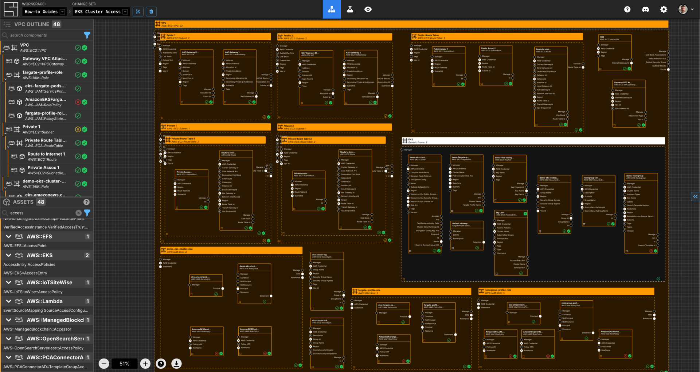
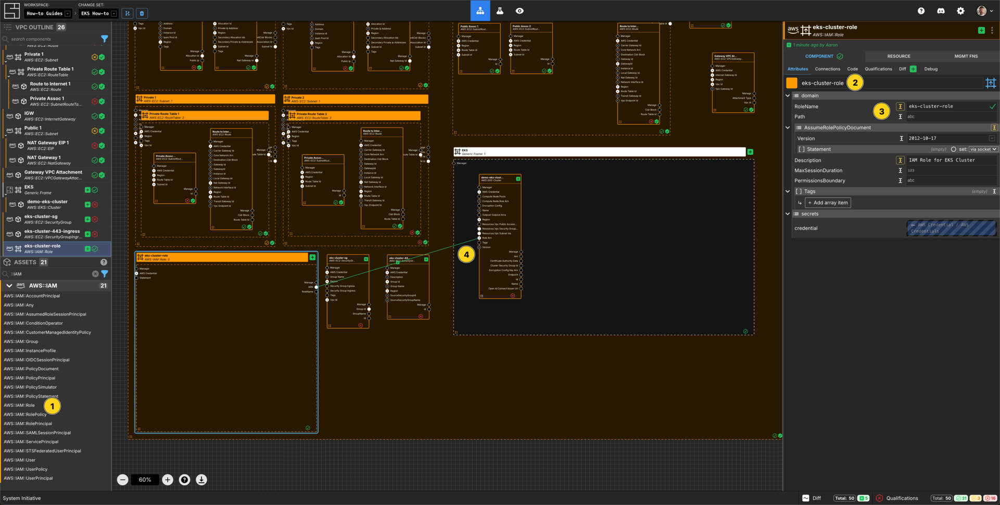
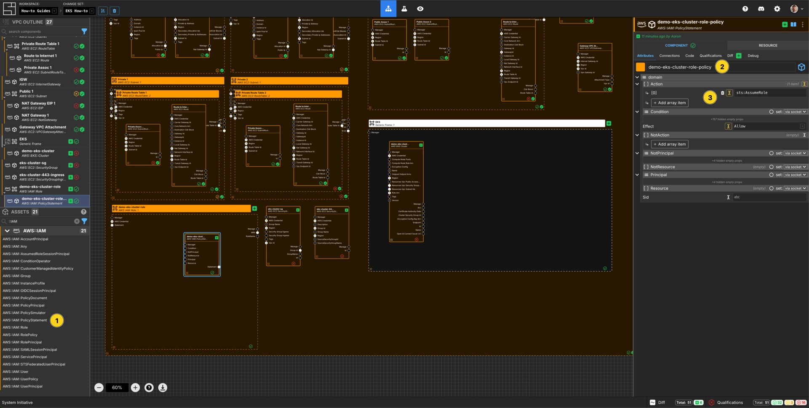
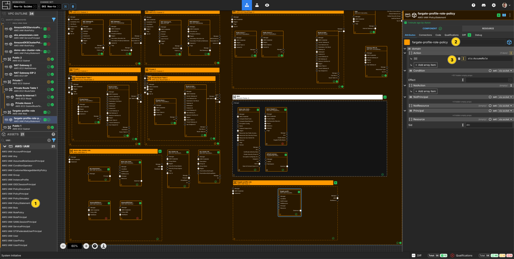
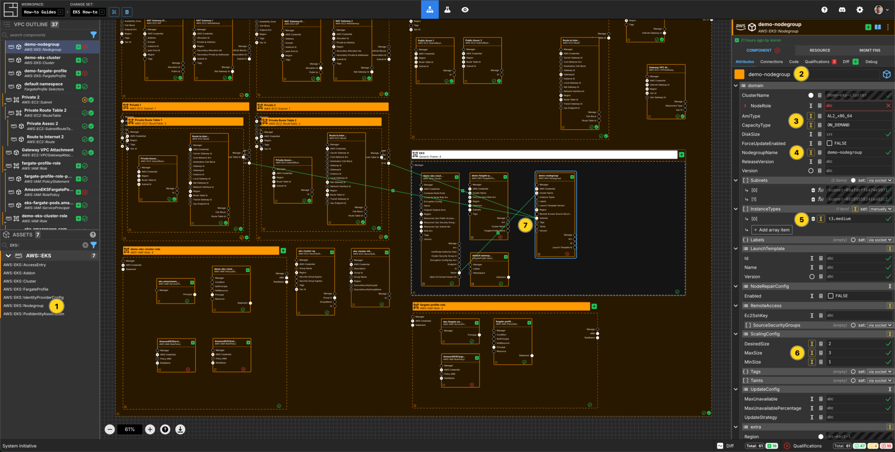
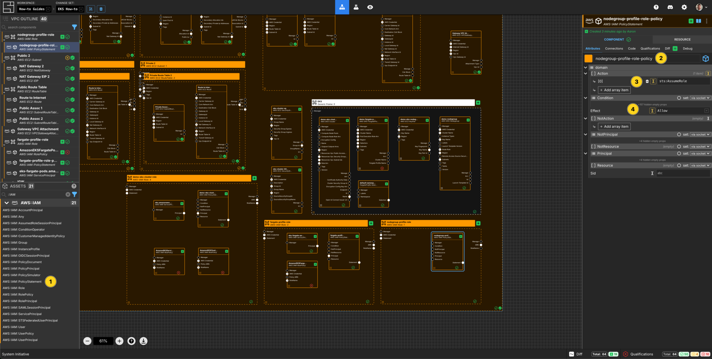
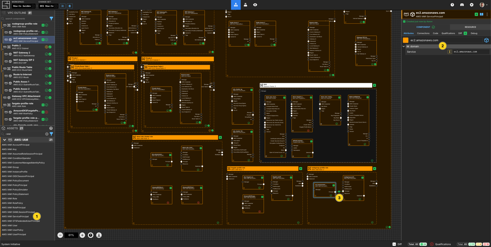
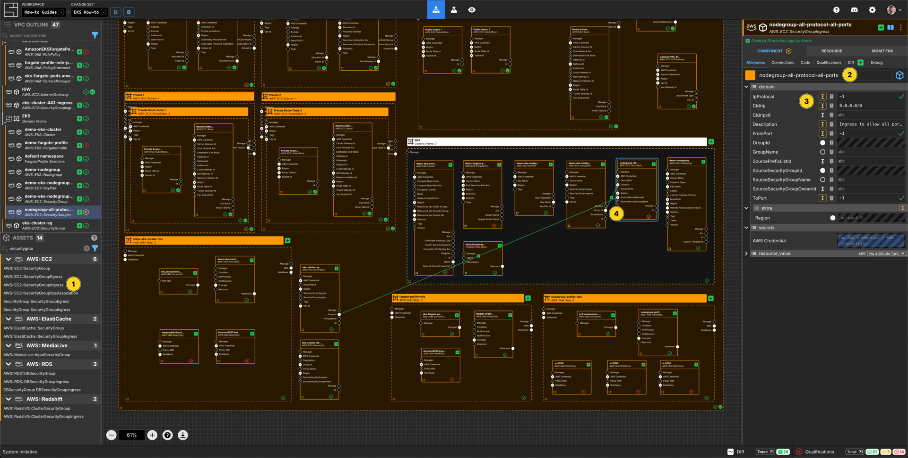
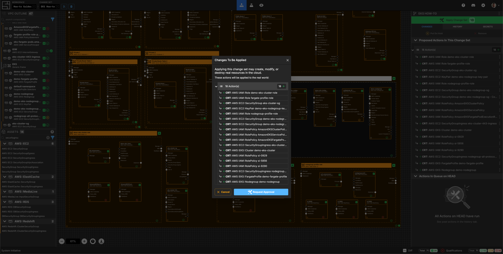

---
outline:
  level: [2, 3, 4]
---

# How to deploy an AWS EKS Cluster and get access to it

This how-to assumes:

- Basic [familiarity with System Initiative](../tutorials/getting-started)
- You have completed the
  [build an AWS VPC with System Initiative tutorial](./aws-vpc) (and not deleted
  the resulting resources)
- Basic
  [familiarity with Kubernetes](https://kubernetes.io/docs/tutorials/kubernetes-basics/)

It will teach you how to create an AWS EKS cluster and then get the correct
access to it using System Initiative.

We will cover:

- The creation of an EKS cluster with a NodeGroup and a Fargate Profile
- The correct IAM configuration to allow connecting to the cluster

## Setup

All activities in this how-to happen within a configured VPC, AWS Region, and AWS
Credential.

Start in a Change Set named `EKS How-to`.

## Walkthrough

### What it will look like

When you are through with this guide, you should have Components that look like
this in your Diagram:



### Create an EKS cluster Component


Add an `EKS Cluster` to your `VPC How-to` vpc frame.

Set the Component name to `demo-eks-cluster`.

Set the `name` to `demo-eks-cluster`.

Set the `version` to be `1.28`.

Add an array item to `enabledLoggingTypes`

Set the value of that array item to `api`.

Set `resourcesVpcConfig.endpointPublicAccess` to be `true`.

Connect the `Subnet ID` Output Socket of each of the private subnet Components
to the `Subnet ID` Input Socket of this `demo-eks-cluster` Component.

### Create a Security Group Component for the Cluster


Add a `Security Group` to your `VPC How-to` vpc frame.

Set the Component name to `eks-cluster-sg`.

Set the `GroupName` to `eks-cluster-sg`.

Set the `Description` to `Security Group to allow access to the EKS Cluster`

Connect the `Security Group ID` Output Socket of `eks-cluster-sg` Component to
the `Security Group ID` Input Socket of the `demo-eks-cluster` frame.

### Create an Ingress Rule Component


Add a `Security Group Rule (Ingress)` to your `VPC How-to` vpc frame.

Set the Component name to `eks-cluster-443-ingress`.

Set the `Description` to `Ingress to allow 443 from the world`.

Set the `TrafficPort` to `443/tcp`.

Add an `IpRange` array item.

Set the `IP Range [CIDR]` to `0.0.0.0/0` and the `Description` to
`The world`.

Connect the `Security Group ID` Output Socket of `eks-cluster-sg` Component to
the `Security Group ID` Input Socket of this `eks-cluster-443-ingress`
Component.

### Create an IAM Role



Add an `AWS IAM Role` Component to your `VPC How-to` vpc frame.

Set the Component name to `eks-cluster-role`.

Set the `RoleName` to `eks-cluster-role`.

Set the `Description` to `IAM Role for EKS Cluster`.

Connect the `ARN` Output Socket of the `eks-cluster-role` AWS IAM Role to the
`Role ARN` Input Socket of your `demo-eks-cluster` EKS Cluster.

### Create an AWS IAM Policy Statement



Add an `AWS IAM Policy Statement` within the `demo-eks-cluster-role` AWS IAM
Role frame.

Set the Component name to `eks-cluster-role-policy`.

Set the `Effect` to `Allow`.

Add an array item to the `Action` array.

Set the `[0]` value for the `Action` array to `sts:AssumeRole`.


Add an `AWS IAM Service Principal` within the `demo-eks-cluster-role` AWS IAM
Role frame.

Set the Component name to `eks.amazonaws.com`.

Set the `Service` to `eks.amazonaws.com`.

Connect the `Principal` Output Socket of the `eks.amazonaws.com` AWS IAM AWS
Service Principal to the `Principal` Input Socket of your
`eks-cluster-role-policy` AWS IAM Policy Statement.

### Connect Additional Access Policies to the IAM Role

Add 2 `Aws IAM Role Policy` Components to the `demo-eks-cluster-role` AWS IAM
Role frame.

Configure them as follows:

| Component Name         | `PolicyArn`                                    |
| ---------------------- | ---------------------------------------------- |
| AmazonEKSClusterPolicy | arn:aws:iam::aws:policy/AmazonEKSClusterPolicy |
| AmazonEKSServicePolicy | arn:aws:iam::aws:policy/AmazonEKSServicePolicy |

Connect the `RoleName` Output Socket of the `demo-eks-cluster-role` to the
`RoleName` Input Socket of each of the AWS IAM Role Policy Components in that
frame.

### Create a Fargate Profile


Add a `Fargate Profile` to your `demo-eks-cluster` eks cluster frame.

Set the Component type to `Up Frame`.

Set the Component name to `demo-fargate-profile`.

Set the `fargateProfileName` to `demo-fargate-profile`.

Connect the `Subnet ID` Output Socket of each of the private subnet Components
to the `Subnet ID` Input Socket of this `demo-fargate-profile` Component.

Add a `POD Profile Selector` Component inside the `demo-fargate-profile` frame.

Set the Component name to `default namespace`.

Set the `namespace` to `default`.

### Create an IAM Role for Fargate Profile


Add an `AWS IAM Role` Component to your `VPC How-to` vpc frame.

Set the Component name to `fargate-profile-role`.

Set the `RoleName` to `fargate-profile-role`.

Set the `Description` to `IAM Role for EKS Cluster`.

Connect the `ARN` Output Socket of the `fargate-profile-role` AWS IAM Role to
the `Role ARN` Input Socket of your `demo-fargate-profile` Fargate Profile.

### Create an AWS IAM Policy Statement



Add an `AWS IAM Policy Statement` within the `fargate-profile-role` AWS IAM Role
frame.

Set the Component name to `fargate-profile-role-policy`.

Set the `Effect` to `Allow`.

Add an array item to the `Action` array.

Set the `[0]` value for the `Action` array to `sts:AssumeRole`.


Add an `AWS IAM Service Principal` within the `fargate-profile-role` AWS IAM
Role frame.

Set the Component name to `eks-fargate-pods.amazonaws.com`.

Set the `Service` to `eks-fargate-pods.amazonaws.com`.

Connect the `Principal` Output Socket of the `eks-fargate-pods.amazonaws.com`
AWS IAM AWS Service Principal to the `Principal` Input Socket of your
`fargate-profile-role-policy` AWS IAM Policy Statement.

### Connect Additional Access Policy to the IAM Role

Add an `Aws IAM Role Policy` Component to the `fargate-profile-role` AWS IAM
Role frame.

Configure it as follows:

| Component Name                         | `PolicyArn`                                                    |
| -------------------------------------- | -------------------------------------------------------------- |
| AmazonEKSFargatePodExecutionRolePolicy | arn:aws:iam::aws:policy/AmazonEKSFargatePodExecutionRolePolicy |

Connect the `RoleName` Output Socket of the `demo-eks-cluster-role` to the
`RoleName` Input Socket of each of the AWS IAM Role Policy Components in that
frame.

### Create a NodeGroup Component



Add a `NodeGroup` to your `demo-eks-cluster` eks-cluster frame.

Set the Component name to `demo-nodegroup`.

Set the `nodegroupName` to `demo-nodegroup`.

Set the `capacityType` to be `ON_DEMAND`.

Set the `amiType` to be `AL2_x86_64`.

Add an array item to `instanceTypes` and set the value to be `t3.medium`.

Set the `scalingConfig.desiredSize` to `2`.

Set the `scalingConfig.maxSize` to `3`.

Set the `scalingConfig.minSize` to `1`.

Connect the `Subnet ID` Output Socket of each of the private subnet Components
to the `Subnet ID` Input Socket of the `demo-nodegroup` Component.

### Create a Key Pair Component


Add a `Key Pair` to your `demo-eks-cluster` frame.

Set the Component name to `demo-eks-nodegroup-key-pair`.

Set the `KeyName` to `demo-eks-nodegroup-key-pair`.

Connect the `Key Name` Output Socket of this `demo-eks-nodegroup-key-pair`
Component to the `Key Name` Input Socket of the `demo-nodegroup` Component.

### Create an IAM Role for Node Group

Add an `AWS IAM Role` Component to your `VPC How-to` vpc frame.

Set the Component name to `nodegroup-profile-role`.

Set the `RoleName` to `nodegroup-profile-role`.

Set the `Description` to `IAM Role for EKS Cluster NodeGroup`.

Connect the `ARN` Output Socket of the `nodegroup-profile-role` AWS IAM Role to
the `Node Role ARN` Input Socket of your `demo-nodegroup` NodeGroup.

### Create an AWS IAM Policy Statement



Add an `AWS IAM Policy Statement` within the `nodegroup-profile-role` AWS IAM
Role frame.

Set the Component name to `nodegroup-profile-role-policy`.

Set the `Effect` to `Allow`.

Add an array item to the `Action` array.

Set the `[0]` value for the `Action` array to `sts:AssumeRole`.



Add an `AWS IAM Service Principal` within the `nodegroup-profile-role` AWS IAM
Role frame.

Set the Component name to `ec2.amazonaws.com`.

Set the `Service` to `ec2.amazonaws.com`.

Connect the `Principal` Output Socket of the `ec2.amazonaws.com` AWS IAM AWS
Service Principal to the `Principal` Input Socket of your
`nodegroup-profile-role-policy` AWS IAM Policy Statement.

### Connect Additional Access Policies to the IAM Role

Add 3 `Aws IAM Role Policy` Component to the `nodegroup-profile-role` AWS IAM
Role frame.

Configure it as follows:

| Component Name                     | `PolicyArn`                                                |
| ---------------------------------- | ---------------------------------------------------------- |
| AmazonEKS_CNI_Policy               | arn:aws:iam::aws:policy/AmazonEKS_CNI_Policy               |
| AmazonEC2ContainerRegistryReadOnly | arn:aws:iam::aws:policy/AmazonEC2ContainerRegistryReadOnly |
| AmazonEKSWorkerNodePolicy          | arn:aws:iam::aws:policy/AmazonEKSWorkerNodePolicy          |

Connect the `RoleName` Output Socket of the `nodegroup-profile-role` to the
`RoleName` Input Socket of each of the AWS IAM Role Policy Components in that
frame.

### Create a Security Group Component for the NodeGroup


Add a `Security Group` to your `demo-eks-cluster` eks cluster frame.

Set the Component name to `demo-eks-nodegroup-sg`.

Set the `GroupName` to `demo-eks-nodegroup-sg`.

Set the `Description` to `Security Group for the EKS NodeGroup`

Connect the `Security Group ID` Output Socket of `demo-eks-nodegroup-sg`
Component to the `Security Group ID` Input Socket of the `demo-nodegroup` frame.

### Create an Ingress Rule Component



Add a `Security Group Rule (Ingress)` to your `demo-eks-cluster` eks cluster
frame.

Set the Component name to `nodegroup-all-protocol-all-ports`.

Set the `Description` to
`Ingress to allow all ports and protocols on the NodeGroup`.

Set the `TrafficPort` to `-1/-1`.

Connect the `Security Group ID` Output Socket of `demo-eks-nodegroup-sg`
Component to the `Security Group ID` Input Socket of this
`nodegroup-all-protocol-all-ports` Component.

Connect the `Security Group ID` Output Socket of
eks-cluster-sg`Component to the`Source Traffic Security Group
ID`Input Socket of this`nodegroup-all-protocol-all-ports` Component.

### Apply your Change Set



Press `Escape` or click anywhere on the canvas background to see the apply
changeset button.

Click the `Apply Change Set` button to:

- Create all of the desired IAM Roles and Policies
- Create all of the Security Groups
- Create an EKS Fargate Profile
- Create an EKS NodeGroup

NOTE: When creating a nodegroup and/or a fargate profile, AWS requires the
cluster to be `ACTIVE`. The create actions will fail with `warning` messages.
You can retry these actions after a period of time.

## Accessing the cluster

By default, the user used to create the cluster will be the user to have access
to it. It is not recommended to use access keys directly with System Initiative.
The workspace uses assumeRolePolicy, so specific users will need granted access
to the cluster & use kubectl to get valid responses from the clusters api
server. to the cluster & use kubectl to get valid responses from the clusters
api server.

### Generating a KubeConfig

Using the
[AWS CLI](https://docs.aws.amazon.com/cli/latest/userguide/cli-chap-configure.html),
run the following command:

```
$ aws eks update-kubeconfig --name demo-eks-cluster --region us-east-1
```

The result is something similar to:

```
aws eks update-kubeconfig --name demo-eks-cluster --region us-east-1
Added new context arn:aws:eks:us-east-1:573113295293:cluster/demo-eks-cluster to /Users/stack72/.kube/config
```

Using [kubectl](https://kubernetes.io/docs/reference/kubectl/), you can check
the access permissions to the cluster:

```
$ kubectl auth can-i get pods
E1112 00:25:56.469718   29444 memcache.go:265] couldn't get current server API group list: the server has asked for the client to provide credentials
E1112 00:25:57.309084   29444 memcache.go:265] couldn't get current server API group list: the server has asked for the client to provide credentials
Warning: the server doesn't have a resource type 'pods'

error: You must be logged in to the server (Unauthorized)
```

This is because my local user does not have any access to the apiserver/nothing
has been granted within the Cluster access configuration

Start in a Change Set named `EKS Cluster Access`.

### Update EKS Cluster Access Config


Update the `demo-eks-cluster` `accessConfig.authenticationMode` to be
`API_AND_CONFIG_MAP`

Right-click on the Component and select `Update Cluster Access Config`.

Note: This change needs to take effect in the cluster before you can add access
policies. So you will need to retry the failed access entry actions.

### Create Access Entry


Add an `Access Entry` to your `demo-eks-cluster` eks cluster frame.

Set the Component name to `My User`.

Set the `type` to `STANDARD`.

Set the `principalArn` to `<enter your userArn>`.

NOTE: The `principalArn` is the ARN of the user I want to grant access to my
cluster.

Add 2 `Access Policy` Components to your `demo-eks-cluster` eks cluster frame.

Configure them to be as follows:

| Component Name              | `policyArn`                                                        | `accessScope.type` |
| --------------------------- | ------------------------------------------------------------------ | ------------------ |
| AmazonEKSAdminPolicy        | arn:aws:eks::aws:cluster-access-policy/AmazonEKSAdminPolicy        | cluster            |
| AmazonEKSClusterAdminPolicy | arn:aws:eks::aws:cluster-access-policy/AmazonEKSClusterAdminPolicy | cluster            |

Connect the `Principal ARN` Output Socket of the `My User` Component to the
`Principal ARN` Input Sockets of the Access Policy Components

### Apply your Change Set

Press `Escape` or click anywhere on the canvas background to see the apply
changeset button.

Click the `Apply Change Set` button to:

- Create the correct access policies for your user

NOTE: By adding a user to the Cluster access management, you will need to
regenerate a new kubeconfig.

### Connect to the Cluster

After the access rules for the cluster have been updated, you can run the
command:

```
$ kubectl auth can-i get pods
yes
```

Now you can access the details of the pods:

```
$ kubectl logs -n kube-system -l k8s-app=aws-node
Defaulted container "aws-node" out of: aws-node, aws-eks-nodeagent, aws-vpc-cni-init (init)
Defaulted container "aws-node" out of: aws-node, aws-eks-nodeagent, aws-vpc-cni-init (init)
Installed /host/opt/cni/bin/aws-cni
Installed /host/opt/cni/bin/egress-cni
time="2024-11-12T00:24:32Z" level=info msg="Starting IPAM daemon... "
time="2024-11-12T00:24:32Z" level=info msg="Checking for IPAM connectivity... "
time="2024-11-12T00:24:34Z" level=info msg="Copying config file... "
time="2024-11-12T00:24:34Z" level=info msg="Successfully copied CNI plugin binary and config file."
Installed /host/opt/cni/bin/aws-cni
Installed /host/opt/cni/bin/egress-cni
time="2024-11-12T00:24:29Z" level=info msg="Starting IPAM daemon... "
time="2024-11-12T00:24:29Z" level=info msg="Checking for IPAM connectivity... "
time="2024-11-12T00:24:31Z" level=info msg="Copying config file... "
time="2024-11-12T00:24:31Z" level=info msg="Successfully copied CNI plugin binary and config file."
```

### Explore your resources

Review the completed AWS resources by clicking the `Resource` sub-panel for each
of your new resources.

### Clean Up

Create a new Change Set called `Clean up How-to`

Delete your `VPC How-to` VPC frame. All of the Components inside will be marked
for deletion.

Click `Apply Change Set`.

All your new resources should be deleted from your AWS account.

## Vocabulary
In this guide bits of System Initiative Vocabulary will be shown with a capital letter. 
All definitions for these can be found here: [System Initative - Vocabulary](https://docs.systeminit.com/reference/vocabulary) 