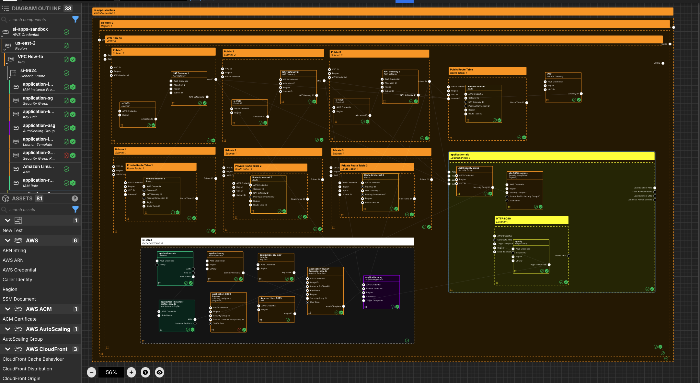

---
outline:
  level: [2, 3, 4]
---

# How to build a highly available AWS EC2 application infrastructure

This how-to assumes:

- Basic [familiarity with System Initiative](../tutorials/getting-started)
- You have completed the
  [build an AWS VPC with System Initiative tutorial](./aws-vpc) (and not deleted
  the resulting resources)

It will teach you how to create a highly available application architecture and
manage it with System Initiative.

We will cover:

- The creation an EC2 Launch Template and AutoScaling group, with a simple
  Python application
- An AWS Application Load Balancer
- The networking required to allow the application instances to serve traffic to
  the application

## Setup

All activities in this how-to happen within a configured VPC, AWS Region and AWS
Credential.

Start in a change set named `EC2 HA How-to`.

## Walkthrough

### What it will look like

When you are through with this guide, you should have components that look like
this in your diagram:



### Create a Loadbalancer component

Add a `Loadbalancer` to your `VPC How-to` vpc frame.

Set the component type to be `Configuration Frame (down)`.

Set the component name to `application-lb`.

Set the `LbName` to `application-alb`.

Set the `IpAddressType` to be `ipv4`.

Set the `LbType` to be `application`.

Set the `Scheme` to be `internet-facing`.

Connect the `Subnet ID` output socket of each of the public subnet components to
the `Subnet ID` input socket of the `application-alb` component.

### Create an EC2 security group component for the Loadbalancer

Add a `Security Group` to your `application-alb` loadbalancer frame.

Set the component name to `ALB Security Group`.

Set the `GroupName` to `ALB Security Group`.

Set the `Description` to be `ALB to the world`

Connect the `Security Group ID` output socket of `ALB Security Group` component
to the `Security Group ID` input socket of the `application-alb` frame.

### Create an Ec2 Ingress Rule component

Add a `Security Group Rule (Ingress)` to your `application-alb` loadbalancer
frame.

Set the component name to be `alb-8080-ingress`.

Set the `Description` to be `Public traffic to HTTP 8080`.

Set the `TrafficPort` to be `8080/tcp`.

Add an `IpRange` array item.

Set the `IP Range [CIDR]` to be `0.0.0.0/0` and the `Description` to be
`The world`.

Connect the `Security Group ID` output socket of `ALB Security Group` component
to the `Security Group ID` input socket of this `alb-8080-ingress` component.

### Create a Listener component

Add a `Listener` component to your `application-alb` loadbalancer frame.

Set the component name to `HTTP:8080`.

Set the `Port` to be `8080`.

Set the `Protocol` to be `HTTP`.

Resize the frame to be large enough to fit another component.

### Create a Target Group

Add a `Target Group` component to your `Listener` frame.

Set the component name to `app-tg`.

Set `TgName` to be `app-tg`.

Set `HealthCheckEnabled` to be enabled.

Set `HealthCheckIntervalSeconds` to `30` seconds.

Set `HealthCheckPath` to be `/health`.

Set `HealthCheckPort` to be `8080`.

Set `HealthCheckProtocol` to be `HTTP`.

Set `HealthCheckTimeoutSeconds` to be `5`.

Set `HealthyThresholdCount` to be `5`.

Set `HttpCode` to be `200`.

Set `Port` to be `8080`.

Set `Protocol` to be `HTTP`.

Set `UnhealthyThresholdCount` to be `2`.

Connect the `Target Group ARN` output socket of `app-tg` component to the
`Target Group ARN` input socket of the `HTTP:8080` frame.

### Create an Application Frame

Add a `Generic Frame` component to your `VPC` frame.

Set the component name to be `Application`.

Resize the frame to hold many components.

### Create an IAM Role

Add an `AWS IAM Role` component to your `Application` frame.

Set the component name to `application-role`.

Set the `RoleName` to `application-role`.

Set the `Description` to `EC2 Application Role`.

Set the `Path` to `/si-tutorial/`.

### Create an Assume Role Policy

Add an `AWS IAM Policy Statement` within the `application-role` AWS IAM Role
frame.

Set the component name to `allow-ec2`.

Set the `Sid` to `allow-ec2`.

Set the `Effect` to `Allow`.

Add an array item to the `Action` array.

Set the `[0]` value for the `Action` array to `sts:AssumeRole`.

### Create an AWS IAM AWS Service Principal

Add an `AWS IAM Service Principal` within the `application-role` AWS IAM Role
frame.

Set the component name to `ec2 service`.

Set the `Service` to `ec2.amazonaws.com`.

Connect the `Principal` output socket of the `ec2-service` AWS IAM AWS Service
Principal to the `Principal` input socket of your `allow-ec2` AWS IAM Policy
Statement.

### Create an IAM Instance Profile

Add an `IAM Instance Profile` to your `Application` frame.

Set the component name to `application-instance-profile-how-to`.

Set the `InstanceProfileName` to `application-instance-profile-how-to`.

Set the `Path` to `/si-tutorial/`.

Connect the `Role Name` output socket of `application-role` IAM Role component
to the `Role Name` input socket of the `application-instance-profile` IAM
Instance Profile component.

### Create a Security Group component for the Application

Add a `Security Group` to your `Application` frame.

Set the component name to `application-sg`

Set the `GroupName` to `application-sg`.

Set the `Description` to be `Application Security Group`

### Create an Ec2 Ingress Rule component

Add a `Security Group Rule (Ingress)` to your `Application` frame.

Set the component name to be `application-8080-ingress`.

Set the `Description` to be `8080 inbound to the node`.

Set the `TrafficPort` to be `8080/tcp`.

Connect the `Security Group ID` output socket of `application-sg` component to
the `Security Group ID` input socket of this `application-8080-ingress`
component.

Connect the `Security Group ID` output socket of `ALB Security Group` component
to the `Source Traffic Security Group ID` input socket of this
`application-8080-ingress` component.

### Create a Keypair component

Add a `Key Pair` to your `Application` frame.

Set the component name to `application-key-pair`.

Set the `KeyName` to `application-key-pair`.

### Create an AMI component

Add an `AMI` to your `Application` frame.

Set the component name to be `Amazon Linux 2023`.

Set the `ImageId` to be `ami-0c11a84584d4e09dd`.

### Create a Launch Template component

Add a `Launch Template` component to your `Application` frame.

Set the component name to `application-launch-template-how-to`.

Set the `LaunchTemplateName` to `application-launch-template-how-to`.

Set the `InstanceType` to be `t3.small`

Set the `UserData` to be:

```
#!/bin/bash
# Update the system
yum update -y

# Install Python 3 and pip
yum install -y python3 python3-pip

# Install Git
yum install -y git

# Create a directory for the application
mkdir -p /opt/flask-app
cd /opt/flask-app

# Create the application file
cat <<EOT > app.py
from flask import Flask
import requests
import os

app = Flask(__name__)

def get_instance_id():
    try:
        instance_id = requests.get("http://169.254.169.254/latest/meta-data/instance-id", timeout=2).text
    except requests.exceptions.RequestException:
        instance_id = "Unknown (not running on EC2)"
    return instance_id

@app.route('/')
def hello():
    instance_id = get_instance_id()
    return f"""
    <h1>Hello from EC2!</h1>
    <p>This response is served by instance: {instance_id}</p>
    <p>Refresh the page to see load balancing in action.</p>
    """

@app.route('/health')
def health_check():
    return "OK", 200


if __name__ == '__main__':
    app.run(host='0.0.0.0', port=int(os.environ.get('PORT', 8080)))
EOT

# Install the Python dependencies
pip3 install --ignore-installed requests Flask

# Create a systemd service file for the Flask app
cat <<EOT > /etc/systemd/system/flask-app.service
[Unit]
Description=Flask App
After=network.target

[Service]
User=root
WorkingDirectory=/opt/flask-app
ExecStart=/usr/bin/python3 /opt/flask-app/app.py
Restart=always

[Install]
WantedBy=multi-user.target
EOT

# Reload systemd, enable and start the Flask app service
systemctl daemon-reload
systemctl enable flask-app
systemctl start flask-app
```

Connect the `Security Group ID` output socket of `application-sg` component to
the `Security Group ID` input socket of this `application-launch-template`
component.

Connect the `Key Name` output socket of `application-key-pair-how-to` component
to the `Key Name` input socket of this `application-launch-template` component.

Connect the `ARN` output socket of `application-instance-profile` component to
the `Instance Profile ARN` input socket of this `application-launch-template`
component.

Connect the `Image ID` output socket of `Amazon Linux 2023` component to the
`Image ID` input socket of this `application-launch-template` component.

### Create an AutoScaling Group component

Add an `AutoScaling Group` component to the `Application` frame.

Set the component name to `application-asg`.

Set `AutoScalingGroupName` to be `application-asg`.

Set `DesiredCapacity` to be 1.

Set `MaxSize` to be 1.

Set `MinSize` to be 0.

Connect the `Launch Template` output socket of `application-launch-template`
component to the `Launch Template` input socket of this `application-asg`
component.

Connect the `Subnet ID` output socket of each of the `Public` subnet components
to the `Subnet ID` input socket of this `application-asg` component.

Connect the `Target Group ARN` output socket of each of the `app-tg` Target
Group to the `Target Group ARN` input socket of this `application-asg`
component.

### Apply your Change Set

Press `Escape` or click anywhere on the canvas background to select the
Workspace.

Click the `Apply Change Set` button to:

- Create a Key Pair
- Create 2 Security Groups and associated ingress rules
- Create an application load balancer, a listener and a target group
- Create an IAM Role and IAM Instance Profile
- Create a Launch Template and an AutoScaling Group (that will create an
  instance)

### Explore your resources

Review the completed AWS resources by clicking the `Resource` sub-panel for each
of your new resources.

### Clean Up

Create a new change set called `Clean up How-to`

Delete your `VPC How-to` VPC frame. All of the components inside will be marked
for deletion.

Click `Apply Change Set`.

All your new resources should be deleted from your AWS account.
