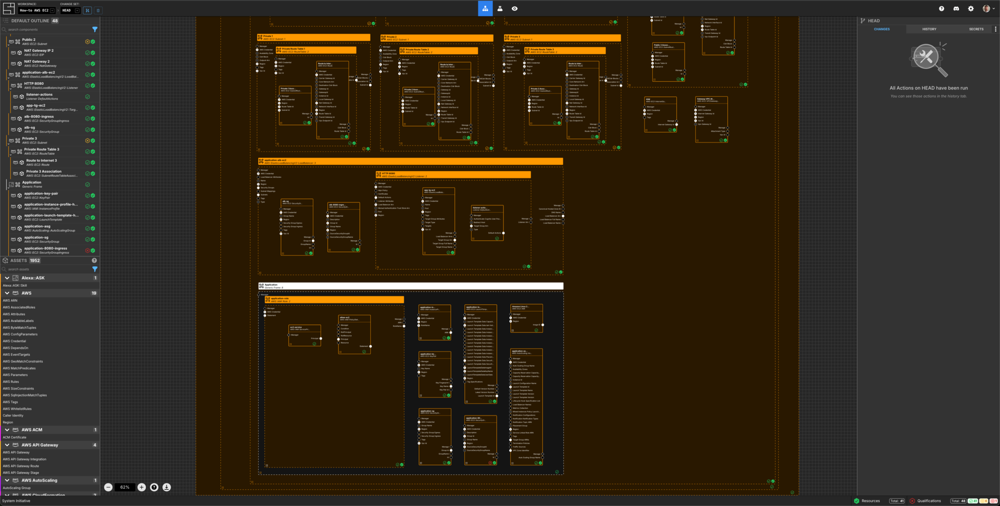
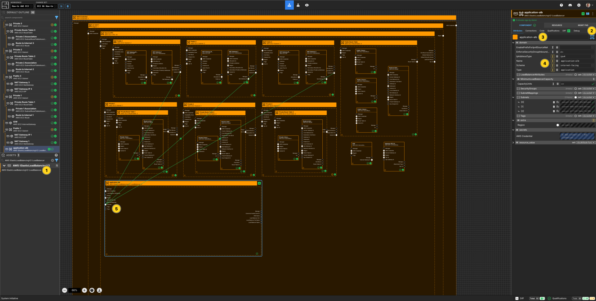
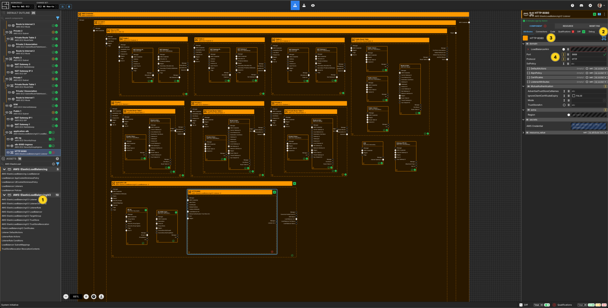
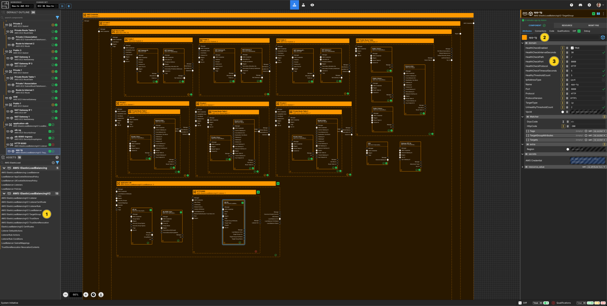
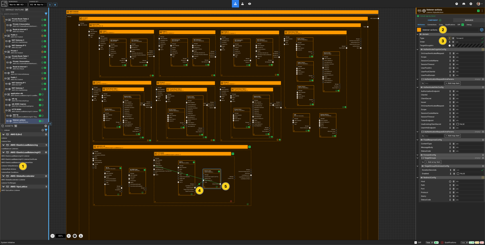
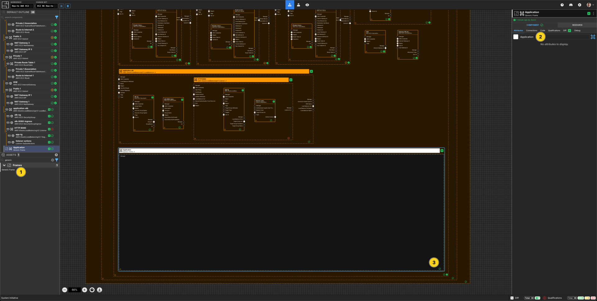
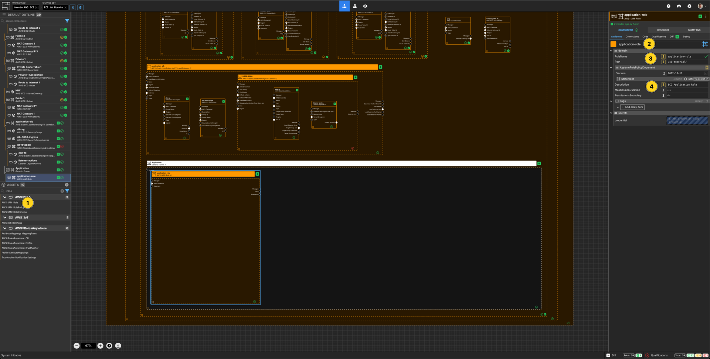
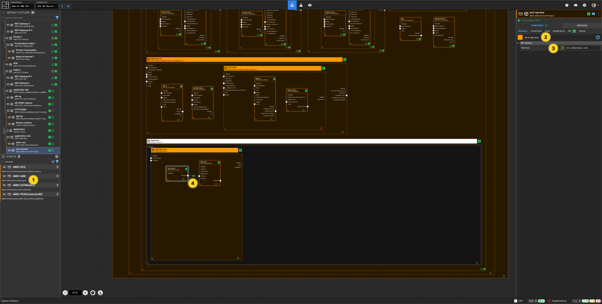
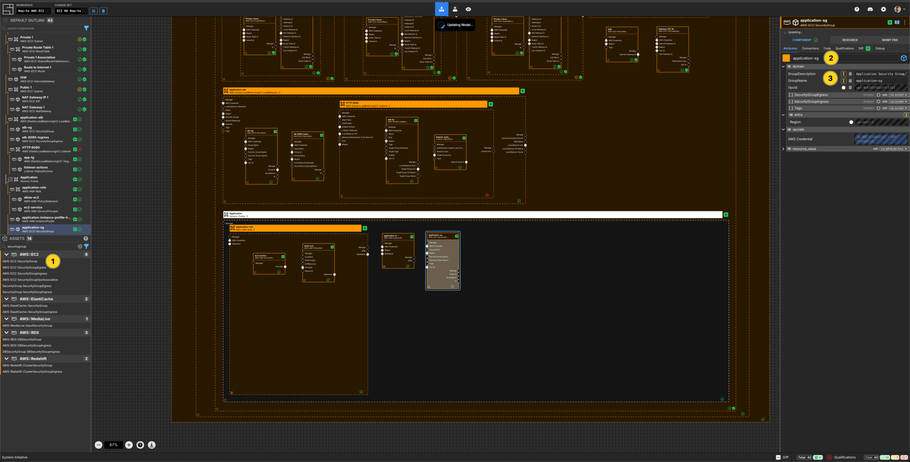
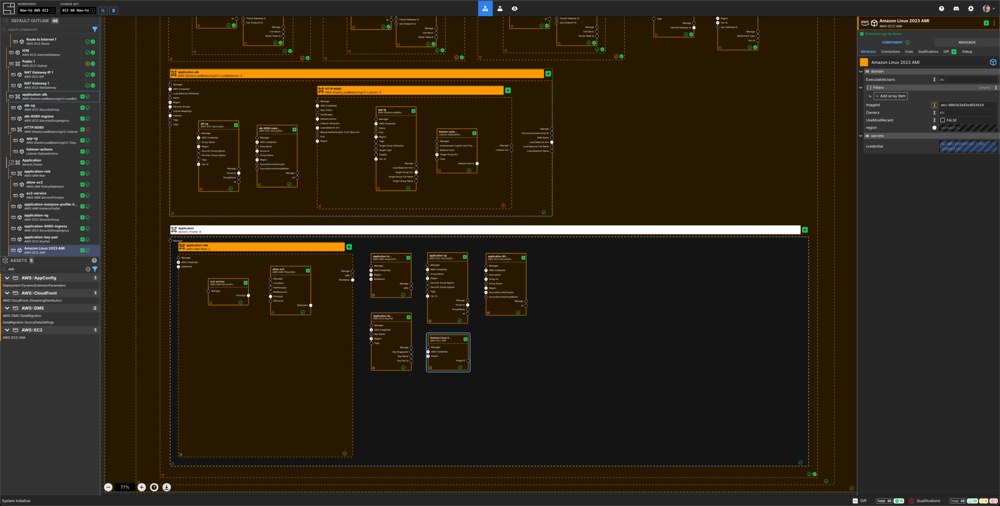

---
outline:
  level: [2, 3, 4]
---

# How to build a highly available AWS EC2 application infrastructure

This how-to assumes:

- Basic [familiarity with System Initiative](../tutorials/getting-started)
- You have completed the
  [build an AWS VPC with System Initiative tutorial](./aws-vpc) (and not deleted
  the resulting resources)

It will teach you how to create a highly available application architecture and
manage it with System Initiative.

We will cover:

- The creation an EC2 Launch Template and AutoScaling group, with a simple
  Python application
- An AWS Application Load Balancer
- The networking required to allow the application instances to serve traffic to
  the application

## Setup

All activities in this how-to happen within a configured VPC, AWS Region and AWS
Credential.

Start in a Change Set named `EC2 HA How-to`.

## Walkthrough

### What it will look like

When you are through with this guide, you should have Components that look like
this in your Diagram:



### Create a Loadbalancer Component

 

Add a `AWS::ElasticLoadBalancingV2::LoadBalancer` to your `VPC How-to` vpc frame.

Set the Component type to `Down Frame`.

Set the Component name to `application-alb`.

Set the `IpAddressType` to `ipv4`.

Set the `Name` to `application-alb`.

Set the `Scheme` to `internet-facing`.

Set the `Type` to `application`.

Connect the `Subnet Id` Output Socket of each of the public subnet Components to
the `Subnets` Input Socket of the `application-alb` Component.

### Create an EC2 security group Component for the Loadbalancer


Add a `AWS::EC2::SecurityGroup` to your `VPC How-to` vpc frame.

Set the Component name to `alb-sg`.

Set the `GroupDescription` to be `ALB to the world`

Set the `GroupName` to `alb-sg`.

Connect the `Group Id` Output Socket of `alb-sg` Component to the
`Security Groups` Input Socket of the `application-alb` frame.

### Create an EC2 Ingress Rule Component


Add a `AWS::EC2::SecurityGroupIngress` Component to your `application-alb` loadbalancer frame.

Set the Component name to `alb-8080-ingress`.

Set the `IpProtocol` to `TCP`.

Set `CidrIp` to be `0.0.0.0/0`.

Set the `Description` to `Public traffic to HTTP 8080`.

Set `FromPort` to be `8080`.

Set `ToPort` to be `8080`.

Connect the `Group Id` Output Socket of `alb-sg` Component to the
`Group Id` Input Socket of this `alb-8080-ingress` Component.

### Create a Listener Component



Add a `AWS::ElasticLoadBalancingV2::Listener` Component to your `application-alb` loadbalancer frame.

Set the Component type to `Down Frame`.

Set the Component name to `HTTP:8080`.

Set the `Port` to be `8080`.

Set the `Protocol` to be `HTTP`.

Resize the frame to be large enough to fit another Component.

### Create a Target Group



Add a `AWS::ElasticLoadBalancingV2::TargetGroup` Component to your `Listener` frame.

Set the Component name to `app-tg`.

Set `HealthCheckEnabled` to `TRUE`.

Set `HealthCheckIntervalSeconds` to `30` seconds.

Set `HealthCheckPath` to `/`.

Set `HealthCheckPort` to `8080`.

Set `HealthCheckProtocol` to `HTTP`.

Set `HealthCheckTimeoutSeconds` to `5`.

Set `HealthyThresholdCount` to `5`.

Set `IpAddressType` to `ipv4`

Set `Name` to be `app-tg`.

Set `Port` to `8080`.

Set `Protocol` to `HTTP`.

Set `ProtocolVersion` to `HTTP1`

Set `TargetType` to `instance`.

Set `UnhealthyThresholdCount` to be `2`.

Set `HttpCode` to `200`.

### Create a Listener Default Action



Add a `Listener DefaultActions` Component to your `Listener` frame.

Set the Component name to `listener-actions`.

Set `Type` to `forward`.

Connect the `Target Group Arn` Output Socket of the `app-tg` Component to the
`Target Group Arn` Input Socket of the `listener-actions` Component.

Connect the `Default Actions` Output Socket of the `listener-actions` Component to the `Default Actions` Input Socket of the `HTTP:8080` Listener Component.

### Create a Generic Frame



Add a `Generic Frame` Component to your `VPC` frame.

Set the Component name to be `Application`.

Resize the frame to hold many Components.

### Create an IAM Role



Add an `AWS::IAM::Role` Component to your Generic `Application` frame.

Set the Component name to `application-role`.

Set the `RoleName` to `application-role`.

Set the `Path` to `/si-tutorial/`.

Set the `Description` to `EC2 Application Role`.

### Create an AWS IAM Policy Statement


Add an `AWS::IAM::PolicyStatement` Component within the `application-role` AWS IAM Role frame.

Set the Component name to `allow-ec2`.

Add an array item to the `Action` array.

Set the `[0]` value for the `Action` array to `sts:AssumeRole`.

Set the `Effect` to `Allow`.

### Create an AWS IAM AWS Service Principal



Add an `AWS::IAM::ServicePrincipal` Component within the `application-role` AWS IAM Role frame.

Set the Component name to `ec2-service`.

Set the `Service` to `ec2.amazonaws.com`.

Connect the `Principal` Output Socket of the `ec2-service` Service
Principal to the `Principal` Input Socket of your `allow-ec2` AWS Policy Statement.

### Create an IAM Instance Profile


Add an `AWS::IAM::InstanceProfile` to your Generic `Application` frame.

Set the Component name to `application-instance-profile-how-to`.

Set the `InstanceProfileName` to `application-instance-profile-how-to`.

Set the `Path` to `/si-tutorial/`.

Connect the `RoleName` Output Socket of `application-role` IAM Role Component to the `RoleName` Input Socket of the `application-instance-profile` Instance Profile Component.

### Create a Security Group Component for the Application



Add a `AWS::EC2::SecurityGroup` Component to your Generic `Application` frame.

Set the Component name to `application-sg`

Set the `GroupDescription` to be `Application Security Group`

Set the `GroupName` to `application-sg`.

### Create an EC2 Ingress Rule Component


Add a `AWS::EC2::SecurityGroupIngress` to your Generic `Application` frame.

Set the Component name to be `application-8080-ingress`.

Set the `IpProtocol` to `TCP`.

Set the `Description` to be `8080 inbound to the node`.

Set the `FromPort` to `8080`.

Set the `ToPort` to `8080`.

Connect the `Group Id` Output Socket of `application-sg` Component to the `Group Id` Input Socket of this `application-8080-ingress`
Component.

Connect the `Group Id` Output Socket of `alb-sg` Component
to the `SourceSecurityGroupId` Input Socket of this
`application-8080-ingress` Component.

### Create a Key Pair Component


Add a `AWS::EC2::KeyPair` Component to your Generic `Application` frame.

Set the Component name to `application-key-pair`.

Set the `KeyName` to `application-key-pair`.

### Create an AMI Component



Add an `AWS::EC2::AMI` to your Generic `Application` frame.

Set the Component name to be `Amazon Linux 2023 AMI`.

Set the `ImageId` to be `ami-08b5b3a93ed654d19`.

### Create a Launch Template Component


Add a `AWS::EC2::LaunchTemplate` Component to your Generic `Application` frame.

Set the Component name to `application-launch-template-how-to`.

Set the `LaunchTemplateName` to `application-launch-template-how-to`.

Set the `InstanceType` to be `t3.small`

Set the `UserData` to be a base64 encoded version of the following code snippet:

```bash
#!/bin/bash
# Update the system
yum update -y

# Install Python 3 and pip
yum install -y python3 python3-pip

# Install Git
yum install -y git

# Create a directory for the application
mkdir -p /opt/flask-app
cd /opt/flask-app

# Create the application file
cat <<EOT > app.py
from flask import Flask
import requests
import os

app = Flask(__name__)

def get_instance_id():
    try:
        instance_id = requests.get("http://169.254.169.254/latest/meta-data/instance-id", timeout=2).text
    except requests.exceptions.RequestException:
        instance_id = "Unknown (not running on EC2)"
    return instance_id

@app.route('/')
def hello():
    instance_id = get_instance_id()
    return f"""
    <h1>Hello from EC2!</h1>
    <p>This response is served by instance: {instance_id}</p>
    <p>Refresh the page to see load balancing in action.</p>
    """

@app.route('/health')
def health_check():
    return "OK", 200


if __name__ == '__main__':
    app.run(host='0.0.0.0', port=int(os.environ.get('PORT', 8080)))
EOT

# Install the Python dependencies
pip3 install --ignore-installed requests Flask

# Create a systemd service file for the Flask app
cat <<EOT > /etc/systemd/system/flask-app.service
[Unit]
Description=Flask App
After=network.target

[Service]
User=root
WorkingDirectory=/opt/flask-app
ExecStart=/usr/bin/python3 /opt/flask-app/app.py
Restart=always

[Install]
WantedBy=multi-user.target
EOT

# Reload systemd, enable and start the Flask app service
systemctl daemon-reload
systemctl enable flask-app
systemctl start flask-app
```

Connect the `Group ID` Output Socket of `application-sg` Component to the `Launch Template Data Security Group Ids` Input Socket of this `application-launch-template` Component.

Connect the `Key Name` Output Socket of `application-key-pair-how-to` Component to the `LaunchTemplateDataKeyName` Input Socket of this `application-launch-template` Component.

Connect the `ARN` Output Socket of `application-instance-profile` Component to
the `Launch Template Data Iam Instance Profile Arn` Input Socket of this `application-launch-template` Component.

Connect the `Image ID` Output Socket of `Amazon Linux 2023 AMI` Component to the
`LaunchTemplateDataImageId` Input Socket of this `application-launch-template` Component.

### Create an AutoScaling Group Component


Add an `AWS::AutoScaling::AutoScalingGroup` Component to the Generic `Application` frame.

Set the Component name to `application-asg`.

Set `MaxSize` to be 1.

Set `MinSize` to be 0.

Set `AutoScalingGroupName` to be `application-asg`.

Set `DesiredCapacity` to be 1.

Set `LaunchTemplate` `Version` to 1.

Connect the `Launch Template Id` Output Socket of `application-launch-template` Component to the `Launch Template Id` Input Socket of this `application-asg` Component.

Connect the `Subnet Id` Output Socket of each of the `Public` subnet Components
to the `VPC Zone Identifier` Input Socket of this `application-asg` Component.

Connect the `Target Group Arn` Output Socket of the `app-tg` Target
Group to the `Target Group ARN` Input Socket of this `application-asg`
Component.

### Apply your Change Set


Press `Escape` or click anywhere on the canvas background to select the
Workspace.

Click the `Apply Change Set` button to:

- Create a Key Pair
- Create 2 Security Groups and associated ingress rules
- Create an application load balancer, a listener and a target group
- Create an IAM Role and IAM Instance Profile
- Create a Launch Template and an AutoScaling Group (that will create an
  instance)

### Explore your resources

Review the completed AWS resources by clicking the `Resource` sub-panel for each
of your new resources.

### Clean Up

Create a new Change Set called `Clean up How-to`

Delete your `VPC How-to` VPC frame. All of the Components inside will be marked
for deletion.

Click `Apply Change Set`.

All your new resources should be deleted from your AWS account.

## Vocabulary
In this guide bits of System Initiative Vocabulary will be shown with a capital letter. 
All definitions for these can be found here: [System Initative - Vocabulary](https://docs.systeminit.com/reference/vocabulary) 