---
outline:
  level: [2, 3, 4]
---

# How to deploy a container application to AWS Lambda

This how-to assumes:

- Basic [familiarity with System Initiative](../tutorials/getting-started)
- Are familiar with [AWS ECR](https://docs.aws.amazon.com/ecr) and
  [AWS Lambda](https://docs.aws.amazon.com/lambda)
- Have [docker cli](https://docs.docker.com/reference/cli/docker/) installed
  locally
- Have
  [aws cli](https://docs.aws.amazon.com/cli/latest/userguide/getting-started-install.html)
  installed locally

It will teach you how to deploy an AWS ECR Repository, build and push a docker
container to it, then deploy that application on AWS Lambda with System
Initiative.

We will cover:

- The creation of an ECR Repository
- The creation of a Lambda function with the necessary permissions to invoke the
  application

## Setup

All activities in this how-to happen within an AWS Region and AWS Credential.

Start in a Change Set named `ECR Infrastructure How-to`.

## Walkthrough

### What it will look like

When you are through with this guide, you should have Components that look like
this in your Diagram:

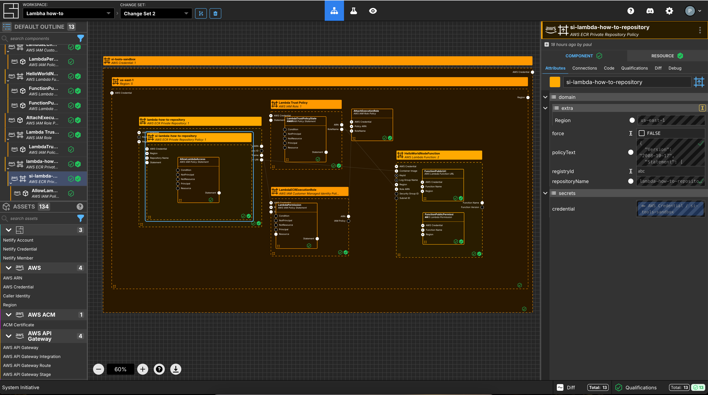

### Create AWS Credentials

Add an `AWS Credential` to your Change Set and configure your AWS credentials

### Select an AWS Region

Add an `AWS Region` to your Change Set and set the `region` property to
`us-east-1`.

### Create an ECR Repository

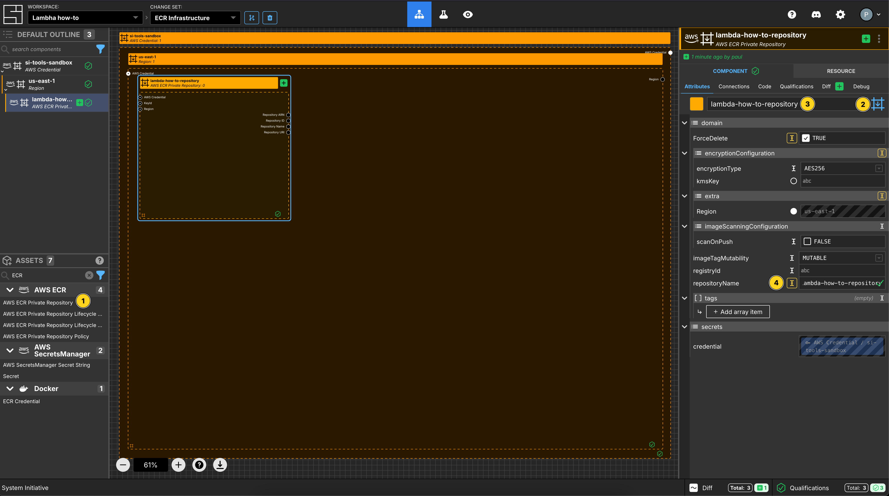

Add an `ECR Private Repository` to your `us-east-1` region frame.

Set the Component name to be `lambda-how-to-repository`.

Set the Component type to be `Configuration Frame (down)`.

Set the `repositoryName` to be `lambda-how-to-repository`.

Set `ForceDelete` to be `true`.

### Create an ECR Repository Policy

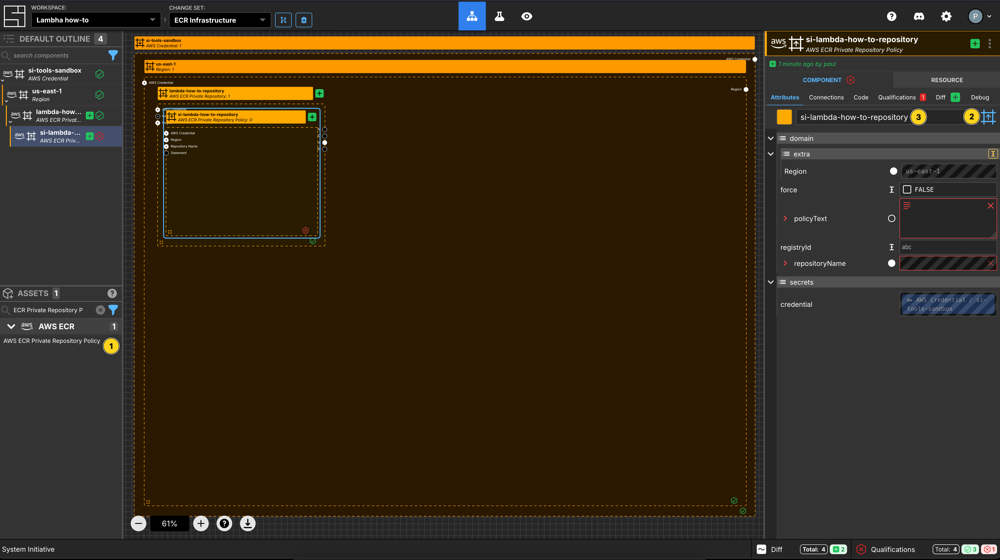

Add an `ECR Repository Policy` to your `demo-app-repo` repository frame.

Set the Component name to be `lambda-how-to-repository policy`

Set the Component type to be `Configuration Frame (up)`.

### Create an IAM Policy Statement

Add an `IAM Policy Statement` to the `lambda-how-to-repository policy` frame.

Set the Component name to be `AllowLambdaAccess`.

Set the `Sid` to be `AllowLambdaAccess`.

Set the `Principal` to be `set manually`.

Add an array item to the `Service` section.

Set the value to be `lambda.amazonaws.com`.

Set `Effect` to be `Allow`.

Add 2 array items to `Action`.

Set the values to be:

- `ecr:GetDownloadUrlForLayer`
- `ecr:BatchGetImage`

### Apply your ECR Infrastructure Change Set

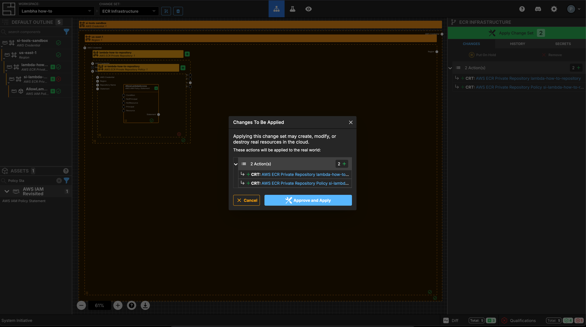

Press `Escape` or click anywhere on the canvas background to select the
Workspace.

Click the `Apply Change Set` button to:

- Create an ECR Private Repository
- Create an ECR Private Repository Policy

### Build & Push Docker Image

We are going to build a very simple demo application, in the form of a
[Lambda Container Image](https://docs.aws.amazon.com/lambda/latest/dg/nodejs-image.html#nodejs-image-instructions)
that we can deploy to ECS.

Firstly, create an `index.js` in any empty directory:

```js
exports.handler = async (event) => {
  const response = {
    statusCode: 200,
    body: JSON.stringify("Hello from a Lambda, managed by System Initiative!"),
  };
  return response;
};
```

Now, create a `package.json` file:

```js
{
  "name": "hello-world-lambda",
  "version": "1.0.0",
  "description": "A simple Node.js Lambda function",
  "main": "app.js",
  "scripts": {
    "start": "node app.js"
  },
  "dependencies": {}
}
```

Lastly, create a `Dockerfile` that we will use to create the container image:

```dockerfile
FROM public.ecr.aws/lambda/nodejs:22

COPY index.js ${LAMBDA_TASK_ROOT}

CMD [ "index.handler" ]
```

We are going to build this container, and push it to our newly created ECR
repository.

Using your terminal, let's run a build of the container:

```bash
$ docker build --platform linux/arm64 -t docker-image:test .
```

This will build the dockerfile in the current directory for `arm64`
architecture.

Next, `docker tag` the image for the ECR container created earlier:

```
docker tag docker-image:test 'repositoryUri':latest
```

Note: the use of `repositoryUri`. Ensure the correct data from the
`Resource Data` is added to this command.

Next, `docker login` to the ECR repository, similar to the following:

```
aws ecr get-login-password --region us-east-1 | docker login --username AWS --password-stdin 573113295293.dkr.ecr.us-east-1.amazonaws.com
```

Note: You must be authenticated to the correct AWS account to run this command.
You can find the accountId from the `repositoryUri`.

Lastly, `docker push` the image:

```
docker push 'repositoryUri':latest
```

**NOTE:** Amazon supply multi-architecture images as the basis for lambda
container images, but Lambda does not support functions that use
multi-architecture container images.

#### Can I test my lambda container image?

Yes, you can test the container that you have built:

```bash
docker run --platform linux/arm64 -p 9000:8080 docker-image:test
```

Then you can use the API endpoint of the container to test it:

```bash
curl "http://localhost:9000/2015-03-31/functions/function/invocations" -d '{}'
```

That should give you the correct API response from the container to prove that
the container has been built correctly.

### Create a new Change Set

Create a new Change Set called `Lambda Infra`.

### Create an IAM Role for the Lambda

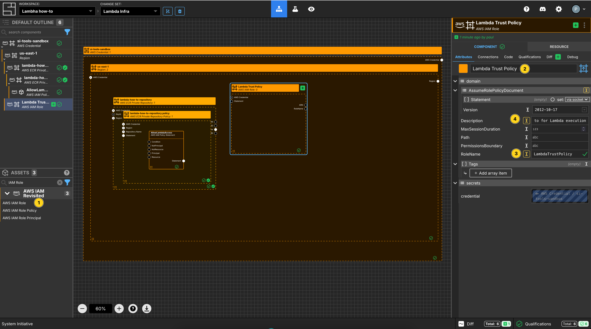

Add an `AWS IAM Role` Component to your `us-east-1` region frame.

Set the Component name to `Lambda Trust Policy`.

Set the `RoleName` to `LambdaTrustPolicy`.

Set the `Description` to `IAM Role to for Lambda execution`.

### Create an AWS IAM Policy Statement

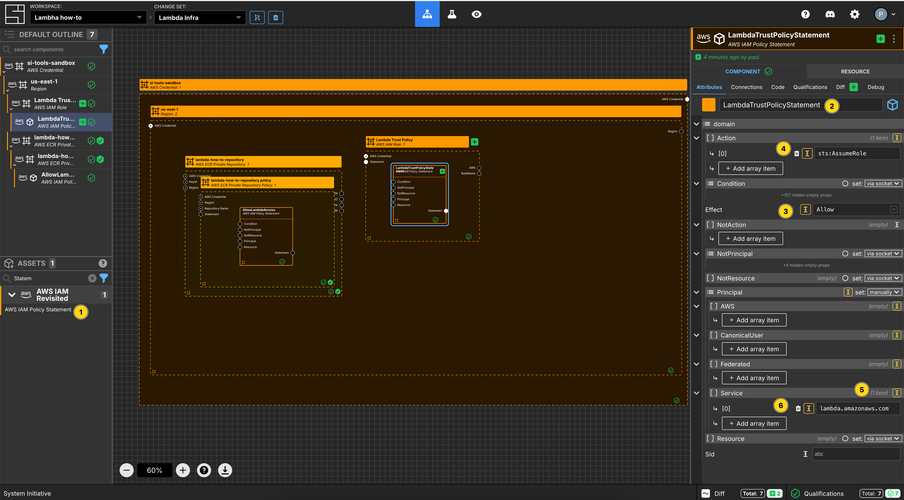

Add an `AWS IAM Policy Statement` within the `Lambda Trust Policy` AWS IAM Role
frame.

Set the Component name to `LambdaTrustPolicyStatement`.

Set the `Effect` to `Allow`.

Add an array item to the `Action` array.

Set the `[0]` value for the `Action` array to `sts:AssumeRole`.

Set the `Principal` to be `set manually`.

Add an array item to the `Service` section.

Set the value to be `lambda.amazonaws.com`.

### Create an AWS IAM Customer Managed Identity Policy

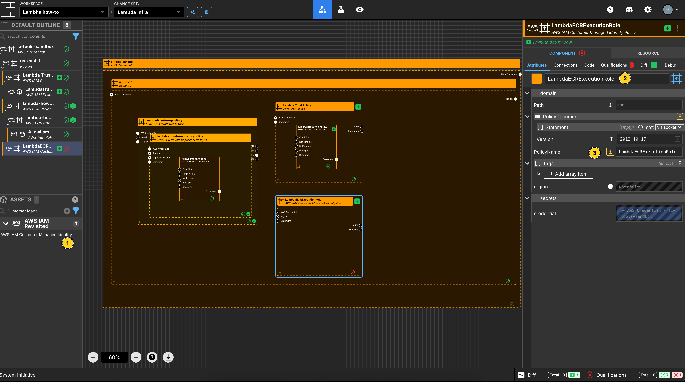

Add an `AWS IAM Customer Managed Identity Policy` Component to your `us-east-1`
region frame.

Set the Component name to `LambdaECRExecutionRole`.

Set the `RoleName` to `LambdaECRExecutionRole`.

### Create an AWS IAM Policy Statement for the Identity Policy

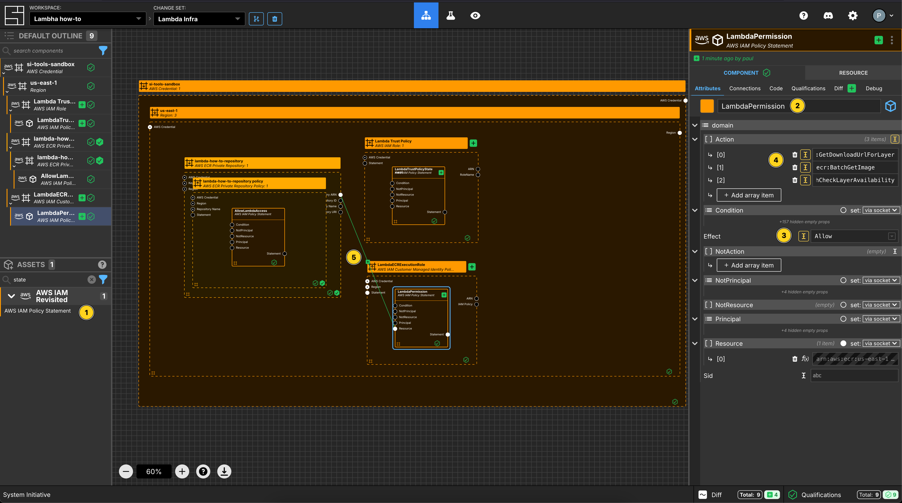

Add an `AWS IAM Policy Statement` within the `LambdaECRExecutionRole` AWS IAM
Role frame.

Set the Component name to `LambdaPermission`.

Set the `Effect` to `Allow`.

Add 3 array items to `Action`.

Set the values to be:

- `ecr:GetDownloadUrlForLayer`
- `ecr:BatchGetImage`
- `ecr:BatchCheckLayerAvailability`

Connect the `Repository ARN` Output Socket of the `lambda-how-to-repository` to
the `Resource` Input Socket of this `LambdaPermission` Component.

### Create an AWS IAM Role Policy

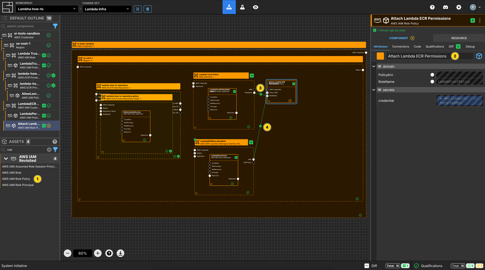

Add an `AWS IAM Role Policy` to your `us-east-1` region frame.

Set the Component name to `Attach Lambda ECR Permissions`.

Connect the `RoleName` Output Socket of the `Lambda Trust Policy` Component to
the `RoleName` of this `Attach Lambda ECR Permissions` Component.

Connect the `ARN` Output Socket of the `LambdaECRExecutionRole` to the
`Policy ARN` Input Socket of this `Attach Lambda ECR Permissions` Component.

### Create a Lambda Function

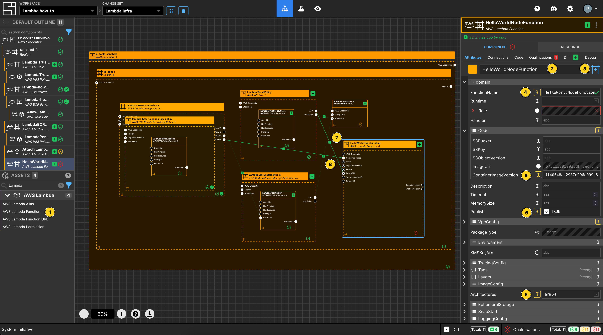

Add a `Lambda Function` to your `us-east-1` region frame.

Set the Component name to be `HelloWorldNodeFunction`.

Set the Component type to be `Configuration Frame (down)`.

Set the `FunctionName` to be `HelloWorldNodeFunction`.

Set `Publish` to be `true`.

Set `Architectures` to be `arm64`.

Connect the `Repository URI` Output Socket of the `lambda-how-to-repository` to
the `Container Image` Input Socket of this `HelloWorldNodeFunction` Component.

Connect the `ARN` Output Socket of the `Lambda Trust Policy` Component to the
`Role ARN` Input Socket of this `HelloWorldNodeFunction` Component.

In order to ensure that you are setting the correct version of the container
image, you can inspect the docker container manifest to ensure you set the
correct image to use as the container image. My local setup will try and build
multi-architecture containers, so I need to select the correct `arm64`
architecture for the function.

```bash
docker manifest inspect 573113295293.dkr.ecr.us-east-1.amazonaws.com/lambda-how-to-repository:latest
{
   "schemaVersion": 2,
   "mediaType": "application/vnd.oci.image.index.v1+json",
   "manifests": [
      {
         "mediaType": "application/vnd.oci.image.manifest.v1+json",
         "size": 1626,
         "digest": "sha256:703e717188a34c38e53d80a3dec4bf345c5b9b97a4f40648aa2987e296e099a5",
         "platform": {
            "architecture": "arm64",
            "os": "linux"
         }
      },
      {
         "mediaType": "application/vnd.oci.image.manifest.v1+json",
         "size": 566,
         "digest": "sha256:e425754d9a0571c59a7a138eb4989b5cdcdc7153d2c2dbd9b47f4adc0b91cb8d",
         "platform": {
            "architecture": "unknown",
            "os": "unknown"
         }
      }
   ]
}
```

In this case, I would set the `ContainerImageVersion` to be
`@sha256:703e717188a34c38e53d80a3dec4bf345c5b9b97a4f40648aa2987e296e099a5`.

### Create Lambda Permission

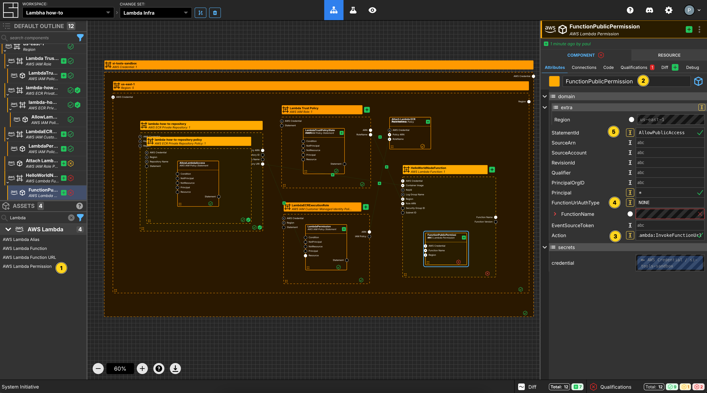

Add a `Lambda Permission` to your `HelloWorldNodeFunction` Lambda function
frame.

Set the Component name to be `FunctionPublicPermission`.

Set `Action` to be `lambda:InvokeFunctionUrl`.

Set `FunctionUrlAuthType` to be `NONE`.

Set `Principal` to be `*`.

Set `StatementId` to be `AllowPublicAccess`.

### Create Lambda Function Url

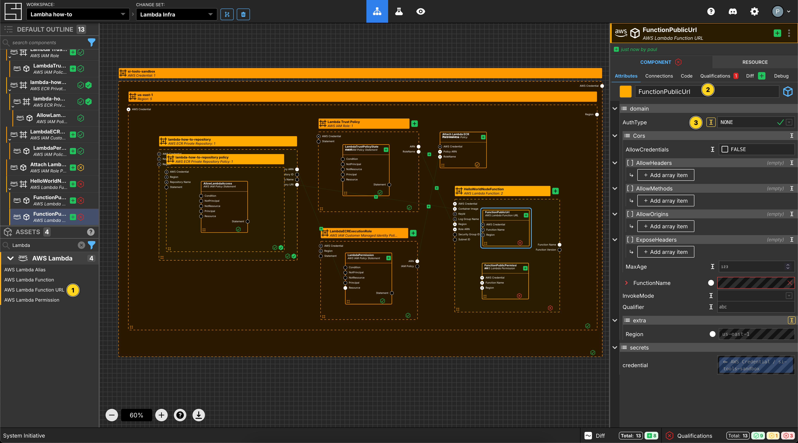

Add a `Lambda Function Url` to your `HelloWorldNodeFunction` Lambda function
frame.

Set the Component name to be `FunctionPublicUrl`.

Set the `AuthType` to be `NONE`.

### Apply your Change Set

Press `Escape` or click anywhere on the canvas background to select the
Workspace.

Click the `Apply Change Set` button to:

- Create 2 IAM Roles and the correct attachment between them
- Create a Lambda Function
- Create a Lambda Permission
- Create a Lambda Function URL

### Explore your resources

Review the completed AWS resources by clicking the `Resource` sub-panel for each
of your new resources.

Select the `FunctionPublicUrl` Component on the Model. Go to the `Resource Data`
screen and you will find the `FunctionUrl`. You can visit that URL in the
browser and inspect the running application.

### Clean Up

Create a new Change Set called `Clean up How-to`

Delete all of the Components.

Click `Apply Change Set`.

All your new resources should be deleted from your AWS account.

## Vocabulary
In this guide bits of System Initiative Vocabulary will be shown with a capital letter. 
All definitions for these can be found here: [System Initative - Vocabulary](https://docs.systeminit.com/reference/vocabulary) 