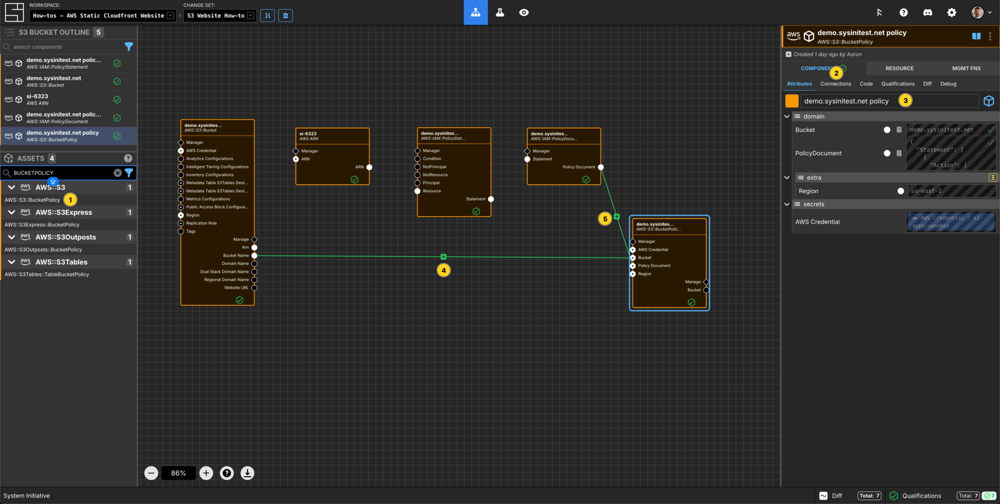
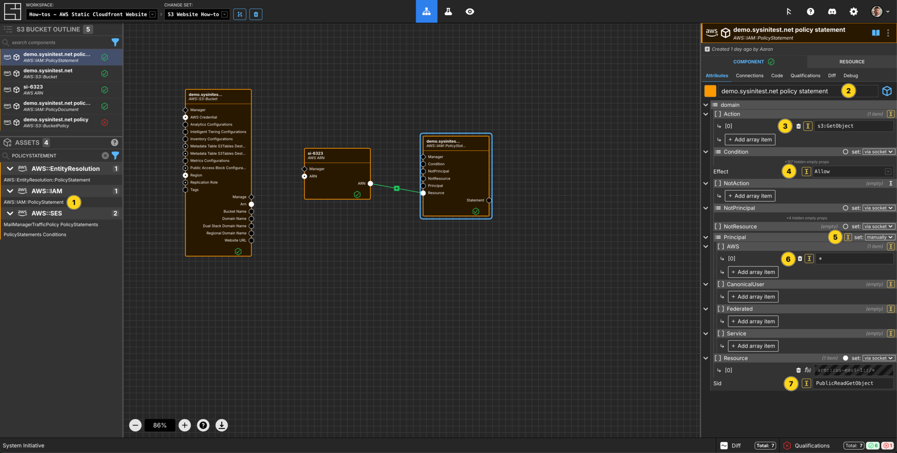

---
outline:
  level: [2, 3, 4]
---

# How to deploy a static Website with AWS S3 and Cloudfront

This how-to assumes:

- Basic [familiarity with System Initiative](../tutorials/getting-started)
- Are familiar with [AWS](https://docs.aws.amazon.com/)

It will teach you how to deploy a website using AWS S3 and Cloutfront with
System Initiative.

We will cover:

- The creation of the correct AWS S3 bucket to host a website
- Deployment of a Cloudfront Distribution for the Website
- Use of Route53 and an ACM Certificate to make it serve traffic from the
  internet.

## Setup

All activities in this how-to happen within an AWS Region and AWS Credential.

Start in a Change Set named `S3 Website How-to`.

## Walkthrough

### What it will look like

When you are through with this guide, you should have Components that look like
this in your diagram:

### Create AWS Credentials

Add a `AWS Credential` to your Change Set and configure your AWS credentials

### Select an AWS Region

Add a `AWS Region` to your Change Set and set the `region` property to
`us-east-1`.

### Create a S3 Bucket

Add a `Bucket` to your `us-east-1` region frame.

Set the Component name to `demo.sysinitest.net`.

Set the `BucketName` to `demo.sysinitest.net`.

Set the `Acl` to `private`.

Set the Component type to be `Configuration Frame (down)`.

Set the `ObjectOwnership` to be `BucketOwnerEnforced`.

### Create a Bucket Website

Add a `Bucket Website` to your `demo.sysinitest.net` bucket frame.

Set the Component name to `demo.sysinitest.net config`.

Set the `Index Document Suffix` to be `index.html`.

Set the `Error Document Key` to be `error.html`.

The `Bucket Name` Input Socket of this `Bucket Website` Component should get
automatically connected to the `Bucket Name` Output Socket of `Bucket` frame.

### Create a Bucket Policy

Add a `Bucket Policy` to your `demo.sysinitest.net` bucket frame.

Set the Component name to `demo.sysinitest.net policy`.

Set the Component type to be `Configuration Frame (up)`.

The `Bucket Name` Input Socket of this `Bucket Policy` frame should get
automatically connected to the `Bucket Name` Output Socket of `Bucket` frame.

### Create an IAM Policy Statement

Add an `IAM Policy Statement` to your `demo.sysinitest.net policy` frame.

Set the Component name to `demo.sysinitest.net policy statement`.

Set the `Sid` to be `PublicReadGetObject`.

Set the `Effect` to be `Allow`.

Set the `Principal` to be `set: manually`.

Add an `array item` to `AWS` and set the value to be `*`.

Add an `array item` to `Action` and set the value to be `s3:GetObject`.

### Create an AWS ARN

Add an `AWS ARN` to your `demo.sysinitest.net` bucket frame.

Set the Component name to be `Bucket Policy Resource`.

Set `resource-postfix` to be `/*`.

The `ARN` Input Socket of this `AWS ARN` Component should get automatically
connected to the `ARN` Output Socket of `Bucket` frame.

Connect the `ARN` Output Socket of the `AWS ARN` Component to the `Resource`
Input Socket of the `demo.sysinitest.net policy` Component.

### Create a Public Access Block

Add a `Bucket Block Public Access` to your `demo.sysinitest.net` bucket frame.

Set the Component name to be `Bucket Access Control`.

Set `BlockPublicAcls` to be `false`.

Set `IgnorePublicAcls` to be `false`.

Set `BlockPublicPolicy` to be `false`.

Set `RestrictPublicBuckets` to be `false`.

The `Bucket Name` Input Socket of this `Bucket Block Public Access` Component
should get automatically connected to the `Bucket Name` Output Socket of
`Bucket` frame.

### Deploy the Bucket Website

Press `Escape` or click anywhere on the canvas background to select the
Workspace.

Click the `Apply Change Set` button to:

- Create an S3 Bucket
- Configure a policy, the public access controls and a website configuration for
  that bucket

### Open a New Changeset

Create a new changeset called `S3 Website Cloudfront How-to`.

### Create a Cloudfront Origin

Add a `Cloudfront Origin` to your `us-east-1` region frame.

Set the Component name to be `S3-Website`.

Set the `Id` to be `S3-Website`.

Set `ProtocolPolocy` to be `http-only`.

Set `HTTPSPort` to be `443`.

Set `HTTPPort` to be `80`.

Connect the `Website Endpoint` Output Socket of this
`demo.sysinitest.net config` Component to the `Domain Name` Input Socket of this
`S3-Website` Component.

### Create a Cloudfront Distribution

Add a `Cloudfront Distribution` to your `us-east-1` region frame.

Set the Component name to be `Website Cloudfront`.

Set the `DistributionName` to be `s3-website`.

Set `Enabled` to be `true`.

Set `Comment` to be `Distribution for S3 Website`

Set `TargetOriginId` to be `S3-Website` (this must match the Component name of
the `Cloudfront Origin` Component).

Set `ViewerProtocolPolicy` to be `Redirect HTTP to HTTPS`.

Add 2 `array items` to `AllowedMethods` and set them to be `GET` & `HEAD`.

Add 2 `array items` to `CachedMethods` and set them to be `GET` & `HEAD`.

Add an `array item` to `Aliases` and set the value to be `demo.sysinitest.net`.

Set `CachePolicyId` to be `CachePolicyOptimized`.

Set `CloudFrontDefaultCertificate` to be `false`.

Set `MinimumProtocolVersion` to be `TLSv1.2_2021`.

Connect the `Origin` Output Socket of the `S3-Website` Component to the `Origin`
Input Socket of this `Website Cloudfront` Component.

### Create a Hosted Zone

Add a `Hosted Zone` to your `us-east-1` region frame.

Set the Component name to be `sysinitest.net`

Set the `Name` to be `sysinitest.net`.

Please Note: I am using the domain `sysinitest.net` as the URL where I will
deploy this application. You will need to substitute in your own domain in this
next section.

### Create an ACM Certificate

Add an `ACM Certificate` to your `us-east-1` region frame.

Set the Component name to be `demo.sysinitest.net`.

Set the `DomainName` to be `demo.sysinitest.net`.

Connect the `Certificate ARN` Output Socket of this `demo.sysinitest.net`
Component to the `ACM Certificate ARN` Input Socket of the `Website Cloudfront`
Component.

### Create an ACM Validation Record

Add a `Route53 Record` to your `us-east-1` region frame.

Set the Component name to be `demo.sysinitest.net cert validation`.

Connect the `Certificate Validation Options` Output Socket of the
`demo.sysinitest.net` Component to the `Certificate Validation Options` input
socket of this `demo.sysinitest.net cert validation` Component.

Connect the `Hosted Zone ID` Output Socket of the `sysinitest.net` Component to
the `Hosted Zone ID` Input Socket of this `demo.sysinitest.net cert validation`
Component.

### Create an Cloudfront Alias Record

Add a `Route53 Record` to your `us-east-1` region frame.

Set the Component name to be `Cloudfront Alias Record`.

Set the `Name` to be `demo.sysinitest.net`.

Connect the `Domain Name` Output Socket of the `Website Cloudfront` Component to
the `cloudfront DNS` Input Socket of this `Cloudfront Alias Record` Component.

Connect the `Hosted Zone ID` Output Socket of the `sysinitest.net` Component to
the `Hosted Zone ID` Input Socket of this `Cloudfront Alias Record` Component.

### Apply your Change Set

Press `Escape` or click anywhere on the canvas background to select the
Workspace.

Click the `Apply Change Set` button to:

- Create a Cloudfront Distribution
- Create a Route53 hosted zone
- Create an ACM Certificate and the appropriate DNS validation record
- Create a Route53 Alias for the Cloudfront Distribution

### Deploy your website

You can now deploy your website to your specified S3 bucket and then visit the
URL that you specified in the `Cloudfront Alias Record`. You should also ensure
that the nameservers for the hosted zone match that of your domain registrar.

### Explore your resources

Review the completed AWS resources by clicking the `Resource` sub-panel for each
of your new resources.

### Clean Up

Create a new Change Set called `Clean up How-to`

Delete your `us-east-1` region frame. All of the Components inside will be
marked for deletion.

Click `Apply Change Set`.

All your new resources should be deleted from your AWS account.

## Vocabulary
In this guide bits of System Initiative Vocabulary will be shown with a capital letter. 
All definitions for these can be found here: [System Initative - Vocabulary](https://docs.systeminit.com/reference/vocabulary) 