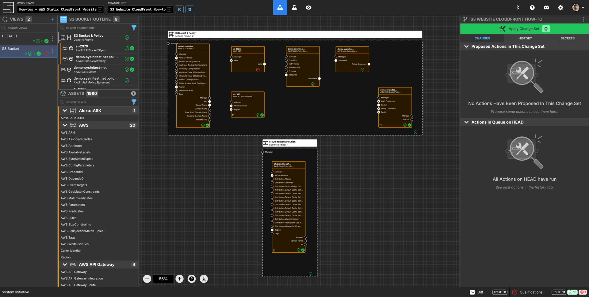
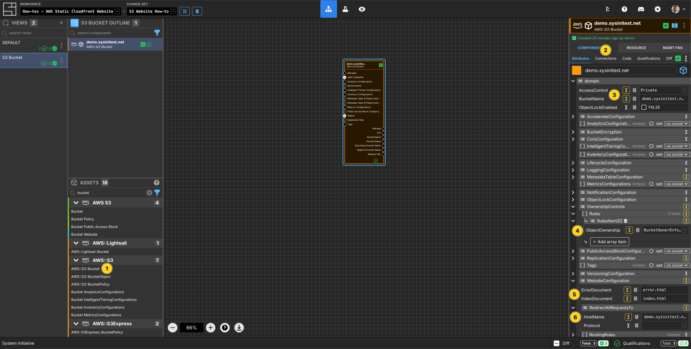
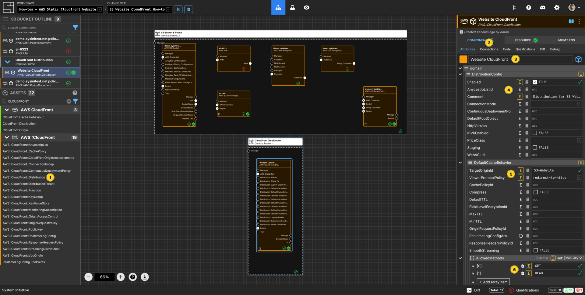

---
outline:
  level: [2, 3, 4]
---

# How to deploy a static Website with AWS S3 and CloudFront

This how-to assumes:

- Basic [familiarity with System Initiative](../tutorials/getting-started)
- Are familiar with [AWS](https://docs.aws.amazon.com/)

It will teach you how to deploy a website using AWS S3 and CloudFront with
System Initiative.

We will cover:

- The creation of the correct AWS S3 bucket to host a website
- Deployment of a CloudFront Distribution for the Website

## Setup

All activities in this how-to guide use an AWS Region and AWS Credential.

Start in a Change Set named `S3 Website How-to`.

## Walkthrough

### What it will look like

When you are through with this guide, you should have Components that look like
this in your diagram:

### Create AWS Credentials

Add a `AWS Credential` to your Change Set and configure your AWS credentials.

### Select an AWS Region

Add a `AWS Region` to your Change Set and set the `region` property to
`us-east-1`.

### Create an S3 Bucket

Add an `AWS::S3::Bucket` component to your canvas and connect the Credentials and region via the Connections menu.

Right click on the `AWS::S3::Bucket` component and select `Move to > Create new View...` Call this S3 Bucket.

Set the Component name to `demo-sysinitest-net`.

Set the `BucketName` to `demo-sysinitest-net`.

Add an array item to `OwnershipControls -> Rules` and set to be `BucketOwnerEnforced`.

Set `PublicAccessBlockConfiguration` to be `set:manually` and leave all options as `FALSE`.

In `WebsiteConfiguration` Set the `IndexDocument` to be `index.html`.

Set the `ErrorDocument` to be `error.html`.

### Add an AWS ARN Component

Add an `AWS ARN` component to your canvas.

Set the `resource-postfix` to `/*`.

Connect the `Arn` Output Socket of the `AWS::S3::Bucket` to the `ARN` Input Socket of the `AWS ARN` Component.

### Create an IAM Policy Statement

Add an `AWS::IAM::PolicyStatement` component to your canvas.

Set the Component name to `demo-sysinitest-net policy statement`.

Add an `array item` to `Action` and set the value to be `s3:GetObject`.

Set the `Effect` to `Allow`.

Change the `Principal` to be `set: manually`.

Add an `array item` to `AWS` and set the value to be `*`.

Set the `Sid` to be `PublicReadGetObject`.

Connect the `ARN` output socket of the `AWS ARN` component to the `Resource` input socket of the `AWS::IAM::PolicyStatement` component.

Add a `AWS::IAM::PolicyDocument` component to your canvas. Change it from Up Frame to Component.

Set the Component name to `demo-sysinitest-net policy document`.

Connect the `Statement` output socket of the `AWS::IAM::PolicyStatement` component to the `Statement` input socket of the `AWS::IAM::PolicyDocument` component.

### Create a Bucket Policy

Add a `AWS::S3::BucketPolicy` component to your canvas.

Connect the AWS Credentials and region via the Connections menu.

Set the Component name to `demo-sysinitest-net policy`.

Connect the `Bucket Name` output socket of the `AWS::S3::Bucket` component to the `Bucket` input socket of the `AWS::S3::BucketPolicy` component.

Connect the `Policy Document` output socket of the `AWS::IAM::PolicyDocument` component to the `Policy Document` input socket of the `AWS::S3::BucketPolicy` component.

### Deploy the Bucket Website

Press `Escape` or click anywhere on the canvas background to select the
Workspace.

Click the `Apply Change Set` button to:

- Create an S3 Bucket, along with its public access controls and a website configuration.
- Configure an IAM and Bucket policy,

### Open a New Changeset

Create a new changeset called `Upload index.html to S3 Bucket`.

### Upload file to your S3 Bucket

Add an `AWS::S3::BucketObject` Component to your canvas.

In the Connections menu connect the `AWS Credential` and `Region`.

Set the `FileContents` property to `Hello there!`.

Set the `FileName` to `index.html`.

Set the `BucketPath` to `s3://demo-sysinitest-net`.

In the Resource tab, Click `Copy File to S3 Bucket`.

Hit the escape button or click on the canvas, then `Apply`. Your file should now be uploaded to your S3 Bucket.

### Open a New Changeset

Create a new changeset called `S3 Website CloudFront How-to`.

### Create a CloudFront Distribution

Add a `AWS::CloudFront::Distribution` component to the canvas.

In the Connections menu, connect the `Region` and `AWS Credential`.

Set the Component name to be `Website CloudFront`.

Set the `Enabled` to `TRUE`.

Add a `Comment` of `Distribution for S3 Website`.

In `DefaultCacheBehaviour` Set `TargetOriginId` to be `S3-Website`.

Set `ViewerProtocolPolicy` to be `redirect-to-https`.

Add 2 `array items` to `AllowedMethods` and set them to be `GET` & `HEAD`.

Add 2 `array items` to `CachedMethods` and set them to be `GET` & `HEAD`.

In `Forwarded Values` set `QueryString` to `TRUE`.

Set `Cookies` `Forward` propery to `all`.

In `Origins` `OriginsItem[0]` Set `DomainName` to be `demo-sysinitest-net.s3-website-us-east-1.amazonaws.com`.

Set `Id` to `S3-Website`.

Set `ConnectionAttempts` to `3`.

Set `ConnectionTimeout` to `10`.

In `CustomOriginConfig` Set `HTTPPort` to be `80`.

Set `HTTPSPort` to be `443`.

Set `OriginKeepaliveTimeout` to `5`.

Set `OriginProtocolPolicy` to `http-only`.

Set `OriginReadTimeout` to `30`.

Create 4 array items within `OriginSSLProtocols`.

Set each array item to have one of the following values `SSLv3`, `TLSv1`, `TLSv1.1`, `TLSv1.2`.

In `ViewerCertificate` Set `CloudFrontDefaultCertificate` to be `TRUE`.

Set `MinimumProtocolVersion` to be `TLSv1.2_2021`.

### Apply your Change Set

Press `Escape` or click anywhere on the canvas background to select the
Workspace.

Click the `Apply Change Set` button to:

- Create a CloudFront Distribution

### Check your website

You can now visit your website on your specified S3 Bucket by visiting the
DomainName that you specified in `AWS::CloudFront::Distribution` plus /index.html, for example `demo-sysinitest-net.s3-website-us-east-1.amazonaws.com/index.html`.

### Explore your resources

Review the completed AWS resources by clicking the `Resource` sub-panel for each
of your new resources.

### Clean Up

Create a new Change Set called `Clean up How-to`

Select the `Credential` and `Region` components, and the `S3 Bucket` view in your `DEFAULT` view and delete.

Click `Apply Change Set`.

All your new resources should be deleted from your AWS account.

## Vocabulary
In this guide bits of System Initiative Vocabulary will be shown with a capital letter.
All definitions for these can be found here: [System Initative - Vocabulary](https://docs.systeminit.com/reference/vocabulary)
