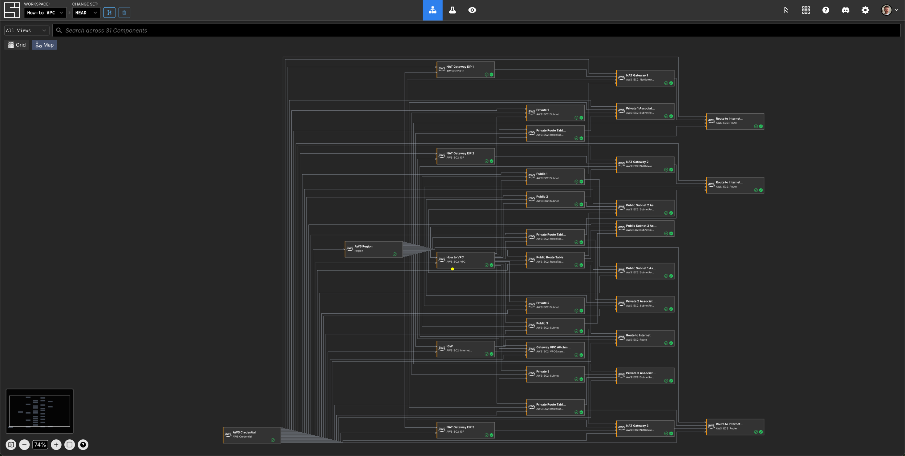
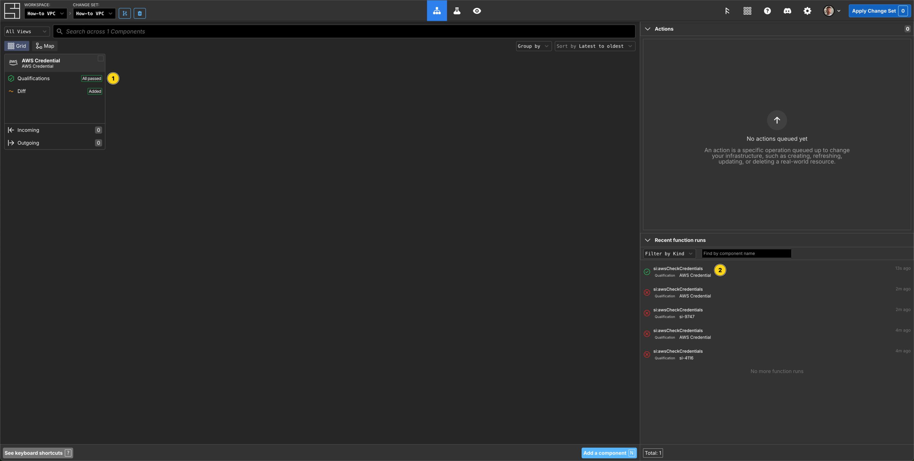
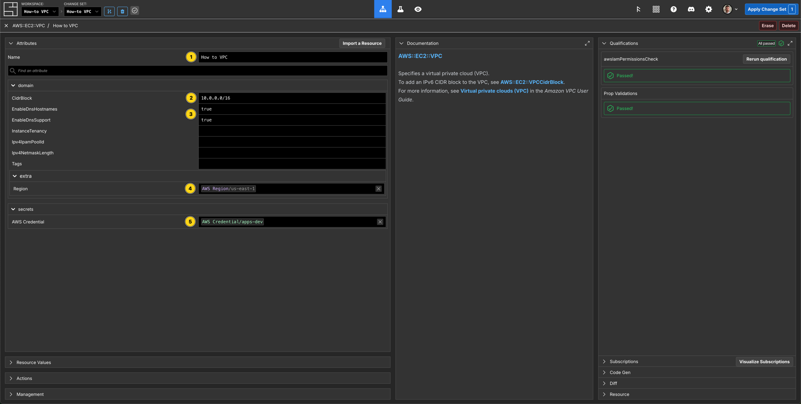
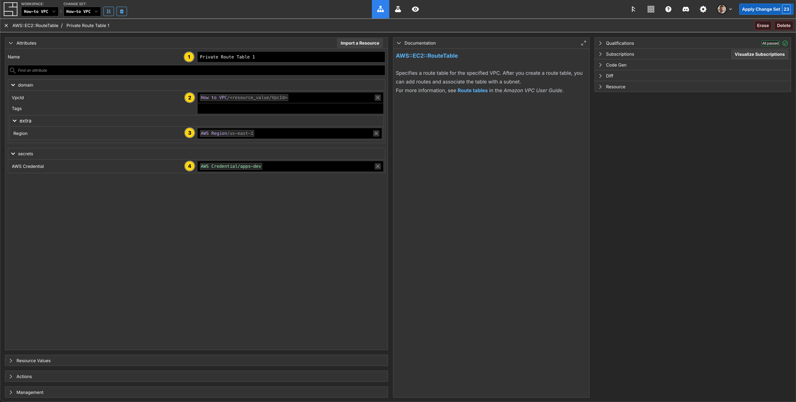
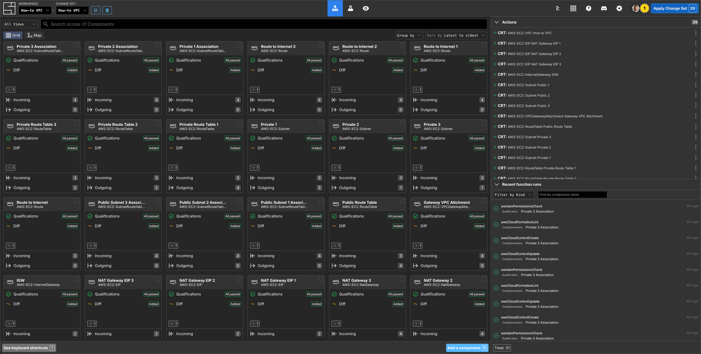

---
outline:
  level: [2, 3, 4]
---

# How to Create and Manage an AWS VPC with the CLI or Web Application

This how-to assumes:

- Basic [familiarity with System Initiative](../tutorials/setup)
- Are familiar with [AWS VPC](https://docs.aws.amazon.com/vpc/)

It will teach you how to create a best practice AWS VPC and manage it with
System Initiative.

We will cover:

- The creation of a highly available VPC that spans multiple availability zones.
- A VPC configured with public and private subnets.
- The networking required to allow outbound traffic for resources on the private
  subnets.
- The networking required for the communication with the internet.

## What it will look like when completed

When you have completed this guide, you should have Components that look like
this in your Grid:


and like this in your Map:



## Create a Change Set

First, create a change set: [[reference]](../reference/change-sets.md#creating-a-change-set)

<DocTabs tabs="CLI,Web Application">
<TabPanel value="CLI">

```shellscript [Create a Change Set]
$ si change-set create "How-to VPC"
✨ info    si              Change set created: { id: "01KCMGWWD388NJ2DH6KQPXYEG8", name: "How-to VPC", status: "Open" }
$ export SI_CHANGE_SET_ID=01KCMGWWD388NJ2DH6KQPXYEG8
```

</TabPanel>
<TabPanel value="Web Application">

To create a Change Set:


1. Press the `C` hotkey or click the 'Create Change Set' button from the top
   bar.
2. Enter the Change set name
3. Click the 'Create change set' button

</TabPanel>
</DocTabs>

## Create AWS Credentials

<DocTabs tabs="CLI,Web Application">
<TabPanel value="CLI">

```shellscript [Create AWS Credential]
$ si secret create "AWS Credential" --name "aws-credential-dev" --use-local-profile -c $SI_CHANGE_SET_ID
✨ info    si              Secret type "AWS Credential" not found. Attempting to install...
✨ info    si              Found schema "AWS Credential", installing...
✨ info    si              ✓ Successfully installed "AWS Credential" schema
✨ info    si              Re-querying secret definitions...
✨ info    si              Discovering credentials from local environment...
✨ info    si              ✓ Found 3 credential(s) in local environment
✨ info    si
✨ info    si              Creating AWS Credential component "aws-credential-dev"...
✨ info    si              ✓ Component created with ID: 01KCMKRVATDC6Y3XZNRGMKVDP5
✨ info    si              Creating secret data...
✨ info    si              ✓ Secret created with ID: 01KCMKRVYHRXY7JFK26SYMX155
✨ info    si              Attaching secret to component...
✨ info    si              ✓ Secret attached to component
✨ info    si
✨ info    si              ✓ Credential created successfully!
✨ info    si                Component ID: 01KCMKRVATDC6Y3XZNRGMKVDP5
✨ info    si                Secret ID: 01KCMKRVYHRXY7JFK26SYMX155
✨ info    si                Secret Name: aws-credential-dev
✨ info    si                Change Set ID: 01KCMGWWD388NJ2DH6KQPXYEG8
✨ info    si
✨ info    si              Next steps:
✨ info    si                1. Apply the change set to make the credential available
✨ info    si                2. Other components can now use this credential
```

</TabPanel>
<TabPanel value="Web Application">

Press `N` (or click `Add a component`) search for `AWS Credential`, select it then hit `Enter` to create an `AWS Credential` Component.


Now configure your AWS Credentials to a valid AWS account, and press `Add Secret`, hit `Esc` to return to the Grid. You now have a valid AWS Credential component to use for this VPC.



</TabPanel>
</DocTabs>

## Select an AWS Region

<DocTabs tabs="CLI,Web Application">
<TabPanel value="CLI">

```shellscript [Create an AWS Region Component]
$ cat > component.json <<'EOF'
{
  "schemaName": "Region",
  "attributes": {
    "/si/name": "How to Region",
    "/domain/region": "us-east-1",
    "/secrets/credential": { "$source": { "component": "aws-credential-dev", "path": "/secrets/AWS Credential" } }
  }
}
EOF

$ si component create -c $SI_CHANGE_SET_ID component.json
✨ info    si              Loading component data from "component.json"
✨ info    si              Creating component: "Region" "us-east-1"
Component ID: 01KCMSAE7PFY34B1AYNBXYDKWB
```

</TabPanel>
<TabPanel value="Web Application">

Press `N`, then search for, select and add an `AWS Region` to your Change Set. Name the Component, `AWS Region`, set the `region` property to`us-east-1` and Subscribe the credential property to your AWS Credential. Hit `Esc` to return to the Grid.


</TabPanel>
</DocTabs>

## Create a VPC Component

<DocTabs tabs="CLI,Web Application">
<TabPanel value="CLI">

```shellscript [Create a VPC Component]
$ cat > component.json <<'EOF'
{
  "schemaName": "AWS::EC2::VPC",
  "attributes": {
    "/si/name": "How to VPC",
    "/domain/CidrBlock": "10.0.0.0/16",
    "/domain/EnableDnsHostnames": true,
    "/domain/EnableDnsSupport": true,
    "/domain/extra/Region":    { "$source": { "component": "How to Region", "path": "/domain/region" } },
    "/secrets/AWS Credential": { "$source": { "component": "aws-credential-dev", "path": "/secrets/AWS Credential" } }
  }
}
EOF

$ si component create -c $SI_CHANGE_SET_ID component.json
✨ info    si              Loading component data from "component.json"
✨ info    si              Creating component: "AWS::EC2::VPC" "How to VPC"
Component ID: 01KCMZ57S8EQFQEKQMSRCWHSZY
```

</TabPanel>
<TabPanel value="Web Application">

Press `N`, then search for, select and add an `AWS::EC2::VPC` Component.

Set the Component name to be `How to VPC`.

Set the `CidrBlock` property to `10.0.0.0/16`

Set `EnableDnsHostnames` to true.

Set `EnableDnsSupport` to true.

Subscribe the `region` property to your AWS Region.

Subscribe the `credential` property to your AWS Credential.



Press `Esc` to return to the Grid.

</TabPanel>
</DocTabs>

## Create the Public Subnet Components

This VPC will span multiple availability zones in our AWS Region.

<DocTabs tabs="CLI,Web Application">
<TabPanel value="CLI">

```shellscript [Create Subnet Public 1]
$ cat > component.json <<'EOF'
{
  "schemaName": "AWS::EC2::Subnet",
  "attributes": {
    "/si/name": "Public 1",
    "/domain/CidrBlock": "10.0.128.0/20",
    "/domain/AvailabilityZone": "us-east-1a",
    "/domain/MapPublicIpOnLaunch": true,
    "/domain/VpcId":           { "$source": { "component": "How to VPC",         "path": "/resource_value/VpcId"} },
    "/domain/extra/Region":    { "$source": { "component": "How to Region",      "path": "/domain/region" } },
    "/secrets/AWS Credential": { "$source": { "component": "aws-credential-dev", "path": "/secrets/AWS Credential" } }
  }
}
EOF

$ si component create -c $SI_CHANGE_SET_ID component.json
✨ info    si              Loading component data from "component.json"
✨ info    si              Creating component: "AWS::EC2::Subnet" "Public 1"
Component ID: 01KCMZKZSJP4MPTS5FFKCNWWEK
```

```shellscript [Create Subnet Public 2]
$ cat > component.json <<'EOF'
{
  "schemaName": "AWS::EC2::Subnet",
  "attributes": {
    "/si/name": "Public 2",
    "/domain/CidrBlock": "10.0.144.0/20",
    "/domain/AvailabilityZone": "us-east-1b",
    "/domain/MapPublicIpOnLaunch": true,
    "/domain/VpcId":           { "$source": { "component": "How to VPC",         "path": "/resource_value/VpcId"} },
    "/domain/extra/Region":    { "$source": { "component": "How to Region",      "path": "/domain/region" } },
    "/secrets/AWS Credential": { "$source": { "component": "aws-credential-dev", "path": "/secrets/AWS Credential" } }
  }
}
EOF

$ si component create -c $SI_CHANGE_SET_ID component.json
✨ info    si              Loading component data from "component.json"
✨ info    si              Creating component: "AWS::EC2::Subnet" "Public 2"
Component ID: 01KCMZQVZJY5XQ82F82744CD94
```

```shellscript [Create Subnet Public 3]
$ cat > component.json <<'EOF'
{
  "schemaName": "AWS::EC2::Subnet",
  "attributes": {
    "/si/name": "Public 3",
    "/domain/CidrBlock": "10.0.160.0/20",
    "/domain/AvailabilityZone": "us-east-1c",
    "/domain/MapPublicIpOnLaunch": true,
    "/domain/VpcId":           { "$source": { "component": "How to VPC",         "path": "/resource_value/VpcId"} },
    "/domain/extra/Region":    { "$source": { "component": "How to Region",      "path": "/domain/region" } },
    "/secrets/AWS Credential": { "$source": { "component": "aws-credential-dev", "path": "/secrets/AWS Credential" } }
  }
}
EOF

$ si component create -c $SI_CHANGE_SET_ID component.json
✨ info    si              Loading component data from "component.json"
✨ info    si              Creating component: "AWS::EC2::Subnet" "Public 3"
Component ID: 01KCMZS15RMPVZY2EA2TBEWGCD
```

</TabPanel>
<TabPanel value="Web Application">

Add a
`AWS::EC2::Subnet` Component to your Change Set, then right click it, and press `D` to duplicate the Component (add a prefix to each duplicate of `Public` if you like) until you have 3 of them.


Then Configure them as follows:

| Component Name | `CidrBlock`   | `AvailabilityZone` | `MapPublicIpOnLaunch` |
| -------------- | ------------- | ------------------ | --------------------- |
| Public 1       | 10.0.128.0/20 | us-east-1a         | true                  |
| Public 2       | 10.0.144.0/20 | us-east-1b         | true                  |
| Public 3       | 10.0.160.0/20 | us-east-1c         | true                  |

Subscribe the VpcId property to your `AWS::EC2::VPC` Component named `How to VPC`, for each of the Subnets.

Subscribe to your `Region` and `AWS Credential` properties for each of the Subnets. When you are done with Subnet 3, press `Esc` to return to the Grid.

</TabPanel>
</DocTabs>

## Create the Elastic IP Components

<DocTabs tabs="CLI,Web Application">
<TabPanel value="CLI">

```shellscript [Create NAT Gateway EIP 1]
$ cat > component.json <<'EOF'
{
  "schemaName": "AWS::EC2::EIP",
  "attributes": {
    "/si/name": "NAT Gateway EIP 1",
    "/domain/Domain": "vpc",
    "/domain/extra/Region":    { "$source": { "component": "How to Region",      "path": "/domain/region" } },
    "/secrets/AWS Credential": { "$source": { "component": "aws-credential-dev", "path": "/secrets/AWS Credential" } }
  }
}
EOF

$ si component create -c $SI_CHANGE_SET_ID component.json
✨ info    si              Loading component data from "component.json"
✨ info    si              Creating component: "AWS::EC2::EIP" "NAT Gateway EIP 1"
Component ID: 01KCMZZDECDDJYKG6PWNSRV907
```

```shellscript [Create NAT Gateway EIP 2]
$ cat > component.json <<'EOF'
{
  "schemaName": "AWS::EC2::EIP",
  "attributes": {
    "/si/name": "NAT Gateway EIP 2",
    "/domain/Domain": "vpc",
    "/domain/extra/Region":    { "$source": { "component": "How to Region",      "path": "/domain/region" } },
    "/secrets/AWS Credential": { "$source": { "component": "aws-credential-dev", "path": "/secrets/AWS Credential" } }
  }
}
EOF

$ si component create -c $SI_CHANGE_SET_ID component.json
✨ info    si              Loading component data from "component.json"
✨ info    si              Creating component: "AWS::EC2::EIP" "NAT Gateway EIP 2"
Component ID: 01KCN00ZT2C68PGQXZ7A889WYQ
```

```shellscript [Create NAT Gateway EIP 3]
$ cat > component.json <<'EOF'
{
  "schemaName": "AWS::EC2::EIP",
  "attributes": {
    "/si/name": "NAT Gateway EIP 3",
    "/domain/Domain": "vpc",
    "/domain/extra/Region":    { "$source": { "component": "How to Region",      "path": "/domain/region" } },
    "/secrets/AWS Credential": { "$source": { "component": "aws-credential-dev", "path": "/secrets/AWS Credential" } }
  }
}
EOF

$ si component create -c $SI_CHANGE_SET_ID component.json
✨ info    si              Loading component data from "component.json"
✨ info    si              Creating component: "AWS::EC2::EIP" "NAT Gateway EIP 3"
Component ID: 01KCN01STSP85JM9Q63C81DNV2
```

</TabPanel>
<TabPanel value="Web Application">

Add an `AWS::EC2::EIP` Component to the Grid, hit `Esc` then duplicate (`D`) until you have 3 of them.

Set the names of the Components to be `NAT Gateway EIP (1|2|3)` - the index
should align with each of the Subnets, and match the corresponding `NAT Gateway` Components.

Set the `Domain` of each of the Elastic IP Components to be `vpc`.

Subscribe to your `Region` and `AWS Credential` properties for each of the NAT Gateway EIP Components.


Press `Esc` to return to the Grid.

</TabPanel>
</DocTabs>

## Create the NAT Gateway Components

<DocTabs tabs="CLI,Web Application">
<TabPanel value="CLI">

```shellscript [Create NAT Gateway 1]
$ cat > component.json <<'EOF'
{
  "schemaName": "AWS::EC2::NATGateway",
  "attributes": {
    "/si/name": "NAT Gateway 1",
    "/domain/ConnectivityType": "public",
    "/domain/SubnetId":        { "$source": { "component": "Public 1",           "path": "/resource_value/SubnetId" } },
    "/domain/AllocationId":    { "$source": { "component": "NAT Gateway EIP 1",  "path": "/resource_value/AllocationId" } },
    "/domain/extra/Region":    { "$source": { "component": "How to Region",      "path": "/domain/region" } },
    "/secrets/AWS Credential": { "$source": { "component": "aws-credential-dev", "path": "/secrets/AWS Credential" } }
  }
}
EOF

$ si component create -c $SI_CHANGE_SET_ID component.json
✨ info    si              Loading component data from "component.json"
✨ info    si              Creating component: "AWS::EC2::NATGateway" "NAT Gateway 1"
Component ID: 01KCN082A0E1CHMBWJHX3H7BS2
```

```shellscript [Create NAT Gateway 2]
$ cat > component.json <<'EOF'
{
  "schemaName": "AWS::EC2::NATGateway",
  "attributes": {
    "/si/name": "NAT Gateway 2",
    "/domain/ConnectivityType": "public",
    "/domain/SubnetId":        { "$source": { "component": "Public 2",           "path": "/resource_value/SubnetId" } },
    "/domain/AllocationId":    { "$source": { "component": "NAT Gateway EIP 2",  "path": "/resource_value/AllocationId" } },
    "/domain/extra/Region":    { "$source": { "component": "How to Region",      "path": "/domain/region" } },
    "/secrets/AWS Credential": { "$source": { "component": "aws-credential-dev", "path": "/secrets/AWS Credential" } }
  }
}
EOF

$ si component create -c $SI_CHANGE_SET_ID component.json
✨ info    si              Loading component data from "component.json"
✨ info    si              Creating component: "AWS::EC2::NATGateway" "NAT Gateway 2"
Component ID: 01KCN0B1EZRAXS1PHXKC8TDE6Q
```

```shellscript [Create NAT Gateway 3]
$ cat > component.json <<'EOF'
{
  "schemaName": "AWS::EC2::NATGateway",
  "attributes": {
    "/si/name": "NAT Gateway 3",
    "/domain/ConnectivityType": "public",
    "/domain/SubnetId":        { "$source": { "component": "Public 3",           "path": "/resource_value/SubnetId" } },
    "/domain/AllocationId":    { "$source": { "component": "NAT Gateway EIP 3",  "path": "/resource_value/AllocationId" } },
    "/domain/extra/Region":    { "$source": { "component": "How to Region",      "path": "/domain/region" } },
    "/secrets/AWS Credential": { "$source": { "component": "aws-credential-dev", "path": "/secrets/AWS Credential" } }
  }
}
EOF

$ si component create -c $SI_CHANGE_SET_ID component.json
✨ info    si              Loading component data from "component.json"
✨ info    si              Creating component: "AWS::EC2::NATGateway" "NAT Gateway 3"
Component ID: 01KCN0BNHJKENYF1AMM1CADQW5
```

</TabPanel>
<TabPanel value="Web Application">

Add an `AWS::EC2::NATGateway` Component to the Grid, hit `Esc` then duplicate (`D`) until you have 3 of them.

Set name names of each of the Components to be `NAT Gateway (1|2|3)` - the index should
align with each subnet.

In NatGateway 1, subscribe the `SubnetId` property to your `AWS::EC2::Subnet` Component named `Public 1`. Repeat this for NatGateway 2 and 3 to subscribe to the matching `SubnetId` properties.

In NatGateway 1, subscribe the `AllocationId` property to your `AWS::EC2::EIP` Component named `NAT Gateway EIP 1`. Repeat this for NatGateway 2 and 3 to subscribe to the matching `AllocationId` properties.


Set the `ConnectivityType` of each of the NAT Gateway Components to be `public`.

Subscribe to your `Region` and `AWS Credential` properties for each of the NAT Gateway Components.

Press `Esc` to return to the Grid.

</TabPanel>
</DocTabs>

## Create the Internet Gateway and VPCGatewayAttachment Components

<DocTabs tabs="CLI,Web Application">
<TabPanel value="CLI">

```shellscript [Create IGW]
$ cat > component.json <<'EOF'
{
  "schemaName": "AWS::EC2::InternetGateway",
  "attributes": {
    "/si/name": "IGW",
    "/domain/extra/Region":    { "$source": { "component": "How to Region",      "path": "/domain/region" } },
    "/secrets/AWS Credential": { "$source": { "component": "aws-credential-dev", "path": "/secrets/AWS Credential" } }
  }
}
EOF

$ si component create -c $SI_CHANGE_SET_ID component.json
✨ info    si              Loading component data from "component.json"
✨ info    si              Creating component: "AWS::EC2::InternetGateway" "IGW"
Component ID: 01KCN0G5T99658PK72FEY4HYTR
```

```shellscript [Create Gateway VPC Attachment]
$ cat > component.json <<'EOF'
{
  "schemaName": "AWS::EC2::VPCGatewayAttachment",
  "attributes": {
    "/si/name": "Gateway VPC Attachment",
    "/domain/InternetGatewayId": { "$source": { "component": "IGW",                "path": "/resource_value/InternetGatewayId" } },
    "/domain/VpcId":             { "$source": { "component": "How to VPC",         "path": "/resource_value/VpcId"} },
    "/domain/extra/Region":      { "$source": { "component": "How to Region",      "path": "/domain/region" } },
    "/secrets/AWS Credential":   { "$source": { "component": "aws-credential-dev", "path": "/secrets/AWS Credential" } }
  }
}
EOF

$ si component create -c $SI_CHANGE_SET_ID component.json
✨ info    si              Loading component data from "component.json"
✨ info    si              Creating component: "AWS::EC2::VPCGatewayAttachment" "Gateway VPC Attachment"
Component ID: 01KCN0KYR3F4KVS5DQSWEX8P8F
```

</TabPanel>
<TabPanel value="Web Application">

Add an `AWS::EC2::InternetGateway` Component to the Grid.

Set the name to be `IGW`.

Subscribe to your `Region` and `AWS Credential` properties


Press `Esc` to return to the Grid.

Add an `AWS::EC2::VPCGatewayAttachment` Component to the Grid.

Set the name to be `Gateway VPC Attachment`.

Subscribe to your VPCs `VpcId` and your InternetGateways `InternetGatewayId`.

Subscribe to your `Region` and `AWS Credential` properties.


Press `Esc` to return to the Grid.

</TabPanel>
</DocTabs>

## Create the Public Route Table and Subnet Route Table Association Components

<DocTabs tabs="CLI,Web Application">
<TabPanel value="CLI">

```shellscript [Create Public Route Table]
$ cat > component.json <<'EOF'
{
  "schemaName": "AWS::EC2::RouteTable",
  "attributes": {
    "/si/name": "Public Route Table",
    "/domain/VpcId":           { "$source": { "component": "How to VPC",         "path": "/resource_value/VpcId"} },
    "/domain/extra/Region":    { "$source": { "component": "How to Region",      "path": "/domain/region" } },
    "/secrets/AWS Credential": { "$source": { "component": "aws-credential-dev", "path": "/secrets/AWS Credential" } }
  }
}
EOF

$ si component create -c $SI_CHANGE_SET_ID component.json
✨ info    si              Loading component data from "component.json"
✨ info    si              Creating component: "AWS::EC2::RouteTable" "Public Route Table"
Component ID: 01KCN0RGPRYKNK4DWTVZHQYGDM
```

```shellscript [Create Public Subnet 1 Association]
$ cat > component.json <<'EOF'
{
  "schemaName": "AWS::EC2::SubnetRouteTableAssociation",
  "attributes": {
    "/si/name": "Public Subnet 1 Association",
    "/domain/RouteTableId":    { "$source": { "component": "Public Route Table", "path": "/resource_value/RouteTableId" } },
    "/domain/SubnetId":        { "$source": { "component": "Public 1",           "path": "/resource_value/SubnetId"} },
    "/domain/extra/Region":    { "$source": { "component": "How to Region",      "path": "/domain/region" } },
    "/secrets/AWS Credential": { "$source": { "component": "aws-credential-dev", "path": "/secrets/AWS Credential" } }
  }
}
EOF

$ si component create -c $SI_CHANGE_SET_ID component.json
✨ info    si              Loading component data from "component.json"
✨ info    si              Creating component: "AWS::EC2::SubnetRouteTableAssociation" "Public Subnet 1 Association"
Component ID: 01KCN151EH2FRB6S350ZTCGM0V
```

```shellscript [Create Public Subnet 2 Association]
$ cat > component.json <<'EOF'
{
  "schemaName": "AWS::EC2::SubnetRouteTableAssociation",
  "attributes": {
    "/si/name": "Public Subnet 2 Association",
    "/domain/RouteTableId":    { "$source": { "component": "Public Route Table", "path": "/resource_value/RouteTableId" } },
    "/domain/SubnetId":        { "$source": { "component": "Public 2",           "path": "/resource_value/SubnetId"} },
    "/domain/extra/Region":    { "$source": { "component": "How to Region",      "path": "/domain/region" } },
    "/secrets/AWS Credential": { "$source": { "component": "aws-credential-dev", "path": "/secrets/AWS Credential" } }
  }
}
EOF

$ si component create -c $SI_CHANGE_SET_ID component.json
✨ info    si              Loading component data from "component.json"
✨ info    si              Creating component: "AWS::EC2::SubnetRouteTableAssociation" "Public Subnet 2 Association"
Component ID: 01KCN171TQNGX4AA208RP8K1W9
```

```shellscript [Create Public Subnet 3 Association]
$ cat > component.json <<'EOF'
{
  "schemaName": "AWS::EC2::SubnetRouteTableAssociation",
  "attributes": {
    "/si/name": "Public Subnet 3 Association",
    "/domain/RouteTableId":    { "$source": { "component": "Public Route Table", "path": "/resource_value/RouteTableId" } },
    "/domain/SubnetId":        { "$source": { "component": "Public 3",           "path": "/resource_value/SubnetId"} },
    "/domain/extra/Region":    { "$source": { "component": "How to Region",      "path": "/domain/region" } },
    "/secrets/AWS Credential": { "$source": { "component": "aws-credential-dev", "path": "/secrets/AWS Credential" } }
  }
}
EOF

$ si component create -c $SI_CHANGE_SET_ID component.json
✨ info    si              Loading component data from "component.json"
✨ info    si              Creating component: "AWS::EC2::SubnetRouteTableAssociation" "Public Subnet 3 Association"
Component ID: 01KCN17QS75GBQE4ZYDW6HJNG2
```

</TabPanel>
<TabPanel value="Web Application">

Add an `AWS::EC2::RouteTable` Component to the Grid.

Set the Component name to be `Public Route Table`.

In the `VpcId` property subscribe to your VPCs `VpcId`.

Subscribe to your `Region` and `AWS Credential` properties.


Add 3 `AWS::EC2::SubnetRouteTableAssociation` components to the Grid, remember you can duplicate using `D`.

Set the Component names to be `Public Subnet (1|2|3) Association`.

Subscribe the `RouteTableId` property to the `Public Route Table` Component.

Subscribe the `SubnetId` to the corresponding `Public (1|2|3)` Component.

Subscribe to your `Region` and `AWS Credential` properties.


Press `Esc` to return to the Grid.

</TabPanel>
</DocTabs>

## Create a Route Component

<DocTabs tabs="CLI,Web Application">
<TabPanel value="CLI">

```shellscript [Create Route to Internet]
$ cat > component.json <<'EOF'
{
  "schemaName": "AWS::EC2::Route",
  "attributes": {
    "/si/name": "Route to Internet",
    "/domain/DestinationCidrBlock": "0.0.0.0/0",
    "/domain/RouteTableId":    { "$source": { "component": "Public Route Table", "path": "/resource_value/RouteTableId" } },
    "/domain/GatewayId":       { "$source": { "component": "IGW", "path": "/resource_value/InternetGatewayId" } },
    "/domain/extra/Region":    { "$source": { "component": "How to Region",      "path": "/domain/region" } },
    "/secrets/AWS Credential": { "$source": { "component": "aws-credential-dev", "path": "/secrets/AWS Credential" } }
  }
}
EOF

$ si component create -c $SI_CHANGE_SET_ID component.json
✨ info    si              Loading component data from "component.json"
✨ info    si              Creating component: "AWS::EC2::Route" "Route to Internet"
Component ID: 01KCN1FWCM6ADJ5831S2JWC9XP
```

</TabPanel>
<TabPanel value="Web Application">

Add an `AWS::EC2::Route` Component to the Grid.

Set the Component name to be `Route to Internet`.

Subscribe the `RouteTableId` property to the `Public Route Table` Component.

Set `DestinationCidrBlock` to be `0.0.0.0/0`.

Subscribe the `GatewayId` property to the `IGW` Component.

Subscribe to your `Region` and `AWS Credential` properties.


Press `Esc` to return to the Grid.

</TabPanel>
</DocTabs>

## Current State of Play

Let's take a look at what we have in our Workspace so far.


You can see all the components you have created so far in descending order. In the Actions panel on the right hand side you can see there are 17 Actions queued - these are all the real world resources that will be created once you apply your change set.

If you click the `Map` button in the top left of the Grid, you seen the visual relationship between the components are creating:


Where the Components are placed on this Map is determined by the dependant property Subscriptions.

## Create the Private Subnet Components

<DocTabs tabs="CLI,Web Application">
<TabPanel value="CLI">

```shellscript [Create Private 1]
$ cat > component.json <<'EOF'
{
  "schemaName": "AWS::EC2::Subnet",
  "attributes": {
    "/si/name": "Private 1",
    "/domain/CidrBlock": "10.0.0.0/19",
    "/domain/AvailabilityZone": "us-east-1a",
    "/domain/VpcId":           { "$source": { "component": "How to VPC",         "path": "/resource_value/VpcId"} },
    "/domain/extra/Region":    { "$source": { "component": "How to Region",      "path": "/domain/region" } },
    "/secrets/AWS Credential": { "$source": { "component": "aws-credential-dev", "path": "/secrets/AWS Credential" } }
  }
}
EOF

$ si component create -c $SI_CHANGE_SET_ID component.json
✨ info    si              Loading component data from "component.json"
✨ info    si              Creating component: "AWS::EC2::Subnet" "Private 1"
Component ID: 01KCN1P5DXA7XCQBQ9FDBKVRQC
```

```shellscript [Create Private 2]
$ cat > component.json <<'EOF'
{
  "schemaName": "AWS::EC2::Subnet",
  "attributes": {
    "/si/name": "Private 2",
    "/domain/CidrBlock": "10.0.32.0/19",
    "/domain/AvailabilityZone": "us-east-1b",
    "/domain/VpcId":           { "$source": { "component": "How to VPC",         "path": "/resource_value/VpcId"} },
    "/domain/extra/Region":    { "$source": { "component": "How to Region",      "path": "/domain/region" } },
    "/secrets/AWS Credential": { "$source": { "component": "aws-credential-dev", "path": "/secrets/AWS Credential" } }
  }
}
EOF

$ si component create -c $SI_CHANGE_SET_ID component.json
✨ info    si              Loading component data from "component.json"
✨ info    si              Creating component: "AWS::EC2::Subnet" "Private 2"
Component ID: 01KCN1RYT3YRNF2TSXY7NNKH4V
```

```shellscript [Create Private 3]
$ cat > component.json <<'EOF'
{
  "schemaName": "AWS::EC2::Subnet",
  "attributes": {
    "/si/name": "Private 3",
    "/domain/CidrBlock": "10.0.64.0/19",
    "/domain/AvailabilityZone": "us-east-1c",
    "/domain/VpcId":           { "$source": { "component": "How to VPC",         "path": "/resource_value/VpcId"} },
    "/domain/extra/Region":    { "$source": { "component": "How to Region",      "path": "/domain/region" } },
    "/secrets/AWS Credential": { "$source": { "component": "aws-credential-dev", "path": "/secrets/AWS Credential" } }
  }
}
EOF

$ si component create -c $SI_CHANGE_SET_ID component.json
✨ info    si              Loading component data from "component.json"
✨ info    si              Creating component: "AWS::EC2::Subnet" "Private 3"
Component ID: 01KCN1T5VXQ9XQGJBZ5YDNRXJW
```

</TabPanel>
<TabPanel value="Web Application">

On the Map, press the `N` key, search for Subnet, select `AWS::EC2::Subnet` and press `Enter`.

As we need 3 Private Subnets, press `Esc` to return to the Map from the Component editor, right click the new Subnet Component and Duplicate it twice.

Add 3 `AWS::EC2::Subnet` Components to your VPC frame and configure them as follows:

| Component name | `CidrBlock`  | `AvailabilityZone` |
| -------------- | ------------ | ------------------ |
| Private 1      | 10.0.0.0/19  | us-east-1a         |
| Private 2      | 10.0.32.0/19 | us-east-1b         |
| Private 3      | 10.0.64.0/19 | us-east-1c         |

Subscribe the `VpcId` property to the `VpcId` of the How to VPC Component for each Private Subnet.

Subscribe the `Region` and `AWS Credential` properties in each Private Subnet.


Here you can see the 3 Private Subnet components and their property Subscriptions. Click the Grid button in the top left of the screen to return to the Grid.

</TabPanel>
</DocTabs>

## Create the Private Route Table Components

<DocTabs tabs="CLI,Web Application">
<TabPanel value="CLI">

```shellscript [Create Private Route Table 1]
$ cat > component.json <<'EOF'
{
  "schemaName": "AWS::EC2::RouteTable",
  "attributes": {
    "/si/name": "Private Route Table 1",
    "/domain/VpcId":           { "$source": { "component": "How to VPC",         "path": "/resource_value/VpcId"} },
    "/domain/extra/Region":    { "$source": { "component": "How to Region",      "path": "/domain/region" } },
    "/secrets/AWS Credential": { "$source": { "component": "aws-credential-dev", "path": "/secrets/AWS Credential" } }
  }
}
EOF

$ si component create -c $SI_CHANGE_SET_ID component.json
✨ info    si              Loading component data from "component.json"
✨ info    si              Creating component: "AWS::EC2::RouteTable" "Private Route Table 1"
Component ID: 01KCN1W8GF5QVTPJKHNECZQCJ1
```

```shellscript [Create Private Route Table 2]
$ cat > component.json <<'EOF'
{
  "schemaName": "AWS::EC2::RouteTable",
  "attributes": {
    "/si/name": "Private Route Table 2",
    "/domain/VpcId":           { "$source": { "component": "How to VPC",         "path": "/resource_value/VpcId"} },
    "/domain/extra/Region":    { "$source": { "component": "How to Region",      "path": "/domain/region" } },
    "/secrets/AWS Credential": { "$source": { "component": "aws-credential-dev", "path": "/secrets/AWS Credential" } }
  }
}
EOF

$ si component create -c $SI_CHANGE_SET_ID component.json
✨ info    si              Loading component data from "component.json"
✨ info    si              Creating component: "AWS::EC2::RouteTable" "Private Route Table 2"
Component ID: 01KCN1XFHAKX6FR24RMZY3VCPR
```

```shellscript [Create Private Route Table 3]
$ cat > component.json <<'EOF'
{
  "schemaName": "AWS::EC2::RouteTable",
  "attributes": {
    "/si/name": "Private Route Table 3",
    "/domain/VpcId":           { "$source": { "component": "How to VPC",         "path": "/resource_value/VpcId"} },
    "/domain/extra/Region":    { "$source": { "component": "How to Region",      "path": "/domain/region" } },
    "/secrets/AWS Credential": { "$source": { "component": "aws-credential-dev", "path": "/secrets/AWS Credential" } }
  }
}
EOF

$ si component create -c $SI_CHANGE_SET_ID component.json
✨ info    si              Loading component data from "component.json"
✨ info    si              Creating component: "AWS::EC2::RouteTable" "Private Route Table 3"
Component ID: 01KCN1XXQD5258DXRX8RMC2F9C
```

</TabPanel>
<TabPanel value="Web Application">

For each of the `Private` Subnets, we will need to create an `AWS::EC2::RouteTable` Component.

Set the names to be `Private Route Table 1(2|3)` - the index should align with
the subnet.

Subscribe the `VpcId` property to the `VpcId` of the How to VPC Component for each Private Route table.

Subscribe the `Region` and `AWS Credential` properties in each Private Route table.



</TabPanel>
</DocTabs>

## Create the Private Route Components

<DocTabs tabs="CLI,Web Application">
<TabPanel value="CLI">

```shellscript [Create Route to Internet 1]
$ cat > component.json <<'EOF'
{
  "schemaName": "AWS::EC2::Route",
  "attributes": {
    "/si/name": "Route to Internet 1",
    "/domain/DestinationCidrBlock": "0.0.0.0/0",
    "/domain/RouteTableId":    { "$source": { "component": "Private Route Table 1", "path": "/resource_value/RouteTableId" } },
    "/domain/GatewayId":       { "$source": { "component": "NAT Gateway 1",         "path": "/resource_value/NatGatewayId" } },
    "/domain/extra/Region":    { "$source": { "component": "How to Region",         "path": "/domain/region" } },
    "/secrets/AWS Credential": { "$source": { "component": "aws-credential-dev",    "path": "/secrets/AWS Credential" } }
  }
}
EOF

$ si component create -c $SI_CHANGE_SET_ID component.json
✨ info    si              Loading component data from "component.json"
✨ info    si              Creating component: "AWS::EC2::Route" "Route to Internet 1"
Component ID: 01KCN27S6F5KP0D209W573FPW1
```

```shellscript [Create Route to Internet 2]
$ cat > component.json <<'EOF'
{
  "schemaName": "AWS::EC2::Route",
  "attributes": {
    "/si/name": "Route to Internet 2",
    "/domain/DestinationCidrBlock": "0.0.0.0/0",
    "/domain/RouteTableId":    { "$source": { "component": "Private Route Table 2", "path": "/resource_value/RouteTableId" } },
    "/domain/GatewayId":       { "$source": { "component": "NAT Gateway 2",         "path": "/resource_value/NatGatewayId" } },
    "/domain/extra/Region":    { "$source": { "component": "How to Region",         "path": "/domain/region" } },
    "/secrets/AWS Credential": { "$source": { "component": "aws-credential-dev",    "path": "/secrets/AWS Credential" } }
  }
}
EOF

$ si component create -c $SI_CHANGE_SET_ID component.json
✨ info    si              Loading component data from "component.json"
✨ info    si              Creating component: "AWS::EC2::Route" "Route to Internet 2"
Component ID: 01KCN299ATEQYFBK5WZ7VAX868
```

```shellscript [Create Route to Internet 3]
$ cat > component.json <<'EOF'
{
  "schemaName": "AWS::EC2::Route",
  "attributes": {
    "/si/name": "Route to Internet 3",
    "/domain/DestinationCidrBlock": "0.0.0.0/0",
    "/domain/RouteTableId":    { "$source": { "component": "Private Route Table 3", "path": "/resource_value/RouteTableId" } },
    "/domain/GatewayId":       { "$source": { "component": "NAT Gateway 3",         "path": "/resource_value/NatGatewayId" } },
    "/domain/extra/Region":    { "$source": { "component": "How to Region",         "path": "/domain/region" } },
    "/secrets/AWS Credential": { "$source": { "component": "aws-credential-dev",    "path": "/secrets/AWS Credential" } }
  }
}
EOF

$ si component create -c $SI_CHANGE_SET_ID component.json
✨ info    si              Loading component data from "component.json"
✨ info    si              Creating component: "AWS::EC2::Route" "Route to Internet 3"
Component ID: 01KCN29XRRA7Y408958NMSGWWH
```

</TabPanel>
<TabPanel value="Web Application">

Add a `AWS::EC2::Route` Component for each of the `Private Route Table` Components.

Set the Component name to be `Route to Internet (1|2|3)` - the index should
align with the Private Route Tables you just created.

Subscribe the `RouteTableId` property to the `RouteTableId` of the corresponding Private Route Table Component.

Set `DestinationCidrBlock` to be `0.0.0.0/0`.

Subscribe to the corresponding `NatGatewayId` property of each existing `NAT Gateway` Component. E.g. `Route to Internet 1` subscribes to the `NatGatewayId` of the NAT Gateway 1 Component.

Subscribe to the `Region` and `AWS Credential` properties.


Press `Esc` to return to the Grid.

</TabPanel>
</DocTabs>

## Create the Private Subnet Route Table Associations

<DocTabs tabs="CLI,Web Application">
<TabPanel value="CLI">

```shellscript [Create Private 1 Association]
$ cat > component.json <<'EOF'
{
  "schemaName": "AWS::EC2::SubnetRouteTableAssociation",
  "attributes": {
    "/si/name": "Private 1 Association",
    "/domain/RouteTableId":    { "$source": { "component": "Private Route Table 1", "path": "/resource_value/RouteTableId" } },
    "/domain/SubnetId":        { "$source": { "component": "Private 1",           "path": "/resource_value/SubnetId"} },
    "/domain/extra/Region":    { "$source": { "component": "How to Region",      "path": "/domain/region" } },
    "/secrets/AWS Credential": { "$source": { "component": "aws-credential-dev", "path": "/secrets/AWS Credential" } }
  }
}
EOF

$ si component create -c $SI_CHANGE_SET_ID component.json
✨ info    si              Loading component data from "component.json"
✨ info    si              Creating component: "AWS::EC2::SubnetRouteTableAssociation" "Private 1 Association"
Component ID: 01KCN2ATJ6X55YW2AXH909NH69
```

```shellscript [Create Private 2 Association]
$ cat > component.json <<'EOF'
{
  "schemaName": "AWS::EC2::SubnetRouteTableAssociation",
  "attributes": {
    "/si/name": "Private 2 Association",
    "/domain/RouteTableId":    { "$source": { "component": "Private Route Table 2", "path": "/resource_value/RouteTableId" } },
    "/domain/SubnetId":        { "$source": { "component": "Private 2",           "path": "/resource_value/SubnetId"} },
    "/domain/extra/Region":    { "$source": { "component": "How to Region",      "path": "/domain/region" } },
    "/secrets/AWS Credential": { "$source": { "component": "aws-credential-dev", "path": "/secrets/AWS Credential" } }
  }
}
EOF

$ si component create -c $SI_CHANGE_SET_ID component.json
✨ info    si              Loading component data from "component.json"
✨ info    si              Creating component: "AWS::EC2::SubnetRouteTableAssociation" "Private 2 Association"
Component ID: 01KCN2CP5BMMPBBHB33V8GB7T8
```

```shellscript [Create Private 3 Association]
$ cat > component.json <<'EOF'
{
  "schemaName": "AWS::EC2::SubnetRouteTableAssociation",
  "attributes": {
    "/si/name": "Private 3 Association",
    "/domain/RouteTableId":    { "$source": { "component": "Private Route Table 3", "path": "/resource_value/RouteTableId" } },
    "/domain/SubnetId":        { "$source": { "component": "Private 3",           "path": "/resource_value/SubnetId"} },
    "/domain/extra/Region":    { "$source": { "component": "How to Region",      "path": "/domain/region" } },
    "/secrets/AWS Credential": { "$source": { "component": "aws-credential-dev", "path": "/secrets/AWS Credential" } }
  }
}
EOF

$ si component create -c $SI_CHANGE_SET_ID component.json
✨ info    si              Loading component data from "component.json"
✨ info    si              Creating component: "AWS::EC2::SubnetRouteTableAssociation" "Private 3 Association"
Component ID: 01KCN2D4F9SVZR0SSR9E7EMANP
```

</TabPanel>
<TabPanel value="Web Application">

Add a `AWS::EC2::SubnetRouteTableAssociation` Component for each of the `Private Route Table` Components.

Set the name of each of the association components to be `Private (1|2|3) Assocation`.

Subscribe the `RouteTableId` property to the `RouteTableId` of the corresponding Private Route Table Component.

Subscribe the `SubnetId` property to the `SubnetId` of the corresponding Private Subnet Component.

Subscribe to the `Region` and `AWS Credential` properties.


Press `Esc` to return to your Grid.

</TabPanel>
</DocTabs>

## Apply your Change Set

Now you can see a scrollable list of 29 pending Create Actions, and all of the individual Components on the Grid required for you to create your How to VPC!



You can also view the Map to see all of your Components:


<DocTabs tabs="CLI,Web Application">
<TabPanel value="CLI">

```shellscript [Apply Change Set]
$ si change-set apply $SI_CHANGE_SET_ID
✨ info    si              Gathering change set data...
✨ info    si              Applying change set...
✨ info    si              Change set applied successfully: { id: "01KCMGWWD388NJ2DH6KQPXYEG8", name: "How-to VPC", status: "Applied" }
✔ Executing 29 action(s):
✨ info    si              All actions completed successfully!
```

</TabPanel>
<TabPanel value="Web Application">

Now click the `Apply Change Set` button to:

- Create a VPC Component
- Create 6 Subnets
- Create an Internet Gateway and the VPC Association
- Create 3 Elastic IPs and 3 NAT Gateways
- Create 4 Route Tables and the subnet associations and 4 Routes


</TabPanel>
</DocTabs>

## Explore your resources

You can review the completed AWS resources by clicking into your Components and viewing the `Resource` sub-panel for each of your new resources.

## Clean Up

<DocTabs tabs="CLI,Web Application">
<TabPanel value="CLI">

```shellscript [Create Cleanup Change Set]
$ si change-set create "Clean up VPC How-to"
✨ info    si              Change set created: { id: "01KCPYKKKS3030CZM2XZV579CS", name: "Clean up VPC How-to", status: "Open" }
$ export SI_CHANGE_SET_ID=01KCPYKKKS3030CZM2XZV579CS
```

```shellscript [Delete VPC Components]
$ si component delete -c $SI_CHANGE_SET_ID "How to VPC"
✨ info    si              Deleting component: "How to VPC"
✨ info    si              Successfully deleted component: "How to VPC" ("01KCMZ57S8EQFQEKQMSRCWHSZY")
$ si component delete -c $SI_CHANGE_SET_ID "NAT Gateway EIP 1"
✨ info    si              Deleting component: "NAT Gateway EIP 1"
✨ info    si              Successfully deleted component: "NAT Gateway EIP 1" ("01KCMZZDECDDJYKG6PWNSRV907")
$ si component delete -c $SI_CHANGE_SET_ID "NAT Gateway EIP 2"
✨ info    si              Deleting component: "NAT Gateway EIP 2"
✨ info    si              Successfully deleted component: "NAT Gateway EIP 2" ("01KCN00ZT2C68PGQXZ7A889WYQ")
$ si component delete -c $SI_CHANGE_SET_ID "NAT Gateway EIP 3"
✨ info    si              Deleting component: "NAT Gateway EIP 3"
✨ info    si              Successfully deleted component: "NAT Gateway EIP 3" ("01KCN01STSP85JM9Q63C81DNV2")
$ si component delete -c $SI_CHANGE_SET_ID "IGW"
✨ info    si              Deleting component: "IGW"
✨ info    si              Successfully deleted component: "IGW" ("01KCN0G5T99658PK72FEY4HYTR")
$ si component delete -c $SI_CHANGE_SET_ID "Public 1"
✨ info    si              Deleting component: "Public 1"
✨ info    si              Successfully deleted component: "Public 1" ("01KCMZKZSJP4MPTS5FFKCNWWEK")
$ si component delete -c $SI_CHANGE_SET_ID "Public 2"
✨ info    si              Deleting component: "Public 2"
✨ info    si              Successfully deleted component: "Public 2" ("01KCMZQVZJY5XQ82F82744CD94")
$ si component delete -c $SI_CHANGE_SET_ID "Public 3"
✨ info    si              Deleting component: "Public 3"
✨ info    si              Successfully deleted component: "Public 3" ("01KCMZS15RMPVZY2EA2TBEWGCD")
$ si component delete -c $SI_CHANGE_SET_ID "Gateway VPC Attachment"
✨ info    si              Deleting component: "Gateway VPC Attachment"
✨ info    si              Successfully deleted component: "Gateway VPC Attachment" ("01KCN0KYR3F4KVS5DQSWEX8P8F")
$ si component delete -c $SI_CHANGE_SET_ID "Public Route Table"
✨ info    si              Deleting component: "Public Route Table"
✨ info    si              Successfully deleted component: "Public Route Table" ("01KCN0RGPRYKNK4DWTVZHQYGDM")
$ si component delete -c $SI_CHANGE_SET_ID "Private 1"
✨ info    si              Deleting component: "Private 1"
✨ info    si              Successfully deleted component: "Private 1" ("01KCN1P5DXA7XCQBQ9FDBKVRQC")
$ si component delete -c $SI_CHANGE_SET_ID "Private 2"
✨ info    si              Deleting component: "Private 2"
✨ info    si              Successfully deleted component: "Private 2" ("01KCN1RYT3YRNF2TSXY7NNKH4V")
$ si component delete -c $SI_CHANGE_SET_ID "Private 3"
✨ info    si              Deleting component: "Private 3"
✨ info    si              Successfully deleted component: "Private 3" ("01KCN1T5VXQ9XQGJBZ5YDNRXJW")
$ si component delete -c $SI_CHANGE_SET_ID "Private Route Table 1"
✨ info    si              Deleting component: "Private Route Table 1"
✨ info    si              Successfully deleted component: "Private Route Table 1" ("01KCN1W8GF5QVTPJKHNECZQCJ1")
$ si component delete -c $SI_CHANGE_SET_ID "Private Route Table 2"
✨ info    si              Deleting component: "Private Route Table 2"
✨ info    si              Successfully deleted component: "Private Route Table 2" ("01KCN1XFHAKX6FR24RMZY3VCPR")
$ si component delete -c $SI_CHANGE_SET_ID "Private Route Table 3"
✨ info    si              Deleting component: "Private Route Table 3"
✨ info    si              Successfully deleted component: "Private Route Table 3" ("01KCN1XXQD5258DXRX8RMC2F9C")
$ si component delete -c $SI_CHANGE_SET_ID "NAT Gateway 1"
✨ info    si              Deleting component: "NAT Gateway 1"
✨ info    si              Successfully deleted component: "NAT Gateway 1" ("01KCN082A0E1CHMBWJHX3H7BS2")
$ si component delete -c $SI_CHANGE_SET_ID "NAT Gateway 2"
✨ info    si              Deleting component: "NAT Gateway 2"
✨ info    si              Successfully deleted component: "NAT Gateway 2" ("01KCN0B1EZRAXS1PHXKC8TDE6Q")
$ si component delete -c $SI_CHANGE_SET_ID "NAT Gateway 3"
✨ info    si              Deleting component: "NAT Gateway 3"
✨ info    si              Successfully deleted component: "NAT Gateway 3" ("01KCN0BNHJKENYF1AMM1CADQW5")
$ si component delete -c $SI_CHANGE_SET_ID "Public Subnet 1 Association"
✨ info    si              Deleting component: "Public Subnet 1 Association"
✨ info    si              Successfully deleted component: "Public Subnet 1 Association" ("01KCN151EH2FRB6S350ZTCGM0V")
$ si component delete -c $SI_CHANGE_SET_ID "Public Subnet 2 Association"
✨ info    si              Deleting component: "Public Subnet 2 Association"
✨ info    si              Successfully deleted component: "Public Subnet 2 Association" ("01KCN171TQNGX4AA208RP8K1W9")
$ si component delete -c $SI_CHANGE_SET_ID "Public Subnet 3 Association"
✨ info    si              Deleting component: "Public Subnet 3 Association"
✨ info    si              Successfully deleted component: "Public Subnet 3 Association" ("01KCN17QS75GBQE4ZYDW6HJNG2")
$ si component delete -c $SI_CHANGE_SET_ID "Route to Internet"
✨ info    si              Deleting component: "Route to Internet"
✨ info    si              Successfully deleted component: "Route to Internet" ("01KCN1FWCM6ADJ5831S2JWC9XP")
$ si component delete -c $SI_CHANGE_SET_ID "Private 1 Association"
✨ info    si              Deleting component: "Private 1 Association"
✨ info    si              Successfully deleted component: "Private 1 Association" ("01KCN2ATJ6X55YW2AXH909NH69")
$ si component delete -c $SI_CHANGE_SET_ID "Private 2 Association"
✨ info    si              Deleting component: "Private 2 Association"
✨ info    si              Successfully deleted component: "Private 2 Association" ("01KCN2CP5BMMPBBHB33V8GB7T8")
$ si component delete -c $SI_CHANGE_SET_ID "Private 3 Association"
✨ info    si              Deleting component: "Private 3 Association"
✨ info    si              Successfully deleted component: "Private 3 Association" ("01KCN2D4F9SVZR0SSR9E7EMANP")
$ si component delete -c $SI_CHANGE_SET_ID "Route to Internet 1"
✨ info    si              Deleting component: "Route to Internet 1"
✨ info    si              Successfully deleted component: "Route to Internet 1" ("01KCN27S6F5KP0D209W573FPW1")
$ si component delete -c $SI_CHANGE_SET_ID "Route to Internet 2"
✨ info    si              Deleting component: "Route to Internet 2"
✨ info    si              Successfully deleted component: "Route to Internet 2" ("01KCN299ATEQYFBK5WZ7VAX868")
$ si component delete -c $SI_CHANGE_SET_ID "Route to Internet 3"
✨ info    si              Deleting component: "Route to Internet 3"
✨ info    si              Successfully deleted component: "Route to Internet 3" ("01KCN29XRRA7Y408958NMSGWWH")
```

```shellscript [Apply Change Set]
$ si change-set apply $SI_CHANGE_SET_ID
✨ info    si              Gathering change set data...
✨ info    si              Applying change set...
✨ info    si              Change set applied successfully: { id: "01KCPYKKKS3030CZM2XZV579CS", name: "Clean up VPC How-to", status: "Applied" }
✔ Executing 29 action(s):
✨ info    si              All actions completed successfully!
```

</TabPanel>
<TabPanel value="Web Application">

Create a new Change Set called `Clean up VPC How-to`

`Cmd/Ctrl + A` on the grid to select all Components, then click `Delete`.

Click `Apply Change Set`.

</TabPanel>
</DocTabs>

All your new resources should be deleted from your AWS account.
