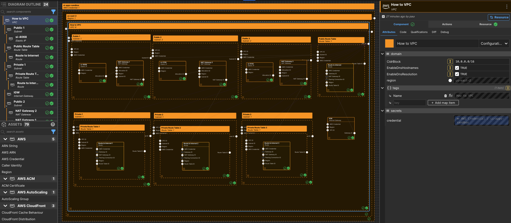

---
outline:
  level: [2, 3, 4]
---

# How to manage an AWS VPC

This how-to assumes:

- Basic [familiarity with System Initiative](../tutorials/getting-started)
- Are familiar with [AWS VPC](https://docs.aws.amazon.com/vpc/)

It will teach you how to create a best practice AWS VPC and manage it with
System Initiative.

We will cover:

- The creation of a highly available VPC that spans multiple availability zones.
- A VPC configured with public and private subnets.
- The networking required to allow outbound traffic for resources on the private
  subnets.
- The networking required for the communication with the internet.

## Setup

All activities in this how-to happen within a configured AWS Region and AWS
Credential. Set the AWS Region to be `us-east-2`.

Start in a change set named `VPC How-to`.

## Walkthrough

### What it will look like

When you are through with this guide, you should have components that look like
this in your diagram:

### Create a VPC component

Add a `VPC` to your `us-east-2` region frame.

Set the component type to be `Configuration Frame (down)` and expand it to fill
the region frame.

Set the component name to be `How to VPC`.

Set the `CidrBlock` to be  `10.0.0.0/16`

Enable `EnableDnsHostnames` and `EnableDnsResolution`.

### Create the Public Subnet Components

This VPC will span multiple availability zones in our AWS Region. Add 3 `Subnet`
components to your VPC frame and configure them as follows:

| component name | `CidrBlock`   | `AvailabilityZone` |
| -------------- | ------------- | ------------------ |
| Public 1       | 10.0.128.0/20 | us-east-2a         |
| Public 2       | 10.0.144.0/20 | us-east-2b         |
| Public 3       | 10.0.160.0/20 | us-east-2c         |

Enable `IsPublic` for each of the public subnet components.

Set the component type for each of the public subnet components to be
`Configuration Frame (down)`.

### Create the Elastic IP and NAT Gateway Components

To each of the `Public` subnet frames, add an `Elastic IP` component.

Also add a `NAT Gateway` component to each of the `Public` subnet frames.

Set name names of the component to be `NAT Gateway (1|2|3)` - the index should
align with the subnet it is inside.

Connect the `Allocation ID` output socket of the `Elastic IP` component to the
`Allocation ID` input socket of the `NAT Gateway` component. The connections
should be in the same subnet.

### Create the Public Route Table Component

Add a `Route Table` component to the VPC frame.

Set the component type to be `Configuration Frame (down)`.

Set the component name to be `Public Route Table`.

Connect the `Subnet ID` output socket of the public subnet components to the
`Subnet ID` input socket of the `Public Route Table` component.

### Create a Route Component

Add a `Route` component to the `Public Route Table` frame.

Set the component name to be `Route to Internet`.

Set `DestinationCidrBlock` to be `0.0.0.0/0`.

### Create the Internet Gateway Component

Add an `Internet Gateway` component to the VPC frame.

Set the name to be `IGW`.

Connect the `Gateway ID` output socket of the `IGW` component to the
`Gateway ID` input socket of the `Route to Internet` component in the
`Public Route Table` frame.

### Create the Private Subnet Components

Add 3 `Subnet` components to your VPC frame and configure them as follows:

| component name | `CidrBlock`  | `AvailabilityZone` |
| -------------- | ------------ | ------------------ |
| Private 1      | 10.0.0.0/19  | us-east-2a         |
| Private 2      | 10.0.32.0/19 | us-east-2b         |
| Private 3      | 10.0.64.0/19 | us-east-2c         |

Set the component type for each of the public subnet components to be
`Configuration Frame (down)`.

### Create the Private Route Table Components

To each of the `Private` subnet frames, add a `Route Table` Component.

Set the name to be `Private Route Table 1(2|3)` - the index should align with
the subnet frame it is inside.

Set the component type for each of the `Private Route Table` components to be
`Configuration Frame (down)`.

### Create theRoute Components

Add a `Route` component to each of the `Private Route Table` frames.

Set the component name to be `Route to Internet (1|2|3)` - the index should
align with the route table frame it is inside.

Set `DestinationCidrBlock` to be `0.0.0.0/0`.

Connect the output socket `NAT Gateway ID` of `NAT Gateway 1` component to the
`NAT Gateway ID` input socket of `Route to Internet 1` component.

Connect the output socket `NAT Gateway ID` of `NAT Gateway 2` component to the
`NAT Gateway ID` input socket of `Route to Internet 2` component.

Connect the output socket `NAT Gateway ID` of `NAT Gateway 3` component to the
`NAT Gateway ID` input socket of `Route to Internet 3` component.

### Apply your Change Set

Press `Escape` or click anywhere on the canvas background to select the
Workspace.

Click the `Apply Change Set` button to:

- Create a VPC component
- Create 6 Subnets
- Create an Internet Gateway
- Create 3 Elastic IPs and 3 NAT Gateways
- Create 4 Route Tables and 4 Routes

### Explore your resources

Review the completed AWS resources by clicking the `Resource` sub-panel for each
of your new resources.

### Clean Up

Create a new change set called `Clean up VPC How-to`

Delete your `VPC How-to` VPC frame. All of the components inside will be marked
for deletion.

Click `Apply Change Set`.

All your new resources should be deleted from your AWS account.
