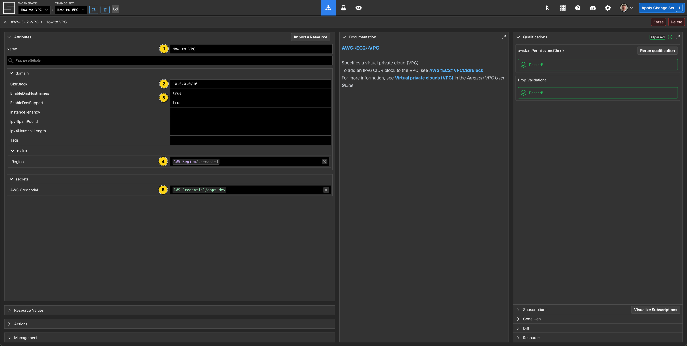
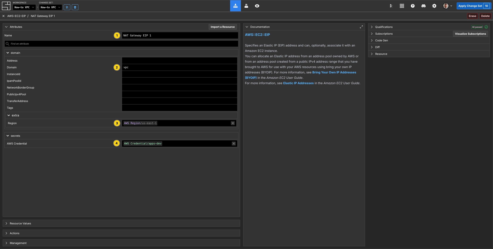
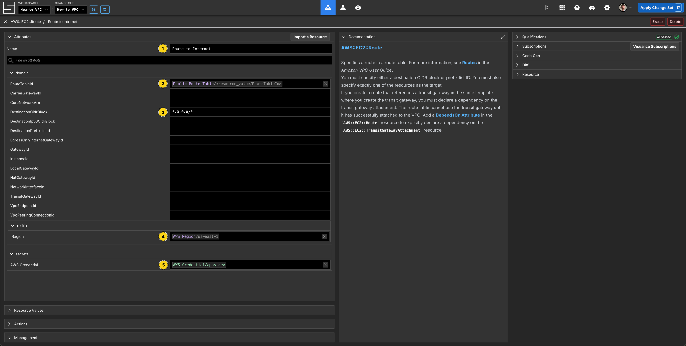
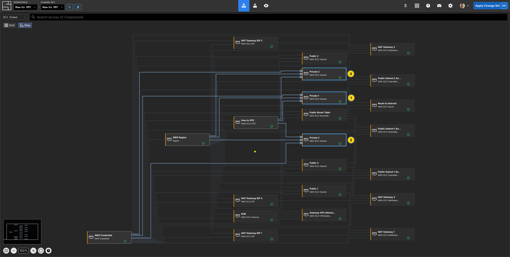
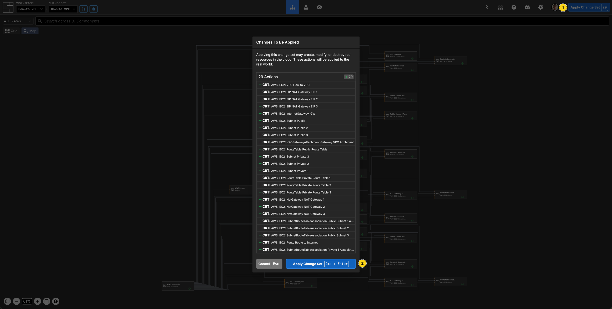

---
outline:
  level: [2, 3, 4]
---

# How to manage an AWS VPC

This how-to assumes:

- Basic [familiarity with System Initiative](../tutorials/getting-started)
- Are familiar with [AWS VPC](https://docs.aws.amazon.com/vpc/)

It will teach you how to create a best practice AWS VPC and manage it with
System Initiative.

We will cover:

- The creation of a highly available VPC that spans multiple availability zones.
- A VPC configured with public and private subnets.
- The networking required to allow outbound traffic for resources on the private
  subnets.
- The networking required for the communication with the internet.

## What it will look like when completed

When you have completed this guide, you should have Components that look like
this in your Diagram:

## Walkthrough

### Create a Change Set

Create a Change Set named `VPC How-to`.

### Create AWS Credentials

Add a `AWS Credential` to your Change Set and configure your AWS credentials

<video src="./aws-vpc/create-aws-credential.mp4" controls></video>

### Select an AWS Region

Add a `AWS Region` to your Change Set and set the `region` property to
`us-east-1`.

### Create a VPC Component

Add a `VPC` to your `us-east-1` region frame.

Set the Component type to be `Down Frame` and expand it to fill the region
frame.

Set the Component name to be `How to VPC`.

Set the `CidrBlock` to be `10.0.0.0/16`

Enable `EnableDnsHostnames`.

Enable `EnableDnsResolution`.

### Create the Public Subnet Components

This VPC will span multiple availability zones in our AWS Region. Add 3 `Subnet`
Components to your VPC frame and configure them as follows:

| Component Name | `CidrBlock`   | `AvailabilityZone` | `IsPublic` |
| -------------- | ------------- | ------------------ | ---------- |
| Public 1       | 10.0.128.0/20 | us-east-1a         | true       |
| Public 2       | 10.0.144.0/20 | us-east-1b         | true       |
| Public 3       | 10.0.160.0/20 | us-east-1c         | true       |

Set the Component type for each of the public subnet Components to be
`Configuration Frame (down)`.

### Create the NAT Gateway Components

Add a `NAT Gateway` Component to each of the `Public` subnet frames.

Set name names of the Component to be `NAT Gateway (1|2|3)` - the index should
align with the subnet it is inside.

### Create the Elastic IPs for each NAT Gateway

To each of the `Public` subnet frames, add an `Elastic IP` Component.

Set the names of the Components to be `NAT Gateway IP (1|2|3)` - the index
should align with the subnet it is inside, and match the `NAT Gateway`
Component.

Connect the `Allocation ID` Output Socket of the `Elastic IP` Component to the
`Allocation ID` Input Socket of the `NAT Gateway` Component. The connections
should be in the same subnet.

### Create the Public Route Table Component

Add a `Route Table` Component to the VPC frame.

Set the Component type to be `Configuration Frame (down)`.

Set the Component name to be `Public Route Table`.

Connect the `Subnet ID` Output Socket of the Public `Subnet` Components to the
`Subnet ID` Input Socket of the `Public Route Table` Component.

### Create a Route Component

Add a `Route` Component to the `Public Route Table` frame.

Set the Component name to be `Route to Internet`.

Set `DestinationCidrBlock` to be `0.0.0.0/0`.

### Create the Internet Gateway Component

Add an `Internet Gateway` Component to the VPC frame.

Set the name to be `IGW`.

Connect the `Gateway ID` Output Socket of the `IGW` Component to the
`Gateway ID` Input Socket of the `Route to Internet` Component in the
`Public Route Table` frame.

### Create the Private Subnet Components

Add 3 `Subnet` Components to your VPC frame and configure them as follows:

| Component name | `CidrBlock`  | `AvailabilityZone` |
| -------------- | ------------ | ------------------ |
| Private 1      | 10.0.0.0/19  | us-east-1a         |
| Private 2      | 10.0.32.0/19 | us-east-1b         |
| Private 3      | 10.0.64.0/19 | us-east-1c         |

Set the Component type for each of the public subnet Components to be
`Configuration Frame (down)`.

### Create the Private Route Table Components

To each of the `Private` subnet frames, add a `Route Table` Component.

Set the name to be `Private Route Table 1(2|3)` - the index should align with
the subnet frame it is inside.

Set the Component type for each of the `Private Route Table` Components to be
`Configuration Frame (down)`.

### Create the Private Route Components

Add a `Route` Component to each of the `Private Route Table` frames.

Set the Component name to be `Route to Internet (1|2|3)` - the index should
align with the route table frame it is inside.

Set `DestinationCidrBlock` to be `0.0.0.0/0`.

Connect the Output Socket `NAT Gateway ID` of `NAT Gateway 1` Component to the
`NAT Gateway ID` Input Socket of `Route to Internet 1` Component.

Connect the Output Socket `NAT Gateway ID` of `NAT Gateway 2` Component to the
`NAT Gateway ID` Input Socket of `Route to Internet 2` Component.

Connect the Output Socket `NAT Gateway ID` of `NAT Gateway 3` Component to the
`NAT Gateway ID` Input Socket of `Route to Internet 3` Component.

### Apply your Change Set

Press `Escape` or click anywhere on the canvas background to select the
Workspace.

Click the `Apply Change Set` button to:

- Create a VPC Component
- Create 6 Subnets
- Create an Internet Gateway
- Create 3 Elastic IPs and 3 NAT Gateways
- Create 4 Route Tables and 4 Routes

### Explore your resources

Review the completed AWS resources by clicking the `Resource` sub-panel for each
of your new resources.

### Clean Up

Create a new Change Set called `Clean up VPC How-to`

Delete your `VPC How-to` VPC frame. All of the Components inside will be marked
for deletion.

Click `Apply Change Set`.

All your new resources should be deleted from your AWS account.

## Vocabulary

In this guide bits of System Initiative Vocabulary will be shown with a capital
letter. All definitions for these can be found here:
[System Initative - Vocabulary](https://docs.systeminit.com/reference/vocabulary)
