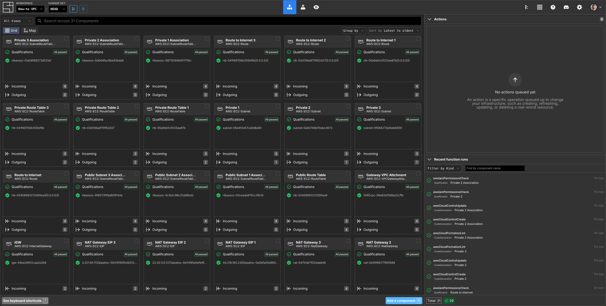
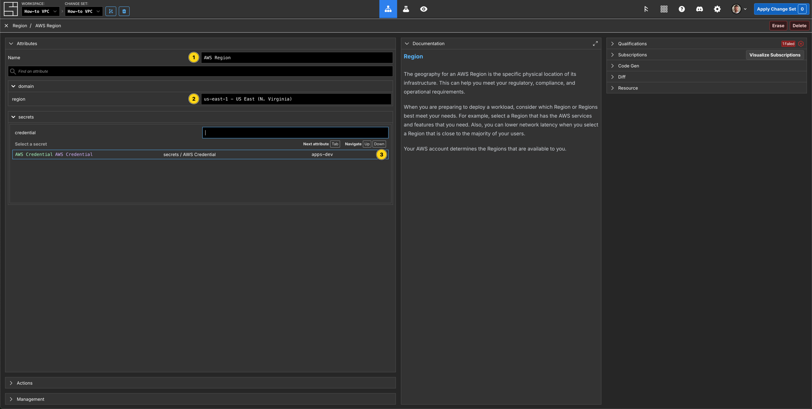
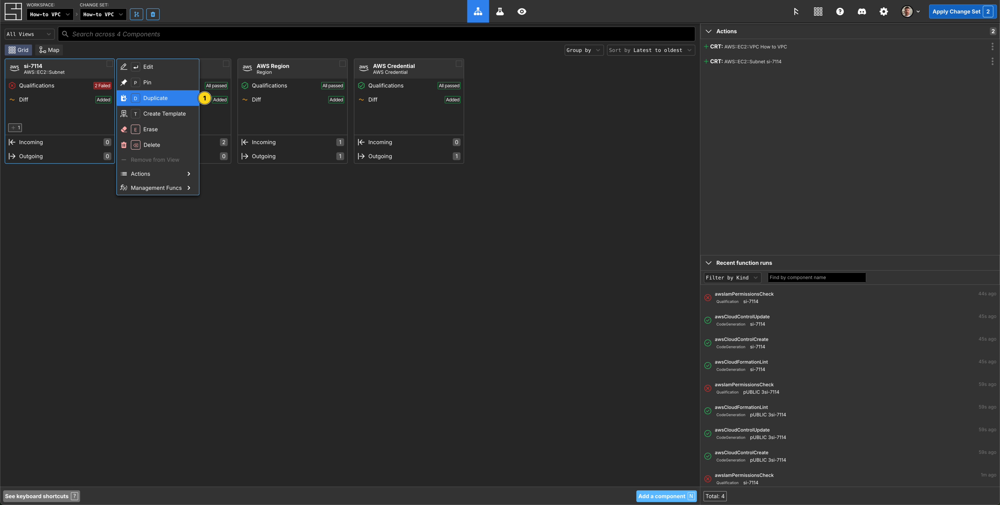
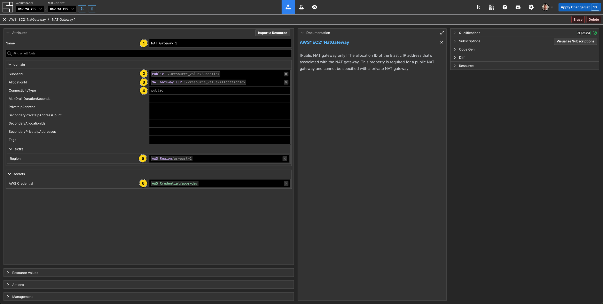
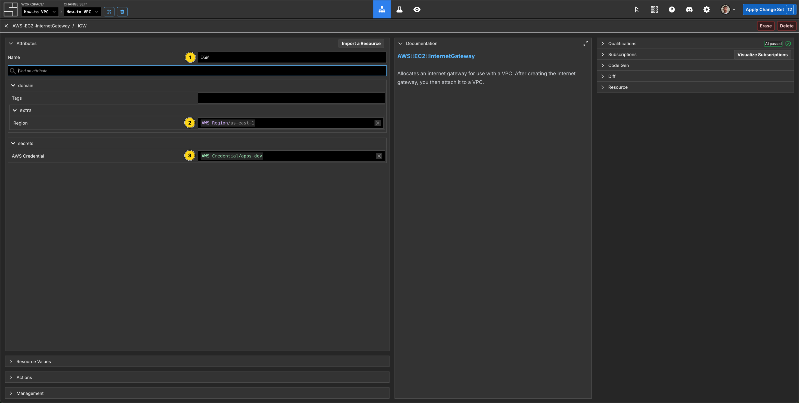
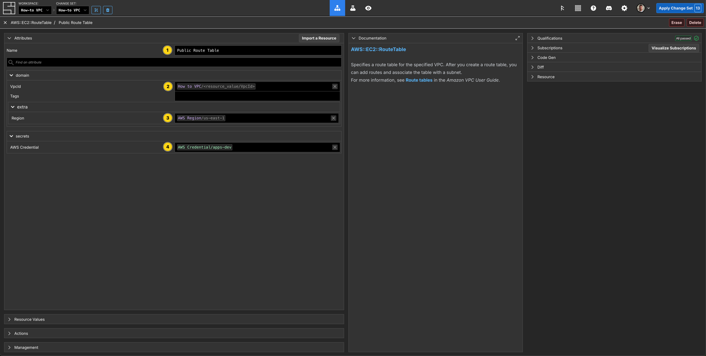
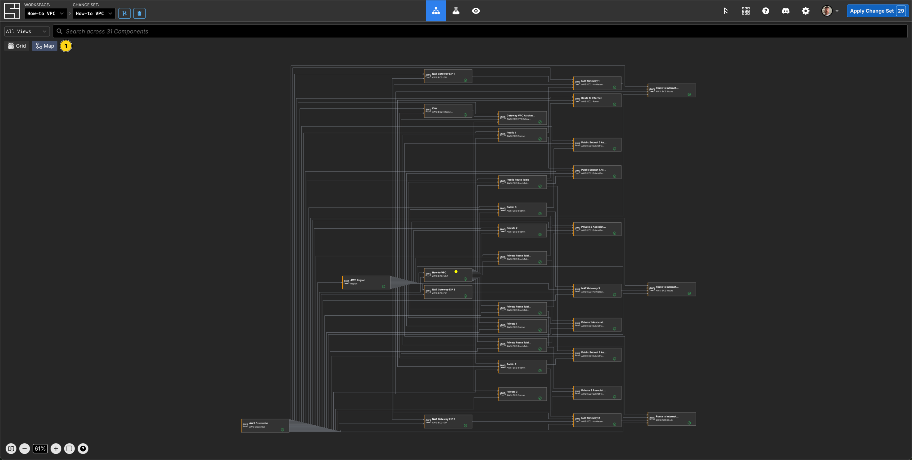

---
outline:
  level: [2, 3, 4]
---

# How to Create and Manage an AWS VPC

This how-to assumes:

- Basic [familiarity with System Initiative](../tutorials/index.md)
- Are familiar with [AWS VPC](https://docs.aws.amazon.com/vpc/)

It will teach you how to create a best practice AWS VPC and manage it with
System Initiative.

We will cover:

- The creation of a highly available VPC that spans multiple availability zones.
- A VPC configured with public and private subnets.
- The networking required to allow outbound traffic for resources on the private
  subnets.
- The networking required for the communication with the internet.

## What it will look like when completed

When you have completed this guide, you should have Components that look like
this in your Grid:

and like this in your Map:

## Create a Change Set

Create a Change Set named `How-to VPC`.

## Create AWS Credentials

Press `N` (or click `Add a component`) search for `AWS Credential`, select it then hit `Enter` to create an `AWS Credential` Component.

Now configure your AWS Credentials to a valid AWS account, and press `Add Secret`, hit `Esc` to return to the Grid. You now have a valid AWS Credential component to use for this VPC.

## Select an AWS Region

Press `N`, then search for, select and add an `AWS Region` to your Change Set. Name the Component, `AWS Region`, set the `region` property to`us-east-1` and Subscribe the credential property to your AWS Credential. Hit `Esc` to return to the Grid.

## Create a VPC Component

Press `N`, then search for, select and add an `AWS::EC2::VPC` Component.

Set the Component name to be `How to VPC`.

Set the `CidrBlock` property to `10.0.0.0/16`

Set `EnableDnsHostnames` to true.

Set `EnableDnsSupport` to true.

Subscribe the `region` property to your AWS Region.

Subscribe the `credential` property to your AWS Credential.

Press `Esc` to return to the Grid.

## Create the Public Subnet Components

This VPC will span multiple availability zones in our AWS Region. Add a
`AWS::EC2::Subnet` Component to your Change Set, then right click it, and press `D` to duplicate the Component (add a prefix to each duplicate of `Public` if you like) until you have 3 of them.

Then Configure them as follows:

| Component Name | `CidrBlock`   | `AvailabilityZone` | `MapPublicIpOnLaunch` |
| -------------- | ------------- | ------------------ | --------------------- |
| Public 1       | 10.0.128.0/20 | us-east-1a         | true                  |
| Public 2       | 10.0.144.0/20 | us-east-1b         | true                  |
| Public 3       | 10.0.160.0/20 | us-east-1c         | true                  |

Subscribe the VpcId property to your `AWS::EC2::VPC` Component named `How to VPC`, for each of the Subnets.

Subscribe to your `Region` and `AWS Credential` properties for each of the Subnets. When you are done with Subnet 3, press `Esc` to return to the Grid.

## Create the Elastic IP Components

Add an `AWS::EC2::EIP` Component to the Grid, hit `Esc` then duplicate (`D`) until you have 3 of them.

Set the names of the Components to be `NAT Gateway EIP (1|2|3)` - the index
should align with each of the Subnets, and match the corresponding `NAT Gateway` Components.

Set the `Domain` of each of the Elastic IP Components to be `vpc`.

Subscribe to your `Region` and `AWS Credential` properties for each of the NAT Gateway EIP Components.

Press `Esc` to return to the Grid.

## Create the NAT Gateway Components

Add an `AWS::EC2::NATGateway` Component to the Grid, hit `Esc` then duplicate (`D`) until you have 3 of them.

Set name names of each of the Components to be `NAT Gateway (1|2|3)` - the index should
align with each subnet.

In NatGateway 1, subscribe the `SubnetId` property to your `AWS::EC2::Subnet` Component named `Public 1`. Repeat this for NatGateway 2 and 3 to subscribe to the matching `SubnetId` properties.

In NatGateway 1, subscribe the `AllocationId` property to your `AWS::EC2::EIP` Component named `NAT Gateway EIP 1`. Repeat this for NatGateway 2 and 3 to subscribe to the matching `AllocationId` properties.

Set the `ConnectivityType` of each of the NAT Gateway Components to be `public`.

Subscribe to your `Region` and `AWS Credential` properties for each of the NAT Gateway Components.

Press `Esc` to return to the Grid.

## Create the Internet Gateway and VPCGatewayAttachment Components

Add an `AWS::EC2::InternetGateway` Component to the Grid.

Set the name to be `IGW`.

Subscribe to your `Region` and `AWS Credential` properties

Press `Esc` to return to the Grid.

Add an `AWS::EC2::VPCGatewayAttachment` Component to the Grid.

Set the name to be `Gateway VPC Attachment`.

Subscribe to your VPCs `VpcId` and your InternetGateways `InternetGatewayId`.

Subscribe to your `Region` and `AWS Credential` properties.

Press `Esc` to return to the Grid.

## Create the Public Route Table and Subnet Route Table Association Components

Add an `AWS::EC2::RouteTable` Component to the Grid.

Set the Component name to be `Public Route Table`.

In the `VpcId` property subscribe to your VPCs `VpcId`.

Subscribe to your `Region` and `AWS Credential` properties.

Add 3 `AWS::EC2::SubnetRouteTableAssociation` components to the Grid, remember you can duplicate using `D`.

Set the Component names to be `Public Subnet (1|2|3) Association`.

Subscribe the `RouteTableId` property to the `Public Route Table` Component.

Subscribe the `SubnetId` to the corresponding `Subnet (1|2|3)` Component.

Subscribe to your `Region` and `AWS Credential` properties.

Press `Esc` to return to the Grid.

## Create a Route Component

Add an `AWS::EC2::Route` Component to the Grid.

Set the Component name to be `Route to Internet`.

Subscribe the `RouteTableId` property to the `Public Route Table` Component.

Set `DestinationCidrBlock` to be `0.0.0.0/0`.

Subscribe the `GatewayId` property to the `Internet Gateway` Component.

Subscribe to your `Region` and `AWS Credential` properties.

Press `Esc` to return to the Grid.

## Current State of Play

Let's take a look at what we have in our Workspace so far.

You can see all the components you have created so far in descending order. In the Actions panel on the right hand side you can see there are 17 Actions queued - these are all the real world resources that will be created once you apply your change set.

If you click the `Map` button in the top left of the Grid, you seen the visual relationship between the components are creating:

Where the Components are placed on this Map is determined by the dependant property Subscriptions.

## Create the Private Subnet Components

On the Map, press the `N` key, search for Subnet, select `AWS::EC2::Subnet` and press `Enter`.

As we need 3 Private Subnets, press `Esc` to return to the Map from the Component editor, right click the new Subnet Component and Duplicate it twice.

Add 3 `AWS::EC2::Subnet` Components to your VPC frame and configure them as follows:

| Component name | `CidrBlock`  | `AvailabilityZone` |
| -------------- | ------------ | ------------------ |
| Private 1      | 10.0.0.0/19  | us-east-1a         |
| Private 2      | 10.0.32.0/19 | us-east-1b         |
| Private 3      | 10.0.64.0/19 | us-east-1c         |

Subscribe the `VpcId` property to the `VpcId` of the How to VPC Component for each Private Subnet.

Subscribe the `Region` and `AWS Credential` properties in each Private Subnet.

Here you can see the 3 Private Subnet components and their property Subscriptions. Click the Grid button in the top left of the screen to return to the Grid.

## Create the Private Route Table Components

For each of the `Private` Subnets, we will need to create an `AWS::EC2::RouteTable` Component.

Set the names to be `Private Route Table 1(2|3)` - the index should align with
the subnet.

Subscribe the `VpcId` property to the `VpcId` of the How to VPC Component for each Private Route table.

Subscribe the `Region` and `AWS Credential` properties in each Private Route table.

## Create the Private Route Components

Add a `AWS::EC2::Route` Component for each of the `Private Route Table` Components.

Set the Component name to be `Route to Internet (1|2|3)` - the index should
align with the Private Route Tables you just created.

Subscribe the `RouteTableId` property to the `RouteTableId` of the corresponding Private Route Table Component.

Set `DestinationCidrBlock` to be `0.0.0.0/0`.

Subscribe to the corresponding `NATGatewayId` property of each existing `NAT Gateway` Component. E.g. `Route to Internet 1` subscribes to the `NatGatewayId` of the NAT Gateway 1 Component.

Subscribe to the `Region` and `AWS Credential` properties.

Press `Esc` to return to the Grid.

## Create the Private Subnet Route Table Associations

Add a `AWS::EC2::SubnetRouteTableAssociation` Component for each of the `Private Route Table` Components.

Set the name of each of the association components to be `Private (1|2|3) Assocation`.

Subscribe the `RouteTableId` property to the `RouteTableId` of the corresponding Private Route Table Component.

Subscribe the `SubnetId` property to the `SubnetId` of the corresponding Private Subnet Component.

Subscribe to the `Region` and `AWS Credential` properties.

Press `Esc` to return to your Grid.

## Apply your Change Set

Now you can see a scrollable list of 29 pending Create Actions, and all of the individual Components on the Grid required for you to create your How to VPC!

You can also view the Map to see all of your Components:

Now click the `Apply Change Set` button to:

- Create a VPC Component
- Create 6 Subnets
- Create an Internet Gateway and the VPC Association
- Create 3 Elastic IPs and 3 NAT Gateways
- Create 4 Route Tables and the subnet associations and 4 Routes

## Explore your resources

You can review the completed AWS resources by clicking into your Components and viewing the `Resource` sub-panel for each of your new resources.

## Clean Up

Create a new Change Set called `Clean up VPC How-to`

`Cmd/Ctrl + A` on the grid to select all Components, then click `Delete`.

Click `Apply Change Set`.

All your new resources should be deleted from your AWS account.

