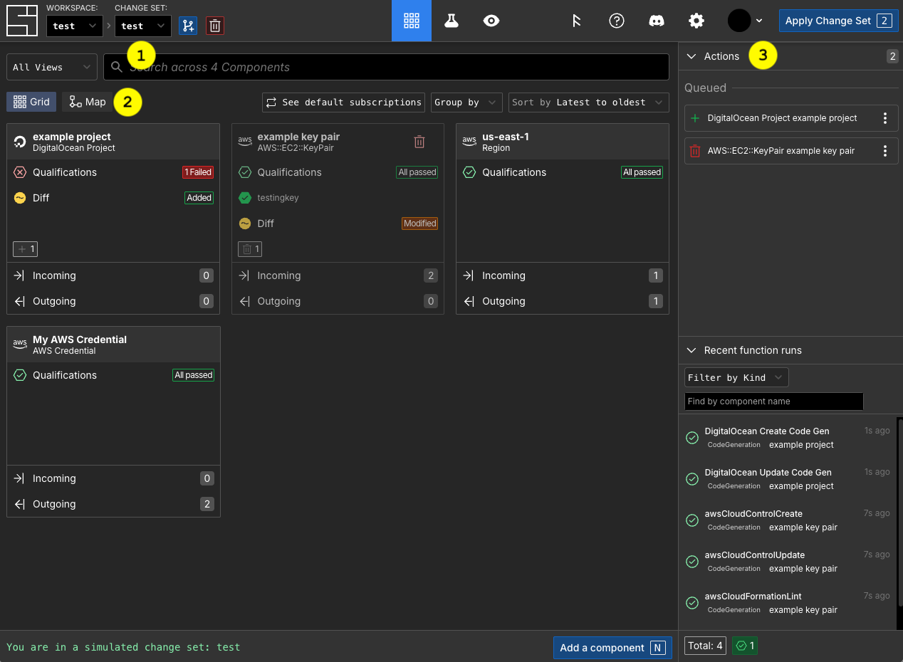
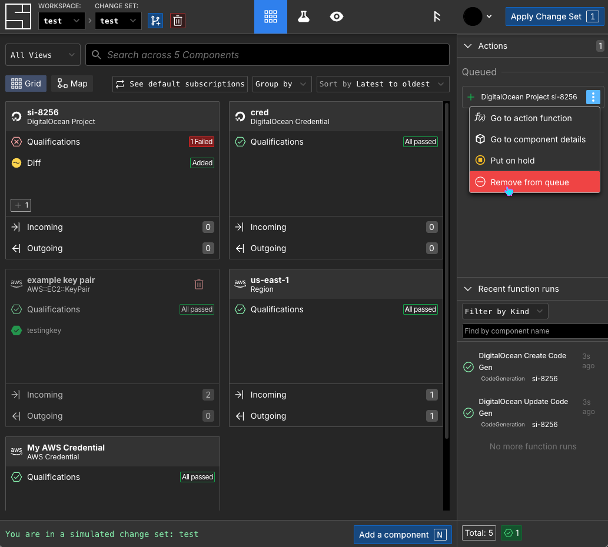
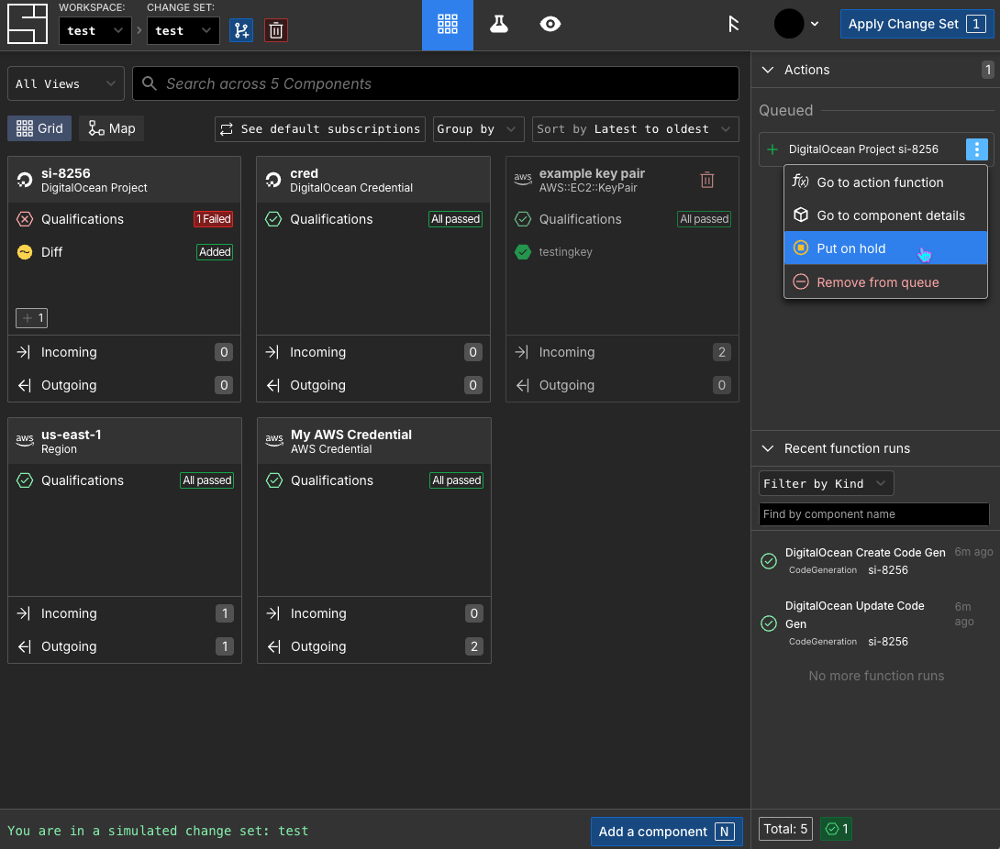
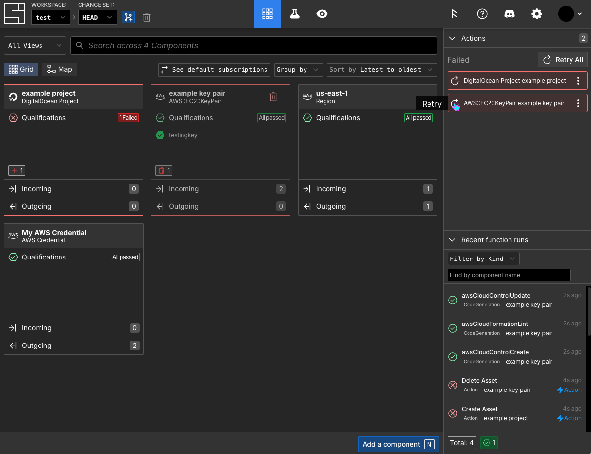

# Actions <!-- TODO - add links to other reference pages -->

An action in System Initiative is a kind of function which performs a specific operation on a resource, such as creating, updating, or deleting it. Actions are the bridge between your intended configuration (components) and their associated resources. When you apply a change set, the actions enqueued within it are executed to bring reality into alignment with what you have modeled.

Actions only run after their dependencies succeed, ensuring that resources are updated in the correct order based on their relationships.

## Types of Actions

System Initiative supports several types of actions, each serving a specific purpose in the lifecycle of infrastructure resources:

### Create Actions

Create actions provision new resources in your cloud provider based on their component's configuration. They are automatically enqueued to the change set when you add a new component that should have an associated resource.

When you apply a change set containing a create action, it executes, sending the component's configuration to the cloud provider. If the action is successful, it returns a `resourceId` that identifies the newly created resource. Then a refresh action automatically runs afterward to populate the resource data for the component.

### Refresh Actions

Refresh actions query your cloud provider to retrieve the current state of a resource and update the resource data for its component. They ensure the component's configuration accurately reflects reality.

Refresh actions are triggered automatically after successful create pr update actions. They can also be run manually.

### Update Actions

Update actions apply configuration changes to existing resources. They are automatically enqueued when you modify the properties of a component that already has an associated resource.

### Delete Actions

Delete actions are automatically enqueued when you delete a component that has an associated resource. They remove the actual resource from your cloud provider.

When you delete multiple related components, delete actions execute in reverse dependency order - for example, a subnet will be deleted before its VPC.

### Manual Actions

Manual actions are custom functions defined for specific components that don't fit into the standard create/update/delete lifecycle. For example, a manual action might restart a service, update a cluster configuration, or perform a one-time maintenance task.

Manual actions must be explicitly enqueued to be run.

## Action Lifecycle

Actions follow a specific lifecycle within System Initiative:

1. **Enqueuing**: Actions are automatically added to the change set when you create, modify, or delete components
2. **Pending**: The action is queued and waiting to be executed
3. **Execution**: When you apply the change set, actions run in dependency order
4. **Completion**: Actions either succeed or fail
5. **Persistence**: Failed actions remain enqueued until they succeed or are manually removed

:::tip
System Initiative records your intent to take an action, and it remains present on [HEAD](/reference/vocabulary#head) until it succeeds or is intentionally removed. This means you can retry failed actions without having to recreate them.
:::

## Action Execution Order

Actions execute in an order determined automatically by the relationships between components. For example:

- A VPC must be created before its subnets
- Subnets must be created before instances that use them
- Resources are deleted in reverse dependency order

You don't need to manually specify action ordering - System Initiative determines the correct sequence based on subscriptions between components.

## Actions and Change Control

Actions are only executed from HEAD - the change set representing "the real world." This ensures that all infrastructure changes flow through the change control process.

When you work in a change set:
- Actions are enqueued based on your changes
- You can review all proposed actions before applying
- No changes are made to actual infrastructure until you apply the change set
- After applying, actions execute and modify real resources

Refresh actions and qualifications are the only functions that can run directly on HEAD without going through a change set, since they don't modify resources - they only read current state or validate configuration.

## Listing Actions

<DocTabs tabs="AI Agent,Web Application,Public API">
<TabPanel value="AI Agent">

To list actions with the AI Agent:

```prompt
List actions for the "example" change set
```

```prompt
AI Agent's Response:

⏺ I'll list the actions in the example change set for you.

⏺ The "example" change set has 2 actions:

  | Action  | Component | Schema               | Kind    | State  |
  |---------|-----------|----------------------|---------|--------|
  | Destroy | example-1 | AWS::EC2::KeyPair    | Destroy | Queued |
  | Create  | example-2 | DigitalOcean Project | Create  | Queued |

  Both actions are queued and will run when the change set is applied. The first will destroy an AWS EC2 KeyPair, and the second will create a DigitalOcean Project.
```

</TabPanel>
<TabPanel value="Web Application">

To view a list of actions:



1. Navigate to the [change set](./change-sets.md) you want to see actions for.
2. Select Grid view.
3. Look at the Actions list near the top right corner.

</TabPanel>
<TabPanel value="Public API">

::: code-group

```typescript [TypeScript]
const response = await actionsApi.getActions({
  workspaceId,
  changeSetId,
});
```

```python [Python]
response = actions_api.get_actions(
    workspace_id=workspace_id,
    change_set_id=change_set_id,
)
```

:::

Both examples use the
[Public List Queued Actions API](./public-api#list-queued-actions). See the
[Public API](./public-api) documentation and the SDKs for more details on
configuring the SDK to communicate with System Initiative.

</TabPanel>
</DocTabs>

## Removing a Queued Action

<DocTabs tabs="AI Agent,Web Application,Public API">
<TabPanel value="AI Agent">

To remove an action with the AI Agent:

```prompt
Remove the create action for the DigitalOcean Project in the "example" change set
```

```prompt
AI Agent's Response:

⏺ I'll help you remove the create action for the DigitalOcean Project in the "example" change set.

⏺ Let me first list the available change sets to find the correct ID for the "example" change set:

⏺ Now let me list the actions in the "example" change set:

⏺ Perfect! I found the Create action for the DigitalOcean Project. Now I'll remove it:

⏺ Done! I've successfully removed the Create action for the DigitalOcean Project (component "example-project") from the "test" change set. The action has been removed from the queue and will no longer execute when the change set is applied.
```

</TabPanel>
<TabPanel value="Web Application">

To remove a queued action:



On the Grid view you can remove a queued action via its menu. Open the menu by clicking on the three vertical dots icon.
</TabPanel>
<TabPanel value="Public API">

::: code-group

```typescript [TypeScript]
const response = await actionsApi.cancelAction({
  workspaceId,
  changeSetId,
  actionId,
});
```

```python [Python]
response = actions_api.cancel_action(
    workspace_id=workspace_id,
    change_set_id=change_set_id,
    action_id=action_id,
)
```

:::

Both examples use the
[Public Remove Queued Action API](./public-api#remove-queued-action). See the
[Public API](./public-api) documentation and the SDKs for more details on
configuring the SDK to communicate with System Initiative.

</TabPanel>
</DocTabs>

## Putting an Action On Hold

<DocTabs tabs="AI Agent,Web Application,Public API">
<TabPanel value="AI Agent">

To remove an action with the AI Agent:

```prompt
Put the create action for the DigitalOcean Project in the change set "example" on hold.
```

```prompt
AI Agent's Response:

⏺ I'll put the create action for the DigitalOcean Project on hold in the "example" change set.

⏺ First, let me find the change set and list the actions to identify the DigitalOcean Project create action.

⏺ Now let me list the actions in the "example" change set:

⏺ Perfect! I found the create action for the DigitalOcean Project. Now I'll put it on hold:

⏺ Done! I've successfully put the Create action for the DigitalOcean Project component "example-project" on hold in the "example" change set. The action will not execute, and any dependent actions will also be blocked until you take it off hold.
```

</TabPanel>
<TabPanel value="Web Application">

To put a queued action on hold:



On the Grid view you can put an action on hold or back into the queue via its menu. Open the menu by clicking on the three vertical dots icon.

</TabPanel>
<TabPanel value="Public API">

::: code-group

```typescript [TypeScript]
const response = await actionsApi.putOnHold({
  workspaceId,
  changeSetId,
  actionId,
});
```

```python [Python]
response = actions_api.put_on_hold(
    workspace_id=workspace_id,
    change_set_id=change_set_id,
    action_id=action_id,
)
```

:::

Both examples use the
[Public Put Action On Hold API](./public-api#put-action-on-hold). See the
[Public API](./public-api) documentation and the SDKs for more details on
configuring the SDK to communicate with System Initiative.

</TabPanel>
</DocTabs>

## Retrying Actions

<DocTabs tabs="AI Agent,Web Application,Public API">
<TabPanel value="AI Agent">

To retry actions with the AI Agent:

```prompt
Retry the DigitalOcean Project create action
```

```prompt
AI Agent's Response:

⏺ I'll retry the Create action for the DigitalOcean Project.

⏺ Successfully retried the Create action for the "example project" DigitalOcean Project.
```

</TabPanel>
<TabPanel value="Web Application">

To retry an action:



On the Grid view you can retry a failed action by clicking the retry icon. You can also use the Retry All button to retry all failed actions.

</TabPanel>
<TabPanel value="Public API">

::: code-group

```typescript [TypeScript]
const response = await actionsApi.retryAction({
  workspaceId,
  changeSetId,
  actionId,
});
```

```python [Python]
response = actions_api.retry_action(
    workspace_id=workspace_id,
    change_set_id=change_set_id,
    action_id=action_id,
)
```

:::

Both examples use the
[Public Retry Action API](./public-api#retry-action). See the
[Public API](./public-api) documentation and the SDKs for more details on
configuring the SDK to communicate with System Initiative.

</TabPanel>
</DocTabs>