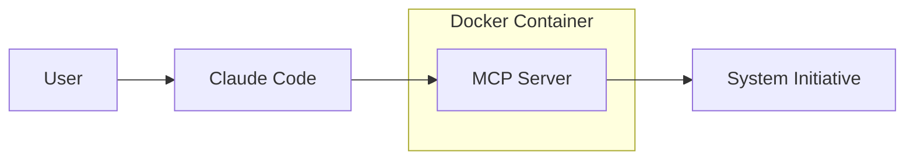

# AI Agent

The AI Agent is one of the primary ways you will interact with System Initiative. It allows you to express your intent in natural language, and let the AI Agent take care of the implementation details.

## Architecture

System Initiative ships a [preconfigured version of Claude Code as a GitHub repository](https://github.com/systeminit/si-ai-agent). It integrates with our [MCP Server](https://github.com/systeminit/si/tree/main/bin/si-mcp-server) running inside a [Docker container](https://hub.docker.com/repository/docker/systeminit/si-mcp-server/general). It also contains a small amount of [context](https://github.com/systeminit/si-ai-agent/blob/main/CLAUDE.md) to help the agent perform well.



No AI Agent is deterministic - ask it to perform the same task twice, and it is likely to perform it slightly differently each time. That's okay! System Initiative provides the deterministic layer to manage your infrastructure, and many tools to ensure you get precisely what you want out of the system.

## Cost Model

System Initiative does not sit between you and the underlying model/agent provider. We do not mark-up your token usage. It is up to you how you pay for the underlying model.

## Installing the Agent

For detailed instructions, follow the [instructions in the si-ai-agent repository](https://github.com/systeminit/si-ai-agent/blob/main/CLAUDE.md). To get started quickly:

```bash
git clone https://github.com/systeminit/si-ai-agent.git
cd si-ai-agent
./setup.sh
```

:::tip
You will need to [generate a workspace API token](./workspaces.md#api-token-management) to set up your AI Agent.
:::

:::info
Our standard [set up process](../tutorials/setup.md) also walks you through setting up the AI Agent.
:::

The setup script will validate that you have the pre-requisites installed (NodeJS, Docker, Claude Code), and prompt you for your Workspace API Token.

## Multiple Workspaces

Each [workspace](./workspaces.md) should have its own copy of the si-ai-agent repository. We recommend making a directory named 'si-workspaces', and then having a checkout of the agent for each workspace within that directory.

## Starting the Agent

To start the agent, navigate to the directory where you cloned the repository for the workspace you want to work in, and run:

```bash
claude
```

## Prompting the AI Agent

To prompt the AI Agent, you will write your request in plain language. The agent will then map your request to a series of commands to System Initiative. When you want a specific outcome, be as specific as possible.

## Validating the Agent is Connected to System Initiative

Validate your credentials to ensure your AI Agent is connected to System Initiative.

```prompt [Validate Connection to System Initiative]
> Validate my connection to System Initiative
● ✅ Connection validated successfully!

  - User: adam+poop@systeminit.com
  - Workspace ID: 01K6GMC6X7WF066E45FYM7YY8G
  - Role: automation
  - Token expires: October 1, 2026

  Your credentials are working correctly and you have access
  to your System Initiative workspace.
```

## Effective Agent Use

### Be specific when it matters

If you want to be sure something happens, be specific. For example, if you ask the AI Agent to build a 'server in AWS' for you, it will make its best guess as to fields like InstanceType or ImageId. These will almost certainly not be the values you want.

#### Bad Prompt
```prompt [Bad Prompt]
> Make a server in aws
```

#### Good Prompt
```prompt [Good Prompt]
> Make a server in AWS in us-east-1, with 1gb of memory, using ami-12345
```

When you want a specific outcome, be specific in your prompt.

:::tip
The agent itself is quite effective at improving your prompt. Try asking it to improve your prompt before you run it!
:::

### Embrace Iteration

System Initiative makes it easy to iterate on your infrastructure. [Change Sets](./architecture/change-control.md) ensure that nothing will change without your approval. Rather than trying to get everything done in one shot, work in iterations. For example, it's better to:

- Ask the agent to create a best practices network layer
- Configure a cluster
- Deploy an application to the cluster

Than to try and have a single prompt that does all 3. It's easier to review the work of the agent, and it is more likely to generate a good outcome.

### Clear your Context

The AI Agent has a context window that is quite large, and we try and provide tools that allow the agent to explore the data it needs from your infrastructure in a token-friendly way. That said, the longer the conversation chain in the agent, the more likely it is to start making mistakes.

When you finish a task, we recommend clearing your context and starting fresh on the next task. Let the LLM explore the information it needs, rather than relying on having it pick it out of a very long context window.

### Repeatability and Policy

Do not come from the AI Agent. For example, if you want to lay down the exact same architecture every time (with small variations), you should be using a template and allowing the Agent to drive it. The same is true with policy - write qualifications and validations to ensure that components are correct, rather than relying on careful prompting or context to get it right.

### Review the Agents Work

When working with the AI Agent, review its work. Use the 'R' hot-key to bring up a review screen, and ensure that all the correct attributes and actions are enqueued. While the Agent frequently gets everything right, it won't always - and that can matter when working with infrastructure.

:::tip
This is why our pre-configured AI Agent repository does not allow the agent to apply or force-apply a change set without your permission. We recommend you keep this setting!
:::

### More Tips

For more tips on working with the AI Agent:

- [The Claude Code Documentation](https://docs.claude.com/en/docs/claude-code/overview)
- [Prompt Engineering Overview](https://docs.claude.com/en/docs/build-with-claude/prompt-engineering/overview)
- [Claude 4 Best Practices](https://docs.claude.com/en/docs/build-with-claude/prompt-engineering/overview)

## Using other Agents and Models

You can use the System Initiative MCP Server with your own agents and underlying models. To gain similar performance to our customized agent, you may have to adapt our custom context from the [si-ai-agent repository](https://github.com/systeminit/si-ai-agent).

:::warning
Using other Agents or Models may result in unexpected behavior due to differences in how they support different features of the [MCP Protocol](https://modelcontextprotocol.io/docs/getting-started/intro) and how effectively they utilize tools.

We are happy to work with you to make our MCP Server work well with your agent and model of choice, but only officially support our AI Agent.
:::

### Running the MCP Server Manually

To run the MCP server directly:

```bash
export SI_API_TOKEN=DEADB33F
docker run -i --rm --pull=always -e SI_API_TOKEN systeminit/si-mcp-server:stable
```

First you need to set the `SI_API_TOKEN` environment variable, which is a valid [workspace API token](./workspaces.md#api-token-management). Then you can run the docker container with the stable release of the MCP Server.

This configuration will ensure that, each time you start the MCP Server, you get the latest version of the container.

### Cursor

Cursor uses [mcp.json](https://cursor.com/docs/context/mcp#using-mcpjson) to configure external MCP Servers. Here is a sample configuration:

```json
{
  "mcpServers": {
    "system-initiative": {
      "type": "stdio",
      "command": "docker",
      "args": [
        "run",
        "-i",
        "--rm",
        "--pull=always",
        "-e",
        "SI_API_TOKEN",
        "systeminit/si-mcp-server:stable"
      ],
      "env": {
        "SI_API_TOKEN": "${env:SI_API_TOKEN}"
      }
    }
  }
}
```

:::tip
Make sure your `SI_API_TOKEN` is set before you launch cursor, so that the MCP server can authenticate with System Initiative.
:::

### VS Code

Add a `.vscode/mcp.json` file to your workspace, following [these instructions](https://code.visualstudio.com/docs/copilot/customization/mcp-servers#_configuration-format).

```json
{
	"servers": {
		"systemInitiative": {
			"type": "stdio",
			"command": "docker",
            "env": {
                "SI_API_TOKEN": "${input:SI_API_TOKEN}"
            },
			"args": [
				"run",
				"-i",
				"--rm",
				"--pull=always",
				"-e",
				"SI_API_TOKEN",
				"systeminit/si-mcp-server:stable"
			]
		}
	},
	"inputs": [
        {
            "type": "promptString",
            "id": "SI_API_TOKEN",
            "description": "Your Workspace API Token",
            "password": true,
        }
    ]
}
```

VS Code will prompt you to paste your API Token in, which it will store in it's own 'secure secret storage'.

:::warning
This is a good example of an environment that may not work well with our MCP server. If you experience issues, let us know.
:::
