# Audit Logs

Audit Logs provide real-time and historic visibility into all changes and events within your [workspace](./workspaces.md). You can see who made what changes, when they made them, and what the downstream effects were to your infrastructure in System Initiative.

:::info

Currently, Audit Logs are currently only accessible through the Web Application interface. They are available on a per-change-set basis, allowing you to audit changes in your working change set or review the complete history of HEAD.

:::

:::tip

If you are intending to review changes before applying your [change set](./change-sets.md) to HEAD, you may want to use the [Review](./review.md) feature instead.

:::

## Accessing Audit Logs

<DocTabs tabs="Web Application">
<TabPanel value="Web Application">

Audit Logs can be accessed via the Audit Logs dashboard.

- When viewing HEAD, you'll see the complete audit history of all changes that have been applied to your workspace.
- When viewing non-HEAD change set, you'll only see the changes made within that change set.

Here's how you can navigate to the Audit Logs dashboard:

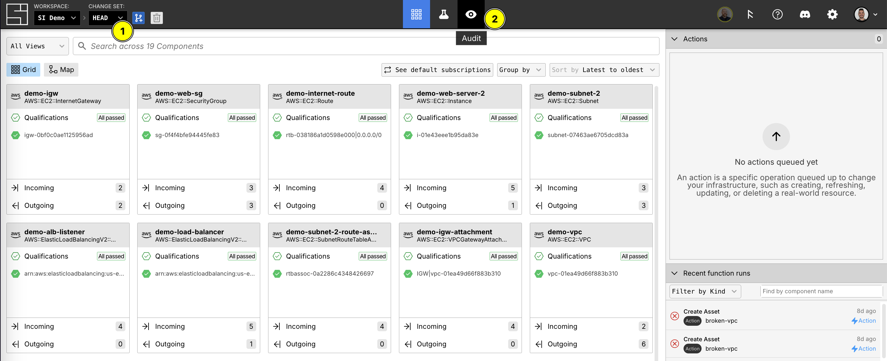

1. Use the change set picker to ensure that you are on the HEAD change set
2. Click the Audit Logs icon in the nav bar (if you are not on HEAD, this will take you to [the review screen](./review.md))

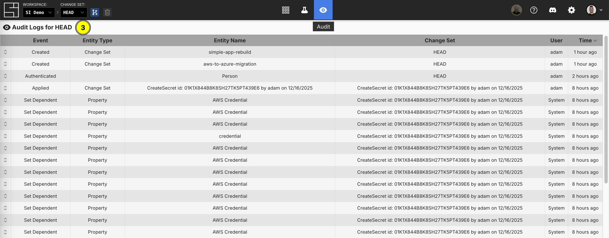

3. Confirm that you are viewing Audit Logs for HEAD via the title of the Audit Logs dashboard

</TabPanel>
</DocTabs>

### Switching Change Sets

<DocTabs tabs="Web Application">
<TabPanel value="Web Application">

Navigating to the Audit Logs dashboard requires you to be on the HEAD change set, but you can _then_ use the change set picker to see Audit Logs for any given change set.

Here's how you can switch change sets within the Audit Logs dashboard:

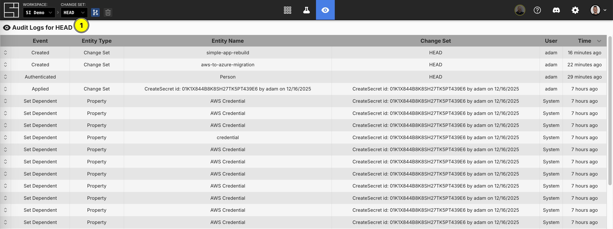

1. Open the change set picker on HEAD

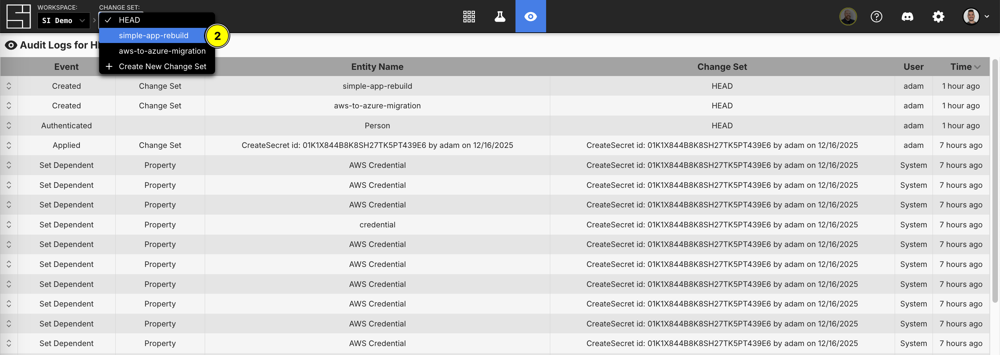

2. Choose your non-HEAD change set

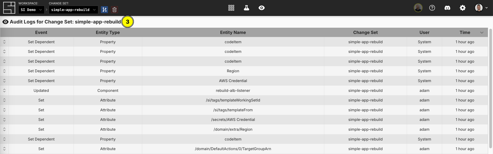

3. Confirm that you are viewing Audit Logs for your change set via the title of the Audit Logs dashboard

</TabPanel>
</DocTabs>

## Audit Log Structure

All Audit Logs share the same structure, which includes the entity name, entity
type, kind, metadata and more. However, the metadata field’s structure will
change based on the Audit Log kind. This gives each Audit Log kind the ability
to attach kind-specific information, such as showing the “before value” and
“after value” when updating a property for a [Component](./components.md).

:::info

All Audit Logs can be serialized to and deserialized from JSON.

:::

### Top Level Fields

Each Audit Log entry captures a specific event within System Initiative and contains the following information:

- **Event Kind**: The type of action that occurred (e.g. "UpdatePropertyEditorValue")
- **Entity Type**: The kind of object affected (e.g. "Property")
- **Entity Name**: The specific name of the object that was changed
- **Change Set**: The change set where the event occurred
- **User**: The [user](./users.md) that performed the action
- **Timestamp**: When the event occurred

### Metadata

While the top level fields contain information that all Audit Logs are guaranteed to have, the "metadata" field can contain arbitrary information based on the given Event Kind. For example, if you rename a Component, the "metadata" object will likely contain a "componentId" corresponding to the Component renamed.

### Audit Log Structure Example

Let's look at two examples showcasing the consistent structure with
kind-dependent metadata in action. Here is an example of an Audit Log for a
Component that has been deleted:

```json
{
  // The title that will be displayed.
  "title": "Deleted",
  // The name of the user who caused the event at the time of the event.
  "userName": "nick",
  // The ID of the user who caused the event.
  "userId": "01GW7GQW71JD7B5GV6VBNJBRME",
  // The email of the user who caused the event at the time of the event.
  "userEmail": "nick@systeminit.com",
  // The kind of Audit Log that was created.
  "kind": "DeleteComponent",
  // The type of entity involved in the event.
  "entityType": "Component",
  // The name of the entity involved in the event.
  "entityName": "AWS Credential",
  // The metadata for the event that corresponds to the Audit Log kind.
  "metadata": {
    // An inner field containing the same name as the entity name.
    "name": "AWS Credential",
    // The ID of the Component deleted.
    "componentId": "01JE77FDSNEY9HECH5CRMME2XK",
    // The ID of the SchemaVariant that the Component was based on.
    "schemaVariantId": "01J8FRJB6ESMBMCMM2PBC1SJJY",
    // The name of the aforementioned SchemaVariant.
    "schemaVariantName": "AWS Credential"
  },
  // This is when the event happened.
  "timestamp": "2024-12-03T21:43:04.607739+00:00",
  // The ID of the ChangeSet where the event happened.
  "changeSetId": "01JE77M419EP6P8GVBYKRWWY6S",
  // The name of the aforementioned ChangeSet.
  "changeSetName": "2024-12-03-21:43"
}
```

Now, here is another example for that same Component, but for when one of its
properities was modified:

```json
{
  "title": "Updated Component",
  "userName": "nick",
  "userId": "01GW7GQW71JD7B5GV6VBNJBRME",
  "userEmail": "nick@systeminit.com",
  "kind": "UpdatePropertyEditorValue",
  "entityType": "Property",
  "entityName": "name",
  // All top-level fields have remained the same, except for those inside the
  // metadata field. The inner fields will changed based on the Audit Log Kind.
  "metadata": {
    "propId": "01J8FRJB6ESMBMCMM2PBC1SJK8",
    "propName": "name",
    "afterValue": "AWS Credential",
    "beforeValue": "si-1002",
    "componentId": "01JE77FDSNEY9HECH5CRMME2XK",
    "componentName": "AWS Credential",
    "schemaVariantId": "01J8FRJB6ESMBMCMM2PBC1SJJY",
    "attributeValueId": "01JE77FDSQ30ANJP1021Z0N438",
    "schemaVariantDisplayName": "AWS Credential"
  },
  "timestamp": "2024-12-03T21:40:55.268312+00:00",
  "changeSetId": "01JE77F4E5P1S4228A3P5978NR",
  "changeSetName": "2024-12-03-21:40"
}
```

Let's say that a new field has been added to the metadata for an
`UpdatePropertyEditorValue` event. It is called `containsWhitespace` and
indicates whether or not the `afterValue` contains a whitespace.

While this scenario is a bit contrived, it shows that metadata not only changes
for a given kind, but can also be expanded in the future, so long as the change
is backwards-compatible. Here is an example using the same Audit Logs as above,
but with the new field:

```json
{
  "title": "Updated Component",
  "userName": "nick",
  "userId": "01GW7GQW71JD7B5GV6VBNJBRME",
  "userEmail": "nick@systeminit.com",
  // The kind is the same as the above Audit Log.
  "kind": "UpdatePropertyEditorValue",
  "entityType": "Property",
  "entityName": "name",
  // The metadata is the same as the above Audit Log, except it has a new field.
  "metadata": {
    "propId": "01J8FRJB6ESMBMCMM2PBC1SJK8",
    "propName": "name",
    "afterValue": "AWS Credential",
    "beforeValue": "si-1002",
    "componentId": "01JE77FDSNEY9HECH5CRMME2XK",
    "componentName": "AWS Credential",
    "schemaVariantId": "01J8FRJB6ESMBMCMM2PBC1SJJY",
    "attributeValueId": "01JE77FDSQ30ANJP1021Z0N438",
    "schemaVariantDisplayName": "AWS Credential",
    // This is the new field!
    "containsWhitespace": true
  },
  "timestamp": "2024-12-03T21:40:55.268312+00:00",
  "changeSetId": "01JE77F4E5P1S4228A3P5978NR",
  "changeSetName": "2024-12-03-21:40"
}
```

## Audit Log Kinds

Audit Logs track a wide range of events, including, but not limited to, the following:

- **Component Events**: Creating, updating, deleting, and restoring Components
- **Property Changes**: Updates to Component attributes, including before and after values
- **Schema Operations**: Installing, upgrading, or modifying [schemas](./schema.md)
- **Function Changes**: Creating, updating, or deleting [functions](./function.md)
- **Action Events**: Enqueueing, executing, or canceling [actions](./actions.md)
- **Connection Changes**: Adding or removing connections between Components
- **Change Set Operations**: Creating, applying, or abandoning change sets

## Viewing Individual Audit Logs

Now that we know how to access Audit Logs and what to expect from their shape, let's look at how we view them.

<DocTabs tabs="Web Application">
<TabPanel value="Web Application">

Each Audit Log row can be "expanded" to reveal its contents. As a reminder, the metadata is specific to the Audit Log kind and provides comprehensive information about what changed.
Here is how you can expand rows to view individual log data:

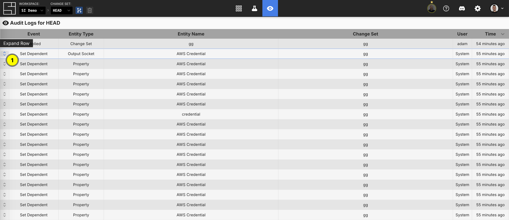

1. Click on the leftmost icon to expand a given row

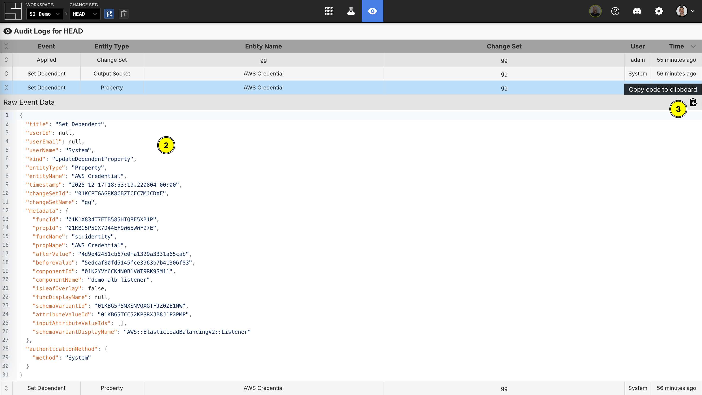

2. Observe the expanded row with both its top level fields and its inner metadata blob
3. Click on the clipboard icon to copy the entire log to your clipboard


4. Expand another row by repeating the first step (you can do this for as many rows as you'd like)

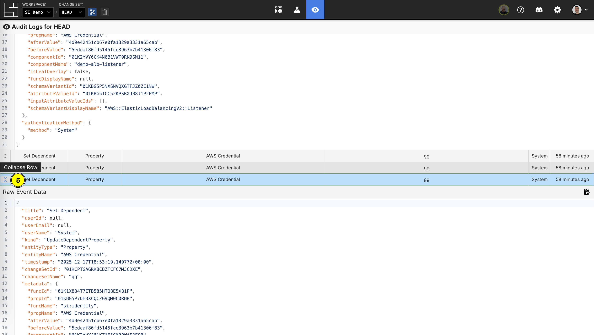

5. Click on the leftmost icon to collapse an expanded row

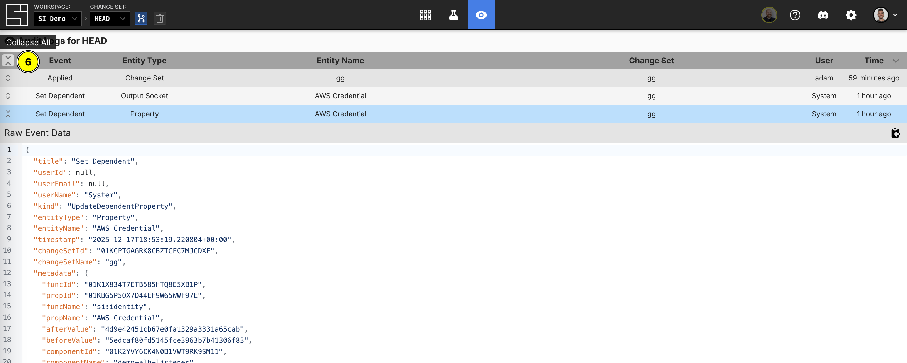

6. Collapse all rows at once by clicking the leftmost icon on the header

</TabPanel>
</DocTabs>

### Hovering and Sorting

<DocTabs tabs="Web Application">
<TabPanel value="Web Application">

Within the Audit Logs dashboard, you can hover to reveal additional information without needing to expand a given row.

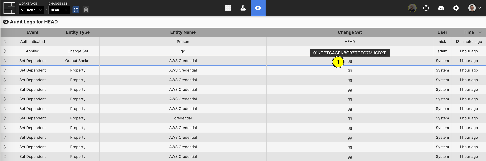

1. You can hover over a change set name to get its ID

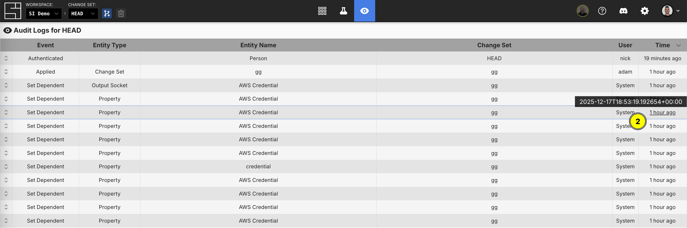

2. You can hover over a relative timestamp to get its full timestamp

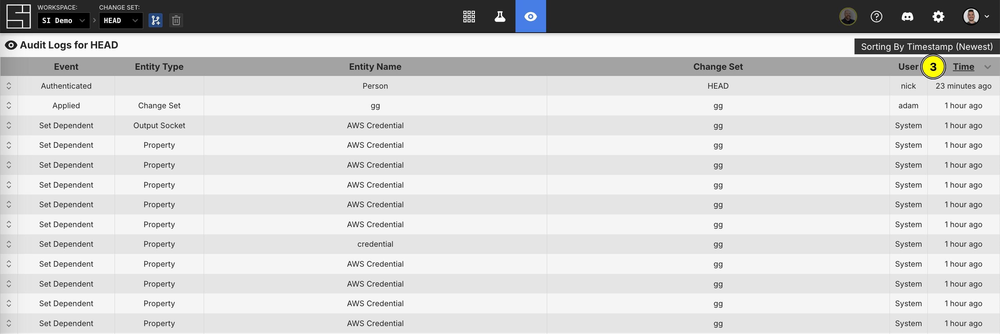

3. Sort from "Latest to Oldest" or vice versa by clicking the caret

</TabPanel>
</DocTabs>

## Filtering Audit Logs

<DocTabs tabs="Web Application">
<TabPanel value="Web Application">

The Audit Log dashboard provides filtering capabilities to help you find specific events:

- **By Event (Audit Log Kind)**: Filter to show only creates, updates, deletes, or other specific event types
- **By Entity Type**: Focus on changes to Components, properties, schemas, functions, or other entity types
- **By Entity Name**: See all events related to a specific Component or entity by its name
- **By Change Set**: Filter events by which change set they occurred in
- **By User**: View changes made by specific users

:::tip

Filters options are populated by the current set of Audit Logs loaded into the dashboard. If you do not see a filter that you are expecting to see, you may need to load more logs.

:::

Multiple filters can be applied simultaneously to narrow down your search. Filters can be cleared individually or all at once.
Here is how to use them:

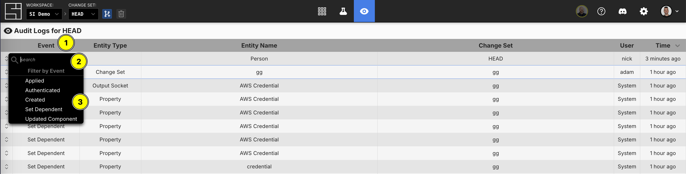

1. Click on the relevant header column to filter by what you'd like (for these examples, we will use "Event")
2. You can fuzzy search for a filter using the textbox
3. Click on a filter to activate it

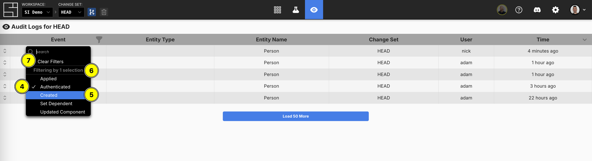

4. Observe that your filter is "checked" and that the rows shown reflect that
5. You can click on another filter to activate more than one filter
6. The number of activate filters for the given column is displayed
7. You can clear all filters for the column by clicking "Clear Filters"

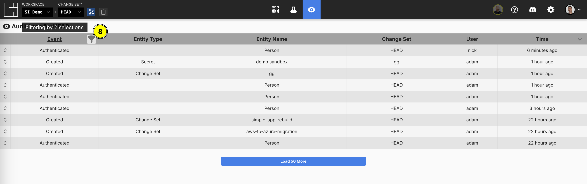

8. You can hover on the filter icon to see the number of active filters and click on it to bring the filter menu back up

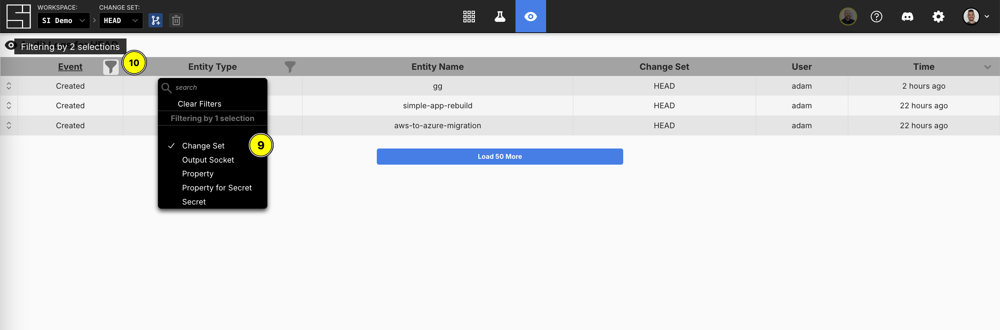

9. Mix and match multiple filters from multiple columns to narrow your results to your liking
10. You can continue to hover and click on individual filters per column

</TabPanel>
</DocTabs>

## Loading More Entries

<DocTabs tabs="Web Application">
<TabPanel value="Web Application">

Upon entering the Audit Log dashboard, it loads the most recent 50 entries. Here is how you can load more:

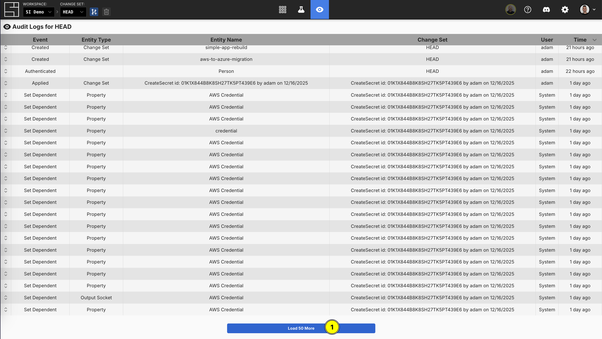

1. To view more logs, click the "Load 50 More" button at the bottom of the dashboard (you can continue loading additional entries until all available logs are loaded)

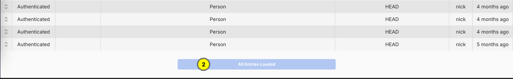

2. If all available logs are loaded, you will be unable to load more

</TabPanel>
</DocTabs>

## Understanding How Audit Logs Are Generated

Audit Logs are deeply integrated with System Initiative's change set functionality. Each change you make in a change set is recorded with:

1. **Direct Changes**: The specific modification you made (e.g., updating a Component attribute)
2. **Downstream Effects**: Automatic changes that occurred as a result (e.g., subscribed Components that updated based on your change)
3. **Provenance Information**: Complete context about who, what, when, and where

:::tip

The ability to track downstream effects is a critical feature of Audit Logs. When you change one Component, subscriptions may cause changes to cascade to other Components. The Audit Log captures all of these effects, giving you complete visibility into the impact of your changes.

:::

## Use Cases

Audit Logs support several important workflows:

- **Troubleshooting**
  - When something unexpected happens, use Audit Logs to trace back through recent changes and identify what triggered the issue.
- **Compliance and Governance**
  - Audit Logs provide an immutable record of who made what changes and when, supporting compliance requirements and audit trails for regulated environments.
- **Understanding Impact**
  - Before applying a change set, review the Audit Log to see all the changes and their downstream effects, ensuring you understand the full scope of what will be applied.
- **Collaboration**
  - In team environments, use Audit Logs to see what your teammates are working on and understand the history of changes to the workspace.
- **Learning and Documentation**
  - New team members can review Audit Logs to understand how infrastructure has evolved and learn from the changes others have made.

