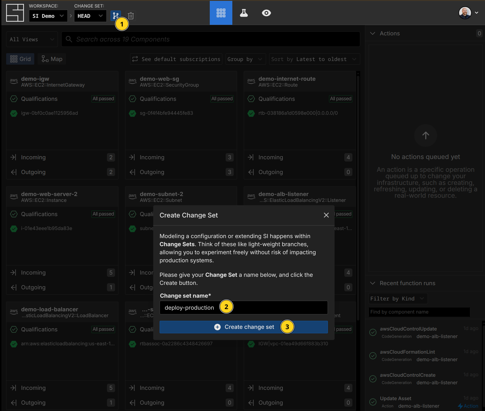
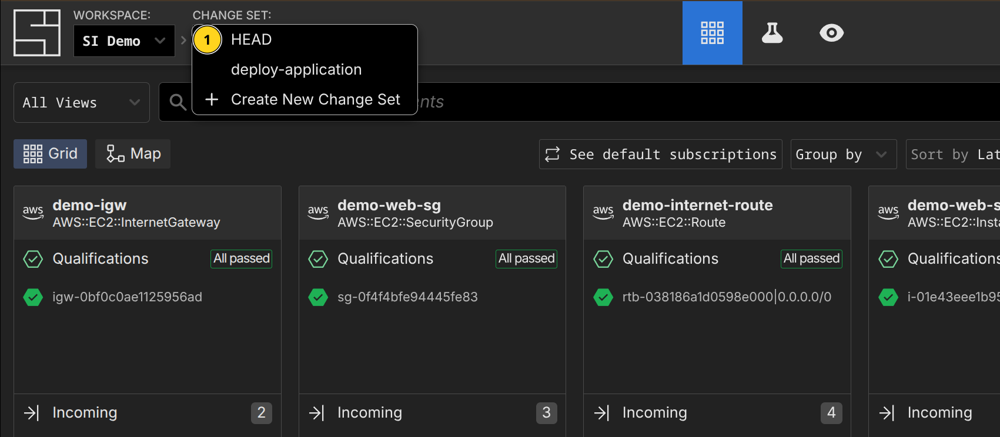
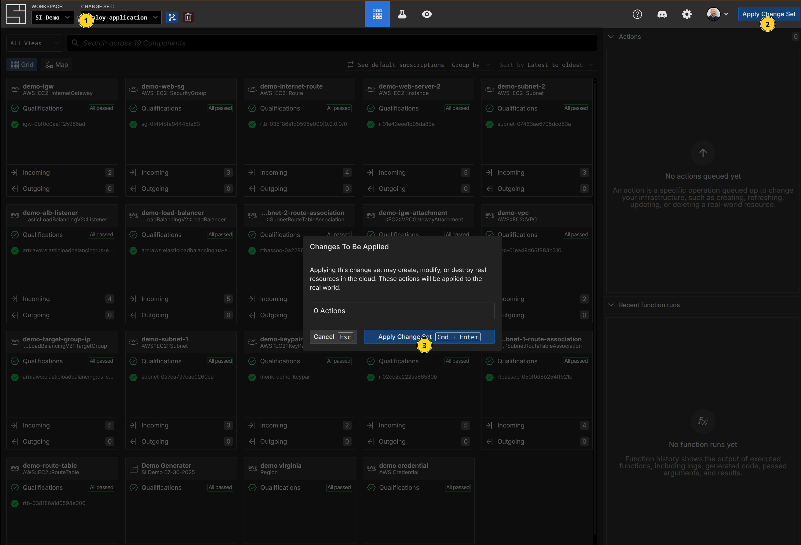
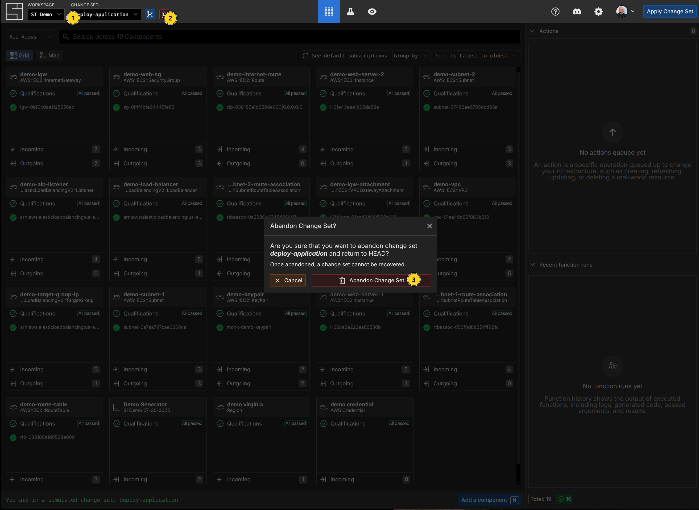

# Change Sets

Change Sets are the change control and simulation mechanism within System Initiative. They allow you to safely propose changes to your model, preview those changes, and then apply them to the real world when you are ready. As change sets are applied to your [workspace](./workspaces.md), your open change sets are automatically updated to reflect those changes.

:::tip
A change set is like an auto-rebasing git branch that can never have conflicts. Unlike tracking state in Git, they are tailor made for the dynamic, fluid nature of how infrastructure changes, regardless of how those changes were made.
:::


## The HEAD Change Set

The HEAD Change Set represents the current state of your resources in the real world. The all your components and resources, along with any actions that are currently enqueued, are tracked on the HEAD Change Set.

:::info
Think of the HEAD Change Set as your view of everything that is currently happening with your workspace. If you want to know "what is happening right now?", looking at HEAD is the way to get that answer.
:::

## Tracking & Auditing Changes

When you create a Change Set, you get an identical clone of HEAD at that time. As you make changes to component attributes, enqueue actions, develop schemas, or write functions, the Change Set tracks your modifications as an operational transform relative to HEAD. It is also tracked in an audit log that records who made the change, when they made it, what changed, and any downstream side-effects that happened as a result (for example, changing an attribute on one component might cause attributes on other components to change based on subscriptions - these are also tracked.)

:::tip
The ability to track the *downstream effects* of a particular update is a critical difference between Change Sets and Git. By having the underyling data model understand not only the specific change you made, but the downstream effects, System Initiative provides a comprehensive view of a change sets impact. It also provides an audit log that can attest to the provenance of every granular change.
:::


## How changes are applied to HEAD

Each change is an [Operational Transfomation](https://en.wikipedia.org/wiki/Operational_transformation) to our core data-model. When a Change Set is applied to HEAD, the set of Operational Transforms are applied to the underlying [graph data model](../reference/architecture/snapshot.md). Each change is idempotent, convergent, and ordered in time - which ensures that as multiple changes are applied they will never conflict.

## Creating a Change Set

<DocTabs tabs="CLI,AI Agent,Web Application,Public API">
<TabPanel value="CLI">

To create a Change Set with the CLI:

```shellscript [Create a Change Set]
$ si change-set create deploy-production
✨ info    si              Change set created: { id: "01KBZTVMFXWAVWFPKZ889YP43X", name: "deploy-application", status: "Open" }
```

</TabPanel>
<TabPanel value="AI Agent">

To create a Change Set with the AI Agent:

```prompt
> Create a deploy-production change set
● Successfully created the deploy-production change set!

  Details:
  - Change Set ID: 01KBR9QXRX1P3X0VJ8FCMEJ6QS
  - Status: Open
  - Ready for modifications

  You can now create, modify, or import components in this
  change set. When you're ready to apply the changes to
  the real world, you can apply the change set to merge it
  into HEAD.
```

</TabPanel>
<TabPanel value="Web Application">

To create a Change Set:



1. Press the `C` hotkey or click the 'Create Change Set' button from the top bar.
2. Enter the Change set name
3. Click the 'Create change set' button

</TabPanel>
<TabPanel value="Public API">

:::code-group
```typescript [TypeScript]
const response = await changeSetsApi.createChangeSet({
  workspaceId,
  createChangeSetV1Request: {
    changeSetName: 'my-change-set',
  },
});
```

```python [Python]
request = CreateChangeSetV1Request(
    change_set_name="my-change-set",
)

response = change_sets_api.create_change_set(
    workspace_id=workspace_id,
    create_change_set_v1_request=request,
)
```
:::

Both examples use the [Public Create Change Set API](./public-api#create-a-change-set). See the [Public API](./public-api) documentation and the SDKs for more details on configuring the SDK to communicate with System Initiative.


</TabPanel>
</DocTabs>

## Listing Change Sets

<DocTabs tabs="CLI,AI Agent,Web Application,Public API">
<TabPanel value="CLI">

To list available Change Sets:

:::code-group
```shellscript [List Change Sets]
$ si change-set list
✨ info    si              Listing change sets...
✨ info    si              Found 2 change sets
✨ info    si              Change Set 1/2: "HEAD"
✨ info    si                ID: "01K1X834T8AMQN8E4BQ69VBDMT"
✨ info    si                Status: "Open"
✨ info    si                HEAD: true
✨ info    si              Change Set 2/2: "deploy-application"
✨ info    si                ID: "01KBZTVMFXWAVWFPKZ889YP43X"
✨ info    si                Status: "Open"
```

```shellscript [List Change Sets as JSON]
$ si change-set list -o json
{
  "count": 2,
  "changeSets": [
    {
      "id": "01K1X834T8AMQN8E4BQ69VBDMT",
      "name": "HEAD",
      "status": "Open",
      "isHead": true
    },
    {
      "id": "01KBZTSCEFVPWJDQ2AHK8F88Q1",
      "name": "deploy-application",
      "status": "Open",
      "isHead": false
    }
  ]
}
```

```shellscript [List Change Sets as YAML]
$ si change-set list -o yaml
count: 2
changeSets:
  - id: 01K1X834T8AMQN8E4BQ69VBDMT
    name: HEAD
    status: Open
    isHead: true
  - id: 01KBZTSCEFVPWJDQ2AHK8F88Q1
    name: deploy-application
    status: Open
    isHead: false
```
:::

</TabPanel>
<TabPanel value="AI Agent">

To list Change Sets with the AI Agent:

```prompt
> What change sets are available?

● You have 2 change sets available:

  1. HEAD (Open)
    - ID: 01K1X834T8AMQN8E4BQ69VBDMT
    - This is your main change set representing the current state of the real world
    - Cannot be edited directly - only updated when other change sets are applied
  2. deploy-application (Open)
    - ID: 01KBZTVMFXWAVWFPKZ889YP43X
    - This is an active change set where you can make and test changes before applying them to HEAD

  Would you like to work in the "deploy-application" change set, or would you like me to create a new change set for a specific task?
```

</TabPanel>
<TabPanel value="Web Application">

To list (switch) Change Sets:



1. Click the Change Set button in the top bar.
2. Select the Change Set you want to switch to.

</TabPanel>
<TabPanel value="Public API">

:::code-group
```typescript [TypeScript]
const response = await changeSetsApi.listChangeSets({
  workspaceId,
});
```

```python [Python]
response = change_sets_api.list_change_sets(
    workspace_id=workspace_id,
)
```
:::

Both examples use the [Public List Change Sets API](./public-api#list-change-sets). See the [Public API](./public-api) documentation and the SDKs for more details on configuring the SDK to communicate with System Initiative.


</TabPanel>
</DocTabs>

## Applying Change Sets

Applies the selected change set to HEAD, updating the attributes of components and executing any enqueued actions.

<DocTabs tabs="CLI,AI Agent,Web Application,Public API">
<TabPanel value="CLI">

:::warning
WIP
:::

</TabPanel>
<TabPanel value="AI Agent">

To apply a Change Set with the AI Agent:

```prompt
> Apply the deploy-application change set

● The deploy-application change set has been successfully applied!

```

</TabPanel>
<TabPanel value="Web Application">

To apply a Change Set:



1. Click the Change Set select button in the top bar.
2. Click 'Apply Change Set'
3. Then click 'Apply Change Set' to confirm.

</TabPanel>
<TabPanel value="Public API">

:::code-group
```typescript [TypeScript]
const response = await changeSetsApi.forceApply({
  workspaceId,
  changeSetId,
});
```

```python [Python]
response = change_sets_api.force_apply(
    workspace_id=workspace_id,
    change_set_id=change_set_id,
)
```
:::

Both examples use the [Public Apply Change Set API](./public-api#apply-a-change-set). See the [Public API](./public-api) documentation and the SDKs for more details on configuring the SDK to communicate with System Initiative.


</TabPanel>
</DocTabs>

## Abandoning Change Sets

:::warning
Abandoning a Change Set means it can no longer be used or retrieved. It cannot be reversed.
:::

<DocTabs tabs="CLI,AI Agent,Web Application,Public API">
<TabPanel value="CLI">

To abandon a Change Set with the CLI:

```shellscript [Abandon a Change Set]
$ si change-set abandon deploy-application
✨ info    si              Change set abandoned: { id: "01KC09XCJ5Y5SXESF1EN34GHD3", name: "deploy-application" }
```

</TabPanel>
<TabPanel value="AI Agent">

To abandon a Change Set with the AI Agent:

```prompt
> Abandon the deploy-application change set

● The deploy-application change set has been successfully abandoned. It is no longer accessible and any changes in it will not be applied to HEAD.
```

</TabPanel>
<TabPanel value="Web Application">

To abandon a Change Set:



1. Click the Change Set select button in the top bar.
2. Click 'Abandon Change Set' button.
3. Then click 'Abandon Change Set' to confirm.

</TabPanel>
<TabPanel value="Public API">

:::code-group
```typescript [TypeScript]
const response = await changeSetsApi.abandonChangeSet({
  workspaceId,
  changeSetId,
});
```

```python [Python]
response = change_sets_api.abandon_change_set(
    workspace_id=workspace_id,
    change_set_id=change_set_id,
)
```
:::

Both examples use the [Public Abandon Change Set API](./public-api#abandon-a-change-set). See the [Public API](./public-api) documentation and the SDKs for more details on configuring the SDK to communicate with System Initiative.


</TabPanel>
</DocTabs>


