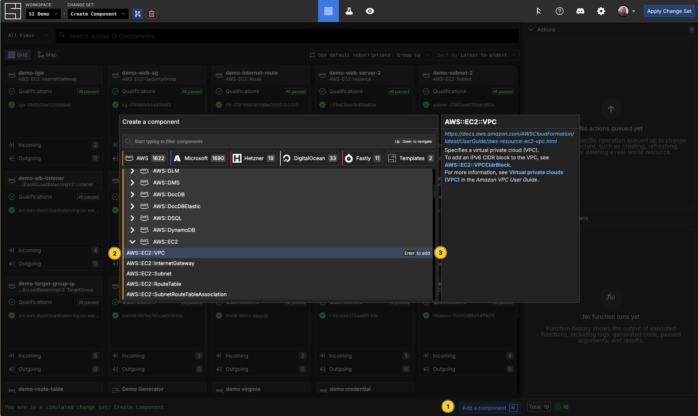
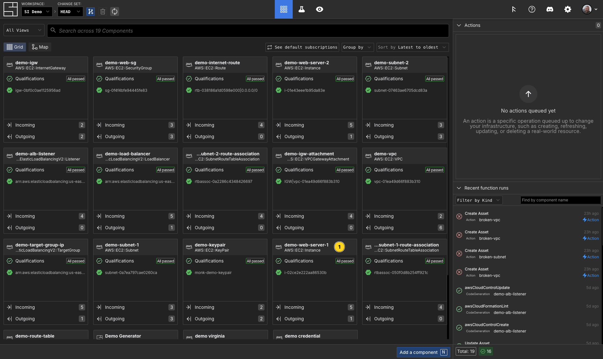
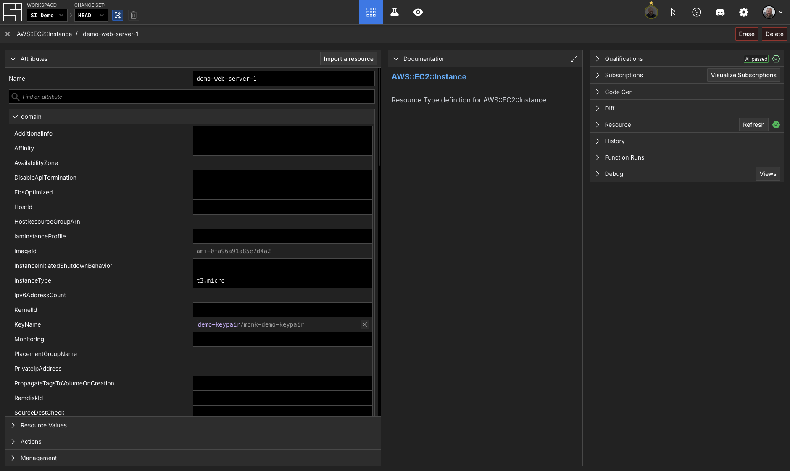
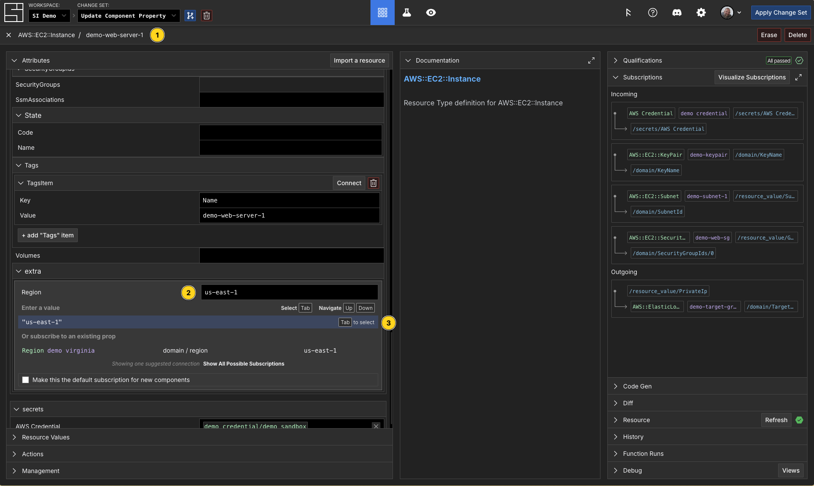
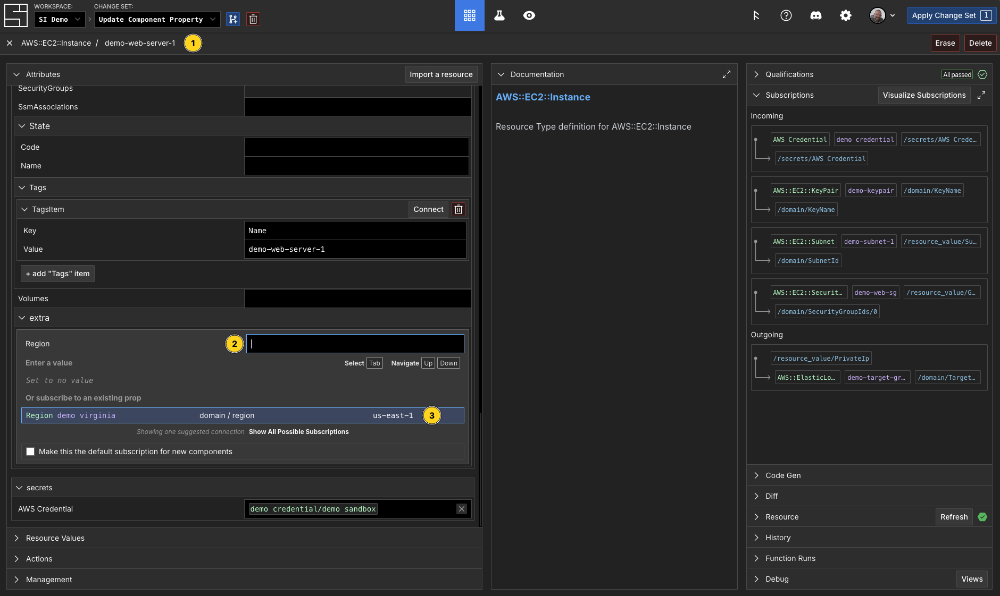
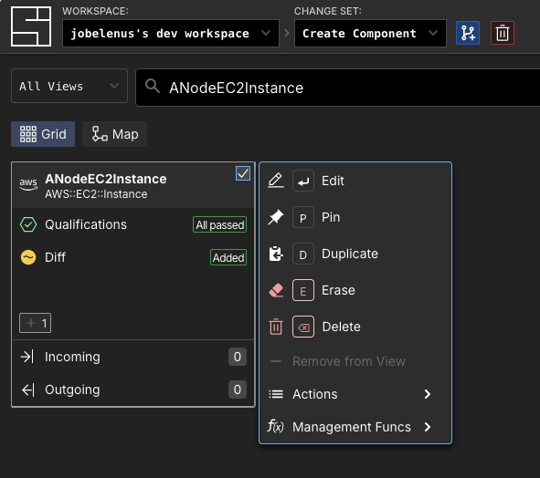
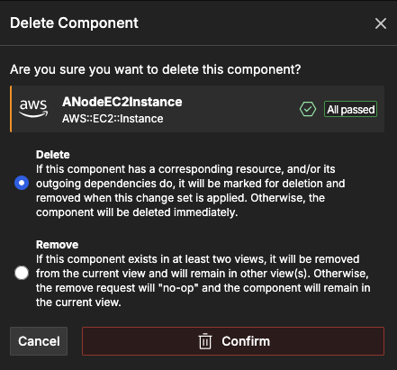
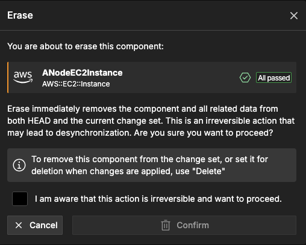

# Components

Components are the 1:1 mapping to your cloud infrastructure. System Initiative
components are instances of Schemas. You can name components within System
Initiative and those names will not affect your cloud infrastructure.

Components have attribute data and resource data. Attribute data represents all
the configurations your cloud infrastructure supports. Resource data represents
the state of your cloud infrastructure.

## Attributes

Components have attributes that can be assigned values. Attributes are typed
(boolean, number, string) and defined by its schema. Each change to a
component's attribute values is tracked in the audit log.

Attributes are organized into hierarchical trees. For example, the
`AWS::EC2::Subnet` component has an attribute named `VpcId`. It's location in
the attribute tree, what we call the path, is `/domain/VpcId`.

System Initiative supports maps, objects, and arrays in the attribute tree.
`Map` is an arbitrary key-value shape where the user can define the keys.
`Object` is a specific shape where the keys are defined by the schema. `Array`
is a list that supports any of the aforementioned types.

### Subscriptions

Subscriptions are how components depend on one another. A subscription moves the
value from Component A's specified attribute path to another attribute path on
Component B. The paths are not required to match. When the value in Component A
is changed that change will be reflected in Component B.

Let's use the VPC example in AWS again. When creating a `Subnet` component that
needs a `VpcId` you want that component to subscribe to the `Vpc` component in
order to obtain the `VpcId` the subnet needs. The `VpcId` value will flow from
the `Vpc` component into the `Subnet` component whenever it changes.

## Resources

A resource in System Initiative is the data that describes the specific instance
within the cloud provider. The cloud provider controls the shape of the resource
data.

Most components can have a resource. When you create a component it will
initially not have a resource. If you import a component it will have a
resource. A Component with a resource represents cloud infrastructure in the
real world. [Actions](./actions.md) update resources within System Initiative
and apply your changes within SI to your cloud infrastructure.

:::info

Certain Components like "AWS Region" do not have a resource, as it does not map
to an instance of cloud infrastructure; rather, it is a reference for
pre-existing cloud configuration data.

:::

## Interacting With Components

### Creating a Component

<DocTabs tabs="CLI,AI Agent,Web Application,Public API">
<TabPanel value="CLI">

To create a Component with the CLI:

```shellscript [Create a Component]
$ cat createcomponent.json
{
  "schemaName": "AWS::EC2::Instance",
  "attributes": {
    "/si/name": "ANodeEC2Instance",
    "/domain/extra/Region": "us-east-1"
  }
}

$ si component create -c 01KC2F3RWYRYQDZ3BRNG69FC28 createcomponent.json
✨ info    si              Loading component data from "createcomponent.json"
✨ info    si              Creating component: "AWS::EC2::Instance" "ANodeEC2Instance"
Component ID: 01KC4CNSWFCSJDY3M30BMYRTMP
```

</TabPanel>
<TabPanel value="AI Agent">

To create a Component with the AI Agent:

```prompt
> Create a EC2 Instance component named MyNodeEC2Instance

⏺ Perfect! I've successfully created the EC2 Instance component named "MyNodeEC2Instance" in the "Create Component" change set. The component has been configured with:

  - Component ID: 01KC28S0R3W977CNWWNE764M04
  - Schema: AWS::EC2::Instance

  The component is now ready for you to configure additional attributes like:
  - ImageId (AMI ID)
  - InstanceType (e.g., t2.micro, t3.small)
  - KeyName (SSH key)
  - SecurityGroupIds or SecurityGroups
  - SubnetId (if using VPC)
  - UserData (bootstrap scripts)
```

</TabPanel>
<TabPanel value="Web Application">

To create a Component:



1. Press the `N` hotkey or click the 'Add a component' button from the bottom
   bar.
2. Use the mouse or keyboard to find the Schema you are looking for.
3. Double click, or hit enter, on the selected Schema.

</TabPanel>
<TabPanel value="Public API">

:::code-group

```typescript [TypeScript]
const api = new ComponentApi(apiConfig);
const response = await api.createComponent({
  workspaceId,
  changeSetId,
  createComponentV1Request: {
    componentName,
    schemaName,
  },
});
```

```python [Python]
request = CreateComponentV1Request(
    name=component_name,
    schema_name=schema_name,
)

api = ComponentsApi(client)
response = api.create_component(
    workspace_id=workspace_id,
    change_set_id=change_set_id,
    create_change_set_v1_request=request,
)
```

:::

</TabPanel>
</DocTabs>

### Getting a Component

<DocTabs tabs="CLI,AI Agent,Web Application,Public API">
<TabPanel value="CLI">

```shellscript
$ si component get -c 01KC2F3RWYRYQDZ3BRNG69FC28 MyNodeEC2Instance -o json
{
  "componentId": "01KBNCGCKKKHSAE23R1E2E8TMA",
  "schemaId": "01JK0QZHF0TXMJFVE1VK2175EC",
  "schemaName": "AWS::EC2::Instance",
  "resourceId": "",
  "toDelete": false,
  "canBeUpgraded": false,
  "qualified": true,
  "attributes": {
    "/si/name": "MyNodeEC2Instance",
    "/si/type": "component"
  },
  "qualifications": [],
  "actions": []
}
```

</TabPanel>
<TabPanel value="AI Agent">

```prompt
> Get the component details for MyNodeEC2Instance 
⏺ Here are the details for MyNodeEC2Instance:

  Component Information:
  - Component ID: 01KC2EQ26S2T2BS5A1AD0HVPDS
  - Component Name: MyNodeEC2Instance
  - Schema: AWS::EC2::Instance
  - Resource ID: (not yet created)

  Attributes:
  - /si/name: "MyNodeEC2Instance"
  - /domain/extra/Region: "us-east-1" (direct value)
  - /secrets/AWS Credential: Subscribed to component 01KBN7TC89C9QHFNPKXV26PRND

  Available Actions:
  - Create Asset
  - Update Asset
  - Refresh Asset
  - Delete Asset
  - Start Ec2 Instance
  - Stop Ec2 Instance
  - Reboot Ec2 Instance

  Available Management Functions:
  - Import from AWS
  - Discover on AWS

  The component currently has the region set to "us-east-1" and has an AWS Credential subscription configured. However, it appears that no other EC2 instance attributes have been set yet (like InstanceType, ImageId, etc.).
```

</TabPanel>
<TabPanel value="Web Application">



1. Click on a component
2. See its details



</TabPanel>
<TabPanel value="Public API">

:::code-group

```typescript [TypeScript]
const api = new ComponentApi(apiConfig);
const response = await api.getComponent({
  workspaceId,
  changeSetId,
  componentId,
});

const findResponse = await api.findComponent({
  workspaceId,
  changeSetId,
  {
    name,
  },
});
```

```python [Python]
api = ComponentsApi(client)
response = api.get_component(
    workspace_id=workspace_id,
    change_set_id=change_set_id,
    component_id=component_id,
)

find_response = api.get_component(
    workspace_id=workspace_id,
    change_set_id=change_set_id,
    component=component_name,
)
```

:::

</TabPanel>
</DocTabs>

### Updating an Attribute

<DocTabs tabs="CLI,AI Agent,Web Application,Public API">
<TabPanel value="CLI">

The `component update` command accepts a filename as its only parameter. That
file contains both the data to identify as well as the values you want the
component data updated to. I added the region attribute and set it to
`us-east-1` below

:::tip

The `component get` command with the `-o json` is a helpful way to get the state
of the component data in a format that is easy to edit.

:::

```shellscript
$ cat mycomponent.json
{
  "componentId": "01KBNCGCKKKHSAE23R1E2E8TMA",
  "schemaId": "01JK0QZHF0TXMJFVE1VK2175EC",
  "schemaName": "AWS::EC2::Instance",
  "resourceId": "",
  "toDelete": false,
  "canBeUpgraded": false,
  "qualified": true,
  "attributes": {
    "/si/name": "MyNodeEC2Instance",
    "/si/type": "component",
    "/domain/extra/Region": "us-east-1"
  },
  "qualifications": [],
  "actions": []
}

$ si component update -c 01KC2F3RWYRYQDZ3BRNG69FC28 mycomponent.json
✨ info    si              Loading component data from "mycomponent.json"
✨ info    si              Resolving change set: "01KC2F3RWYRYQDZ3BRNG69FC28"
✨ info    si              Fetching current component: "01KBNCGCKKKHSAE23R1E2E8TMA"
✨ info    si              Schema: "AWS::EC2::Instance" ("01JK0QZHF0TXMJFVE1VK2175EC")
✨ info    si              Component: "MyNodeEC2Instance" ("01KBNCGCKKKHSAE23R1E2E8TMA")
✨ info    si              Attributes to set or update: { "/domain/extra/Region": "us-east-1" }
✨ info    si              Updating component "01KBNCGCKKKHSAE23R1E2E8TMA"
✨ info    si              Component "01KBNCGCKKKHSAE23R1E2E8TMA" updated successfully
✨ info    si              Component "MyNodeEC2Instance" updated successfully in change set "01KC2F3RWYRYQDZ3BRNG69FC28"
```

</TabPanel>
<TabPanel value="AI Agent">

```prompt
> For the component MyNodeEC2Instance set the region value to us-east-1
⏺ Done! I've set the region for MyNodeEC2Instance to "us-east-1".
```

</TabPanel>
<TabPanel value="Web Application">



1. Navigate to the component detail page.
2. Filter and / or scroll to the attribute you wish to update
3. Type the value you want to set, hit tab (or enter)

</TabPanel>
<TabPanel value="Public API">

:::code-group

```typescript [TypeScript]
const api = new ComponentApi(apiConfig);
const response = await api.updateComponent({
  workspaceId,
  changeSetId,
  componentId,
  updateComponentV1Request: {
    attributes: {
      "/si/name": "us-east-1",
    },
  },
});
```

```python [Python]
request = UpdateComponentV1Request(
  attributes={
    "/si/name": "us-east-1",
  }
)

api = ComponentsApi(client)
response = api.update_component(
    workspace_id=workspace_id,
    change_set_id=change_set_id,
    component_id=component_id,
    update_component_v1_request=request,
)
```

:::

</TabPanel>
</DocTabs>

### Creating Subscriptions

<DocTabs tabs="CLI,AI Agent,Web Application,Public API">
<TabPanel value="CLI">

The `component update` command accepts a filename as its only parameter. That
file contains both the data to identify as well as the values you want the
component data updated to. I added the region attribute and configured a
subscription to the value of the region component

:::tip

The `component get` command with the `-o json` is a helpful way to get the state
of the component data in a format that is easy to edit.

:::

```shellscript
$ cat mycomponent.json
{
  "componentId": "01KBNCGCKKKHSAE23R1E2E8TMA",
  "schemaId": "01JK0QZHF0TXMJFVE1VK2175EC",
  "schemaName": "AWS::EC2::Instance",
  "resourceId": "",
  "toDelete": false,
  "canBeUpgraded": false,
  "qualified": true,
  "attributes": {
    "/si/name": "MyNodeEC2Instance",
    "/si/type": "component",
    "/domain/extra/Region": {
      "$source": {
        "component": "01KBN59ZHQPVCXD44J1YT77S4E",
        "path": "/domain/region"
      }
    }},
  "qualifications": [],
  "actions": []
}

$ si component update -c 01KC2F3RWYRYQDZ3BRNG69FC28 mycomponent.json
✨ info    si              Loading component data from "mycomponent.json"
✨ info    si              Resolving change set: "01KC2F3RWYRYQDZ3BRNG69FC28"
✨ info    si              Fetching current component: "01KBNCGCKKKHSAE23R1E2E8TMA"
✨ info    si              Schema: "AWS::EC2::Instance" ("01JK0QZHF0TXMJFVE1VK2175EC")
✨ info    si              Component: "MyNodeEC2Instance" ("01KBNCGCKKKHSAE23R1E2E8TMA")
✨ info    si              Subscriptions to update: { "/domain/extra/Region":
                              { component: "01KBN59ZHQPVCXD44J1YT77S4E", path: "/domain/region", func: undefined } }
✨ info    si              Updating component "01KBNCGCKKKHSAE23R1E2E8TMA"
✨ info    si              Component "01KBNCGCKKKHSAE23R1E2E8TMA" updated successfully
✨ info    si              Component "MyNodeEC2Instance" updated successfully in change set "01KC2F3RWYRYQDZ3BRNG69FC28"
```

</TabPanel>
<TabPanel value="AI Agent">

```prompt
> Subscribe the region for MyNodeEC2Instance component to the region from Our East Region component 
⏺ Done! I've successfully subscribed the region for MyNodeEC2Instance to the region from Our East Region. The /domain/extra/Region attribute of MyNodeEC2Instance is now subscribed to /domain/region from the Our East Region component,
  so the region value will automatically flow from that component.
```

</TabPanel>
<TabPanel value="Web Application">



1. Navigate to the component detail page.
2. Filter and / or scroll to the attribute you wish to make a subscription
3. Find the component, path, and value you want to subscribe to with either the
   keyboard or mouse and select it (click, tab, or enter).

Note: typing in the attribute input box will fuzzy filter the list of
subscriptions

</TabPanel>
<TabPanel value="Public API">

:::code-group

```typescript [TypeScript]
const api = new ComponentApi(apiConfig);
const response = await api.updateComponent({
  workspaceId,
  changeSetId,
  componentId,
  updateComponentV1Request: {
    attributes: {
      "/domain/extra/Region": {
        "$source": {
          "component": "01KBN59ZHQPVCXD44J1YT77S4E",
          "path": "/domain/region",
        },
      },
    },
  },
});
```

```python [Python]
source = {
  "component": "01KBN59ZHQPVCXD44J1YT77S4E",
  "path": "/domain/region"
}
request = UpdateComponentV1Request(
  attributes={
    "/si/name": { "$source": source },
  }
)

api = ComponentsApi(client)
response = api.update_component(
    workspace_id=workspace_id,
    change_set_id=change_set_id,
    component_id=component_id,
    update_component_v1_request=request,
)
```

:::

</TabPanel>
</DocTabs>

### Deleting a Component

:::tip

To remove a piece of cloud infrastructure you will delete its corresponding
component. A deleted component will remain in your Change Set until its
corresponding resource has been removed by its delete [action](./actions.md).

:::

<DocTabs tabs="CLI,AI Agent,Web Application,Public API">
<TabPanel value="CLI">

To delete a Component with the CLI:

```shellscript [Delete a Component]
$ si component delete -c 01KC22VWQQSFWN203C83Q42EVZ ANodeEC2Instance
```

</TabPanel>
<TabPanel value="AI Agent">

```prompt
> Delete the component ANodeEC2Instance from the Create Component change set 
⏺ Successfully deleted the "ANodeEC2Instance" component from the "Create Component" change set. The component has been removed and will no longer be part of the change set when you apply it.
```

</TabPanel>
<TabPanel value="Web Application">

To delete a Component:



1. Find the component on the grid.
2. Right click to open the context menu.
3. Click delete.
4. Confirm your selection.



</TabPanel>
<TabPanel value="Public API">

:::code-group

```typescript [TypeScript]
const api = new ComponentApi(apiConfig);
await api.deleteComponent({
  workspaceId,
  changeSetId,
  componentId,
});
```

```python [Python]
api = ComponentsApi(client)
response = api.delete_component(
    workspace_id=workspace_id,
    change_set_id=change_set_id,
    component_id=component_id,
)
```

:::

</TabPanel>
</DocTabs>

### Erasing a Component

:::tip

Erasing is not the same as Deleting. When you no longer want to manage a piece
of cloud infrastructure in System Initiative you will erase its corresponding
component. The component will no longer be present in your Change Set and the
cloud infrastructure will not be modified.

:::

<DocTabs tabs="CLI,AI Agent,Web Application,Public API">
<TabPanel value="CLI">

To erase a Component with the CLI:

```shellscript [Erase a Component]
$ si component erase -c 01KC22VWQQSFWN203C83Q42EVZ ANodeEC2Instance
```

</TabPanel>
<TabPanel value="AI Agent">

```prompt
> Erase the component ANodeEC2Instance from the Create Component change set 
⏺ Successfully erased the "ANodeEC2Instance" component from the "Create Component" change set. The component has been completely removed from System Initiative without enqueuing a delete action. This action cannot be undone within
  this change set.
```

</TabPanel>
<TabPanel value="Web Application">

To erase a Component:


1. Find the component on the grid.
2. Right click to open the context menu.
3. Click Erase.
4. Confirm your selection.



</TabPanel>
<TabPanel value="Public API">

:::code-group

```typescript [TypeScript]
const api = new ComponentApi(apiConfig);
await api.eraseComponent({
  workspaceId,
  changeSetId,
  componentId,
});
```

```python [Python]
api = ComponentsApi(client)
api.erase_component(
    workspace_id=workspace_id,
    change_set_id=change_set_id,
    component_id=component_id,
)
```

:::

</TabPanel>
</DocTabs>
