# Infrastructure as Code vs System Initiative

Everything that can be accomplished with traditional Infrastructure as Code (IaC) tooling can be done using System Initiative. This reference highlights key differences in methodology, workflow, and general capabilities. It also provides guidance on how to accomplish similar tasks in System Initiative to those you're familiar with in Infrastructure as Code solutions.

## Key Differences

### Programmable data model, not declarative code

Traditional IaC tools work by having you write declarative code in a [Domain Specific Language](https://en.wikipedia.org/wiki/Domain-specific_language), which goes through an interpreter (or a compiler) to generate a list of resources to configure called the *desired state*. This desired state is then compared to the *last known state* of the resources in the cloud provider - this is usually kept in a *state file* or *remote state store*. If the state doesn't match, then the tool will update the *resource* in the cloud. If the resource is updated outside the IaC tool, then the state won't match, and it will usually require manual intervention.

In this model, what you program are the *declarations* that represent the desired state of the system.

In System Initiative, you program the transitions to a [data model](./architecture/snapshot.md) rather than to a source code declaration. We make a 1:1 model, called a [digital twin](./architecture/digital-twin.md), with built in [change control](./architecture/change-control.md). For any given set of changes, we track your *intended* configuration in a *component*, which we then compare to the real-world state, which we call a *resource* (we call the component and the resource together a *model*.) At any given moment in time, the *resource* is authoritative for the actual configuration of the underlying provider, and the *component* is authoritative for your intent. You can make changes to the model through many *interfaces* - with our Web Application, through our [Public API](./public-api.md), with our AI Agent. The information can flow *bidirectionally* - you can create components first, and then have them create the resources, or you can discover the resources and build the components up from reality.

:::tip
A good analogy here is the difference between programming a change to a database, and changing application code. With Infrastructure as Code, you're writing the desired state as application code. With System Initiative, you're programming changes to a reactive database.
:::

The result is a platform that is much more flexible, requires less custom code, never gets out of sync in ways you cannot resolve easily.

### Reactive subscriptions, not static variables

With Infrastructure as Code, you create relationships between resources by declaring them explicitly with features like Terraforms *depends_on*, or through using a *variable* reference to an existing resource.

In System Initiative, you create *subscriptions* between models. For example, an AWS Subnet requires the ID of an AWS VPC in order to be created - in System Initiative, this happens through the Subnet *subscribing* to the VpcId from the underlying *resource*. So when the VPC is created and AWS assigns the VpcId, the Subnet will automatically be updated to reflect the correct value.

This mechanism makes every value explicit, and enables us to build comprehensive maps of your infrastructure. The subscriptions can be set like any other value, meaning they can be updated at any time through simply setting the value to a subscription.

:::tip
Web Frameworks like [React](https://react.dev) or [Vue](https://vuejs.org/) have a similar concept of reactive subscriptions. They make for efficient updates, easy tracing, and allow for all sorts of internal debugging and visualization tools.

And like the analogy of a database, they make more sense when you understand that you are programming a *data model*, rather than writing source code. You subscribe to the data you need, and the system keeps it up to date as it changes (however it changes!), rather than declaring it statically.
:::

### Working systems, not re-writing automation

System Initiative does not care how a resource was created - we only need to *discover* the underlying resource, at which point we have all the data the model needs to let you automate it. That means rather than starting your automation project by "rebuilding" all of your code in a new platform, you only need to import the information about what you already have. This discovery

Infrastructure as Code struggles greatly with pre-existing infrastructure. While you can generate a declaration from a resource, and even patch the state to associate it, the process is fragile and difficult to do at scale. It's fragile because the code it generates won't follow any convention in your code-base - by definition it will be a static declaration, with no variables or relationships.

### Real-time updates, not sequential application

Most Infrastructure as Code tools follow a 'model-plan-apply' cycle. You write the code in the model, then ask for a 'plan' that tells you what changes the system thinks it needs to make, and then you 'apply' the model to the underlying provider. Due to the need to track state and keep it free from conflicts, this necessarily means that a given *repository* can only have one update happening to its resources at a time.

:::tip
Think of this like a global, distributed lockfile - because that's what it is, much of the time.
:::

System Initiative's underlying [data model](./architecture/snapshot.md) is an immutable directed acyclic graph (or [DAG](https://en.wikipedia.org/wiki/Directed_acyclic_graph)). Each change is tracked as an [operational transform](https://en.wikipedia.org/wiki/Operational_transformation), which can then be applied to any other snapshot. The result is that two distinct change sets can apply at the same time, and the resulting transitions cannot conflict with one another. It also means that, as change flows through the system, all other open change sets can be updated in real time.

The result is that we do not need a global lock, because state cannot conflict. We use this feature to make our Web Application work in a real-time way - updates are shared immediately between every user.

### Flexible actions, not pre-determined states

Infrastructure as Code tools work through taking a static declaration of a resources desired state and applying it. Those states are themselves pre-determined by the tool, and they typically are limited to things like 'created' or 'deleted'.

In System Initiative, we track your *intent* to take an *action* against a resource. That action may update the *resource data* as a result. For example, System Initiative allows you to stop, start, restart, and reboot an EC2 Instance. That's because we decouple the configuration of your instance in our *component* from the real-world *resource*. That action can run, the instance will stop, and the new status is reflected in the *resource data*.

This is a huge boon, in particular when you are writing more complex automation using our [public API](./public-api.md). We use this feature to do things like trigger increases in tracing for applications during troubleshooting, etc. The skies the limit.

### Unified workflow, not choose your own adventure

Nobody uses just an Infrastructure as Code tool. In order to make thing work in production, you need to make choices about multiple external tools: state management, secrets, CI/CD, policy enforcement, visualization, code review, etc. Each of these choices needs to be considered in the context of the others, be explained to your users, and has pros and cons.

System Initiative is a single, unified workflow that streamlines the entire life cycle of Infrastructure Automation. Change control is built in. There is no need for bespoke infrastructure pipelines. Policy and validation is built in through our qualifications. Visualization comes for free. Dynamic change set review is built in. Authorization is ubiquitous. Secret storage is built in. We do this not because you can't get those things from other vendors, but because the user experience of having to get them, manage them, automate them, and understand them is too high. By making a unified experience, we have the freedom to improve the status quo.

### AI Native, not an AI afterthought

AI Native platforms were designed to work well with AI, and put those interactions at the center of the workflow and experience. System Initiative's [digital twins](./architecture/digital-twin.md), which map 1:1 to how the upstream provider works, are the foundation of that. By building 1:1 models, we can leverage the training data that is already in the LLM - we don't need to add context for it to correctly understand how to configure infrastructure (you might still, but that will likely be more about specificity than understanding.) Through allowing the Agent to explore and propose changes in [simulated change sets](./architecture/change-control.md), we can give immediate feedback when they make a mistake (like inventing an attribute that might not exist, or setting a value that is inappropriate), rather than waiting for a long (and likely non-existent) test cycle. Our subscription model makes it easy for the Agent to create the correct relationships between configuration values, and can use our comprehensive schema, which includes upstream documentation, to make good choices. Setting it up is as easy as [cloning our git repository and running a setup script](https://github.com/systeminit/si-ai-agent).

With Infrastructure as Code, AI integration works like application code does. The Agent has been trained on how to write Terraform code, but struggles to write code that conforms to an existing standard or structure. You have to provide all the context for every task - context that, if you're in a large organization, is largely spread across many different repositories and state files. When it makes a mistake, you will learn about it only much later - when you plan, or when you apply. Because the infrastructure code is, by nature, an abstraction of the underlying provider (and even more so when it is well factored with variables, modules, etc.), the context necessary to make good decisions is much larger. We've seen folks who have put in a lot of time and effort have OK outcomes using agents to help write their IaC - but System Initiative eliminates the need for that effort through intentional design.

## Terraform

This section will provide guidance for mapping your expertise in Terraform to System Initiative.

:::info
This section is obviously written from the perspective of System Initiative. That said, our goal here is to never misrepresent how Terraform works. Our examples are taken from HashiCorp's own documentation:

- [Define infrastructure with Terraform resources](https://developer.hashicorp.com/terraform/tutorials/configuration-language/resource)
- [Sensitive Input Variables](https://developer.hashicorp.com/terraform/tutorials/configuration-language/sensitive-variables)
- [Vault Provider](https://registry.terraform.io/providers/hashicorp/vault/latest/docs)
- [Query Data Sources](https://developer.hashicorp.com/terraform/tutorials/configuration-language/data-sources)
- [Count](https://developer.hashicorp.com/terraform/tutorials/configuration-language/count)
- [For Each](https://developer.hashicorp.com/terraform/tutorials/configuration-language/for-each)
- [Modules Overview](https://developer.hashicorp.com/terraform/tutorials/modules/module)
- [Module Use](https://developer.hashicorp.com/terraform/tutorials/modules/module-use)
- [Manage resource state](https://developer.hashicorp.com/terraform/tutorials/state/state-cli)
- [Purpose of Terraform State](https://developer.hashicorp.com/terraform/language/state/purpose)
- [Remote state](https://developer.hashicorp.com/terraform/language/state/remote)
- [Initialize Terraform configuration](https://developer.hashicorp.com/terraform/tutorials/cli/init)
- [Create a Terraform plan](https://developer.hashicorp.com/terraform/tutorials/cli/plan)
- [Apply Terraform configuration](https://developer.hashicorp.com/terraform/tutorials/cli/apply)

If you find a bug, or think we've misrepresented anything - let us know.
:::

### Comparison

Below is a quick translation between various aspects of Terraform and System Initiative.

| Aspect | Traditional IaC (Terraform) | System Initiative |
|--------|----------------------------|-------------------|
| **Initialization** | `terraform init` - Initialize working directory with provider plugins and backend configuration | Creating a workspace and adding credentials through the visual interface, API or AI integration |
| **State Management** | External state storage (local files, S3/DynamoDB, GCS, Terraform Cloud) with manual configuration | Centralized state store embedded in the system with bi-directional data model and automatic synchronization |
| **State Locking** | External locking mechanisms (DynamoDB, Terraform Enterprise) to prevent concurrent modifications | Built-in Change Sets with automatic rebasing of merges to HEAD, eliminating traditional locking concerns |
| **Secrets Management** | Integration with external secret stores (Vault, AWS SSM, Secrets Manager) using data sources | Fully encrypted secrets management built into the platform with end-to-end encryption in transit and at rest. Highly extensible code-first platform allowing any interfacing secret backend to be supported |
| **Drift Detection** | `terraform plan` to detect differences between desired state and actual infrastructure, limited to managed resources | Full-fidelity discovery and import with bidirectional diff capabilities across all infrastructure |
| **Resource Removal** | `terraform state rm` and manual code removal to stop managing resources | Component erase from the graph with clear relationship impact visualization |
| **Manual Overrides** | `terraform taint` to force resource recreation on next apply | Direct action queuing (Delete + Create) against specific components with immediate contextual feedback |
| **Data Flow** | Output blocks and data sources for passing values between modules and external data retrieval | System and user-authored functions for data transformation and binding between components with real-time updates |
| **Version Management** | `required_providers` blocks and `terraform.lock.hcl` for provider/module version pinning | On-demand asset upgrades with granular component-level version control |
| **Branching Strategy** | Git branches for parallel development with manual merge | Change Sets as automatically rebasing branches with conflict-free merges |
| **Change Review** | Pull requests with external CI/CD integration for plan/apply workflows | Built-in change review system with granular approvals and real-time collaboration |
| **Resource Import** | `terraform import` with manual state file manipulation and code generation | Full-fidelity discovery and import with automatic relationship detection and visual integration |
| **Selective Apply** | `terraform apply -target` for applying subset of Changes | Action queuing system allowing selective execution of specific actions or action groups |
| **Environment Management** | Terraform workspaces or directory/repository cloning per environment | Templates and duplication functions with workspace, view, or RBAC level environment separation |
| **Policy as Code** | External tools (Sentinel, OPA, Checkov) integrated via CI/CD or pre-commit hooks | Native qualifications system integrated directly into Change Sets with real-time validation |
| **Visualization** | Static `terraform graph` output requiring external tools for visualization | Native dynamic graph visualization with interactive Map view and real-time updates |
| **CI/CD Integration** | GitHub Actions, Jenkins, or similar pipelines for plan-on-PR and apply-on-merge workflows | Deep external API interface for integration with any CI provider or custom scripting |
| **Reusability** | Terraform modules for packaging and sharing reusable infrastructure patterns | Templates system for creating and sharing reusable infrastructure patterns with visual composition |

### Repositories

In Terraform, a *repository* maps to a source code repository that contains your terraform code. This includes providers, modules, resource declarations, variables, etc. In large scale use, there are typically multiple repositories for a given organization, split up according to rate of change, size, authorization, and speed to plan and apply. There are many different possible shapes of repository, each with pros and cons depending on your use case.

In System Initiative, we have [workspaces](./architecture/tenancy.md) which provide data separation, secret isolation, and access isolation. Workspaces contain the data about each component (which maps roughly to a single resource declaration in Terraform), their schema, your policy, etc. Rather than thinking of it like organizing application source code, think of a workspace like a uniquely isolated database instance with change control built in. We then provide tools for viewing and analyzing the infromation in your workspace - grid views for quickly searching and taking action, map views for understanding relationships, etc. You can partition the workspace into smaller pieces called *views*, which become logical slices of infrastructure that focus on related components - for example, you might have a Core Network view, an Application specific view, and an IAM view.

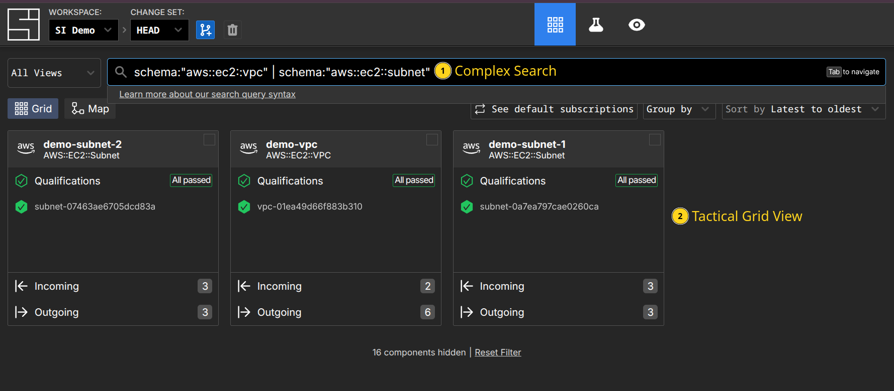

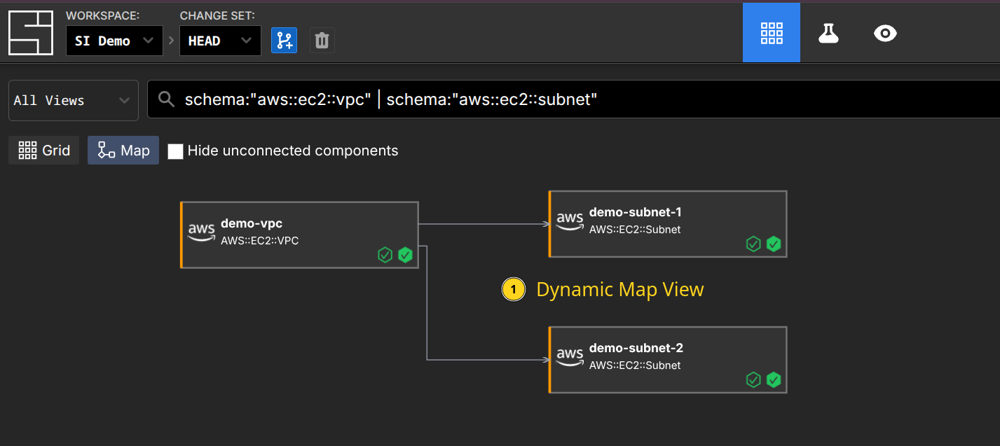

Workspaces store all the data about your infrastructure and provide flexible logical organization, uniquely powerful searching, mapping, visiblity and programability. They solve many of the core problems with designing repositories, by giving you *logical* ways to view and organize the underlying data, rather than forcing you to refactor *source code*.

### Providers

In terraform, you declare which providers to use, and then declare their options:

::: code-group
```terraform [terraform.tf]
# Copyright (c) HashiCorp, Inc.
# SPDX-License-Identifier: MPL-2.0

terraform {
  required_providers {
    aws = {
      source  = "hashicorp/aws"
      version = "~> 4.15.0"
    }
    random = {
      source = "hashicorp/random"
    }
  }

  required_version = "~> 1.2.0"
}
```

```terraform [main.tf]
provider "aws" {
  region = "us-west-2"
}

provider "random" {}
```
:::

These blocks define what version of the underlying provider code will be used, and the options that will apply globally to all the resources that provider exposes. The providers themselves define how the resource declarations map to API calls in the underlying cloud API.

System Initative does not have an equivalent provider layer. Instead, it works in terms of *assets* and *functions*. An asset is defined by its *schema* and by *functions* that define behavior - for example, *action functions* that define things like *create*, *update*, or *delete*. These functions can be shared across multiple assets - for example, all of our AWS assets share the same fundamental CRUD action functions. One valuable side-effect of our approach is that you can see the specifics directly on the asset.

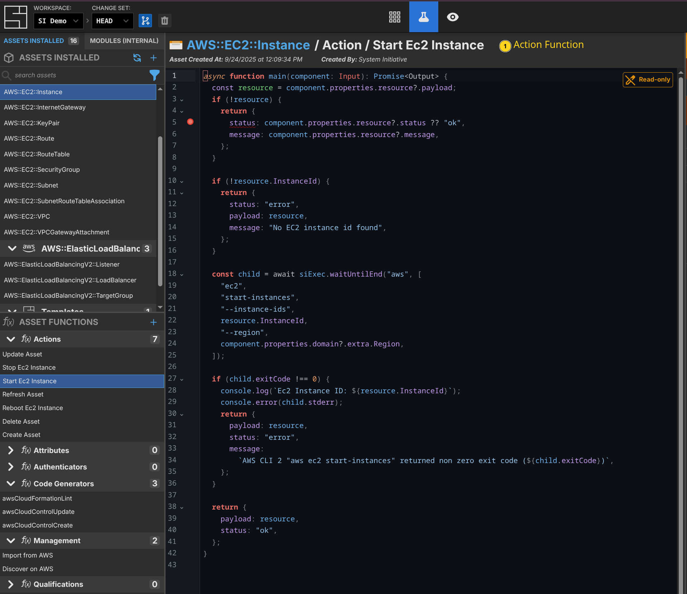

:::tip
This is a good example of how removing the provider layer simplifies the architecture. System Initiative assets are *fully programmable* from within System Initiative - no need to switch programming languages, move outside the DSL, etc. The underlying data model knows how to track changes and improvements across time. Also, this is the kind of action that doesn't exist in Terraform - it knows how to create and destroy resources, but it cannot understand how to 'restart' an instance at a point in time.
:::

When it comes to specifying "provider options", those are modeled as *assets* directly. For example, the AWS Region is itself an asset with an attribute of the region. If you want the region to be set by default, you make that region the *default subscription*, which would cause all new components created to have that region set automatically. An upside of this approach is a dramatic increase in flexibility - having multiple regions, credentials, etc. in the same *workspace* is trivial.

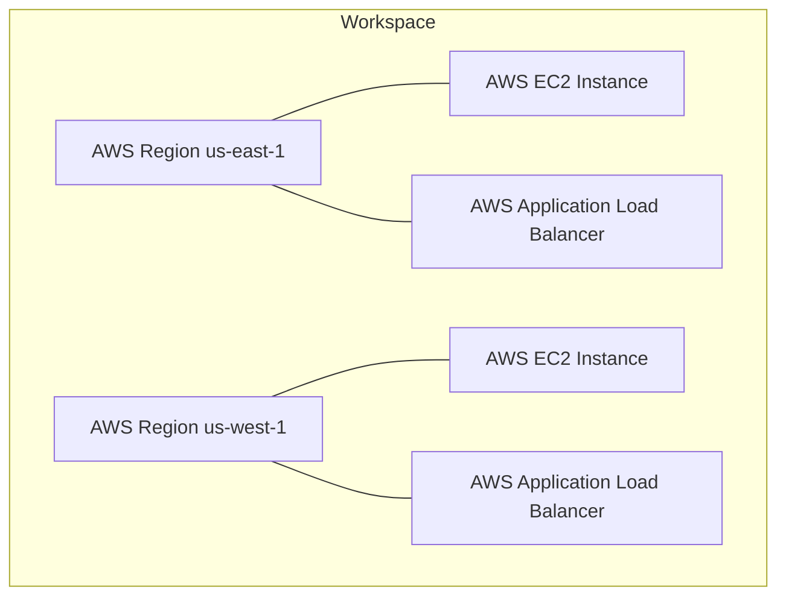

By eliminating the concept of providers entirely, and focusing instead on how *assets* compose, we eliminate the complexity of determining which underlying versions should run (you can have multiple versions installed at the level of a single resource, if that's what you need), the pain of trying to override those options on a per-resource basis, and make the underlying system easier to understand, extend, and debug.

### Resources

Terraform providers define resources, which represent the declarative syntax that maps to an underlying concept within the provider, as declarative code in text files. They have arguments (configuration options for the resource), attributes (values exposed by the resource; typically assigned by the underlying provider), and meta-arguments (Terraform specific behavior like 'count').

```terraform:line-numbers {4,6,11}
# Copyright (c) HashiCorp, Inc.
# SPDX-License-Identifier: MPL-2.0

resource "random_pet" "name" {}

resource "aws_instance" "web" {
  ami           = "ami-a0cfeed8"
  instance_type = "t2.micro"

  tags = {
    Name = random_pet.name.id
  }
}
```

In the example above, two resources have been declared. The first is a "random pet" name (line 4). The second is an AWS EC2 Instance (line 6), which uses the `id` attribute of the random pet resource to set the Name tag of the instance.

In System Initiative, we would create two *components* in a new *change set* - a Random Pet component and an AWS::EC2::Instance component, with a *subscription* to the random pet components id. We could create these in multiple ways - through our Web Interface, through the Public API as code, or from an AI Agent - all of which have the same end result: our underlying data model is updated to have these two components.

Here are examples for all 3 different mechanisms:

::: details AI Agent {open}
Feed the AI Agent the following prompt:

```prompt
Create an ec2 instance named web that uses ami-a0cfeed8 and is a t2.micro.
It should have a Name tag that subscribes to the id of a Random Pet named
'ec2 web random name'.
```
It will then make a plan, inspect the schema for the relevant assets, and create the components in a new change set. After a few seconds of work, it will respond with something like this:

```
● Excellent! I've successfully created:

  1. Random Pet component named "ec2 web random name" - this will generate
     a random pet name ID
  2. EC2 Instance component named "web" with:
    - AMI ID: ami-a0cfeed8
    - Instance Type: t2.micro
    - Name tag: Subscribed to the Random Pet component's ID (so it will use
      the random pet name)
    - Region: Subscribed to the existing "us-west-1" Region component
    - AWS Credential: Subscribed to the existing "SI Demo" AWS Credential
      component

  The configuration is complete with no qualification failures. The EC2 instance
  will be tagged with a random pet name generated by the Random Pet component,
  and it's properly configured with the required AWS credentials and region
  settings.
```

The agent is the fastest way to work with components in System Initiative, in particular if you don't know the specific schema you need to create.
:::

::: details Public API {open}
Here is an example of our public API using a standalone Python script.

```python
#!/usr/bin/env python3

import os
from system_initiative_api_client import ApiClient, Configuration, ChangeSetsApi, ComponentsApi, SchemasApi
from system_initiative_api_client import CreateChangeSetV1Request, CreateComponentV1Request, UpdateComponentV1Request

def main():
    # Configure API key authorization
    api_token = os.environ.get('SI_API_TOKEN')
    if not api_token:
        raise ValueError("SI_API_TOKEN environment variable is required")

    workspace_id = os.environ.get("SI_WORKSPACE_ID")
    if not workspace_id:
        raise ValueError("SI_WORKSPACE_ID environment variable is required")

    # Setup API configuration
    configuration = Configuration()
    configuration.host = "https://api.systeminit.com"  # Set the API host
    api_client = ApiClient(configuration)
    api_client.default_headers['Authorization'] = f"Bearer {api_token}"

    # Initialize API instances
    change_sets_api = ChangeSetsApi(api_client)
    components_api = ComponentsApi(api_client)

    # Create new change set
    change_set_request = CreateChangeSetV1Request(
        changeSetName="add random web server"
    )

    change_set_response = change_sets_api.create_change_set(
        workspace_id=workspace_id,
        create_change_set_v1_request=change_set_request
    )
    change_set_id = change_set_response.change_set.id

    # Create Random Pet
    random_request = CreateComponentV1Request(
        name="random-web-name",
        schemaName="Random Pet",
    )

    random_pet_response = components_api.create_component(
        workspace_id=workspace_id,
        change_set_id=change_set_id,
        create_component_v1_request=random_request
    )

    # Create EC2 instance component with subscription to Random Pet's id
    ec2_request = CreateComponentV1Request(
        name="web",
        schemaName="AWS::EC2::Instance",
        attributes={
            "/domain/ImageId": "ami-a0cfeed8",
            "/domain/InstanceType": "t2.micro",
            "/domain/Tags/0/Key": "Name",
            "/domain/Tags/0/Value": {
                "$source": {
                    "component": random_pet_response.component.id,
                    "path": "/domain/id"
                }
            }
        }
    )

    components_api.create_component(
        workspace_id=workspace_id,
        change_set_id=change_set_id,
        create_component_v1_request=ec2_request
    )
    print("Done")

if __name__ == "__main__":
    main()
```

Programming the data model shines in moments where you need to drive more complex behavior, or integrate into things like CD pipelines. In a typical CD pipeline, you would have a code change get merged, then an artifact built, and then promote that artifact into a development environment. This can be tricky with Infrastructure as Code - you need to model the artifact version as a variable input to your Terraform module, which is likely in a separate repository altogether, then trigger the run (which may or may not be able to complete, depending on the actual deployment infrastructure).

Here is an example of updating a service running in AWS ECS using System Initiative:

1. Create a build artifact, with a version number
1. Pass the artifact, version number, and target environment to your 'deploy' script
1. Have the deploy script create a change set in System Initiative named after the artifact, version, and environment
1. Update the Image you want to run in the AWS::ECS::TaskDefinition
1. Apply the change set

When you change the Image in the TaskDefinition, it will automatically schedule an Update to it. Because that update will change the ARN of the deployed Task, any AWS::ECS::Service that is running that is subscribed to it will also automatically update.
:::

:::details Web Application {open}
The Web Application is a fully multiplayer IDE, designed for configuring infrastructure.

First, we create a new Change Set called "Randomly Named Web App" by using the `C` hotkey:

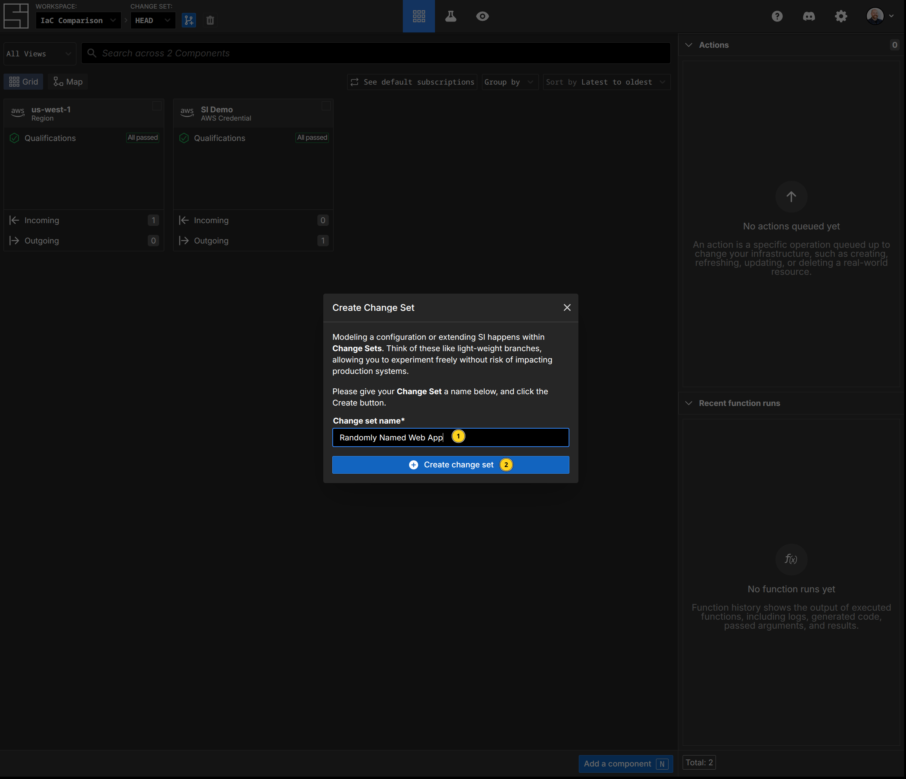

Second, add the Random Pet component to generate our random string by pressing `N`, typing 'Random Pet', and hitting enter. Then we name our component. Notice the 'id' field says "presidential_horse" - that's an *attribute function* populating that field. Notice that this is not opaque, like the Terraform variable reference is. This is a feature of *subscriptions* - you can easily inspect their values.

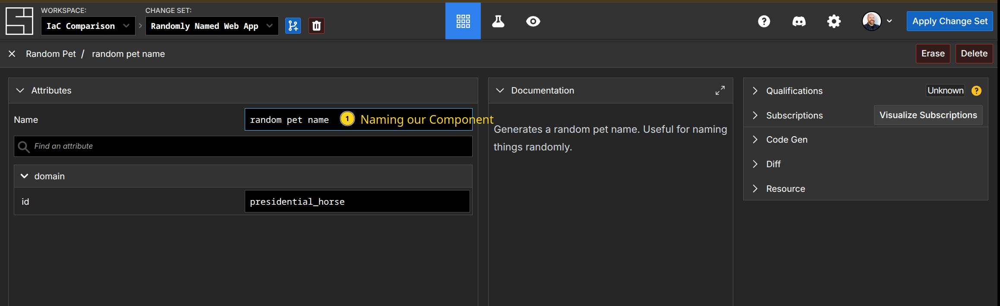

Third, create our AWS::EC2::Instance the same way, populating the fields appropriately. The Name tag becomes a *subscription* to our 'random pet name' component:

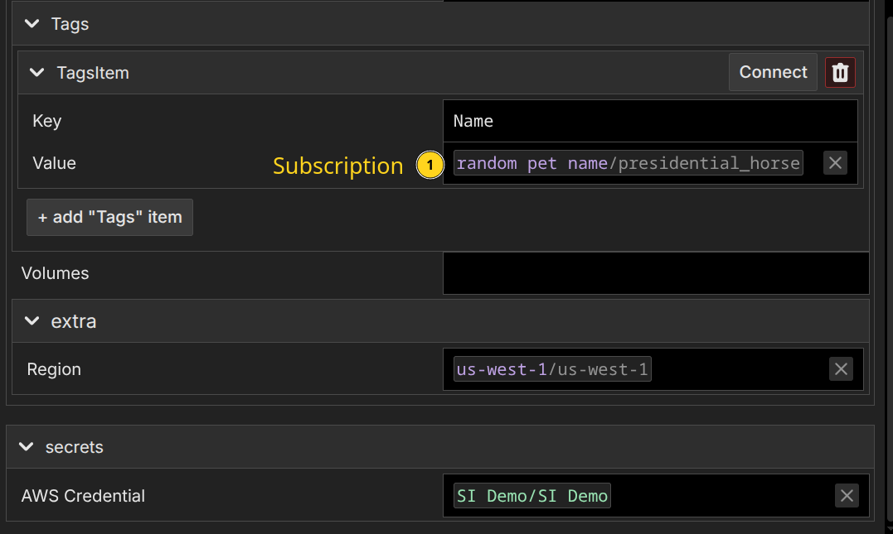

Again, notice that we see the value will be 'presidential_horse', directly inline.

When working directly in the Web Application, you get full completion of the fields, documentation, automatic recommendations for appropriate subscriptions, fast feedback on invalid configurations, and more. It's a great way to build when you know precisely what you want.
:::

What is important to understand about this is that all 3 ways work on the same underlying data model. This is the most fundamental difference between a resource declaration in Terraform and a component in System Initiative: in Terraform the declaration is static code; in System Initiative it is a dynamic data model. In System Initiative, you can then update your model any way you like. We can populate the model from the underlying provider, with no loss of fidelity (a task that would require careful importing of the underlying resource into your state file, and matching it to a declaration,) and with ease.


:::details Random Pet Component Source Code - Why Providers Aren't Necessary
The 'Random Pet' component did not exist when this page was written. We created it specifically for this tutorial in a few minutes. Here is the complete source code for it, as an illustration of why it's far more powerful to have a programmable schema and functions within the data model than separate providers.

:::code-group
```typescript [Schema Definition]
function main() {
  const asset = new AssetBuilder();

  const id = new PropBuilder()
        .setName("id")
        .setKind("string")
        .build();
  asset.addProp(id);

  return asset.build();
}
```

```typescript [Attribute Function]
import {
    uniqueNamesGenerator,
    Config,
    adjectives,
    colors,
    animals
} from 'npm:unique-names-generator';

async function main(input: Input): Promise<Output> {
    const customConfig: Config = {
        dictionaries: [adjectives, animals],
        separator: '_',
        length: 2,
    };

    const shortName: string = uniqueNamesGenerator(customConfig);

    return shortName;
}
```
The schema definition defines our *id* attribute, which is where we will hold the generated name.

We then attach an *attribute* function, which will set the value to whatever is returned, to that attribute.

When you create a Random Pet component, the attribute function will run by default, and populate the id field.

You can compare this to the [source code for the Random Pet provider](https://github.com/hashicorp/terraform-provider-random/blob/main/internal/provider/resource_pet.go) - which, while it supports more options, is illustritive of the difference between how extensible the platforms are. System Initiative's approach creates a more extensible, easy to follow way to build up automation, even if the provider never existed before.
:::

System Initiative's approach provides better clarity through rich schemas, multiple ways of creating and updating the model, and transparent variables through subscriptions. Being able to build up a component in what-ever way works, and then use it for your automation, is a fundamentally more powerful way of building automation than static declarations. As you move from basic infrastructure automation to the more complex day two operations, you'll be shocked at how much easier things are.

### Sensitive Variables

Terraform handles the need to use sensitive or secret information like usernames, passwords, API tokens, or Personally Identifiable Information (PII) through a feature called 'Sensitive Variables'. If you hard-code those values into your resource declarations, they will then appear not only in the plain text code, but also in the output of Terraform - in logs and console output in particular. To solve this problem, you mark variables as 'sensitive', and then use those variables in your code rather than the raw values. To inject the actual value, you store it in a separate *tfvars* file, or set environment variables, and pass them in when you plan or apply:

::: code-group
```terraform [variables.tf]
variable "db_username" {
  description = "Database administrator username"
  type        = string
  sensitive   = true
}

variable "db_password" {
  description = "Database administrator password"
  type        = string
  sensitive   = true
}
```

```terraform [main.tf]
resource "aws_db_instance" "database" {
  allocated_storage = 5
  engine            = "mysql"
  instance_class    = "db.t3.micro"
  username          = var.db_username
  password          = var.db_password

  db_subnet_group_name = aws_db_subnet_group.private.name

  skip_final_snapshot = true
}
```

```terraform [secret.tfvars]
db_username = "admin"
db_password = "insecurepassword"
```
:::

Once this is done, the sensitive secrets will be redacted from Terraforms output. Importantly, they will *not* be redacted from state files or plan files - both of which are frequently stored and referenced. The issue with this approach is that Terraform deals only with *redacting* sensitive values. Because the secret data itself needs to be injected into the declaration in order for it to be used, they don't really have an alternative. To make matters worse, it means that if your state data or a plan is compromised, all of the secrets used in your infrastructure will be leaked - there is no protection by default. Regardless of how you solve those problems, it is still up to you to determine how to securely store and inject your secret values into Terraform.

:::info
The OpenTofu project, which is an open-source fork of Terraform, supports [state and plan encryption](https://opentofu.org/docs/language/state/encryption/). This will provide [encryption at rest](https://en.wikipedia.org/wiki/Data_at_rest) for state and plan files.

The HCP Terraform commercial offering also encrypts state at rest.

You can also use [AWS Server-Side Encryption](https://docs.aws.amazon.com/AmazonS3/latest/userguide/UsingServerSideEncryption.html) when storing state in an S3 bucket to get encryption at rest.

Terraform also allows you to define 'ephemeral' resources and variables, which are never stored in state or plan files.

You may be wondering about [HashiCorp Vault](https://registry.terraform.io/providers/hashicorp/vault/latest/docs). Vault is integrated with Terraform through the 'Vault Provider', which exposes resources that you can use to consume secret data as attributes. The same underlying challenges apply - this solves the problem of connecting to vault, getting the data from secure storage, and then injecting it as a variable - but the variables themselves are no different than when they were injected through tfvars or credentials.
:::

System Initiative provides secrets as a first class part of the data model. They are defined as an *asset*, with a *schema* that sets the shape of the secret data that needs to be stored, and an *authentication* function that handles configuring the execution environment for when a secret is needed. When you want to pass a secret value into System Initiative, you create a new component, then set the values. They are encrypted first by your browser, using the public half of a workspace level [Ed25519 public keypair](https://en.wikipedia.org/wiki/EdDSA). This keypair is itself encrypted at rest with a cluster level key-pair inside our infrastructure (this ensures that, in the event of data compromise, your keys cannot be read without externally stored key material.) Then our database itself is encrypted at rest by [AWS](https://docs.aws.amazon.com/AmazonRDS/latest/UserGuide/Overview.Encryption.html). The data is then sent to System Initiative over HTTPS. This model ensures that your secrets are not transmitted across the wire unencrypted, even when you set them, and are encrypted at rest (even if the database was to be dumped in plain text.)

Here is the full source code for our AWS Credential asset as an example of how easy it is to build even a complex secret:

:::code-group
```typescript [AWS Credential Schema]
function main() {
    const awsCredential = new SecretDefinitionBuilder()
        .setName("AWS Credential")
        .addProp(
            new PropBuilder()
            .setName("SessionToken")
            .setKind("string")
            .setWidget(
                new PropWidgetDefinitionBuilder()
                .setKind("password")
                .build()
            ).build())
        .addProp(
            new PropBuilder()
            .setName("AccessKeyId")
            .setKind("string")
            .setWidget(
                new PropWidgetDefinitionBuilder()
                .setKind("password")
                .build()
            ).build())
        .addProp(
            new PropBuilder()
            .setName("SecretAccessKey")
            .setKind("string")
            .setWidget(
                new PropWidgetDefinitionBuilder()
                .setKind("password")
                .build()
            ).build())
        .addProp(
            new PropBuilder()
            .setName("AssumeRole")
            .setKind("string")
            .setWidget(
                new PropWidgetDefinitionBuilder()
                .setKind("text")
                .build()
            ).build())
        .addProp(
            new PropBuilder()
            .setName("Endpoint")
            .setKind("string")
            .setWidget(
                new PropWidgetDefinitionBuilder()
                .setKind("text")
                .build()
            ).build())
        .build();
    return new AssetBuilder()
        .defineSecret(awsCredential)
        .build()
}
```

```typescript [AWS Credential Authentication Function]
async function main(secret: Input): Promise < Output > {
    // assume role and set returned creds as env var
    if (secret.AssumeRole) {
        if (secret.AccessKeyId as string || secret.SecretAccessKey as string) {
            var child = await siExec.waitUntilEnd("aws", [
                "configure",
                "set",
                "aws_access_key_id",
                secret.AccessKeyId as string
            ]);

            child = await siExec.waitUntilEnd("aws", [
                "configure",
                "set",
                "aws_secret_access_key",
                secret.SecretAccesskey as string
            ]);

            child = await siExec.waitUntilEnd("aws", [
                "sts",
                "assume-role",
                "--role-arn",
                secret.AssumeRole as string,
                "--role-session-name",
                `SI_AWS_ACCESS_${secret.WorkspaceToken}`,
                "--external-id",
                secret.WorkspaceToken as string
            ]);
        } else {
            var child = await siExec.waitUntilEnd("aws", [
                "sts",
                "assume-role",
                "--role-arn",
                secret.AssumeRole as string,
                "--role-session-name",
                `SI_AWS_ACCESS_${secret.WorkspaceToken}`,
                "--external-id",
                secret.WorkspaceToken as string,
                "--profile",
                "si-access-prod"
            ]);
        }

        if (child.exitCode !== 0) {
            console.error(child.stderr);
            return;
        }

        const creds = JSON.parse(child.stdout).Credentials;

        requestStorage.setEnv("AWS_ACCESS_KEY_ID", creds.AccessKeyId);
        requestStorage.setEnv("AWS_SECRET_ACCESS_KEY", creds.SecretAccessKey);
        requestStorage.setEnv("AWS_SESSION_TOKEN", creds.SessionToken);

    } else {
        requestStorage.setEnv("AWS_ACCESS_KEY_ID", secret.AccessKeyId);
        requestStorage.setEnv("AWS_SECRET_ACCESS_KEY", secret.SecretAccessKey);
        if (secret.SessionToken) {
            requestStorage.setEnv("AWS_SESSION_TOKEN", secret.SessionToken);
        }
    }

    if (secret.Endpoint) {
        requestStorage.setEnv("AWS_ENDPOINT_URL", secret.Endpoint);
    }
}
```
:::

When you need to reference a secret from another component (for example, all of our AWS assets need an AWS Credential in order to perform operations with AWS), you use a *secret subscription*. Rather than dynamically passing their underlying values like a regular subscription, secret subscriptions trigger the *authentication* function to run before any functionality that requires the secret. When those functions execute, we decrypt your secret, pass it into the secure micro-vm that is running the function, and then run the authentication function, which can set up the data necessary for the final behavior that needs the secret data. We then track the secrets that were used across every function invocation, and redact any occurrence of the secret value from our logs, function output, etc. We do not allow secret values to be consumed by regular attributes - so you cannot leak them by subscribing to the value itself. They must be consumed *by the underlying functions*.

This is a place where our fundamental design truly shines. We not only redact your secret information, but we make sure it is stored safely *end to end* - from the moment you give us the secret material to the moment its used in a function. We prevent you from accidental leakage, provide defense in-depth, and allow you to define and consume your own secret components just like any other asset in System Initiative. Everything is redacted, we go out of our way to ensure you cannot leak the data, and you cannot consume it as a plain text value subscription. System Initiative is secure by default.

### Data Sources

Data Sources in Terraform allow you to dynamically fetch data from APIs or other Terraform state backends, so that you can reference those values in resource attributes. They're used to make your configuration more dynamic, and to feed external information through to your resource declarations.

Data sources are used similarly to resource declarations - you provide arguments that then produce attributes for you to consume:

```terraform [main.tf]
data "aws_ami" "amazon_linux" {
  most_recent = true
  owners      = ["amazon"]

  filter {
    name   = "name"
    values = ["amzn2-ami-hvm-*-x86_64-gp2"]
  }
}

resource "aws_instance" "app" {
  count = var.instances_per_subnet * length(data.terraform_remote_state.vpc.outputs.private_subnet_ids)

  ami = data.aws_ami.amazon_linux.id
}
```

The role of Data Sources for fetching data from external APIs in System Initiative is filled through creating components whose attributes are populated dynamically, and whose resulting values are subscribed to in the consuming component. First for the AMI lookup:

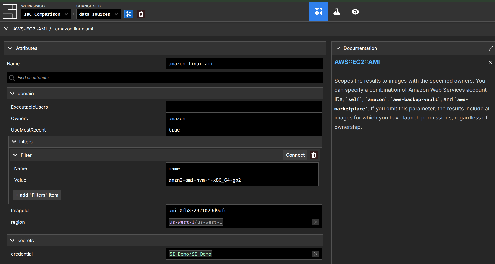

Then consuming it in an AWS::EC2::Instance:

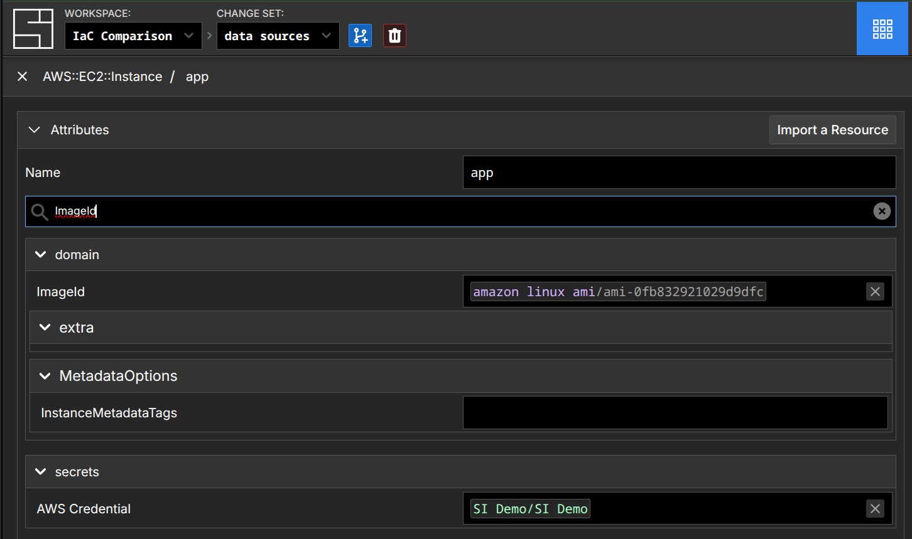

This approach highlights the programability of System Initiative's underlying model. Rather than needing to switch to another language (go, in this case), write the data source in a provider, then ship that provider - you re-use your existing expertise about the underlying platform that has the data you need, your pre-existing knowledge of how to write *schema* and *attribute functions*, and build the component that fetches the data you need.

:::tip
Functions in System Initiative are written in TypeScript using the [Deno](https://deno.com/) runtime. Your functions can use dependencies from the entire NPM, JSR, and GitHub ecosystems, and TypeScript is one of the most supported languages in the world. If you need a library for something, it probably exists.

If you aren't familiar with TypeScript - no problem. You can also ask the AI Agent to write the schema and function for you, and assist in troubleshooting any issues you might encounter. Alternatively, you can always fetch code from external sources and execute it directly within the micro-vm that executes functions. System Initiative will flex to meet you where you are.
:::

There is no analog of fetching data from "other Terraform state backends" in System Initiative. Our underlying data model, granular action execution, and integrated authorization means that there is far less reason to break up repositories according to things like rate of change, blast radius, or performance. In cases where you might need the same resource in two workspaces, you can import it in both.

:::info
This is an area of active exploration with System Initiative. We think there might be real value in having 'read only' replicas of components across workspaces without having to configure authorization rules. If you have thoughts, we'd love to hear them!
:::

### Modules

Terraform modules are used to organize configuration in a repository, encapsulate configurations into higher level abstractions, enable re-use of a configuration, and provide consistency through that abstraction. Technically, every Terraform configuration is in a module - the 'top' of your repository is considered the 'root module'. You can have modules that are local, which are defined in your repository; or remote, where they are coming from sources like the Terraform Registry. They are a fundamental element of designing your Terraform workflow.

Modules are invoked with a syntax that is similar to a resource declaration, with their arguments specified as *input variables*, and their attributes specified as *output values*:

:::code-group

```terraform [main.tf]
module "vpc" {
  source  = "terraform-aws-modules/vpc/aws"
  version = "3.18.1"

  name = var.vpc_name
  cidr = var.vpc_cidr

  azs             = var.vpc_azs
  private_subnets = var.vpc_private_subnets
  public_subnets  = var.vpc_public_subnets

  enable_nat_gateway = var.vpc_enable_nat_gateway

  tags = var.vpc_tags
}
```

```terraform [variables.tf]
variable "vpc_name" {
  description = "Name of VPC"
  type        = string
  default     = "example-vpc"
}

variable "vpc_cidr" {
  description = "CIDR block for VPC"
  type        = string
  default     = "10.0.0.0/16"
}

variable "vpc_azs" {
  description = "Availability zones for VPC"
  type        = list(string)
  default     = ["us-west-2a", "us-west-2b", "us-west-2c"]
}

variable "vpc_private_subnets" {
  description = "Private subnets for VPC"
  type        = list(string)
  default     = ["10.0.1.0/24", "10.0.2.0/24"]
}

variable "vpc_public_subnets" {
  description = "Public subnets for VPC"
  type        = list(string)
  default     = ["10.0.101.0/24", "10.0.102.0/24"]
}

variable "vpc_enable_nat_gateway" {
  description = "Enable NAT gateway for VPC"
  type        = bool
  default     = true
}

variable "vpc_tags" {
  description = "Tags to apply to resources created by VPC module"
  type        = map(string)
  default = {
    Terraform   = "true"
    Environment = "dev"
  }
}
```

```terraform [outputs.tf]
output "vpc_public_subnets" {
  description = "IDs of the VPC's public subnets"
  value       = module.vpc.public_subnets
}

output "ec2_instance_public_ips" {
  description = "Public IP addresses of EC2 instances"
  value       = module.ec2_instances[*].public_ip
}
```
:::

Modules are effectively "black box" abstractions - you specify the input variables, use that to dynamically create resources within the module, and then expose the specific output data you need for other modules to consume. When the modules are local (defined by you or your team), this can be fine - you are in control of the inputs and outputs. When using community modules, it can be a source of pain if the community module doesn't expose an input you need to specify or an output you need to consume, as you will be stuck either keeping a local copy of the community module with your edits, trying to merge a change upstream, or refactoring your own code to meet the modules requirements.

This design leads to the 200% rule of automation abstractions: any sufficiently generic abstraction over an infrastructure concept will grow to encompass all of the functionality it abstracts, but with a slightly different syntax. A practical example here is the (honestly amazing) [AWS VPC Terraform module](https://registry.terraform.io/modules/terraform-aws-modules/vpc/aws/latest) - it has [236 inputs](https://registry.terraform.io/modules/terraform-aws-modules/vpc/aws/latest?tab=inputs) and [119 outputs](https://registry.terraform.io/modules/terraform-aws-modules/vpc/aws/latest?tab=outputs), and might create [82 different types of resources](https://registry.terraform.io/modules/terraform-aws-modules/vpc/aws/latest?tab=resources). It's hard to imagine a module that does a better job of abstracting over the complexities of AWS networking. But as a consumer of this module, I get stuck in a trap: an 'easy' default configuration is easy, but to make a complex environment I need to understand both the underlying resources I need and how this module abstracts their configuration through variables in order to produce the desired output.

Another issue to contend with is how this module composes with other resource declarations. Each resource within the module exposes its own attributes, but to access those attributes outside the module, they need to be exposed as output variables. In order to understand which attribute you should use, you again likely need to map from your own knowledge of the underlying resources to the module design. If the output has not been specified by the module author, you'll need to either fork it (and now own it), wait for an upstream change, or somehow work around the issue (usually be duplicating data, hard coding it, etc.)

System Initiative solves these problems by leveraging our core programmable [data model](./architecture/engine.md) to solve for the use cases of modules without introducing their complexity, or the 200% problem. We do this by creating specific patterns that address each of the value propositions of modules in the first place.

Organizing configuration happens *logically*, on top of the underlying data, through *views* of the data. This allows you to create semantically relevant perspectives within a workspace - for example, 'Network Layer', 'Application', or 'Database'. When full isolation is necessary, *workspaces* can be used to provide it, even across the same information if necessary. Rather than forcing you to use modules and on-disk structure, you start by importing all the data, and then slice it into the perspectives that make sense for your organization. How or where a component is defined has no bearing on how the resulting information is organized. This makes it much easier to evolve the organization over time - you aren't stuck with the choices you made because of how things were encapsulated or laid out on disk.

:::tip
This is another place where the database analogy can be helpful. You might have your data laid out in one way, and then create a "view" across that data to ease querying or optimize performance. The same is true in System Initiative! Organization is decoupled from how the resources are defined.
:::

Encapsulating configuration into higher level abstractions or enabling re-use is done by creating new *template components*, and embracing an iterative approach to complexity. To use the AWS VPC concept as an example, we have an 'AWS VPC Template' component. The attributes of that component are defined by it's schema, and are similar to specifying your input variables for a module - they are things like the initial CidrBlock, Tenancy, Number of Availability Zones, etc. The schema includes more than simply variable names and basic types - embedded documentation, validation, how to render the field in the UI, all are a part of the definition. We then have a *management function* defined for the component, which is a function that can create, update, or delete components, views, and more programatically. This function takes as one of its inputs the attributes of the component, and returns the infrastructure you want to configure. Here's a small sample:

:::code-group
```typescript [Schema Definition]
function main() {
    const asset = new AssetBuilder();

    const vpcNameProp = new PropBuilder()
        .setName("VPC Name")
        .setKind("string")
        .setDefaultValue("example-vpc-name")
        .setWidget(new PropWidgetDefinitionBuilder().setKind("text").build())
        .setValidationFormat(Joi.string().required())
        .setDocumentation("The name of your VPC. This name will prepend all component names and can be used to identify related resources.")
        .build();
    asset.addProp(vpcNameProp);

    const vpcIpv4StartingAddressProp = new PropBuilder()
        .setName("CidrBlock")
        .setKind("string")
        .setDefaultValue("10.0.0.0/16")
        .setValidationFormat(
            Joi.string()
            .required()
            .regex(/^\d{1,3}\.\d{1,3}\.0\.0(\/\d{1,2})?$/)
            .message("IP address must end in .0.0; example: 10.0.0.0 or 10.0.0.0/16")
        ).setDocumentation(
            "The IPv4 network range for the VPC, in CIDR notation. For example, 10.0.0.0/16. The value will automatically prepend /16 if no /n is provided."
        )
        .build();
    asset.addProp(vpcIpv4StartingAddressProp);

    // In practice, there are many more definitions!

    return asset.build();
}
```

```typescript [Management Function]
async function main({ thisComponent }: Input): Promise<Output> {
    const vars = thisComponent.properties.domain;
    const create: Output["ops"]["create"] = {};
    const vpcComponent: Output["ops"]["create"][string] = {
        kind: "AWS::EC2::VPC",
        attributes: {
            "/si/name": vars["VPC Name"],
            "/secrets/AWS Credential":
               template.sourceOrValue("/secrets/AWS Credential", thisComponent),
            "/domain/extra/Region":
               template.sourceOrValue("/domain/extra/Region", thisComponent),
            "/domain/CidrBlock": vars["CidrBlock"],
            "/domain/EnableDnsHostnames": vars["EnableDnsHostnames"],
            "/domain/EnableDnsSupport": vars["EnableDnsSupport"],
            "/domain/Tags/0/Key": "Name",
            "/domain/Tags/0/Value": vars["VPC Name"],
        },
    };
    create[vpcComponent.attributes["/si/name"]] = vpcComponent;

    // In practice, many more declarations, logic, and library calls.

    return {
        status: "ok",
        ops: {
            create,
        }
    }
}
```
:::

The resulting full component looks like this in our web application:

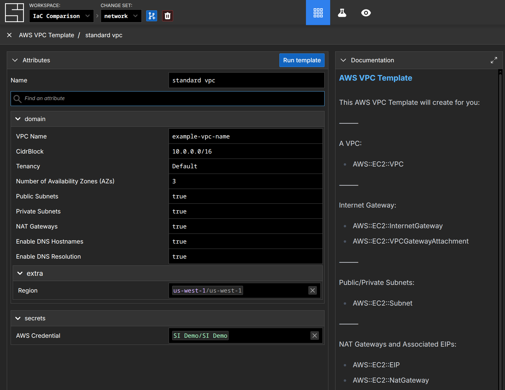

When the template is run, the components defined in the management function will be created in the workspace. The clever amongst you will be considering that our Standard VPC Template is quite a bit smaller than the example we gave for Terraform - and that's a feature, not a bug. In System Initiative, you build templates that handle the *most common* repeatable cases - because the template itself expands into components within the workspace. They are fully present - they are not hidden behind a "black box". Rather than forcing those details up into an ever more complex component (and thus re-creating the 200% problem!), users *iterate* on the output of the template to adapt it to their circumstances.

As an example, the AWS VPC Terraform Module supports configuring [Amazon Redshift Subnet Groups](https://docs.aws.amazon.com/redshift/latest/mgmt/working-with-cluster-subnet-groups.html). This functionality exists within the AWS VPC Terraform Module because declaring those resources from outside the module require too much knowledge of the outputs of the module. To fully understand how this functionality works in the module, you will need to have deep understanding of the module, Redshift, and AWS networking.

With System Initiative, the two would be treated as *separate things* - which they are within AWS. You could create the VPC and Subnets first, then add them to a Redshift Subnet Group. Or you could create them all at once. Either way, the most likely thing a user would do is use our AI Agent with a prompt like this:

```prompt [Create a Redshift Subnet Group]
> Create a VPC with two availability zones using the AWS VPC Template. Then
  make the resulting subnets available to Redshift.

 ● Perfect! The VPC template has created all the necessary infrastructure across
   two availability zones. I can see:

   - VPC (redshift-vpc-vpc)
   - 2 Public Subnets (redshift-vpc-subnet-pub-1, redshift-vpc-subnet-pub-2)
   - 2 Private Subnets (redshift-vpc-subnet-priv-1, redshift-vpc-subnet-priv-2)
   - Internet Gateway and attachment
   - 2 NAT Gateways with EIPs
   - Route tables and associations

   Now I need to configure the subnets for Redshift availability. For Redshift,
   we need to create a DB Subnet Group that includes the private subnets from
   both availability zones.
 ● Now let me create a Redshift ClusterSubnetGroup that includes the private
   subnets from both AZs. First, let me get the details of the private subnets
   to create subscriptions
 ● system-initiative - component-get (MCP)(changeSetId: "01K61GCZ0GCHTQ78T4NY7JKPRA",
   componentId: "01K61GFB5MF1MBFAM6K1679HG2")
 ● system-initiative - component-get (MCP)(changeSetId: "01K61GCZ0GCHTQ78T4NY7JKPRA",
   componentId: "01K61GFBB9557S5981236AA443")
 ● Perfect! Now I can create the Redshift ClusterSubnetGroup using subscriptions to both private subnets:
 ● Excellent! The Redshift subnet group has been created.
```

Zooming in on just the configuration for the `AWS::Redshift::ClusterSubnetGroup`:


By having templates *expand*, rather than be black boxes like a module, we can avoid the problems of having to specify every input and output. If the template doesn't have every option, that's fine - you can iterate on the results to get the right outcome. We also avoid the 200% problem - we make the focus on enabling the right thing for the common use cases, and let the any specific complexity get resolved with iteration.

If this is a task that happens regularly (for example, you deploy Redshift clusters into new VPCs on demand), you would automate it by creating a new component like 'Redshift Cluster'. You would do that by telling System Initiative to create a template based on a sample, working Redshift deployment. Create the schema that defines the variables, customize the function, and then call that template on demand. You can do these tasks through the Web Application, or let the AI Agent do them for you and review the results.

:::tip
Our approach to modules reflects one of the fundamental differences between IaC and System Initiative: that you can iterate easily toward working infrastructure, and *then* automate what you need. Combine doing things manually through the web interface, writing code with the public API, or using our AI Agent - it's all just a means to an end, and no matter how you got there, you can easily repeat it, audit it, and evolve it. It's radically simpler and more effective.
:::

### Count and For Each

Meta-Arguments like *count* and *for each* allow you to replicate resources a given number of times. Both are good examples of the difficulty that comes from expressing complex configuration in static declarations.

In the case of count, it makes an identical (or nearly identical) copy of a resource declaration. It's also frequently used to decide if a resource should exist or not (by setting count to zero, even if the resource is declared). Here's an example:

:::code-group
```terraform [main.tf]
resource "aws_instance" "app" {
  depends_on = [module.vpc]

  count = var.instances_per_subnet * length(module.vpc.private_subnets)

  ami           = data.aws_ami.amazon_linux.id
  instance_type = var.instance_type

  subnet_id              = module.vpc.private_subnets[count.index % length(module.vpc.private_subnets)]
  vpc_security_group_ids = [module.app_security_group.this_security_group_id]

  ## ...
}
```

```terraform [variables.tf]
variable "instances_per_subnet" {
  description = "Number of EC2 instances in each private subnet"
  type        = number
  default     = 2
}
```
:::

In this example, the total number of EC2 Instances that will be deployed is equal to the total number of private subnets multiplied by the `instances_per_subnet` variable. Which subnet a given instance is configured for will be decided by the 'modulo' (the remainder after division) of the total number of subnets. The goal here is to have an even distribution of instances per subnet. While this code works, it's a good example of the kind of complexity inherent in writing HCL - as your needs grow more complex, the language itself can be a barrier for people.

With For Each, things tend to get even more complex:

:::code-group
```terraform [main.tf]
module "vpc" {
  source  = "terraform-aws-modules/vpc/aws"
  version = "3.14.2"

  for_each = var.project

  cidr = var.vpc_cidr_block

  azs             = data.aws_availability_zones.available.names
  private_subnets = slice(var.private_subnet_cidr_blocks, 0, each.value.private_subnets_per_vpc)
  public_subnets  = slice(var.public_subnet_cidr_blocks, 0, each.value.public_subnets_per_vpc)
  #...
}

module "app_security_group" {
  source  = "terraform-aws-modules/security-group/aws//modules/web"
  version = "4.9.0"

  for_each = var.project

  name        = "web-server-sg-${each.key}-${each.value.environment}"
  description = "Security group for web-servers with HTTP ports open within VPC"
  vpc_id      = module.vpc[each.key].vpc_id

  ingress_cidr_blocks = module.vpc[each.key].public_subnets_cidr_blocks
}
```

```terraform [variables.tf]
variable "project" {
  description = "Map of project names to configuration."
  type        = map(any)

  default = {
    client-webapp = {
      public_subnets_per_vpc  = 2,
      private_subnets_per_vpc = 2,
      instances_per_subnet    = 2,
      instance_type           = "t2.micro",
      environment             = "dev"
    },
    internal-webapp = {
      public_subnets_per_vpc  = 1,
      private_subnets_per_vpc = 1,
      instances_per_subnet    = 2,
      instance_type           = "t2.nano",
      environment             = "test"
    }
  }
}
```
:::

In this example, a 'project' variable is defined, with names for each project and settings for each. Then the "vpc" and "app_security_group" modules are called, once for each entry in the project variable. Functions like `slice` and `each_key` are used to extract data from the underlying data structure, and configure the attributes of the module. While this syntax can be effective for DRY-ing up a configuration, it is also very difficult to understand without quite a bit of context - you can't tell at a glance how many VPCs or Security groups will be created, nor what a particular attribute will resolve to at a glance. They may be effective in reducing lines of code, but they have a drastic downside in the ability to reason about the underlying infrastructure.

System Initiative solves this problem in two different ways, depending on what you're trying to accomplish. In the case where you want '2 instances in each private subnet', you make the change with an AI agent:

```prompt [2 instances per private subnet]
> Make sure there are 2 ec2 instances named 'app' in each private subnet.
  ● Perfect! I have successfully created 6 EC2 instances named 'app' in
    the count changeset:

    Private Subnet 1:
    - app-1 (ID: 01K6418Q4PN78AT3PC88R21FWR)
    - app-2 (ID: 01K6418XJY54KBDTVETX1VEMW9)

    Private Subnet 2:
    - app-3 (ID: 01K641948798H8YN8VNRS0TP2R)
    - app-4 (ID: 01K64199SG7HT6P4QDB3JJ6V73)

    Private Subnet 3:
    - app-5 (ID: 01K6419GEGHMZCZFPF98AQXWJX)
    - app-6 (ID: 01K6419P50Z5N4R8P6AWTWQRD3)

    Each instance is configured with:
    - AMI: ami-0c02fb55956c7d316 (Amazon Linux 2)
    - Instance Type: t3.micro
    - Proper subnet subscription to their respective private subnet
    - Region subscription to us-west-1
    - AWS Credential subscription to the SI Demo credential

    The count changeset now has exactly 2 EC2 instances named 'app' in
    each private subnet as requested.
```

In this example, there were no app servers in the subnets to begin with, so it created them all. Here's the response if we removed app-1 and app-5 (and therefore need to add an instance to Subnet 1 and Subnet 3):

```prompt [Add two instances]
> Make sure there are 2 ec2 instances named 'app' in each private subnet
  ● Done! I've created 2 additional EC2 instances:
    - app-1 in Private Subnet 1
    - app-5 in Private Subnet 3

    Now each private subnet has 2 'app' instances:
    - Private Subnet 1: app-1, app-2
    - Private Subnet 2: app-3, app-4
    - Private Subnet 3: app-5, app-6
```

There are several advantages with this approach: clarity, simplicity, and flexibility. It's more clear because, regardless of the starting state of the infrastructure, the change set will show you precisely what needs to be done. In Terraform, you're going to have to map that mentally, or rely on plan output. It's simpler because you can express your intent in many different ways to get to the end result. This is particularly true when you have teams working on your Terraform code - all of your team members can likely type "make sure there are 2 ec2 instances in each private subnet" - but how many can write the correct declaration, especially as the complexity in the repository increases? Finally, it's more flexible - because each individual instance is itself directly configurable, if you need to have more variation (for example, mixes of CPU, Memory, or Disk configuration) it's straightforward to do.

The other way we help solve this problem is by separating out the *intent* behind a change, and if it's a common change that needs to be made regularly, doing so with a *template* component instead. This would be the equivalent of the for each example above. You would create a working baseline, turn that into a template, and then use that to create the underlying infrastructure.

This approach is also useful for *day two* operations - for example, regularly 'scaling up' a complex application.You would create a *management component*, which can then encapsulate the details of the underlying transformation. For example, 'Scale Up' or 'Scale Down' can be implemented as a management function that makes the required changes to the underlying infrastructure model (perhaps changing an existing component, or creating new ones, or a mix of both.)

System Initiative's approach is to leverage the underlying clarity and programability of the data model to solve the use cases without introducing the cognitive overhead of 'count' and 'for each'.

### State

Terraform stores information about your infrastructure in *state files*. State serves several purposes in Terraform:

- Mapping resources to their real world counterparts
- Storing metadata, such as resource dependencies
- As a cache of attribute values for resources, to improve performance
- Synchronizing change across multiple members of a team

State is tracked by default in the same working directory where Terraform is run. Typically, a 'remote state' solution will be introduced that makes for easier delegation of authority across teams and locking to ensure things do not conflict. Possible solutions here range from an S3 Bucket with a DynamoDB locking table to HCP Terraform or other cloud offerings integrated state management solution.

Regardless of how you choose to store state, there are several issues with the approach: it is single threaded, it is prone to drift, refactoring is dangerous, it gets slower at scale, and partial applications can corrupt state.

There is always a lock around any state transitions, ensuring that only one batch of change can happen at a time. This causes real problems with the pace of change inside an infrastructure. For example, if a regularly scheduled deployment is being performed with Terraform, while simultaneously some unrelated work needs to happen, if they are being tracked in the same state file the unrelated work will *block*. This leads to a design where Terraform repositories are broken down into smaller pieces, not because the relationships dictate it should be so, but to eliminate these risky bottlenecks.

With state files, any changes that happen outside of Terraform are considered *resource drift*. A classic example of drift would be an AWS EC2 instance having a tag added to it from the AWS Console. Drift gets dealt with through `terraform (plan|apply) -refresh-only` to update the changed resource, and with a separate update to your local configuration to bring the resource declaration inline with the changed resource. If the change was new relationships or configuration, you'll need to use careful application of `terraform import` to ensure your new declaration gets assigned to the previously created infrastructure. In Terraform, drift is only ever solved in one direction - by having the declared code be the 'source of truth'.

When working with Terraform code, you must be aware of the execution and statefile boundaries. This becomes a problem in particular as you spread your code across multiple repositories, frequently to deal with issues of speed or safety. If you have a declaration present in one spot, and move across that boundary, the state will be lost - in the worst case, it can lead to accidental deletion of the working cloud resource. This is mitigated with commands like `terraform state mv`, but often requires deep knowledge both of Terraform internals, your repository layouts, and the code in question.

Terraform `plan` or `apply` must evaluate all resources that appear in the state file. In a large repository, this can take a significant amount of time - frequently more time to update and evaluate state than the actual application of the final changes themselves. This leads to an unnatural partitioning of resources, not because it makes logical sense, but because the evaluation and synchronization timing has become untenable.

Finally, a Terraform `apply` that is interrupted can lead to corrupted or missing state files. You may wind up with resources that are not tracked, and then need to be manually reconciled or imported. You'll frequently be forced to use external tools to determine what state has been applied, then determine how to synchronize the results. This can happen for reasons outside of your control - for example, a cloud provider API going down, etc. These are high stress and high risk moments.

System Initiative resolves these issues by eliminating the need for a state file entirely. Our underlying [data model](./architecture/snapshot.md) is an immutable DAG that has versioning and copy-on-write built in, which means that as changes are made to the data model (for example, adding a resource, or updating an attribute) we track that change explicitly. On top of this we use 1:1 digital twins, where the *component* represents the change you would like to make, and the *resource* represents the true state in the underlying cloud provider. This structure allows us to avoid all the problems inherent with statefiles:

- We eliminate the need for a lock file by keeping track of the *transitions* to the data model as [operational transforms](https://en.wikipedia.org/wiki/Operational_transformation). Multiple people can collaborate in real-time on a change set, or multiple change sets, and apply them at any time. The underlying data structure sorts out the details.
- Drift is no longer an issue that requires 'state file surgery'. Instead, System Initiative updates the *resource* side of the digital twin, and you can then decide to use that to update the underlying *component* - or take action to restore the *resource* to another condition. System Initiative does not care about the source of changes - it cares only that you have working infrastructure and an accurate record.
- There is no need to refactor anything, as System Initiative is a programmable data platform. If you need to create a new logical separation, you can create as many views of the information as you need. If you need a resource to appear in a different *workspace*, you can do that through discovering the resource and 'erasing' it in the other (erase is an operation to remove a resource without impacting the underlying cloud resource).
- Our integrated change sets mean that we only need to evaluate precisely what has changed, through comparing your change set with the current 'HEAD' change set (our record of production intent.) Change Sets always calculate their 'plan' - there is no separate planning phase. Similarly, when it comes time to apply, System Initiative executes the actions required to transition the infrastructure, but does not need to evaluate anything else. If you have open change sets, and a change gets applied, we automatically update each open change set - ensuring that nothing ever gets out of date (no 'stale' plans or applies).
- System Initiative tracks your *intent* to mutate the external cloud provider, rather than the entire *run* all at once. The result is that if an API call fails, or if things are interrupted, that intent continues to be tracked. You can retry the actions at a later date, or fix your configuration, and pick up right where you left off. Our low level dependency tracking means that if you have dependent actions, those actions will be 'paused' until all their pre-requisites are met.

:::tip
System Initiative keeps track of all of the underlying information exposed by the cloud provider. For example, the id's that are created, resource pointers, etc. That information can be refreshed at any time, and can be subscribed to like any other attribute. It can also be searched, mapped, and extracted over our public API.

Therefore you can easily see the difference between the real world resources and the component in any particular change set.
:::

System Initiative's underlying data model is fundamentally more powerful than Terraforms approach to state files. It provides clear visibility into your intent, keeps track of both the real configuration and your desired configuration, makes drift a decision point rather than an occasion for state file surgery, paralleizes actions to ensure no slow-downs at scale, and is resilient to intermittent failure.

### Initialize

Initializing a Terraform workspace installs all the providers and modules necessary for your configuration, and configures your state backend. It will then update a 'lock file', tracking all the versions of providers for the provider selections. When you make changes to module or provider versions, you run the init process again with the '-upgrade' flag to update the cached versions of the modules.

As we described above in the 'Providers' and 'Modules' sections, System Initiative eliminates the need for this step in the process entirely. Each model in your workspace is attached to a specific *schema version*, which defines its behavior. As new versions are released, you can upgrade your configuration as needed - you can have multiple versions of a schema in the same workspace (facilitating easy step-wise migration, or testing of new functionality.) In Terraform, a provider is always repository wide - in System Initiative, you can upgrade individual components.

:::tip
The data model in System Initiative also helps with things like upgrading resources. Lets say your cloud provider builds a brand new API, but it changes the shape of how it thinks about the underlying configuration data. In System Initiative, that would become a new 'schema', which would import the same *data* as your pre-existing component that used the old API. You could then *erase* the old version, and you would have successfully migrated to the new API.
:::

### Plan

The *plan* phase in Terraform allows you to preview the changes that Terraform will make before you make them. This plan contains the changes that will create, update, or delete resources. These execution plans are static at the point in time they were ran. These plans can then be reviewed, our submitted directly to an `apply`.

Plans in Terraform are not guaranteed to be 1:1 to the behavior you will receive on `apply`. This is particularly true in a busy Terraform repository with multiple open branches or pull requests, each with their own 'plan' of how things will change. As each pull request is merged, the other pull requests plans will become out of date. Similarly, re-using a plan for a subsequent apply can be risky, as the state may have changed. If you want to do deeper analysis of the changes in a plan, the documented pattern is converting the plan to a JSON file and inspecting the data with tools such as [jq](https://jqlang.org/).

```shell [terraform jq]
jq '.resource_changes[] | select( .address == "module.ec2-instance.aws_instance.main")' tfplan.json
{
  "address": "module.ec2-instance.aws_instance.main",
  "module_address": "module.ec2-instance",
  "mode": "managed",
  "type": "aws_instance",
  "name": "main",
  "provider_name": "registry.terraform.io/hashicorp/aws",
  "change": {
    "actions": [
      "create"
    ],
    "before": null,
    "after": {
      "ami": "ami-055744c75048d8296",
      "credit_specification": [],
      "get_password_data": false,
      "hibernation": null,
      "instance_type": "t2.micro",
      "launch_template": [],
      "source_dest_check": true,
      "timeouts": null,
      "user_data_replace_on_change": false,
      "volume_tags": null
    },
    "after_unknown": {
      "arn": true,
      "associate_public_ip_address": true,
      "availability_zone": true,
## ...
    }
  }
}
```

This approach is required because the plan data itself is static data, that reflects point in time knowledge about your proposed changes and the underlying infrastructure. It's not a reactive data model - it's a static JSON file.

In System Initiative, there is no separate 'plan' phase. Instead, all work is performed in a [simulated change set](./architecture/change-control.md), which tracks your *intent* to make a change to the system. Any change you make to a change set, from creating new components to enqueing actions to transform resources are tracked the same way. The impact of each change is tracked *at the time you make it* and available for review immediately without any delay.

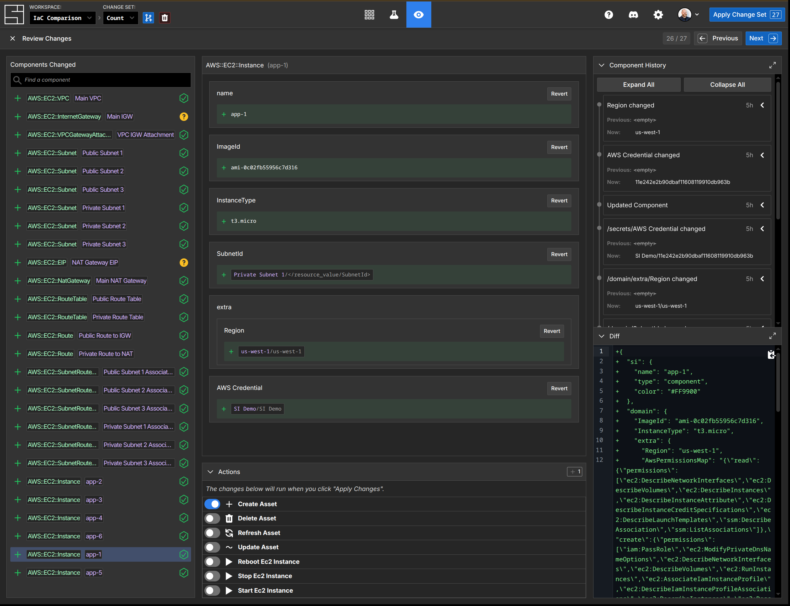

This comprehensive review mechanism allows not only for rich context about what changes are being proposed, but also the actions that will be taken and the history of the components in question. It's a much more powerful way to understand what's about to happen. If you want to know more complex summarization of changes, they can easily be made through AI prompting:

```prompt [AI Plan Review]
> Can you summarize the changes to EC2 instances in the 'count' change set?
  ● Summary of EC2 Instance Changes in 'Count' Change Set

    The 'Count' change set contains 6 EC2 instances that are configured to
    be created:

    Instance Configuration

    All instances share the same configuration:
    - Instance Type: t3.micro
    - AMI: ami-0c02fb55956c7d316 (Amazon Linux 2023)
    - Status: Not yet created (no resourceId)

    Distribution Across Subnets

    The instances are distributed across 3 different subnets:

    Subnet 1 (component ID: 01K63SAMHA5QN2YD0APJ7267M3):
    - app-1
    - app-2

    Subnet 2 (component ID: 01K63SATFHDEGJ7TEYB3BX427E):
    - app-3
    - app-4

    Subnet 3 (component ID: 01K63SB0BJ27ENT8Y3VNYBXH0Z):
    - app-5
    - app-6

    Common Subscriptions

    All instances subscribe to:
    - Region: From component 01K5YP8PDA3GNEYHPVTNJPEKN2
    - AWS Credential: From component 01K5YP8P9376BMYQ4AG9DJWGP2

    Validation Status

    ✅ All instances have no qualification failures - they are ready to be
    applied.

    These instances will be created when the change set is applied to HEAD.
```

This is a dramatically more straightforward way to analyze and understand what will happen as a result of a change being applied.

:::tip
Platforms like HCP Terraform or their competitors often have more dynamic ways of displaying resources and plan data, but the fundamental issues remain: they are point in time representations, can easily go stale, etc.
:::

We also avoid the problem of 'stale' plans. As change sets are applied, System Initiative automatically updates every open change set to reflect those changes, and applies intelligent logic to avoid conflicts and streamline change. For example, if you changed an 'InstanceType' in a change set to 't3.micro', and another user also changed that value to 't3.micro', and they merged their change set - your open change set would show *no changes at all*, because your *intent* had already been accomplished.

System Initiative provides a significantly more powerful and usable approach to knowing exactly what is about to happen as a result of a given change being applied. It avoids the problems of 'stale' plan files by ensuring that all open change sets are updated when any changes are applied or resources refreshed. By providing comprehensive review and AI summarization, we make it easy to understand all facets of what changes that are about to be applied.

### Apply

Terraform apply is the stage where you make the changes defined by a plan to create, update, or destroy resources. First it will lock your workspace, ensuring that no other applies can happen at the same time (it is single threaded, as explained above in the State section.) You either feed it a saved plan file (which will allow it to execute without requiring approval), or it will generates a plan and ask for your approval. It will then execute the steps defined in the plan using the providers installed when the configuration was initialized. At each phase, it will update the workspaces state with the new resource data. Then it will unlock the workspace and report the changes it made, and any output values you specified.

When an apply encounters an error, it will log the error, update the state file, and unlock. Terraform does not automatically support rolling back a partially-completed apply. You have to resolve the errors, then apply the configuration again to update the desired state.

You can also use the '-replace' option to the plan or apply phase, specifying that you want to replace a resource that is not functional but exists. There is also the `-target` option, which lets you specify the individual resources you want to apply, rather than the entire configuration.

Configuration will be applied according to the order specified by its dependencies.

The apply stage has several fundamental problems:

- It is single threaded and requires a lock file
- It can be out of date with the 'plan'
- Errors require re-evaluating the entire state, and may leave you in uncertain situations

System Initiative solves these issues by applying the *intent* that was specified in the change set to the underlying data model. This eliminates the need for a lockfile, as each change is an idempotent operational transform to the underlying graph. It cannot be out of date with the plan, as the plan is itself a direct representation of the intent that is about to be applied.

We also track the dependencies between components and use it to find an optimal level of parallelism between actions, and to ensure that dependent actions are only run if their parents succeed. When an error is encountered, System Initiative tracks the error output, the specific function code that was executed at the time, and all of its inputs. The action itself is then put on *hold*, so that you can investigate the failure (all actions that depend on the failed action will also be put on hold). If the failure is transient (for example, an API is down) - you can simply *retry* the action at a later date, at which point the apply will continue. If the problem is in your configuration, you open a new change set, make the configuration change, and then retry the action with the new component values.

Applies in System Initiative are much more powerful than in Terraform. They can be parallel by default. They cannot be out of date with the plan. And recovering from errors is very straightforward.

:::tip
You can also control when actions will happen by putting actions on 'hold' in a change set. In this way, you could apply a change set and then *later* apply the actual changes to the underlying resources.
:::

