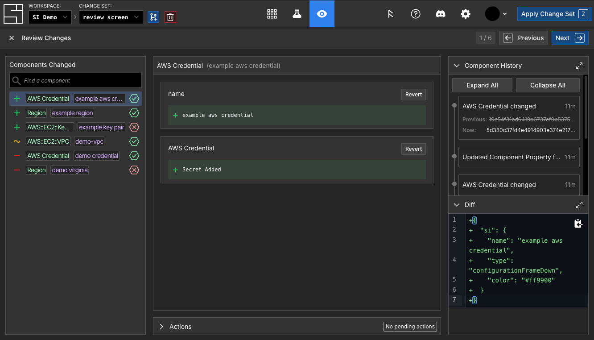
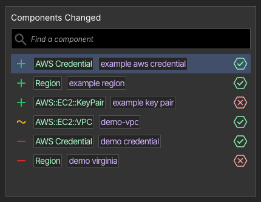
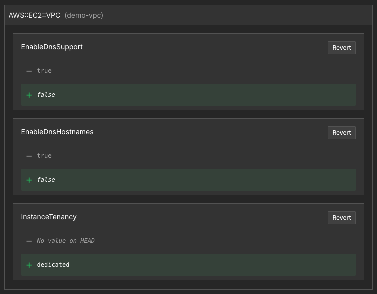
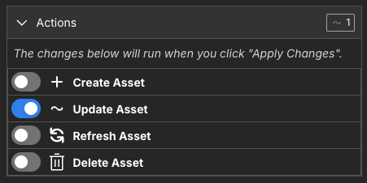
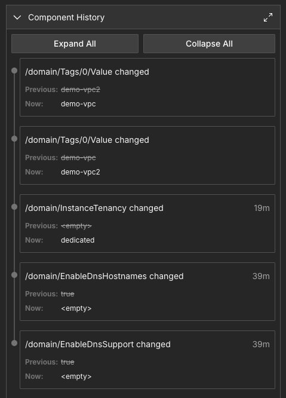
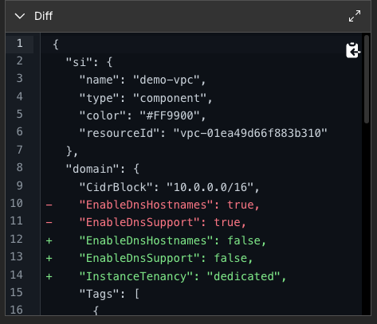

# Review

Before applying a [change set](./change-sets.md) to your infrastructure, it is essential to review all changes to [components](./components.md) included and what [actions](./actions.md) will run. System Initiative's review screen lets you review all potential changes to ensure you're always confident applying them to the real world.

:::tip

If you are looking to audit changes instead, you should use the [Audit Logs](./audit-logs.md) feature.

:::

## The Review Screen

The review screen in the web application is the best way to view all changes in a change set and review them.

Within a change set, the review screen can be opened by clicking the eye icon in the center section of the top navigation bar, or by pressing the hotkey `R`. The review screen can also be closed via the `Escape` key.

## Components Changed

The left Components Changed area shows a list of all changed components, broken down into three types of changes:

- **Created Components**: New components added are marked with a plus +
- **Updated Components**: Modified components are marked with a tilde ~
- **Deleted/Erased Components**: Removed components are shown with a minus -

After the change type icon on the left, each component entry in the list shows the [schema](./schema.md) name of the component, the component's name, and finally an icon indicating the component's [qualification](./qualification.md) status.

The currently selected component is highlighted, and you can either click a component in the list to select it or page through components using the `arrow keys`, `tab`, and `shift+tab`.

## Component Change Details

The central area of the review screen shows the specific details of the changes made to one component. In the screenshot above, three changes have been made to an `AWS::EC2::VPC` component called "demo-vpc" - two boolean properties (`EnableDnsSupport` and `EnableDnsHostnames`) have been changed, and one new piece of data (`InstanceTenancy`) was set to a new value.

Each change can be reverted to the HEAD state by clicking its `Revert` button.

You can navigate to the component details page for the component by clicking the text on the header of this section.

## Actions

The [actions](./actions.md) section is a collapsible panel at the bottom middle of the screen underneath the component change details section. It allows you to see which actions the component has and which ones are set to run when the change set is merged.

Each action is shown with a toggle to indicate if it will run or not, an icon to show what [type](./actions.md#types-of-actions) of action it is, and the name of the action.

When a component is deleted or erased in a change set, no actions are available for it.

## Component History

The component history section at the top of the right panel shows a detailed log of all edits made to the selected component, including edits that no longer result in a change.

The screenshot above shows five edits to demo-vpc, but because one of them reverted the other, these changes resulted only in the three shown in the [component change details](#component-change-details) section.

## Diff

The diff section at the bottom of the right panel shows the component's diff view.

You can easily copy the diff by clicking the copy icon in the top right of the code area.
