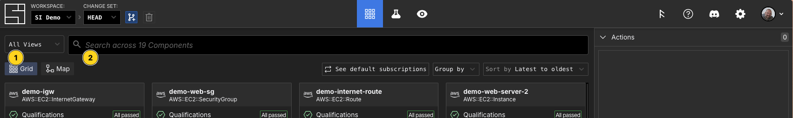

---
outline:
  level: [2, 3]
---

# Search

## Query Syntax

- Component name: Search for `prod` to find components with prod in their name.
- Schema name: Search for `schema:AWS::EC2::Instance` to find EC2 instances.
- Combine them: Search for `prod schema:AWS::EC2::Instance` to find EC2
  instances with prod in their name!

When you need more than mere words can convey, you can use more advanced search 
features such as attribute searches and boolean logic.

### Attribute Search Syntax

To search _inside_ components, you can use attribute searches. All attributes in
the [component's tree](./components.md#attributes) are available to search by
using their name as the key. `InstanceType:`, for example, will search for
instances with that type. Specific syntax for attribute searches:

- **Basic Syntax:** `InstanceType:m8g.medium` will search for m8g.medium
  instances.
- **Alternatives:** `InstanceType:m8g.medium|m8g.small` will search for
  m8g.medium or m8g.large instances.
- **Wildcards:** `InstanceType:m8g.*` will search for all m8g instances
  regardless of size.

  Wildcards can be placed anywhere in the value: `InstanceType:m*.large` will
  match `m8g.large`, `m7g.large`, and even `m7i-flex.large`.

  > Tip: While building your infrastructure, you may want to find things where
  > you did _not_ specify an attribute. For example, `!AvailabilityZone:*` will
  > bring back instances where you did not specify an AvailabilityZone, so you
  > can add one!
- **Exact Matches:** `Runtime:"python3.11"` will match only the `python3.11`
  runtime on a lambda function, but not `python3`.

  You can use quotes (`"`) to pin down your search and match an exact value. If
  you don't use quotes, things that _start with_ the value you specify are
  matched.

  Quotes will also allow you to use spaces in your search:
  `Description:"Production Access"`.
- **Attribute Paths:** `LaunchTemplate/Version:1` will match instances with
  `LaunchTemplate version 1`.

  Sometimes an attribute has a generic name, and you need to specify more of its
  path. `LaunchTemplate/Version:1` is helpful because it will _not_ bring in
  every other AWS resource with a random `Version` field set to 1.
- **Schema:** `schema:AWS::EC2::Instance`, or `schema:Instance`, will find all
  EC2 instances.

All of these features can be mixed and matched:
`InstanceType:m8g.*|"mac1.metal"` will find `m8g` instances as well as
`mac1.metal` instances.

### Boolean Logic

Sometimes you need more precise logic than "find things matching A, B, and
C." For this, we support full boolean logic, with nesting.

- **Negation:** `!InstanceType:m8g.large` will match all instances that are
  _not_ m8g.large.
- **Alternatives:** `Instance | Image` will match all instances and images.
- **Grouping:** `(prod Instance) | (dev Image)` will match Instances in prod,
  and images with "dev" in the name.
- "And" (narrowing a search) is done by putting spaces between things. `&` is
  supported but redundant: `prod Instance` and `prod & Instance` do the same
  thing.

## Putting It All Together

This search will bring back `m8g.medium` instances and load balancers with
`MaxSize>1`, in prod:

```
prod (schema:AWS::EC2::Instance InstanceType:m8g.* | schema:AWS::ElasticLoadBalancing::LoadBalancer !MaxSize:0|1)
```

<DocTabs tabs="CLI,Web Application,Public API">
<TabPanel value="CLI">

```shellscript
$ si component search "schema:AWS::EC2::Instance" -o json
{
  "count": 1,
  "components": [
    {
      "id": "01KBNCGCKKKHSAE23R1E2E8TMA",
      "name": "MyNodeEC2Instance",
      "schema": {
        "name": "AWS::EC2::Instance"
      }
    }
  ]
}
```

</TabPanel>
<TabPanel value="Web Application">

You can search for components when exploring your workspace in both the Grid and
Map interfaces.



1. Filter components by their membership in Views.
2. Search for components.

</TabPanel>
<TabPanel value="Public API">

:::code-group

```typescript [TypeScript]
const searchApi = new SearchApi(apiConfig);
const searchResponse = await searchApi.search({
  workspaceId,
  changeSetId,
  q: query,
});

const components = searchResponse.data.components;
const count = components.length;
```

```python [Python]
api = SearchApi(client)
response = api.search(
  workspace_id=workspace_id,
  change_set_id=change_set_id,
  q=query
)
```

:::

</TabPanel>
</DocTabs>
