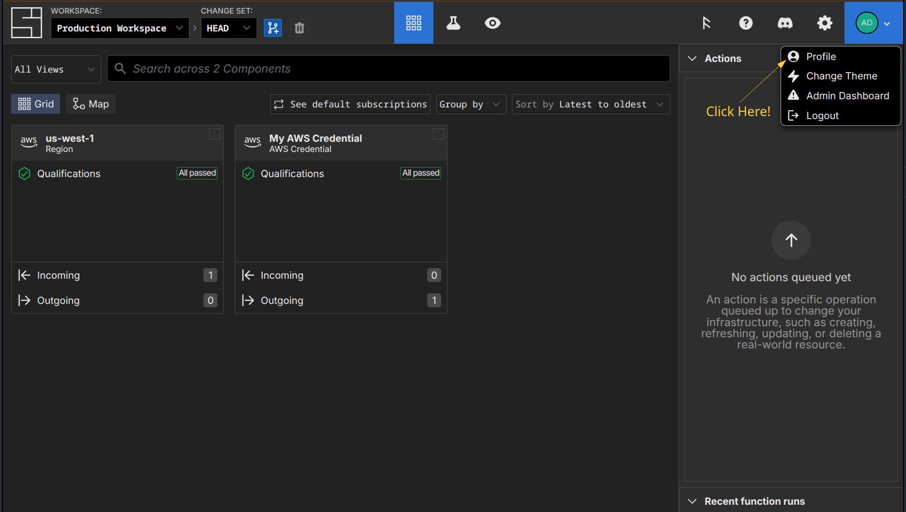
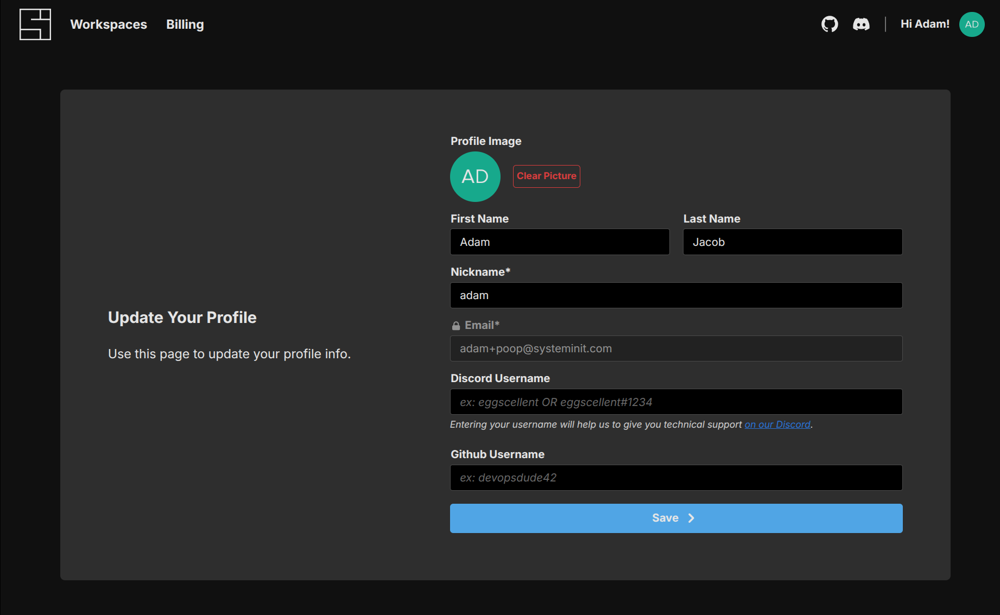
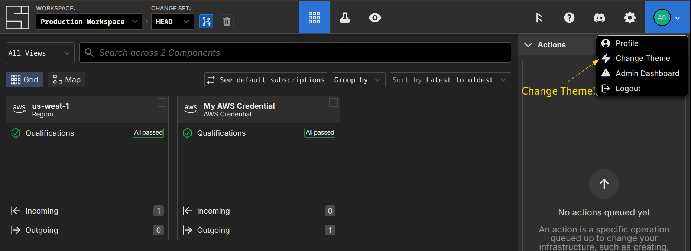

# Users

Users in System Initiative map to people, and have access to multiple [workspaces](./workspaces.md)

## Creating new Users

Follow the [setup tutorial](../tutorials/setup.md) to create a new user, or start the [sign up process directly](https://auth.systeminit.com/signup).

:::info
System Initiative supports SAML and SSO! Reach out to us at info@systeminit.com to learn more.
:::

## Setting your Profile

From within a workspace in our Web Application, click on the circular avatar in the upper right-corner and select 'Profile':

From here you can set your:

- First and Last Name
- Nickname (which is what you will see throughout the application)
- Discord Username
- Github Username

## Changing Theme

You can change between light mode, dark mode, and 'system' (which will follow whatever the underlying operating system hints, enabling switching between light and dark according to the time of day) in the Web Application:

