# Workspaces

A workspace in System Initiative is the isolation boundary for a set of models.
They are a hard boundary between data. Workspaces have multiple 'members', that
map to [users](./users.md) in System Initiative.

## Interacting with Workspaces

### Creating new Workspaces

<DocTabs tabs="Web Application,Public API">
<TabPanel value="Web Application">


Click the 'Create New Workspace' button:

You'll be asked to provide a _Display Name_ for your workspace, an optional
description, and to choose one of 3 _workspace types_:

- _Managed By System Initiative_: The default. The workspace will be managed by
  the System Initiative SaaS platform.
- _Local Dev Instance_: The workspace will be created in your
  [local development environment](https://github.com/systeminit/si).
- _Remote URL_: The workspace will be created in a publicly available instance
  of System Initiative at the specified URL. This option is only used in Bring
  Your Own Cloud or custom deployments.

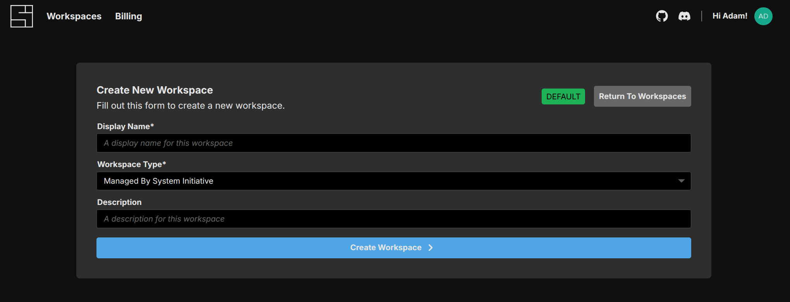

Click 'Create Workspace' to create your new workspace.
</TabPanel>
<TabPanel value="Public API">

If you want a workspace in the managed System Initiative SaaS product use
`app.systeminit.com` as the `instanceUrl`.

:::code-group

```typescript [TypeScript]
const api = new WorkspaceManagementApi(apiConfig);
const response = api.createWorkspace({
  createWorkspaceRequest: {
    description,
    displayName,
    instanceUrl,
  },
});
```

```python [Python]
request = CreateWorkspaceRequest(
  description=description,
  displayName=displayName,
  instanceUrl=instanceUrl,
)
api = WorkspaceManagementApi(client)
response = api.create_workspace(
  create_workspace_request=request
)
```

:::

</TabPanel>
</DocTabs>

### Update Workspace

<DocTabs tabs="Web Application,Public API">
<TabPanel value="Web Application">
Click on the 'Gear' icon on an existing workspace and choose 'Settings'.

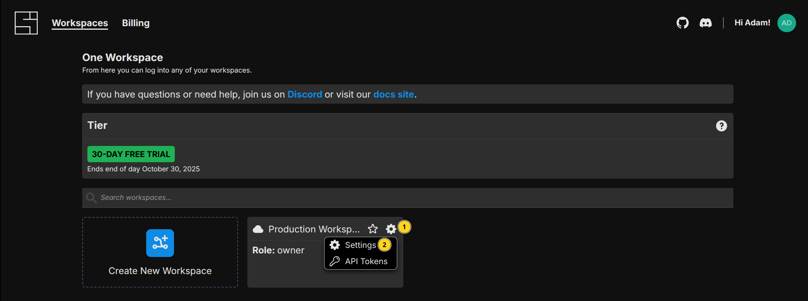

From here you can change your workspaces _Display Name_ or _Description_, access
the _API tokens_ screen, invite _users to the workspace_, and configure the
_role_ of a user within your workspace.

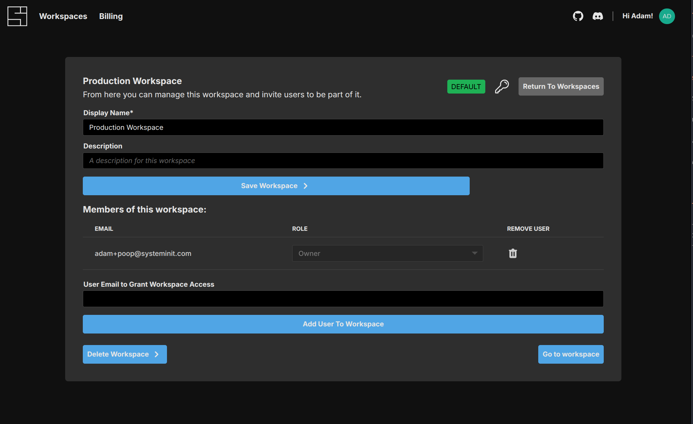

</TabPanel>
<TabPanel value="Public API">

:::code-group

```typescript [TypeScript]
const api = new WorkspaceManagementApi(apiConfig);
const response = api.updateWorkspace({
  workspaceId,
  updateWorkspaceRequest: {
    description,
    displayName,
    instanceUrl,
  },
});
```

```python [Python]
request = UpdateWorkspaceRequest(
  description=description,
  displayName=displayName,
  instanceUrl=instanceUrl,
)
api = WorkspaceManagementApi(client)
response = api.update_workspace(
  update_workspace_request=request
)
```

:::

</TabPanel>
</DocTabs>

### Add a User to a Workspace

<DocTabs tabs="Web Application,Public API">
<TabPanel value="Web Application">
You can add users to the workspace by adding their email and clicking 'Add User to Workspace':

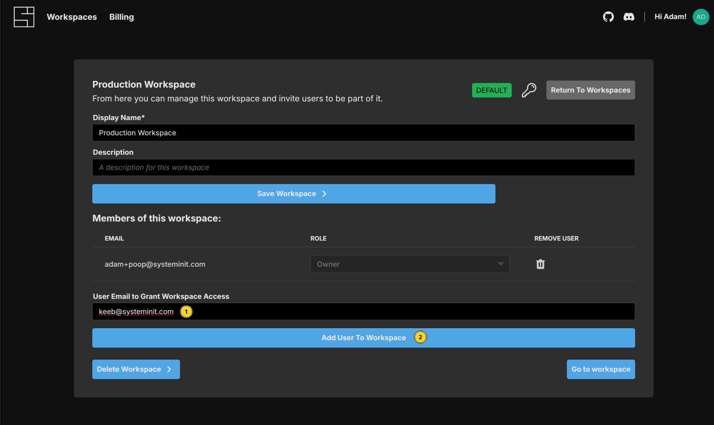

</TabPanel>
<TabPanel value="Public API">

:::code-group

```typescript [TypeScript]
const api = new WorkspaceManagementApi(apiConfig);
const response = api.inviteMember({
  workspaceId,
  inviteMemberRequest: {
    email,
  },
});
```

```python [Python]
request = InviteMemberRequest(
  email=email,
)
api = WorkspaceManagementApi(client)
response = api.invite_member(
  invite_member_request=request
)
```

:::

</TabPanel>
</DocTabs>

### Set a Users Role in a Workspace

<DocTabs tabs="Web Application,Public API">
<TabPanel value="Web Application">
You can set a users Role in a workspace:

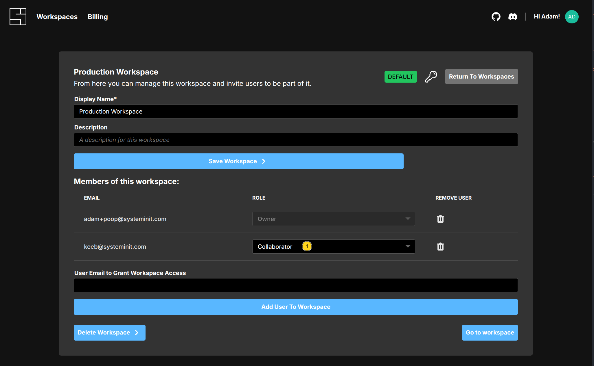

There are two options:

- _Collaborator_: the user will be able to propose changes to a workspace, but
  will not be able to apply or approve change sets.
- _Approver_: the user will be able to approve changes to the workspace and
  apply change sets.

</TabPanel>
<TabPanel value="Public API">

:::code-group

```typescript [TypeScript]
const api = new WorkspaceManagementApi(apiConfig);
const listResponse = api.listMembers({
  workspaceId,
});

const userId = listResponse.data.pop()?.userId;

const response = api.updateMemberRole({
  workspaceId,
  updateMemberRole: {
    userId,
    role,
  },
});
```

```python [Python]
request = UpdateMemberRoleRequest(
  role=role,
  user_id=user_id,
)
api = WorkspaceManagementApi(client)
response = api.update_member_role(
  update_member_role_request=request
)
```

:::

</TabPanel>
</DocTabs>

### Remove a User from a Workspace

<DocTabs tabs="Web Application,Public API">
<TabPanel value="Web Application">

To remove a user from the workspace, click the 'Trash' icon next to their email
in the members list:

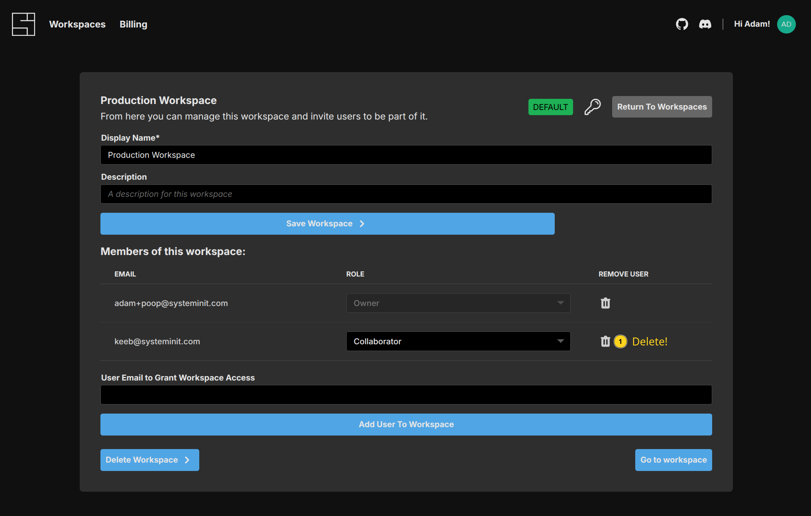

</TabPanel>
<TabPanel value="Public API">

:::code-group

```typescript [TypeScript]
const api = new WorkspaceManagementApi(apiConfig);
const response = api.removeMember({
  workspaceId,
  removeMemberRequest: {
    email,
  },
});
```

```python [Python]
request = RemoveMemberRequest(
  email=email,
)
api = WorkspaceManagementApi(client)
response = api.remove_member(
  remove_member_request=request
)
```

:::

</TabPanel>
</DocTabs>

## API Token Management

API Tokens in System Initiative are used by the [Public API](./public-api.md)
and [AI Agent](./ai-agent.md) to access a System Initiative workspace on a users
behalf.

You can manage API tokens by either selecting the 'Manage Workspace Tokens'
option from the workspace in the Web Application:

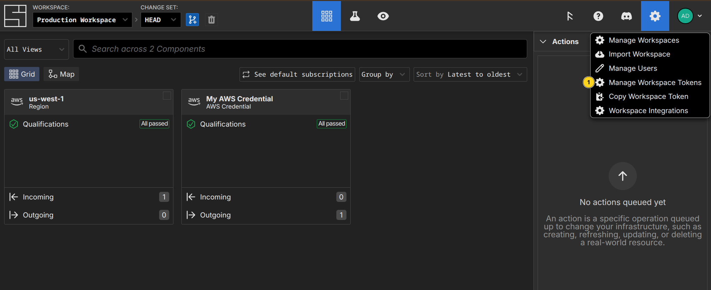

From the Workspace Management screen, through the 'Gear' icon and selecting 'API
Tokens':

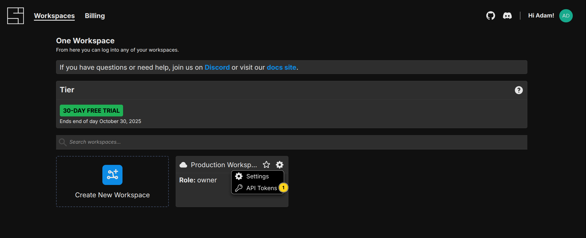

Or from the Workspace Settings screen by clicking the 'Key' icon:

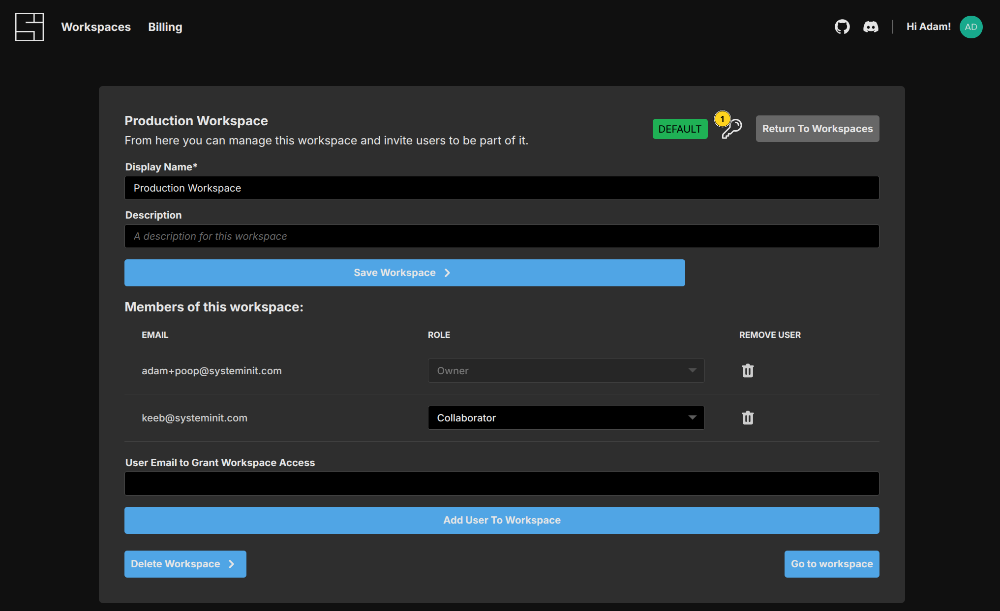

Each option will lead you to the API Tokens management screen:

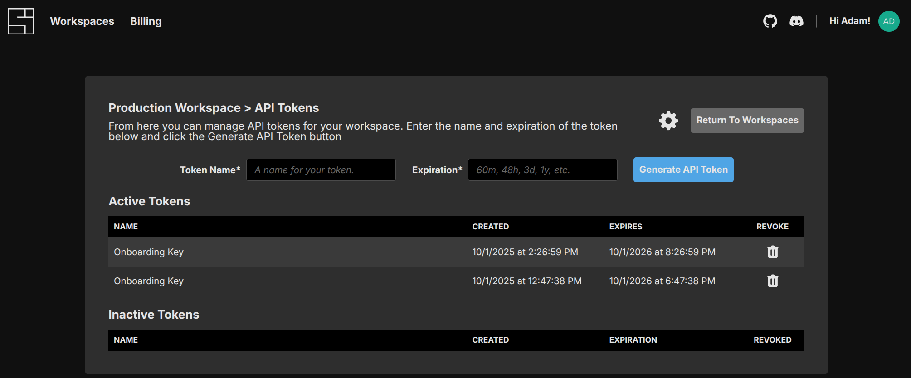

## Generate API Token

To generate a new API token, provide a _token name_ and a suitable _expiration_,
such as '1y' or '48h'.

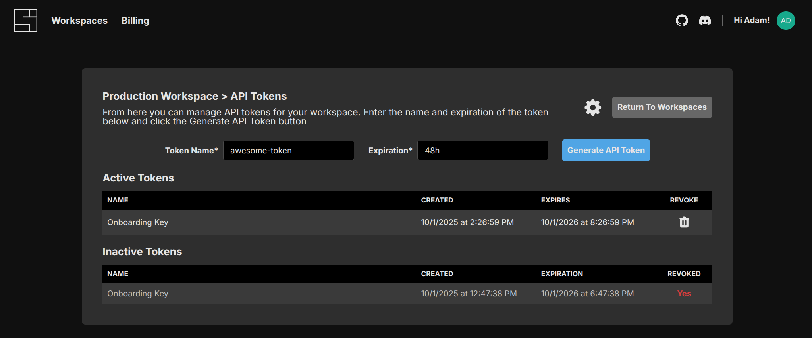

Then click the 'Generate API Token' button. The token will then be shown _only
one time in a modal_. Copy the token and store it someplace safe - it provides
access to your System Initiative workspace on your behalf!

It will then appear in the 'Active Tokens' list.

## Revoking an API Token

While API Tokens cannot be retrieved, they can be revoked. To revoke an API
token, click the 'Trash' icon next to the token you wish to revoke. It will then
be moved to the 'Inactive Tokens' list.

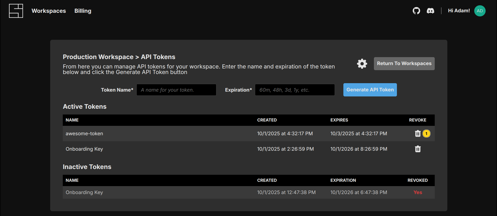
