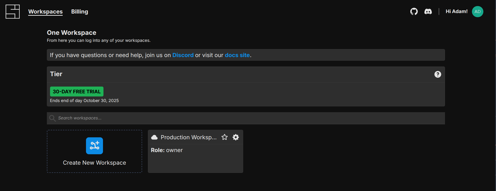

# Workspaces

A workspace in System Initiative is the isolation boundary for a set of models. They are a hard boundary between data. Workspaces have multiple 'members', that map to [users](./users.md) in System Initiative.

## The Manage Workspaces Screen

Managing workspaces is done from the 'Manage Workspaces' screen. You can [navigate there directly](https://auth.systeminit.com/workspaces), or you can click the 'Manage Workspaces' option from the 'Gear' menu.

The Manage Workspaces screen:

## Creating new Workspaces

Click the 'Create New Workspace' button:

You'll be asked to provide a *Display Name* for your workspace, an optional description, and to choose one of 3 *workspace types*:

- *Managed By System Initiative*: The default. The workspace will be managed by the System Initiative SaaS platform.
- *Local Dev Instance*: The workspace will be created in your [local development environment](https://github.com/systeminit/si).
- *Remote URL*: The workspace will be created in a publicly available instance of System Initiative at the specified URL. This option is only used in Bring Your Own Cloud or custom deployments.

Click 'Create Workspace' to create your new workspace.

## Workspace Settings

Click on the 'Gear' icon on an existing workspace and choose 'Settings'.

From here you can change your workspaces *Display Name* or *Description*, access the *API tokens* screen, invite *users to the workspace*, and configure the *role* of a user within your workspace.

## Add a User to a Workspace

You can add users to the workspace by adding their email and clicking 'Add User to Workspace':

## Set a Users Role in a Workspace

You can set a users Role in a workspace:

There are two options:

- *Collaborator*: the user will be able to propose changes to a workspace, but will not be able to apply or approve change sets.
- *Approver*: the user will be able to approve changes to the workspace and apply change sets.

## Remove a User from a Workspace

To remove a user from the workspace, click the 'Trash' icon next to their email in the members list:

## API Token Management

API Tokens in System Initiative are used by the [Public API](./public-api.md) and [AI Agent](./ai-agent.md) to access a System Initiative workspace on a users behalf.

You can manage API tokens by either selecting the 'Manage Workspace Tokens' option from the workspace in the Web Application:

From the Workspace Management screen, through the 'Gear' icon and selecting 'API Tokens':

Or from the Workspace Settings screen by clicking the 'Key' icon:

Each option will lead you to the API Tokens management screen:

## Generate API Token

To generate a new API token, provide a *token name* and a suitable *expiration*, such as '1y' or '48h'.

Then click the 'Generate API Token' button. The token will then be shown *only one time in a modal*. Copy the token and store it someplace safe - it provides access to your System Initiative workspace on your behalf!

It will then appear in the 'Active Tokens' list.

## Revoking an API Token

While API Tokens cannot be retrieved, they can be revoked. To revoke an API token, click the 'Trash' icon next to the token you wish to revoke. It will then be moved to the 'Inactive Tokens' list.

