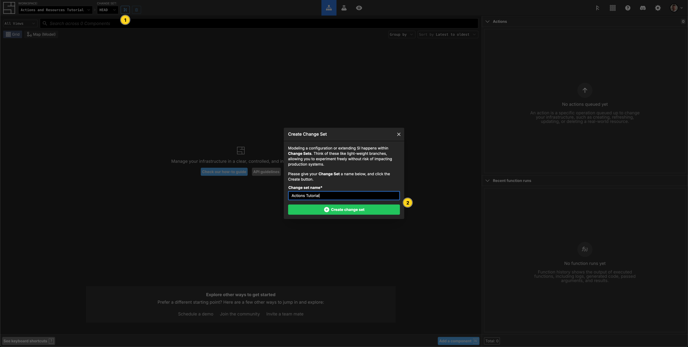
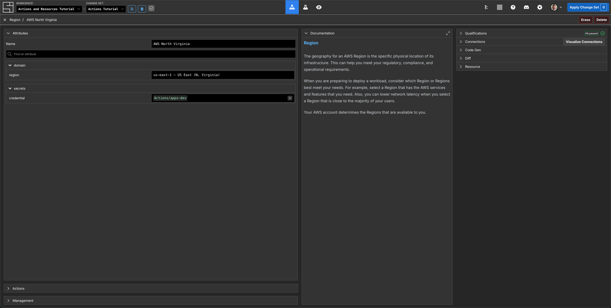
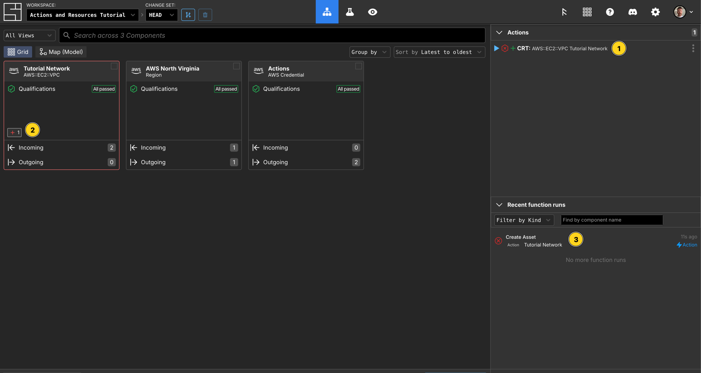
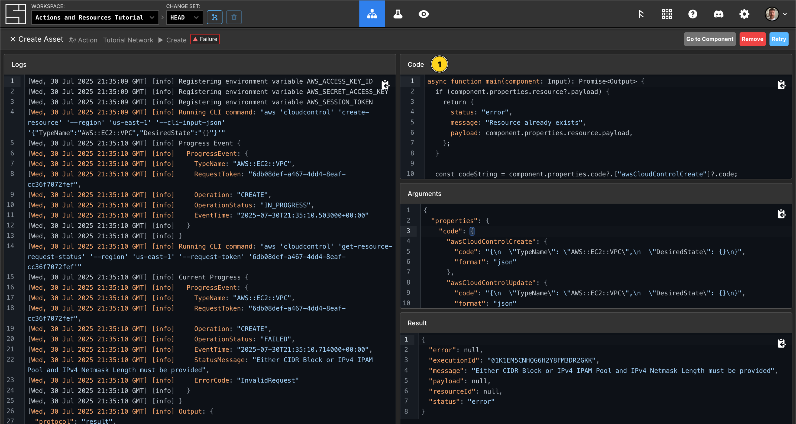
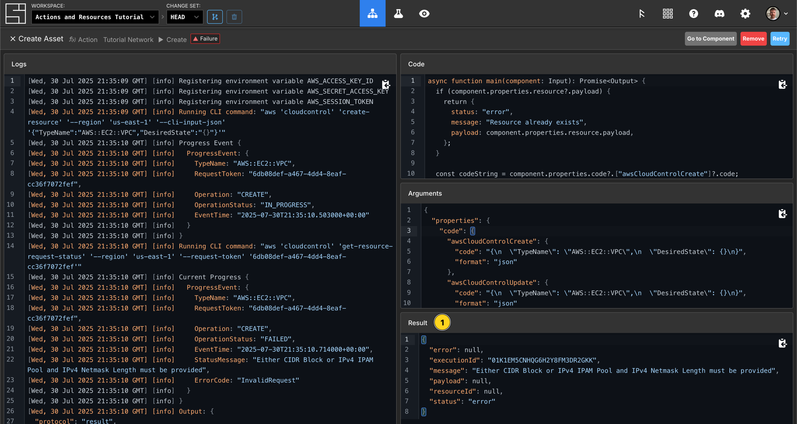
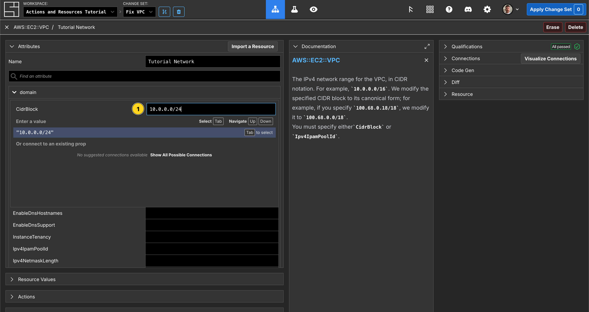
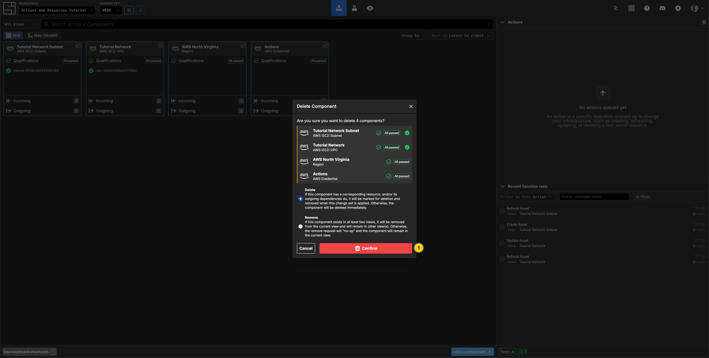

# Actions and Resources

This tutorial will teach you how to use [actions](/reference/vocabulary#actions)
and manage your [resources](/reference/vocabulary#resources) in System
Initiative.

To follow along, you should:

1. Finish the [Getting Started tutorial](./getting-started), to have basic
   knowledge of System Initiative.

2. An
   [AWS account that allows you to create free-tier resources](https://aws.amazon.com/free/),
   such as EC2 instances.

3. You should have your System Initiative workspace open in another window.

## Create a Change Set



Click the create Change Set button.

Name your new Change Set `Actions Tutorial`, and click the `Create Change Set`
button.

## Add an AWS Credential Component and set its properties


Click `AWS Credential` from the AWS category of the asset pallete, and drop it
on the Diagram canvas.

`Resize` the Component until it fills most of the visible canvas by dragging the
lower right corner of the frame.

Name your AWS Credential Component `Actions`.

Click the `Select/add secret` button of the `AWS Credential` property.

If you have completed the Getting Started tutorial, you may have a Credential
already present you can use. If so, select it, and move on to the next section.

If not, click the `Add Secret` button.

Fill in your AWS accounts `Access Key Id` and `Secret Access Key`.
[Refer to the AWS documentation if you do not know what they are](https://aws.amazon.com/blogs/security/how-to-find-update-access-keys-password-mfa-aws-management-console/).

Click `Store Secret` to securely encrypt and save your Secret.

## Add an AWS Region Component and set its properties



Click `Region` from the AWS category of the Asset pallete, and drop it on the
Diagram canvas.

`Resize` the Component until it fills the Credential frame.

Name your AWS Region Component `Northern Virginia`.

Set the `region` property to `us-east-1`.

## Add a VPC Component and set its properties


Click `VPC` from the AWS EC2 category of the Asset pallete, and drop it on the
Diagram canvas.

Name your VPC `Tutorial Network`.

## Investigate the Actions tab for the VPC


Click the `Actions` tab in the right side panel. You will see a list of all the
available [actions](/reference/vocabulary#actions) for the VPC.

The `Tutorial Network` Component was created in this Change Set - so System
Initiative has automatically enqueued the `Create VPC` action for you.

## Apply the Change Set


::: tip

Your `Tutorial Network` VPC will be failing its qualifications at this point.
This is okay - this tutorial will show you what happens when actions _fail_
before it shows you how they succeed.

:::

Press the `Escape` key or click on an empty area of the canvas to select the
workspace itself.

Notice that there is a create action for the `VPC Tutorial Network`. All the
actions enqueued for a Change Set will be shown here.

Click `Apply Change Set`.

A modal will appear confirming you want to take these actions. Click the
`Apply Changes` button to proceed.

## Observe the failed creation of the VPC



The `Changes` panel will show that there is 1 Action,
`CRT: VPC Tutorial Network` currently waiting to run.

The red hexagon shows you that it has failed. `Click on the failed action` to
view the logs from the action.

The logs show that the action has failed to run:

```json
Running CLI command: "aws 'ec2' 'create-vpc' '--region' 'us-east-1' '--cli-input-json' '{
 "TagSpecifications": [
  {
   "ResourceType": "vpc",
   "Tags": [
    {
     "Key": "Name",
     "Value": "Tutorial Network"
    }
   ]
  }
 ]
}'"

An error occurred (MissingParameter) when calling the CreateVpc operation: Either 'cidrBlock' or 'ipv4IpamPoolId' should be provided.
```

The cause is that AWS has rejected your request to create the VPC, due to
missing a `cidrBlock` or `ipv4IpamPoolId`.

## Check the arguments


You can check the arguments sent to the action by clicking the `Arguments` tab
of the action details panel. This will show you the exact data sent to the
underlying action function.

## Check the executed code



Clicking the `Code Executed` tab of the action details panel shows you the
precise code that was executed when this action was run.

## Check the result



Clicking the `Result` tab of the action details panel shows you the return
result of the function.

Close the panel by clicking the `X`.

## Create another Change Set


To finish creating your VPC, you need to add a valid `CidrBlock`. To do that,
you need to create a new Change Set.

Click the `Create Change Set` button.

Name your Change Set `Fix VPC`.

Click `Create Change Set`.

## Add the CidrBlock property to your VPC



Select the `Tutorial Network` VPC Component.

Set the `CidrBlock` property to `10.0.0.0/24`.

## Apply the Change Set


Hit `Escape` or click on the diagram background to select the workspace.

Your create action is still enqueued, so this Change Set shows no proposed
actions.

Click `Apply Change Set`.

Confirm that you want to apply this Change Set by clicking `Apply Changes` in
the modal.

## Try to create the VPC again


Try creating your VPC again by clicking the `Play` button.

You'll see the action execute and succeed!

:::tip

System Initiative records your intent to take an action, and it remains present
on [HEAD](/reference/vocabulary#HEAD) until it succeeds or is intentionally
removed from the list.

:::

## Checking the successful create action result


Click the `History` tab in the right hand panel.

You'll see your failed create actions, and the final success, indicated by a
green filled-in hexagon next to the action.
`Click your successful create action` to view the action details.

Click the `Result` tab.

You will see output similar to this:

```json
{
  "error": null,
  "executionId": "01J5XBTT8ZF6QX3B2SDKC4HXGY",
  "message": null,
  "payload": {
    "CidrBlock": "10.0.0.0/24",
    "CidrBlockAssociationSet": [
      {
        "AssociationId": "vpc-cidr-assoc-059d9d6854371c4ad",
        "CidrBlock": "10.0.0.0/24",
        "CidrBlockState": {
          "State": "associated"
        }
      }
    ],
    "DhcpOptionsId": "dopt-b05847cb",
    "InstanceTenancy": "default",
    "Ipv6CidrBlockAssociationSet": [],
    "IsDefault": false,
    "OwnerId": "835304779882",
    "State": "pending",
    "Tags": [
      {
        "Key": "Name",
        "Value": "Tutorial Network"
      }
    ],
    "VpcId": "vpc-041a1f62d65eaac18"
  },
  "status": "ok"
}
```

The `payload` field of your action result contains the information System
Initiative will use to populate the [resource](/reference/vocabulary#resource)
for your [model](/reference/vocabulary#model).

Note that the `payload/State` field is set to `pending`. The AWS API for VPC
creation is asynchronous - AWS is informing us that it will create our VPC, but
has not done so yet.

## Refreshing the Tutorial Network Resource


Click the `Tutorial Network` VPC Component on the diagram.

Click the `Resource` tab in the right side panel.

You will likely see that the state of your resource has already been updated
from when it was created - the `State` will have transitioned to `available`.

Click the `Refresh Resource` button, above the `Resource` tab, to ensure you
have the most up to date resource data.

::: tip You can also refresh the resource data from the `Diagram Outline` in the
left panel. Hover over the Components entry, and click the small `Refresh` icon.
:::

## Create a new Change Set


Now we will update some properties of our VPC, and add

Click the `Create Change Set` button.

Name your Change Set `Update VPC`.

Click `Create Change Set`.

## Update the properties of the Tutorial Network VPC


Select the `Tutorial Network` VPC.

Click the `Component` tab.

Set the Component type to `Configuration Frame (Down)`.

`Resize` the frame large enough to hold a new Component.

Set the `EnableDnsHostnames` property to true.

Set the `EnableDnsResolution` property to true.

## Enqueue the Update VPC Attributes action


Click the `Actions` tab in the right side panel.

Toggle the `Update VPC Attributes` action to `on`.

This will update the `Tutorial Network` VPC resource to reflect your changed
Component properties when the Change Set is applied.

## Add a Subnet and set its properties


Click `Subnet` from the AWS EC2 category of the asset pallete, and drop it
within the `Tutorial Network` VPC frame.

Name your Subnet `Tutorial Network Subnet`.

Set the `AvailabilityZone` property to `us-east-1a`.

Set the `CidrBlock` property to `10.0.0.0/26`.

## Observe the enqueued actions


Press the `Escape` key or click on the diagram canvas background to select the
workspace.

You will have 2 actions enqueued for this Change Set - one that is the manual
action to update the attributes of the VPC, and a create action for your new
Subnet.

Click the `...` button next to the `Subnet Create` action. You will see that it
is `Waiting On` the manual action to update the VPC.

When you apply the Change Set, the action to update the attributes will run
first. If it succeeds, then the action to create your Subnet will run.

## Apply the Change Set


Click `Apply Change Set`.

Confirm that you want to apply this Change Set by clicking `Apply Changes` in
the modal.

## Observe the action order


You will see the action to update the `Tutorial Network` VPC finish, followed by
the create action of your `Tutorial VPC Subnet`.

:::tip

The order of actions is automatically determined based on their configuration
relationships.

:::

## Clean Up



Select the `Actions` AWS Credential frame.

Press the `Delete` key.

Click to `Confirm` that you want to delete the resources you created.

Click the `Apply Change Set` button.

Click the `Apply Changes` button in the modal to confirm.

## Congratulations

In this tutorial you learned:

- How to use the Actions tab to enable/disable an action in a Change Set
- Enqueued actions can be seen in the changes tab
- Enqueued actions are persisent across change-sets until they succeed
- Actions are executed in order according to their configuration relationships
- Failed actions can be debugged by looking at their arguments, function code,
  results, and logs
- Past action executions can be viewed from the history panel
- Updating resources requires changing both properties and enqueing an action
- Actions set a models resource value through their return value
- Resources can be refreshed as needed, to ensure an accurate view of the system

## Vocabulary
In this tutorial bits of System Initiative Vocabulary will be shown with a capital letter. 
All definitions for these can be found here: [System Initative - Vocabulary](https://docs.systeminit.com/reference/vocabulary) 