# Actions and Resources

This tutorial will teach you how to use actions
and manage your resources in System
Initiative.

To follow along, you should:

1. Finish the [Getting Started tutorial](./getting-started), to have basic
   knowledge of System Initiative.

2. An
   [AWS account that allows you to create free-tier resources](https://aws.amazon.com/free/),
   such as EC2 instances.

3. You should have your System Initiative workspace open in another window.

## Create a Change Set


Click the create Change Set button.

Name your new Change Set `Actions Tutorial`, and click the `Create Change Set`
button.

## Add an AWS Credential Component and set its properties

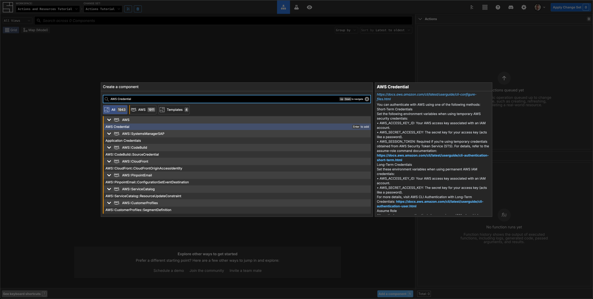

If you have completed the Getting Started tutorial, you may have an AWS Credential
already present that you can use. If so, move on to the next section.

Press `N` or Click the `Add a component` button, then in the search bar type `AWS Credential`, select the Component and press `Enter`.

Name your Component `Actions`, then Name your Secret something relevant, for example the AWS Account name `apps-dev`.

Fill in your AWS accounts `Access Key Id` and `Secret Access Key`.
[Refer to the AWS documentation if you do not know what they are](https://aws.amazon.com/blogs/security/how-to-find-update-access-keys-password-mfa-aws-management-console/).


Click `Add Secret` to securely encrypt and save your Credentials. Press `Esc` to return to the Grid.

## Add an AWS Region Component and set its properties


Click `Add a component` (or press `N`), then search for `Region` in the `AWS` category, select this and then press `Enter`.

Name your region `AWS North Virginia`.

Set the `region` property to `us-east-1`.

Click the `credential` property field and select `AWS Credential apps-dev`. Press `Esc` to return to the Grid.

## Add a VPC Component and set its properties

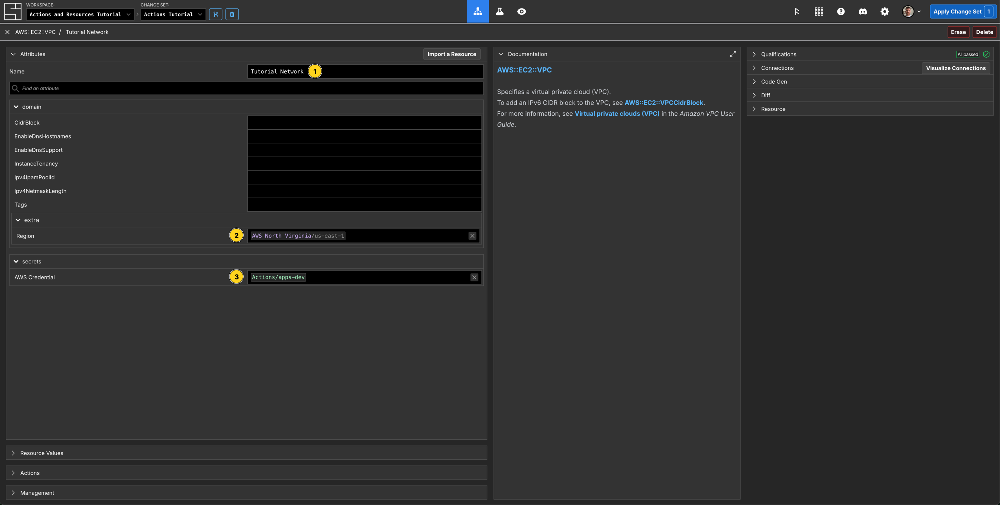

Click `Add a component` (or press `N`), then search for `AWS::EC2::VPC` in the `AWS` category, select this and then press `Enter`.

Name your VPC `Tutorial Network`.

Set your created `region` and `AWS Credential` properties.

## Investigate the Actions tab for the VPC

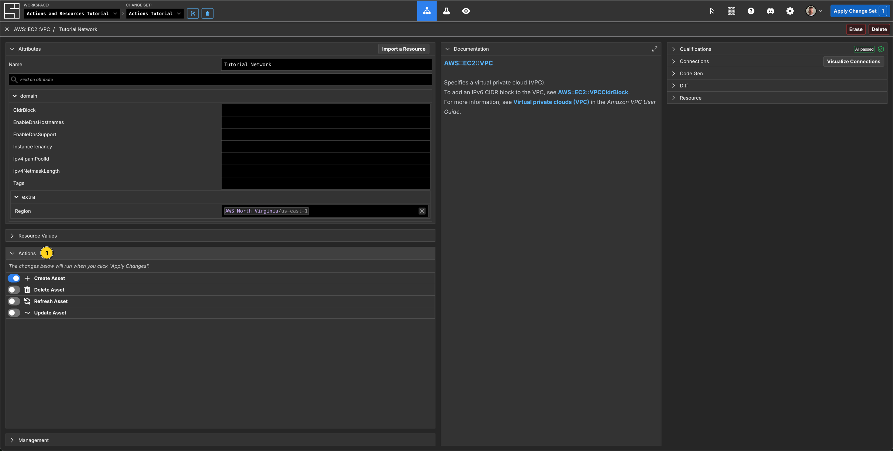

Click the `Actions` tab on the left hand side underneath the Attributes panel. You will see a list of all the available Actions for the VPC.

The `Tutorial Network` Component was created in this Change Set - so System
Initiative has automatically enqueued the `Create VPC` action for you.

## Apply the Change Set

Press the `Esc` key or click on `Close` in the top left of the Component.


Notice on the right side in the Actions panel that there is a create action for the `Tutorial Network` VPC. All of the Actions enqueued for a Change Set will be shown here.

Click `Apply Change Set`.

A modal will appear confirming you want to take these Actions. Click the
`Apply Changes` button to proceed.

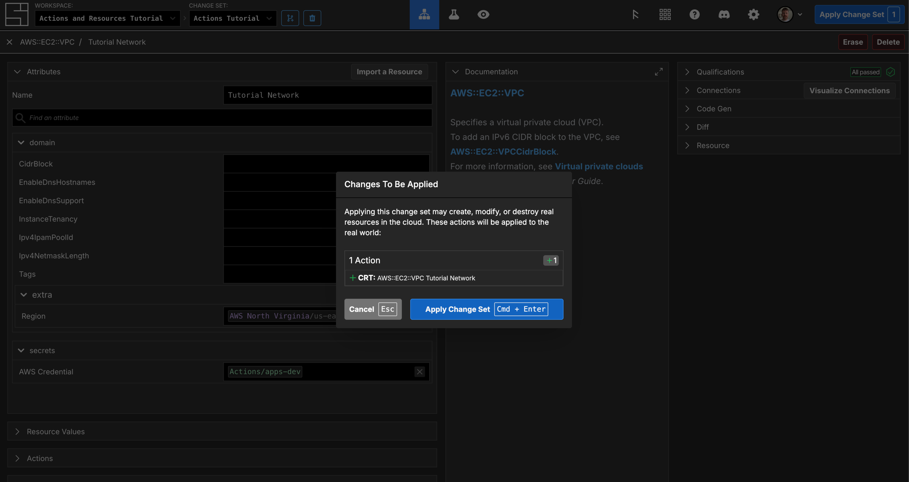

## Observe the failed creation of the VPC


The AWS::EC2::VPC Component on the grid will be outlined in red to depict the failure of the Create Action. The `Actions` panel will show that there is 1 Action, `CRT: AWS::EC2::VPC Tutorial Network` currently waiting to run, the red hexagon shows you that it has failed. There is also an entry in `Recent Function Runs` that shows you that the Create function failed to run.

In the Actions panel, `Click on the failed action` to view the logs.

The logs show:


The information we need specifically here is:

```json
Running CLI command: "aws 'cloudcontrol' 'get-resource-request-status' '--region' 'us-east-1' '--request-token' '6db08def-a467-4dd4-8eaf-cc36f7072fef'"
Current Progress {
    ProgressEvent: {
        TypeName: "AWS::EC2::VPC",
        RequestToken: "6db08def-a467-4dd4-8eaf-cc36f7072fef",
        Operation: "CREATE",
        OperationStatus: "FAILED",
        EventTime: "2025-07-30T21:35:10.714000+00:00",
        StatusMessage: "Either CIDR Block or IPv4 IPAM Pool and IPv4 Netmask Length must be provided",
        ErrorCode: "InvalidRequest"
    }
}
Output: {
  "protocol": "result",
  "status": "success",
  "executionId": "01K1EM5CNHQG6H2Y8FM3DR2GKK",
  "health": "error",
  "message": "Either CIDR Block or IPv4 IPAM Pool and IPv4 Netmask Length must be provided"
}
```

We can see that the cause of the failure is that AWS has rejected your request to create the VPC, due to missing a `cidrBlock` or `ipv4IpamPoolId`.

## Check the arguments

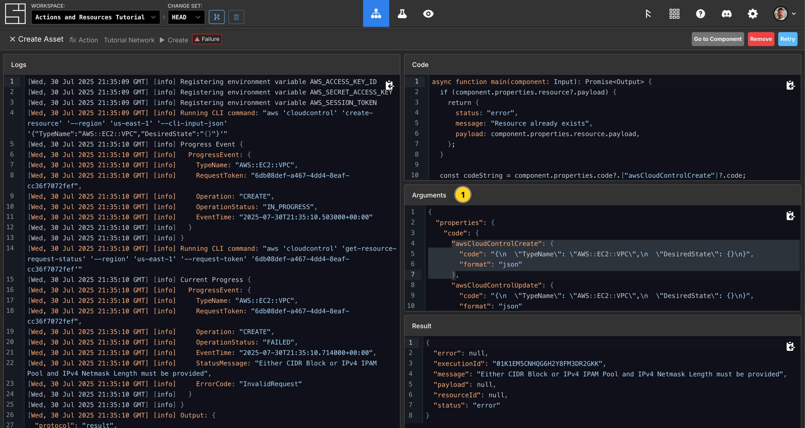

You can check the arguments sent to the Action in the `Arguments` section
of the Function output screen. This will show you the exact data sent to the
underlying action function. In this example you can see that no values were sent in the Create Action.

## Check the executed code


View the `Code` section of the Function output screen. This shows you the
precise code that was executed when this action was run.

## Check the result


View the `Result` section of the Function output screen. This shows you the returned
result of the function.

Close the panel by clicking the `X` or by pressing the `Esc` key.

## Create another Change Set

To finish creating your VPC, you need to add a valid `CidrBlock`. To do that,
you need to create a new Change Set.

Click the `Create Change Set` button.

Name your Change Set `Fix VPC`.

Click `Create Change Set`.

## Add the CidrBlock property to your VPC


On the Gird, click into the `Tutorial Network` VPC Component.

Set the `CidrBlock` property to `10.0.0.0/24`.

## Apply the Change Set

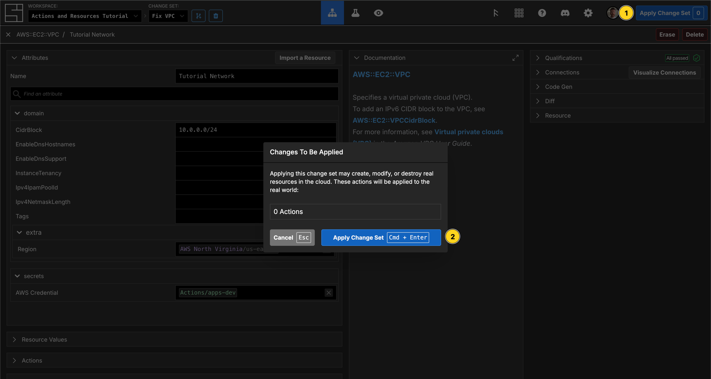

From the Component details screen, click `Apply Change Set`.

Your create action is still enqueued, so this Change Set shows no proposed
Actions.

Click `Apply Change Set`.

## Try to create the VPC again

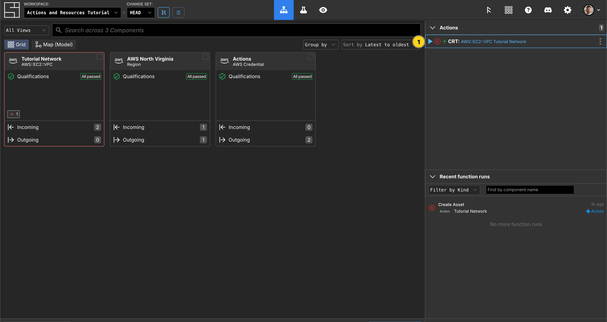

Try creating your VPC again by clicking the `Play` button.

You'll see the action execute and succeed!

:::tip

System Initiative records your intent to take an action, and it remains present
on HEAD until it succeeds or is intentionally
removed from the list.

:::

## Checking the successful create action result

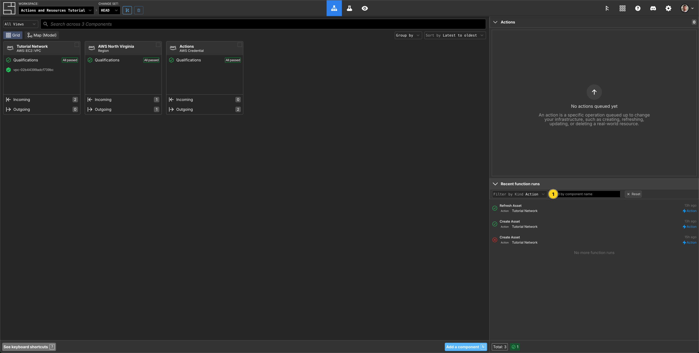

In the lower right hand panel named `Recent Function runs` Filter by Kind `Action` and view the initial failed Create Action, the successful Create Action and the following successful Refresh Action.

`Click your successful create action` to view the action details.

View the `Result` section.

You will see output similar to this:

```json
{
  "error": null,
  "executionId": "01K1ETG6QME7YBWH8A0XQZVX6G",
  "message": null,
  "payload": null,
  "resourceId": "vpc-02b44399adcf739bc",
  "status": "ok"
}
```

Your Action result contains the information System
Initiative will then use to populate the resource via a Refresh Action, using for example the `resourceId` which runs automatically after a successful Create.

Note that the `payload/State` field is currently set to `null`.

## A Refreshed Tutorial Network VPC Resource

Return to the Grid, and filter your `Recent function runs` by `Action`, then click the successul `Refresh` Action.

In the Result section you will see something like the following:

```json
{
  "error": null,
  "executionId": "01K1ETGTYHAEXRJY7XMXHKDT4R",
  "message": null,
  "payload": {
    "CidrBlock": "10.0.0.0/24",
    "CidrBlockAssociations": [
      "vpc-cidr-assoc-0538bd0a59c91179c"
    ],
    "DefaultNetworkAcl": "acl-07d867dd4a7900e1b",
    "DefaultSecurityGroup": "sg-094ab226efdf848b5",
    "EnableDnsHostnames": false,
    "EnableDnsSupport": true,
    "InstanceTenancy": "default",
    "Ipv6CidrBlocks": [],
    "Tags": [],
    "VpcId": "vpc-02b44399adcf739bc"
  },
  "resourceId": null,
  "status": "ok"
}
```

You can see the details of your resource in the payload above. These properties are also available to view in the VPC Component too:


You can click the `Refresh Resource` button, on the `Resource` section, to ensure you
have the most up to date resource data.

::: tip

You can also refresh the resource data from the `Grid`. Right click the Component, hover over Actions and then click `Refresh Asset`.

:::


## Create a new Change Set

Now we will update some properties of our VPC.

Click the `Create Change Set` button.

Name your Change Set `Update VPC`.

Click `Create Change Set`.

## Update the properties of the Tutorial Network VPC


Select the `Tutorial Network` AWS::EC2::VPC on the Grid.

Set the `EnableDnsHostnames` property to true.

Set the `EnableDnsSupport` property to true.

Editing a property on a Component with an existing Resource will automatically enqueue an `Update Action`, you can view this from within the Component via the `Actions` panel, or on the `Grid` via `Actions`. On the below screenshot, you can also see a `~Diff` icon on the VPC Component.


## Add a Subnet and set its properties

Click `Add a component` or press `N` and search for `Subnet`, select `AWS::EC2::Subnet` and hit `Enter`.

Name your Subnet `Tutorial Network Subnet`.

In `VpcId`, subscribe to the `VpcId` property of the `Tutorial Network` Component.


Set the `AvailabilityZone` property to `us-east-1a`.

Set the `CidrBlock` property to `10.0.0.0/26`.

Set your `region` and `aws credential` properties.

Click the `X` or press `Esc` to return to the Grid.

## Observe the enqueued Actions

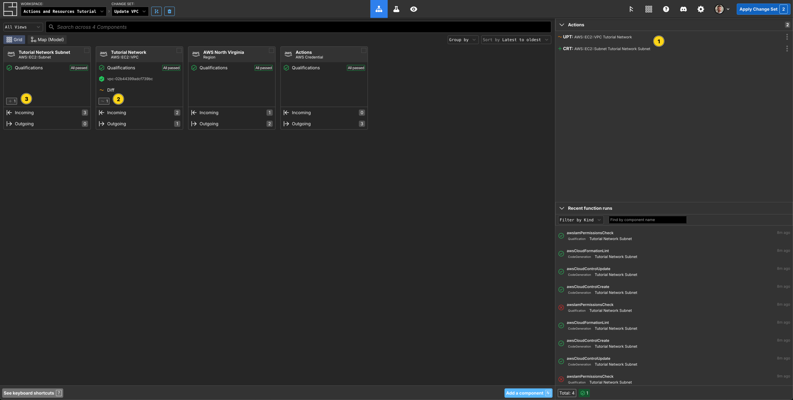

You will have 2 Actions enqueued for this Change Set - one to update the attributes of the VPC, and a create action for your new Subnet.

You can also see the two pending Update and Create Actions on the VPC and Subnet Component tiles.

When you apply the Change Set, the action to update the attributes will run first. If it succeeds, then the action to create your Subnet will run.

## Apply the Change Set

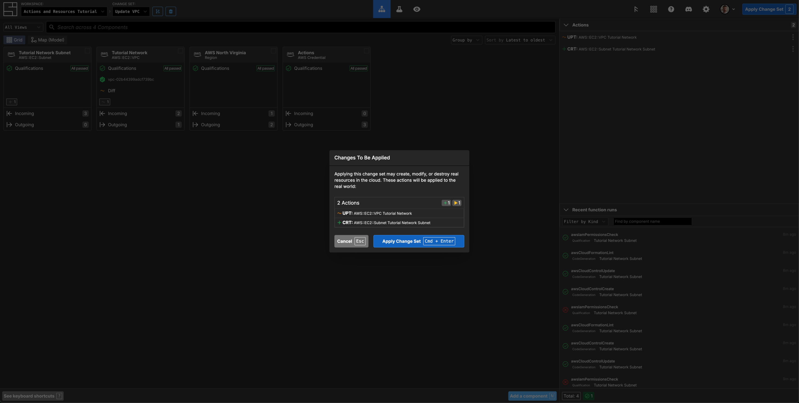

Click the `Apply Change Set` button in the Header.

Confirm that you want to apply this Change Set by clicking `Apply Change Set` (or `Cmd/Ctrl + Enter`) in
the modal.

## Observe the action order

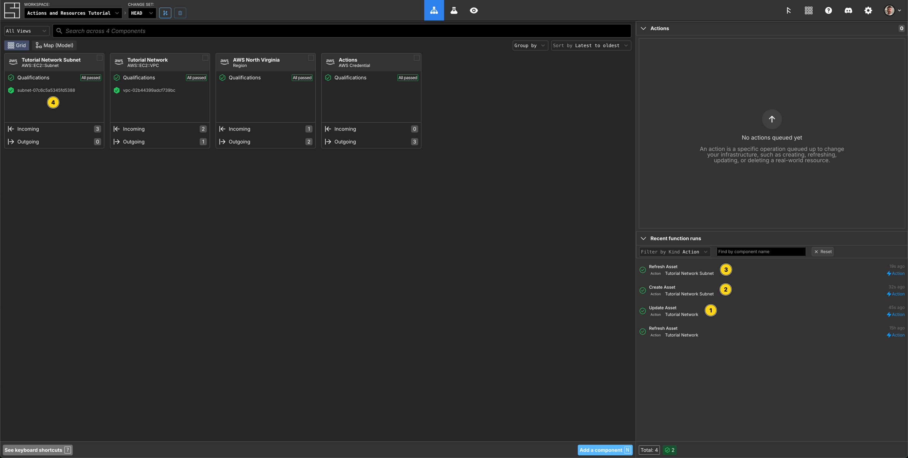

You will see the Action to update the `Tutorial Network` VPC finish, followed by
the Create Action of your `Tutorial VPC Subnet`, then finally the Refresh Action. You can now view the Subnets ResourceID and verification of its creation on the Component tile.

:::tip
The order of Actions is automatically determined based on their configuration
relationships.
:::

## Clean Up


Press `Cmd/Ctrl + A` to Select all Components on the Grid, then the `Delete` key via your keyboard or click the option in the Context Menu.

Click to `Confirm` that you want to delete the resources you created.

Click the `Apply Change Set` button in the Header.

Click the `Apply Change Set` button in the modal to confirm the Action.

## Congratulations

In this tutorial you learned:

- How to use the Actions panel in a Component to enable/disable an action in a Change Set
- Enqueued Actions can be seen in the Actions panel
- Enqueued Actions are persisent across change-sets until they succeed
- Grid Components display pending actions
- Actions are executed in order according to their configuration relationships
- Failed Actions can be debugged by looking at their arguments, function code,
  results, and logs
- Past action executions can be viewed from the Recent function runs panel
- Resource updates are enqueued automatically when making changes to existing resources
- Actions set a Components resource value through their return value
- Resources can be refreshed as needed, to ensure an accurate view of the system

