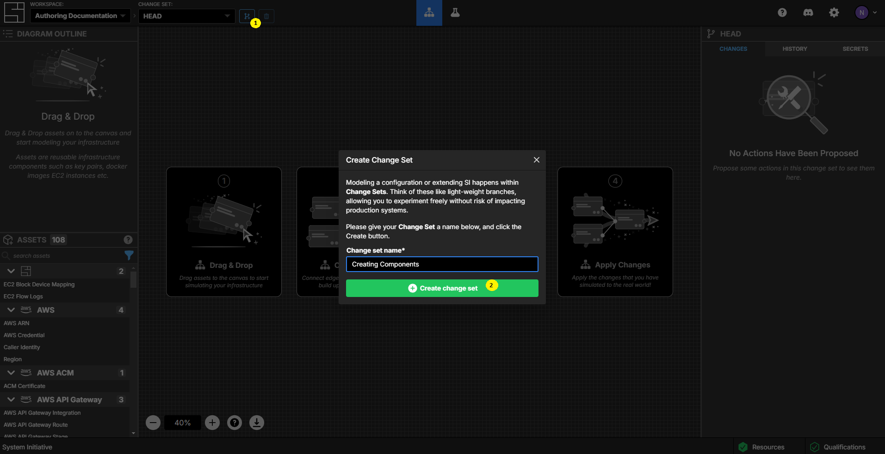
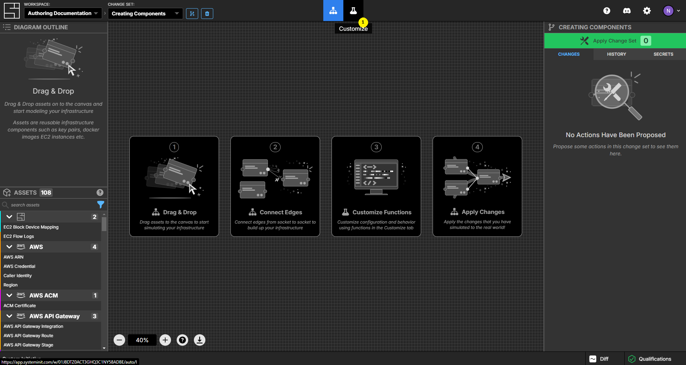

# Creating Components

This tutorial will teach you how to create new
[components](/reference/vocabulary#components).

To follow along, you should:

1. Finish the [Getting Started tutorial](./getting-started), to have basic
   knowledge of System Initiative.

2. You should have your System Initiative workspace open in another window.

This tutorial show you how to create and edit components and add functions to
them. It's focus is on introducing you to the user interface and various high
level concepts. For deeper details, it will link to the reference guides.

:::tip

While creating components and writing functions does require you to write
TypeScript, don't worry if you aren't familiar with the language. System
Initiative functions tend to be quite short and easy to reason about. You'll
pick it up.

:::

## Create a change set



Click the create change set button.

Name your new change set `Creating Components`

Click the `Create change set` button.

## Switch to the Customize Screen



Click the `Beaker` icon to switch to the customize screen.

## Create a new Hello World Component

Click the `New Asset` button (represented by a `+` icon) in the Assets pallete
in the left side panel.

Name your [asset](/reference/vocabulary#asset) `Hello World`.

Click `Create Asset`.

Make sure the `Hello World` is selected in the Assets sub-panel of the left side
of the screen.

:::tip

Assets are anything you might need to use in System Initiative - today, they are
synonymous with components.

:::

## Set the Hello World meta-data


Set the `Category` to `Tutorial`.

Set the `Component Type` to `Component`.

Set the `Description` to `Hello World`.

Set the `color` to `#6cdcf8`.

## Add properties to the Hello World schema


In the center of the screen is a text editor showing the empty schema of your
`Hello World` component.

The code will look like this when you are finished:

```typescript
function main() {
  const asset = new AssetBuilder();

  const helloProp = new PropBuilder()
    .setName("Hello")
    .setKind("string")
    .setValidationFormat(Joi.string().regex(/^world$/))
    .build();
  asset.addProp(helloProp);

  const tagsProp = new PropBuilder()
    .setName("Tags")
    .setKind("array")
    .setEntry(
      new PropBuilder()
        .setKind("object")
        .setName("TagEntry")
        .addChild(new PropBuilder().setKind("string").setName("Key").build())
        .addChild(new PropBuilder().setKind("string").setName("Value").build())
        .build(),
    )
    .build();
  asset.addProp(tagsProp);

  return asset.build();
}
```

This will create a component with two properties:

- _Hello_: a string that must be all lowercase
- _Tags_: an array of Key/Value objects

Here is how you would write it yourself, step by step.

### 1. Schema function


You define your components schema by writing a TypeScript function named
`main()`. The function begins by creating a new `AssetBuilder()`, stored in a
variable named `asset`.

:::tip

This `builder` pattern is a recurring one in schema definition. You will create
new `Builder` objects, then call functions to configure them, and finally call
`.build()` to output the final definition.

:::

### 2. The Hello property

Next you will add the `Hello` property in a variable named `helloProp`. Start by
typing `const helloProp = new` - you'll see an auto-complete pop-up with a
snippet named `New Prop Snippet`. Press `Enter`, and the code to create a new
string property will be added.

The new prop definition starts with a `new PropBuilder()`, on which you will
call functions on to configure your property.

- `setName` sets the properties name as it will appear in the component
  attributes panel; in this case, `KeyName`.
- `setKind` specifies the datatype for this property; in this case, `string`.
- `setWidget` controls how this property is rendered in the attributes panel;
  for this property, as a `text` box. You can delete this line, as it is also
  the default.
- `setValidationFormat` adds a validation that ensures the value of Hello is
  `world`.

:::tip

Hovering over a function will show you its definition. This can be very helpful
for reminding yourself of the available options!

:::

Finish your property definition by calling `.build()`.

Add the `Hello` property to the `asset` by calling `asset.addProp(helloProp);`.

### 3. The Tags property

Use the `New Prop Snippet` to generate another property, this time in a variable
named `tagsProp`.

Set the name to `Tags`.

Set the kind of the property to `array`.

Arrays have their entries defined by properties as well, using the `setEntry()`
method. The array will contain an object with two properties, `Key` and
`Value` - these are specified with the `addChild()` method on the objects
PropBuilder.

Finish your property definition by calling `.build()`.

:::tip

There is a `format` button in the upper left of the editor! Use it to
auto-format your function as you go.

:::

### 4. Return the compiled asset

With all your properties added to the schema, you can now return the compiled
asset definition with `return asset.build()`.

## Regenerate the asset

Click the `Regenerate Asset` button in the right-side panel.

This will execute your schema definition function and update System Initiative
with the new schema.

## Check your new component

Click the `Graph` icon to switch to the modeling screen.

Click the `Hello World` component from the Tutorial section of your Assets
panel, and drop it on the diagram.

Name your `Hello World` component `First Component`.

You will see that you have the following properties:

- Hello, an empty string field that accepts only lowercase letters
- Tags, an array of Key/Value objects

## Add a qualification function

Click the `Beaker` icon to switch back to the customize screen. Ensure you
`Hello World` asset is selected.

In the `Asset Functions` panel in the left pane, click the `Attach Function`
button, represented by the blue links icon, and select `+ New Function`.

Select `Qualification` from the drop-down, indicating you want to create a new
Qualification function.

Name your Qualification `helloWorldTags`.

## Set the qualifications meta-data

Set the `Display Name` to `Hello World Tags`

## Write the qualification function

Ensure that any `Hello World` components have a tag with the key `Super` and
value is `Duper`.

The code will look like this when you are finished:

```typescript
async function main(component: Input): Promise<Output> {
  let result: "failure" | "success" = "failure";
  let message = "Must have a tag of Super:Duper.";
  for (const tag of component.domain.Tags) {
    if (tag.Key == "Super" && tag.Value == "Duper") {
      result = "success";
      message = "You are Super Duper!";
    }
  }
  return {
    result,
    message,
  };
}
```

Here is how you would write it, step by step:

### 1. Make a result and message variable

Start by declaring two variables, `result` and `message`. These will be used in
your functions return value.

The `result` variable has a TypeScript type annotation, reflecting the two valid
values for our function: `failure` or `success`, and defaults to `failure`.

### 2. Iterate over the Tags and check for the proper values

For each tag in our `Tags` array, check if it has a key named `Super` and a
value of `Duper`. If it does, set the `result` to `success` and provide a
helpful message.

### 3. Return the result and message

Finally, return the `result` and `message`.

## Check your new qualification function

Click the `Graph` icon to switch to the modeling screen.

Select your `Hello World` component on the diagram.

Select the Qualifications sub-panel, and see that your `Hello World Tags`
function is failing.

## Clean Up

Abandon your change set to clean up.

## Congratulations

In this tutorial you learned:

- How to add a new Asset
- Configure its meta-data
- Define its schema
- Regenerate the asset to update its schema
- Inspect your new asset
- Add a qualification function
- Write qualification function in TypeScript

## Next Steps

To learn more, explore the reference documentation:

- [Asset Schema Reference](/reference/asset/schema.md) for more information on
  how to author asset schema, including input and output sockets.
- [Asset Function Reference](/reference/asset/function.md) for more information
  on how to write functions
