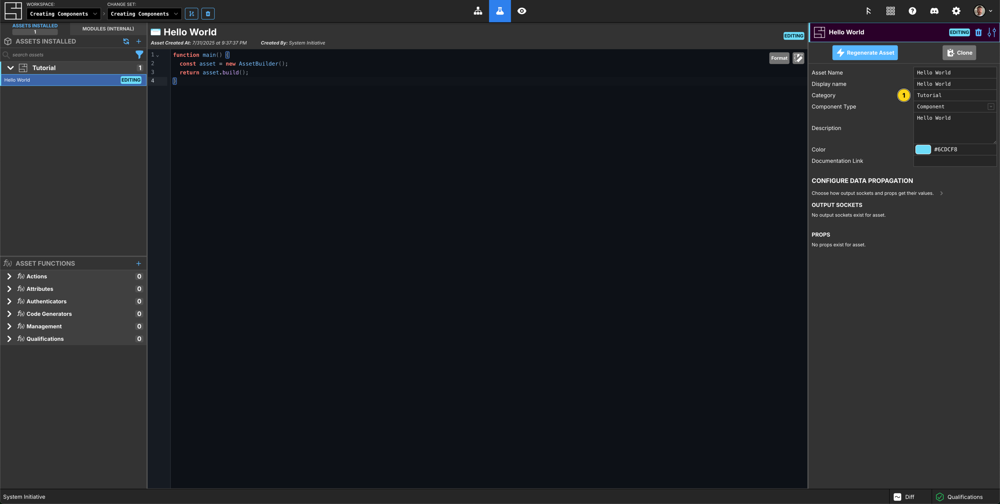
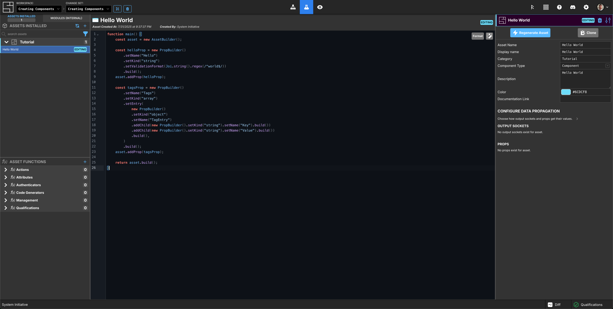
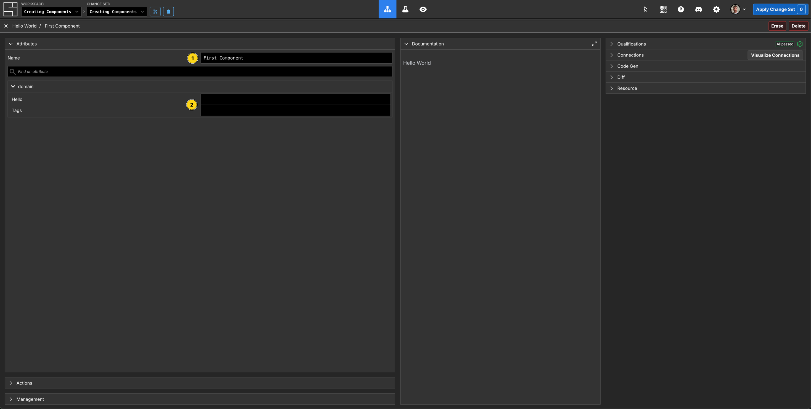
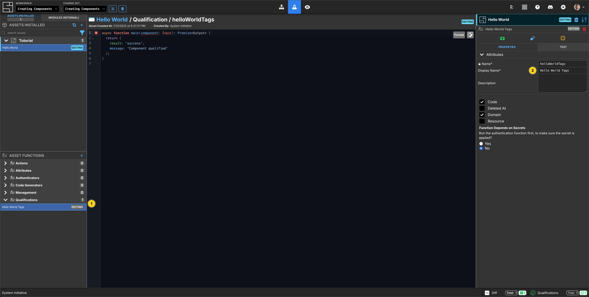
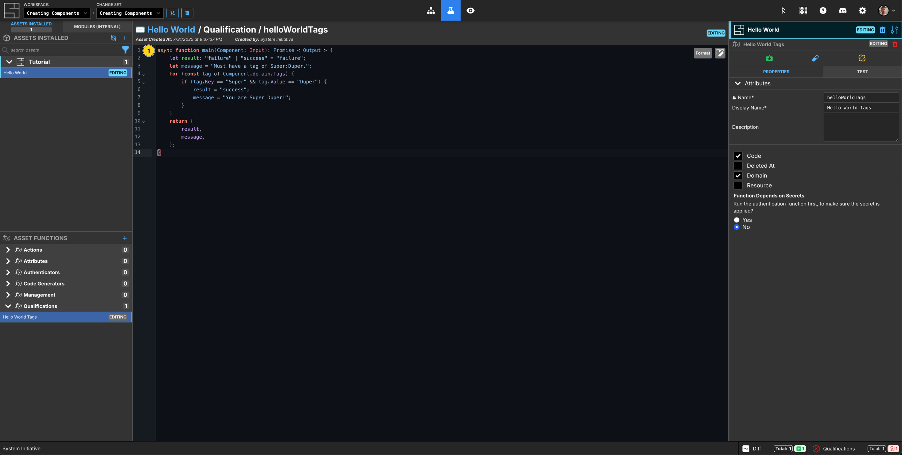
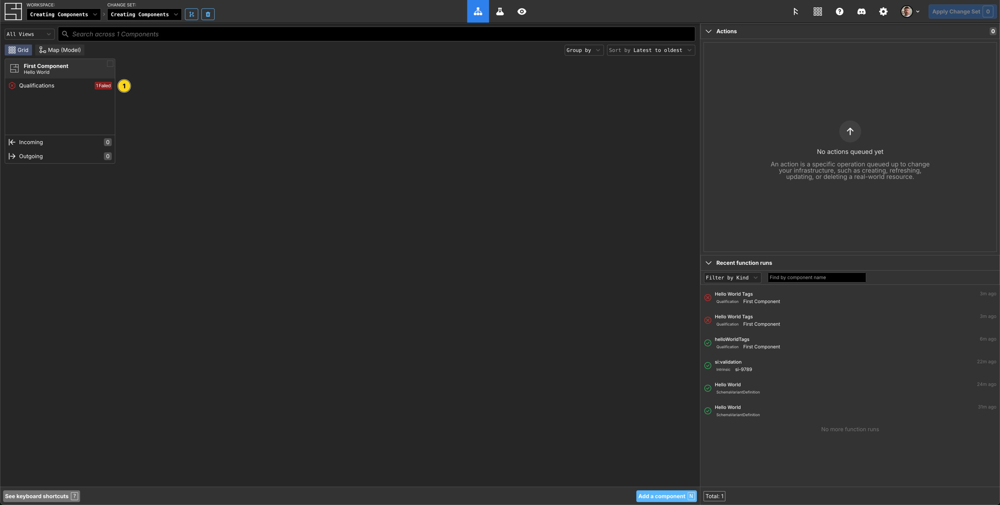

# Creating Components

This tutorial will teach you how to create new
[Components](/reference/vocabulary#components).

To follow along, you should:

1. Finish the [Getting Started tutorial](./getting-started), to have basic
   knowledge of System Initiative.

2. You should have your System Initiative workspace open in another window.

This tutorial shows you how to create Components and add functions to them. It's
focus is on introducing you to the user interface and various high level
concepts. For deeper details on writing specific function types,
[see the reference guides](../reference/index.md).

:::tip While creating Components and writing functions does require you to write
TypeScript, don't worry if you aren't familiar with the language. System
Initiative functions tend to be quite short and easy to reason with. You'll pick
it up.

:::

## Create a Change Set

Click the `Create Change Set` button.

Name your new Change Set `Creating Components`

Click the `Create Change Set` button.

## Switch to the Customize Screen

Click the `Beaker` icon to switch to the Customize screen.

## Create a new Hello World Component

Click the `New Asset` button (represented by a `+` icon) in the Assets pallete
in the left side panel.

Name your [Asset](/reference/vocabulary#asset) `Hello World`.

Click `Create Asset`.

Make sure the `Hello World` is selected in the Assets sub-panel of the left side
of the screen.

:::tip Assets are anything you might need to use in System Initiative - today,
they are synonymous with Components.

:::

## Set the Hello World meta-data



Set the `Category` to `Tutorial`.

Set the `Component Type` to `Component`.

Set the `Description` to `Hello World`.

Set the `color` to `#6cdcf8`.

## Add properties to the Hello World Schema

In the center of the screen is a text editor showing the empty Schema of your
`Hello World` Component.

The code will look like this when you are finished:

```typescript
function main() {
  const asset = new AssetBuilder();

  const helloProp = new PropBuilder()
    .setName("Hello")
    .setKind("string")
    .setValidationFormat(Joi.string().regex(/^world$/))
    .build();
  asset.addProp(helloProp);

  const tagsProp = new PropBuilder()
    .setName("Tags")
    .setKind("array")
    .setEntry(
      new PropBuilder()
        .setKind("object")
        .setName("TagEntry")
        .addChild(new PropBuilder().setKind("string").setName("Key").build())
        .addChild(new PropBuilder().setKind("string").setName("Value").build())
        .build(),
    )
    .build();
  asset.addProp(tagsProp);

  return asset.build();
}
```

This will create a Component with two properties:

- _Hello_: a string that must be all lowercase
- _Tags_: an array of Key/Value objects

Here is how you would write it yourself, step by step.

### 1. Schema function

You define your Components schema by writing a TypeScript function named
`main()`. The function begins by creating a new `AssetBuilder()`, stored in a
variable named `asset`.

:::tip This `builder` pattern is a recurring one in Schema definition. You will
create new `Builder` objects, then call functions to configure them, and finally
call `.build()` to output the final definition.

:::

### 2. The Hello property

Next you will add the `Hello` property in a variable named `helloProp`. Start by
typing `const helloProp = new` - you'll see an auto-complete pop-up with a
snippet named `New Prop Snippet`. Press `Enter`, and the code to create a new
string property will be added.

The new prop definition starts with a `new PropBuilder()`, on which you will
call functions on to configure your property.

- `setName` sets the properties name as it will appear in the Component
  attributes panel; in this case, `KeyName`.
- `setKind` specifies the datatype for this property; in this case, `string`.
- `setWidget` controls how this property is rendered in the attributes panel;
  for this property, as a `text` box. You can delete this line, as it is also
  the default.
- `setValidationFormat` adds a validation that ensures the value of Hello is
  `world`.

:::tip Hovering over a function will show you its definition. This can be very
helpful for reminding yourself of the available options!

:::

Finish your property definition by calling `.build()`.

Add the `Hello` property to the `asset` by calling `asset.addProp(helloProp);`.

### 3. The Tags property

Use the `New Prop Snippet` to generate another property, this time in a variable
named `tagsProp`.

Set the name to `Tags`.

Set the kind of the property to `array`.

Arrays have their entries defined by properties as well, using the `setEntry()`
method. The array will contain an object with two properties, `Key` and
`Value` - these are specified with the `addChild()` method on the objects
PropBuilder.

Finish your property definition by calling `.build()`.

:::tip There is a `format` button in the top right of the editor! Use it to
auto-format your function as you go.

:::

### 4. Return the compiled Asset

With all your properties added to the Schema, you can now return the compiled
asset definition with `return asset.build()`.

By now, your schema should look like this:



## Regenerate the Asset


Click the `Regenerate Asset` button in the right-side panel.

This will execute your Schema definition function and update System Initiative
with the new Schema.

## Check your new Component

Click the `Grid` icon to switch to the Grid.

Press `N` or click `Add a component` to bring up the Component search, type
`Hello World`, select and `Enter` to add your new Component.

Name your `Hello World` Component `First Component`.



You will see that you have the following properties:

- Hello, an empty string field that accepts only lowercase letters
- Tags, an array of Key/Value objects

## Add a Qualification function


Click the `Beaker` icon to switch back to the Customize screen. Ensure your
`Hello World` Asset is selected.

In the `Asset Functions` panel in the left pane, click the `Add Function`
button, represented by the blue `+` icon, and select `+ New Function`.

Select `Qualification` from the drop-down, indicating you want to create a new
Qualification function.

Name your Qualification `helloWorldTags` and click `+ Attach new function`.

## Set the Qualifications meta-data

In the Asset Functions panel on the bottom left, click `Qualifications`, this is
where your Qualification functions can be selected for editing.



Set the `Display Name` to `Hello World Tags`

## Write the Qualification function

Ensure that any `Hello World` Components have a tag with the key `Super` and
value is `Duper`.

The code will look like this when you are finished:

```typescript
async function main(Component: Input): Promise<Output> {
  let result: "failure" | "success" = "failure";
  let message = "Must have a tag of Super:Duper.";
  for (const tag of Component.domain.Tags) {
    if (tag.Key == "Super" && tag.Value == "Duper") {
      result = "success";
      message = "You are Super Duper!";
    }
  }
  return {
    result,
    message,
  };
}
```

Here is how you would write it, step by step:

### 1. Make a result and message variable

Start by declaring two variables, `result` and `message`. These will be used in
your functions return value.

The `result` variable has a TypeScript type annotation, reflecting the two valid
values for our function: `failure` or `success`, and defaults to `failure`.

### 2. Iterate over the Tags and check for the proper values

For each tag in our `Tags` array, check if it has a key named `Super` and a
value of `Duper`. If it does, set the `result` to `success` and provide a
helpful message.

### 3. Return the result and message

Finally, return the `result` and `message`.

Here is what the function should look like once written:



## Check your new Qualification function

Click the `Grid` icon to switch to the Grid.

You can see your `Hello World` Component on the Grid, and it has 1 Failed
Qualification.



To view the result, you can click the failed `Qualification` in the Recent
function runs panel, or click into the Component, then click Qualifications on
the right-side panel.


This tells you that the Qualification failed because no tag has a key named
`Super` and a value of `Duper`. So in the Tags property field, click
`+ Add "Tags" item`, then enter value for `Key` `Super` and `Value` `Duper`.
Your Qualification function has now automatically re-run and passed!


Now click the `Apply Change Set` button in the header, and then
`Apply Change Set`. Your Component is now ready to be used from HEAD.

## Create a new Change Set

Create a new Change set by clicking the Create Change Set button, and call it
`Editing Components`.

## Edit your Hello World Component

Switch to the `Customize` screen by clicking the Beaker icon in the header.

In the Asset panel on the left, click your Hello World Asset, then on the top
right, click `Edit`. This unlocks and creates an editable version of your Asset.


## Add a new property to Hello World

Add a new `Awesome` boolean property to the `Hello World` schema below the
`tagsProp`.

The code looks like this:

```typescript
const awesomeProp = new PropBuilder()
  .setName("Awesome")
  .setKind("boolean")
  .build();
asset.addProp(awesomeProp);
```

Click `Regenerate Asset` when you are done.


## Upgrade to your new Hello World Component

Click the Grid icon to view your Hello World Component. You can see it now has a
lightning bolt icon in the top right corner, this means that the Component is
`Upgradeable`. Right click the Component, and select Upgrade (or press `U`), to
upgrade to the new 'version'.


Now click the Hello World Component. You can see the new `Awesome` property in
the Attributes panel, and if you click into it, you have an option to select
`true` or `false`.


## Edit a function

Click the `Beaker` icon to switch to the Customize screen.

In the `Asset Functions` panel, click the `Hello World Tags` Qualification
function. You can see this that is not currently editable, so click the `Edit`
button in the top right in line with the Function name.


Now you have an editing version of the function, lets add a
`console.log("Hello there!)` to the function on line 2. To ensure that this
change to your function remains, you would need to Apply the Change set.

## Updating Assets from System Initiative

You can update assets as new versions are published from System Initiative from
the customize screen. You can click the `Check for Asset Updtes` button (two
arrows), then if an Asset can be updated, you will see an `Update All` button
above the Asset list, and specific assets will have the same icon next to their
entry in the list, and next to their title in the right side panel, if they have
an update available.


## Contributing Assets to System Initiative

If you have created or edited an Asset that you want to contribute to the
community, you can do so once you've applied it to your workspace.

The Asset will appear with a `Contribute` button (a cloud with an up arrow).
Select the Asset from the list, and click the icon next to the assets name in
the right side panel.


You'll be notified that the code will be reviewed, and agree that by clicking
the contribute button the code will be contributed under the Apache License.

If you do, we'll be in touch with some awesome swag for you. :)

## Clean Up

To clean up your workspace, right click the `Hello World` Component, delete, and
then Apply the Change set.

## Congratulations

In this tutorial you learned:

- How to add a new Asset
- Configure its meta-data
- Define its Schema
- Regenerate the Asset to update its Schema
- Inspect your new Asset
- Add a Qualification function
- Write Qualification function in TypeScript
- Troubleshoot your Qualification function
- Edit your Asset
- Edit an Asset function
- Update your Assets
- Contribute your Assets

## Next Steps

To learn more, explore the reference documentation:

- [Asset Schema Reference](/reference/asset/schema.md) for more information on
  how to author Asset Schema, including Input Sockets and Output Sockets.
- [Asset Function Reference](/reference/asset/function.md) for more information
  on how to write functions

## Vocabulary

In this tutorial bits of System Initiative Vocabulary will be shown with a
capital letter. All definitions for these can be found here:
[System Initative - Vocabulary](https://docs.systeminit.com/reference/vocabulary)
