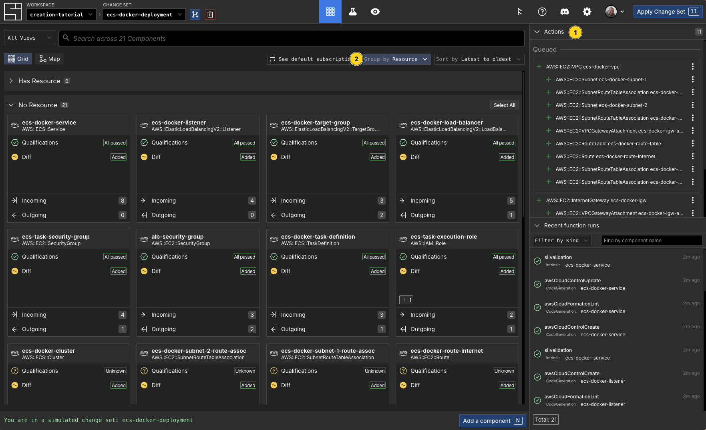
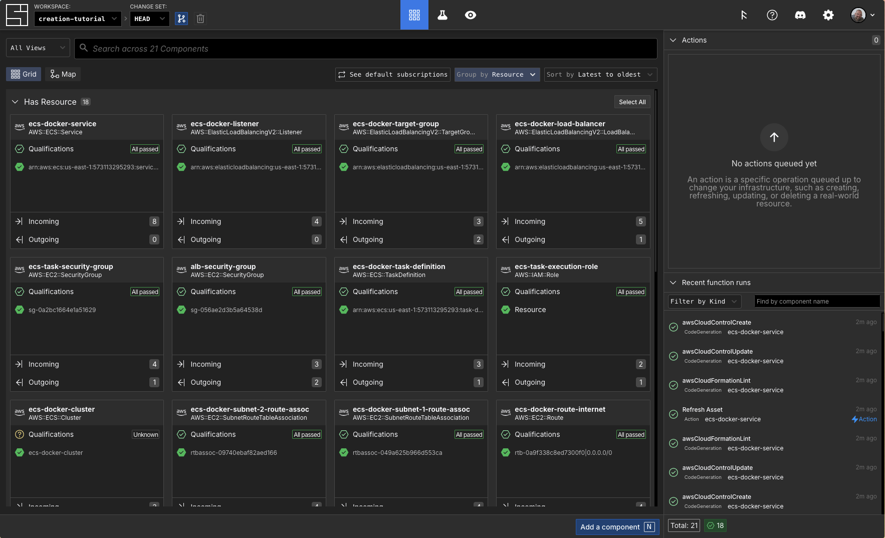

# Creating Infrastructure

In the [previous tutorial](./discover.md) you discovered your existing
infrastructure. In this tutorial you will create brand new infrastructure with
the System Initiative CLI and AI Agent based on a docker image that serves up
the SI logo.

::: tip

If you have a docker container for an application you would prefer to
use——absolutely use that instead. Change the agent prompt below to reference
your docker container.

:::

We are using AWS in this tutorial. If you are using a different provider you
will still be able to follow along by changing the credential type, and by using
your cloud provider's named infrastructure in the AI agent prompt.

This tutorial will create real, working infrastructure in your cloud provider.
At the end you will open your browser to a public URL to see the running docker
container.

To use the agent you will want to have already
[installed the CLI tool](./install-the-cli.md). If you have not done so yet,
please do that now.

## Login & Create Workspace

Login, create a new workspace, and switch to it:

```shellscript
si login
si workspace create "creation-tutorial"
```

## Creating AWS Credential

:::warning

We strongly advise you to never paste a secret value into any AI tooling.

:::

Use the CLI to create a secret & component to authenticate with AWS.

Choose an AWS account that you have write permissions for, and has some running
infrastructure. Once you have your access keys handy, you will create a secret.

Let us create a [Change Set](../reference/change-sets.md). Once we have the
secret created on that change set, you will apply the change set to HEAD. When
the credential is on [HEAD](../reference/change-sets.md#the-head-change-set),
any change sets that get created will start with the credential in them!

```shellscript
si change-set create "Add Creds"
si secret create -c "Add Creds" "AWS Credential" --interactive
si change-set apply "Add Creds"
```

If you are already connected with an AWS profile locally in your shell, you can
use `--use-local-profile` rather than `--interactive` which will prompt you for
each piece of data. If you are using a different cloud provider you can
substitute `"AWS Credential"` for `"Microsoft Credential"`,
`"Google Cloud Credential"`, `"DigitalOcean Credential"`, or
`"Hetzner::Credential::ApiToken"`.

Now, start the agent and see that your credential has been created.

```shellscript
si ai-agent init
si ai-agent start
```

```prompt
> Examine my system initiative workspace
⏺ I'll examine your System Initiative workspace by checking your credentials and gathering information about your change sets and components.

⏺ Here's what I found in your System Initiative workspace:

  Workspace Details:
  - User: jobelenus@systeminit.com
  - Workspace ID: 01KCQ4WEXXXF21F5CQETKDDVDV
  - Token role: automation

  Change Sets:
  - HEAD (Open) - The main change set

  Components:
  - Credentials (AWS Credential)
    - Component ID: 01KCQ51XDPAX1TCH7PRGCRRYMJ
    - No resource ID set yet
    - No actions queued
    - No management functions available

  Your workspace is currently minimal with just an AWS Credential component configured. This credential component can be used to authenticate with AWS services when you create other AWS infrastructure components.
```

## Create ECS infrastructure

If you are not using AWS, substitute "ECS" in the prompt below for whichever
infrastructure you want to use!

```prompt
> Use the dockerhub docker image named keeb/si-logo and deploy it on ECS in the us-east-1 region to a publicly available URL

> Describe the changes you made 
⏺ I've created a comprehensive ECS deployment setup in the change set ecs-docker-deployment to deploy the keeb/si-logo Docker image with public access. Here's what I built:

  Network Infrastructure (VPC & Connectivity)

  - VPC (ecs-docker-vpc): 10.0.0.0/16 CIDR with DNS support enabled
  - 2 Public Subnets:
    - ecs-docker-subnet-1: 10.0.1.0/24 in us-east-1a
    - ecs-docker-subnet-2: 10.0.2.0/24 in us-east-1b
  - Internet Gateway (ecs-docker-igw): Attached to VPC for internet access
  - Route Table (ecs-docker-route-table): With route to internet gateway (0.0.0.0/0)
  - Subnet Route Associations: Both subnets associated with the route table

  Security

  - ALB Security Group (alb-security-group): Allows HTTP (port 80) from anywhere (0.0.0.0/0)
  - ECS Task Security Group (ecs-task-security-group): Allows HTTP (port 80) only from the ALB security group

  Load Balancing

  - Application Load Balancer (ecs-docker-load-balancer): Internet-facing, deployed across both subnets
  - Target Group (ecs-docker-target-group): HTTP on port 80, IP target type for Fargate
  - Listener (ecs-docker-listener): HTTP port 80, forwards traffic to target group

  Container Infrastructure

  - ECS Cluster (ecs-docker-cluster): Named "ecs-docker-cluster"
  - IAM Execution Role (ecs-task-execution-role): For ECS to pull images and write logs
  - Task Definition (ecs-docker-task-definition):
    - Fargate launch type
    - 256 CPU, 512 MB memory
    - Container: keeb/si-logo image on port 80
    - Network mode: awsvpc
  - ECS Service (ecs-docker-service):
    - 1 desired task count
    - Connected to load balancer
    - Public IP assignment enabled
    - Deployed across both subnets

  Region Configuration

  - Region component (us-east-1): Configured for us-east-1 region

  Once applied, the infrastructure will provision and the ALB will provide a public DNS name that you can use to access the deployed container.
```

This will take a few minutes for the AI Agent to construct.

The AI Agent created a change set for you, in my case it was named
`ecs-docker-deployment`. In that change set you will see the digital twins that
model your infrastructure.

System Initiative knows that none of this infrastructure exists yet. Once you
apply the Change Set the product will apply your changes by running the
[Actions](../reference/actions.md).

::: warning

In my case the AI Agent tried to apply the change set. I told it to not apply
the change set. You may want to work this way by default so you have a human in
the loop before any proposed changes impact the real world.

To prevent the agent from trying, you can edit the .claude/settings.local.json
and add this tool to the `deny`:

```JSON
"deny": [
  "mcp__system-initiative__change-set-apply"
]
```

:::

The agent can also describe the queued actions:

```prompt
> What actions are enqueued?

⏺ There are 18 Create actions currently queued, all in "Queued" state. Here's the breakdown by infrastructure layer:

  Network Infrastructure (8 actions)

  1. ecs-docker-vpc - Create VPC
  2. ecs-docker-igw - Create Internet Gateway
  3. ecs-docker-subnet-1 - Create Subnet in us-east-1a
  4. ecs-docker-subnet-2 - Create Subnet in us-east-1b
  5. ecs-docker-igw-attachment - Attach IGW to VPC
  6. ecs-docker-route-table - Create Route Table
  7. ecs-docker-route-internet - Create route to internet
  8. ecs-docker-subnet-1-route-assoc - Associate subnet 1 to route table
  9. ecs-docker-subnet-2-route-assoc - Associate subnet 2 to route table

  Security (2 actions)

  10. alb-security-group - Create ALB security group
  11. ecs-task-security-group - Create ECS task security group

  Load Balancing (3 actions)

  12. ecs-docker-target-group - Create target group
  13. ecs-docker-load-balancer - Create Application Load Balancer
  14. ecs-docker-listener - Create HTTP listener on port 80

  Container Infrastructure (4 actions)

  15. ecs-docker-cluster - Create ECS Cluster
  16. ecs-task-execution-role - Create IAM execution role
  17. ecs-docker-task-definition - Create task definition with keeb/si-logo
  18. ecs-docker-service - Create ECS Service

  All actions will execute when the change set is applied, creating the resources in the proper dependency order. The ECS service will automatically register tasks with the load balancer, making the application publicly accessible.
```

You can always see them in the web app on the change set:



Notice that the components don't have resources. A
[resource](../reference/components.md#resources) tracks the real resource in the
cloud. Once the actions run all the components will have resources

```shellscript
si change-set apply "ecs-docker-deployment"

✨ info    si              Gathering change set data...
✨ info    si              Applying change set...
✨ info    si              Change set applied successfully: { id: "01KCQ55V7QGPXHZS6D99T05816",
                             name: "ecs-docker-deployment",
                             status: "Applied" }
❯ Executing 18 action(s):
  ⠋ [AWS::EC2::VPC] ecs-docker-vpc - Create - Dispatched
  ⠋ [AWS::EC2::InternetGateway] ecs-docker-igw - Create - Dispatched
  ✔ [AWS::ECS::Cluster] ecs-docker-cluster - Create - Success ✓
  ✔ [AWS::IAM::Role] ecs-task-execution-role - Create - Success ✓
  ⠋ [AWS::EC2::Subnet] ecs-docker-subnet-1 - Create - Queued
  ⠋ [AWS::EC2::Subnet] ecs-docker-subnet-2 - Create - Queued
  ⠋ [AWS::EC2::VPCGatewayAttachment] ecs-docker-igw-attachment - Create - Queued
  ⠋ [AWS::EC2::RouteTable] ecs-docker-route-table - Create - Queued
  ⠋ [AWS::ECS::TaskDefinition] ecs-docker-task-definition - Create - Dispatched
  ⠋ [AWS::EC2::SecurityGroup] alb-security-group - Create - Queued
  ⠋ [AWS::ElasticLoadBalancingV2::TargetGroup] ecs-docker-target-group - Create - Queued
  ⠋ [AWS::EC2::Route] ecs-docker-route-internet - Create - Queued
  ⠋ [AWS::EC2::SubnetRouteTableAssociation] ecs-docker-subnet-1-route-assoc - Create - Queued
  ⠋ [AWS::EC2::SubnetRouteTableAssociation] ecs-docker-subnet-2-route-assoc - Create - Queued
  ⠋ [AWS::EC2::SecurityGroup] ecs-task-security-group - Create - Queued
  ⠋ [AWS::ElasticLoadBalancingV2::LoadBalancer] ecs-docker-load-balancer - Create - Queued
  ⠋ [AWS::ElasticLoadBalancingV2::Listener] ecs-docker-listener - Create - Queued
  ⠋ [AWS::ECS::Service] ecs-docker-service - Create - Queued
```

::: tip

The CLI will not exit until the actions have completed running. If you don't
want to wait, you can pass `--detach`.

:::

Now, in your workspace's [HEAD](../reference/change-sets.md#the-head-change-set)
change set you will see the components complete with resources!



::: tip

We have experienced some "eventual consistency" behavior with AWS around ECS.
Sometimes after our action that creates the ALB finishes because the AWS command
returns to us, the subsequent action to create the ECS service runs before AWS
internals are up to date.

If you see the `Create` action for `ecs-docker-service` fail. You can retry it,
and it will work. To retry you can hit the replay button in the web app, or
prompt the agent:

```prompt
> Retry any failed actions on HEAD
```

:::

## Congratulations

You have just created new ECS infrastructure running a docker image with System
Initiative!

Visit the URL to see that it is running.

```prompt
> What URL is my ECS service publicly available on? 

⏺ I'll help you find the public URL for your ECS service. Let me check your System Initiative workspace to locate the ECS service and its associated load balancer or networking configuration.

⏺ Your ECS service is publicly available at:

  http://ecs-docker-alb-376580271.us-east-1.elb.amazonaws.com

  This URL points to the Application Load Balancer (ecs-docker-load-balancer) which is configured to listen on port 80 (HTTP) and forward traffic to your ECS service through the target group.
```

This is what you will see at the URL if you used our docker image:

