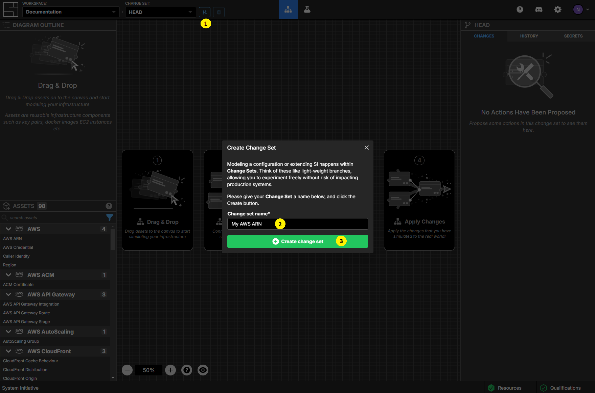
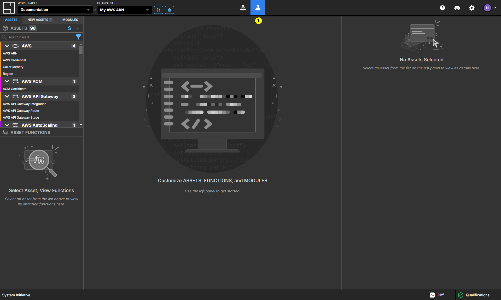
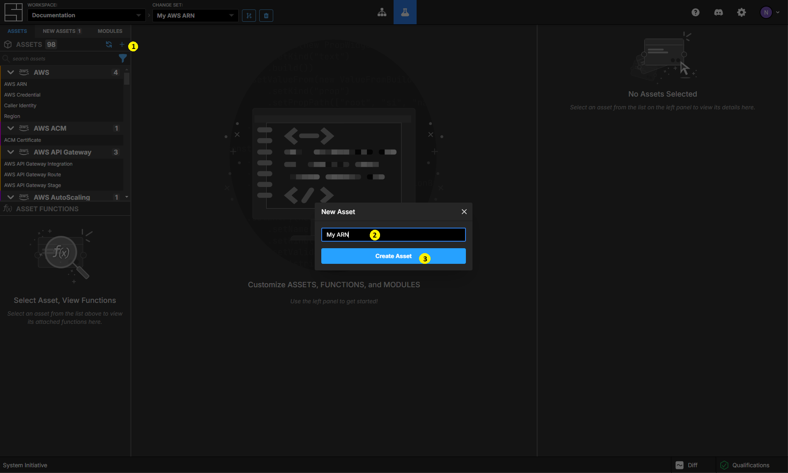
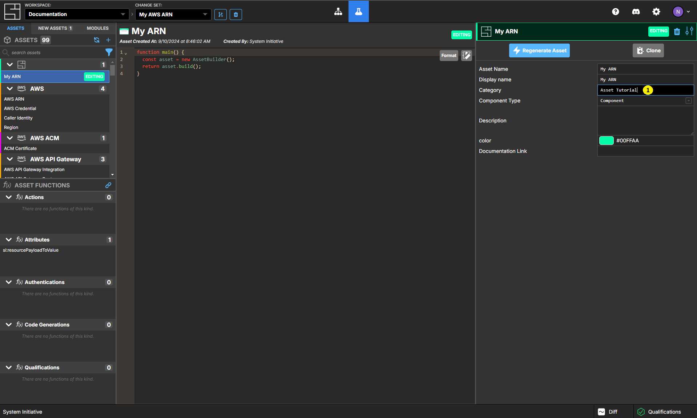
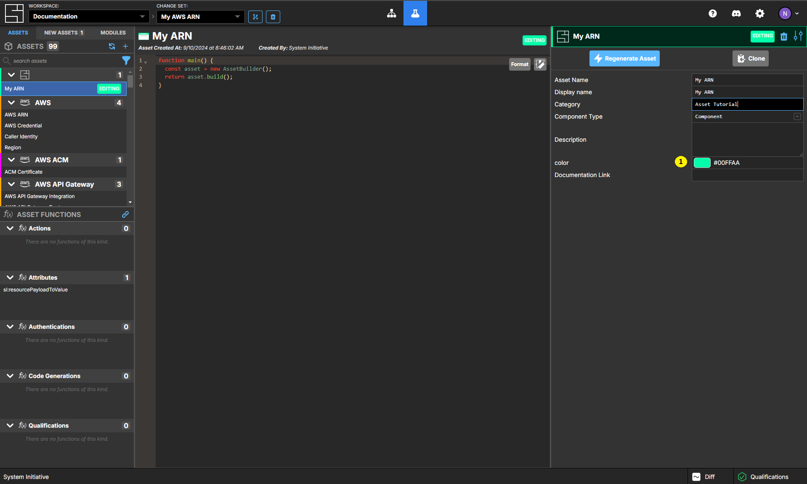
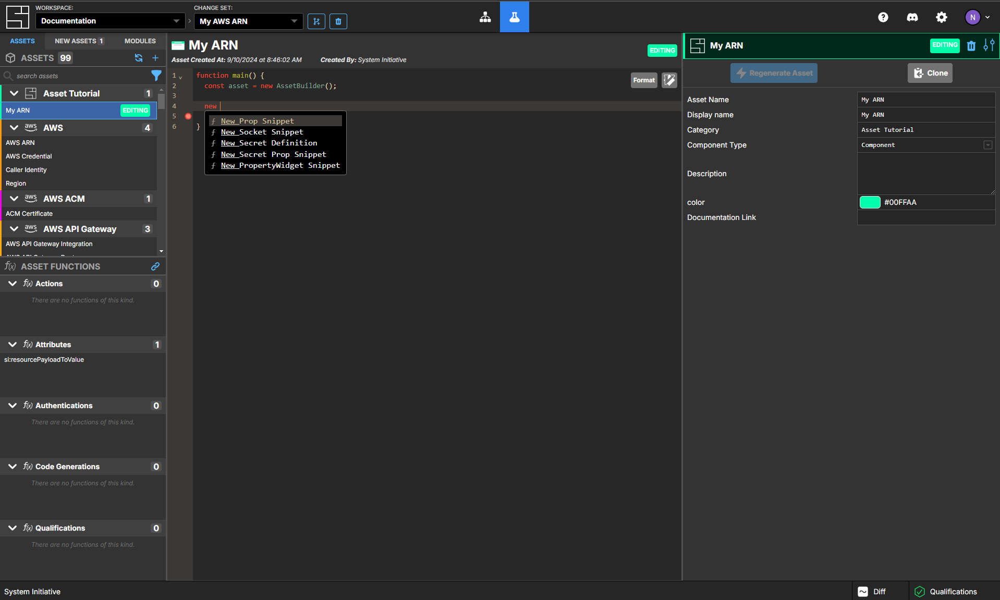
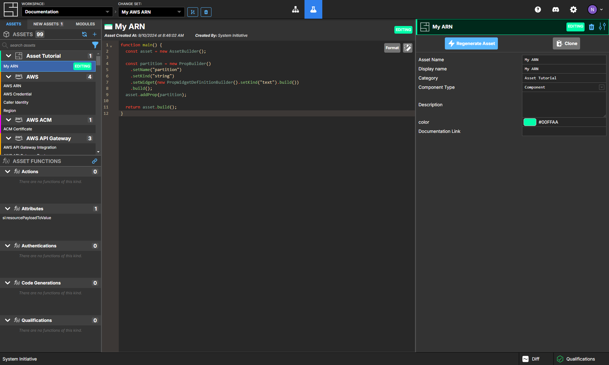

# Creating a new asset

This tutorial will teach you how to create a new asset. The asset models an
\[AWS
ARN\](<https://docs.aws.amazon.com/IAM/latest/UserGuide/reference-arns.html>).
You will need to know basic programming concepts to follow along.

## Create a new change set



Create a new change set called `My AWS ARN`.

## Go to the customize screen



Go to the customize screen by clicking on the Beaker icon. This is where you can
create new assets, or customize existing assets.

## Create a new asset



In the upper-left side of your screen is an panel containing all the Assets in
your workspace. Click the + icon to create a new asset - name it `My ARN` and
click Create Asset.

## Give your asset a Category



The properties for your new Asset appear in the right side panel. Set the
category property for your asset to `Asset Tutorial`.

## Select a color



Select a color you like by clicking the `color` property.

## The schema

An asset schema defines the attributes and sockets of a component. Yours looks
like this by default:

```typescript
function main() {
  const asset = new AssetBuilder();

  return asset.build();
}
```

## Mapping an ARN to Attributes

To understand the attributes your component needs, you can refer to the
[AWS ARN documentation](https://docs.aws.amazon.com/IAM/latest/UserGuide/reference-arns.html).
Here is an example ARN for an SNS Topic:

```
arn:aws:sns:us-east-1:123456789012:example-sns-topic-name
```

ARNs are a colon separated string identifier - they have six parts, five of
which are meaningful:

- The string "arn"
- A partition
- A service
- A region
- An account-id
- A resource-id

## Adding the partition attribute


`To add your partition attribute, click on line 3, then type`new`. You will see an auto-complete dropdown. Select`New
Prop Snippet` by clicking or pressing the down arrow and then enter.

Your definition will look like this:

```typescript
function main() {
  const asset = new AssetBuilder();

  const propName = new PropBuilder()
    .setName("name")
    .setKind("string")
    .setWidget(new PropWidgetDefinitionBuilder().setKind("text").build())
    .build();

  return asset.build();
}
```

Set the name of the new attribute by setting the argument to the `setName()`
function to `"partition"`.

Then add your new prop to your asset. First, rename the variable from `propName`
to `partition`. Then, below the semicolon that ends your property definition,
add `asset.addProp(partition)`.


```typescript
function main() {
  const asset = new AssetBuilder();

  const partition = new PropBuilder()
    .setName("partition")
    .setKind("string")
    .setWidget(new PropWidgetDefinitionBuilder().setKind("text").build())
    .build();
  asset.addProp(partition);

  return asset.build();
}
```

## Regenerate your updated schema


Execute your updated schema definition function by clicking the
`Regenerate Asset` button.

## Check your work


You can check your work by going to the Model screen. Then add a new `My ARN`
component to the configuration diagram. It will have only one attribute -
`partition`. It will be the color you chose. It will be in the category you set.
