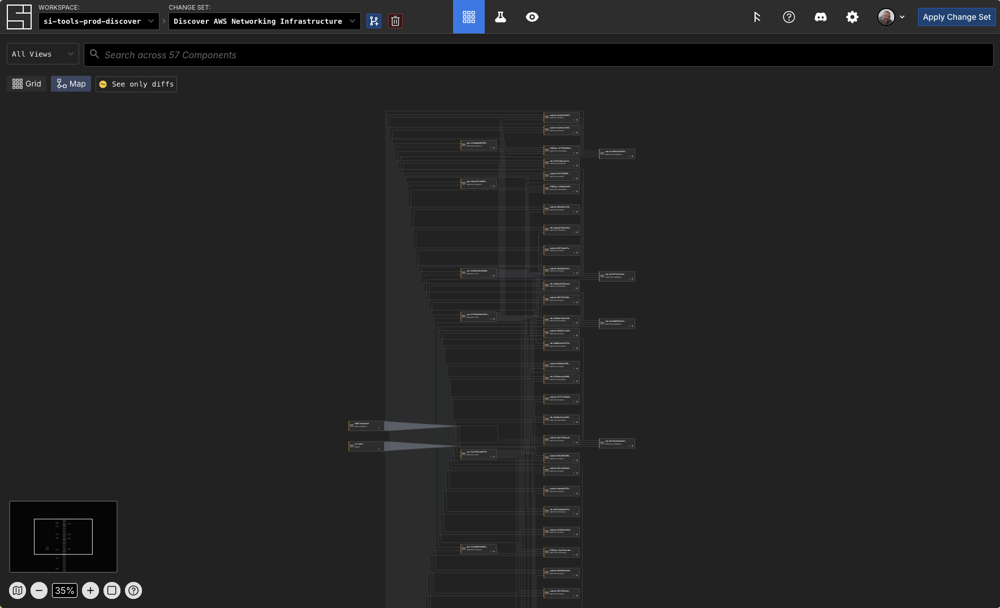
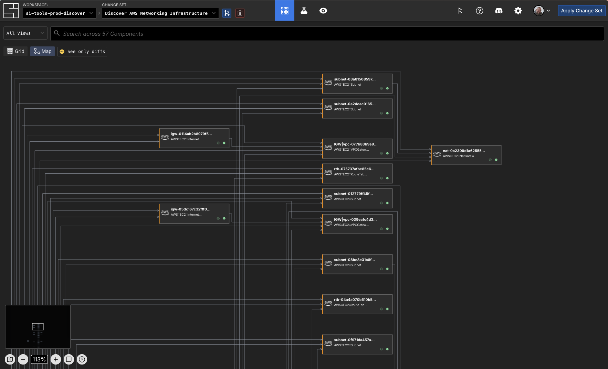
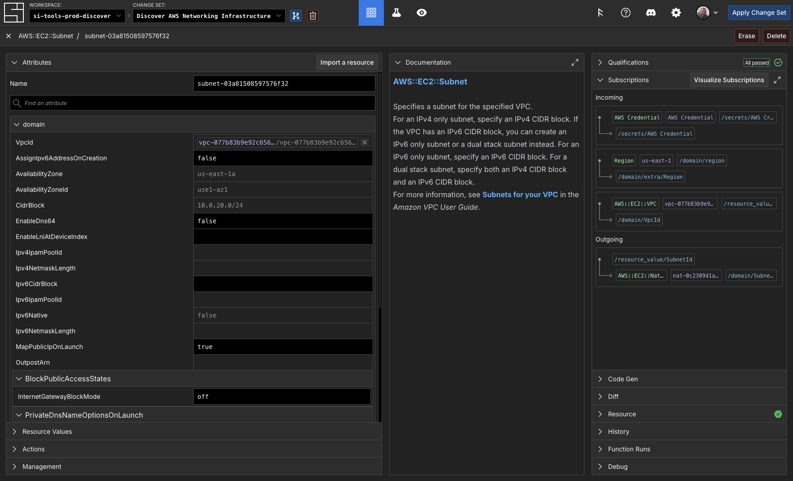

# Discovery

This tutorial will teach you have to discover & analyze your existing
infrastructure on AWS using the System Initiative AI agent. Note: while we are
using AWS in this particular example, feel free to use any of our supported
cloud providers. There is very little about this tutorial that is AWS specific.

System Initiative uses a "1:1" modeling approach. What this means in practice is
that each component in System Initiative reflects a single piece of cloud
infrastructure that can be modified by an API. There is no abstraction that
"hides" the cloud details. Each component will have every possible cloud
configuration available to you.

The discovery process will take the real resources in your cloud account and
create their digital twin. Each component will be subscribed to the related
components that provide their values.

To use the agent you will want to have already
[installed the CLI tool](./install-the-cli.md). If you have not done so yet,
please do that now.

## Login & Create Workspace

You will first login and create a new workspace to model your infrastructure:

```shellscript
si login
si workspace create "discovery-tutorial"
si workspace switch
```

Select your new workspace from the list in the switch command options.

:::tip

After each `si workspace switch` invocation, you will want to re-run the AI
agent initialization command to populate the agent with the new workspace API
token.

```shellscript
si ai-agent init
```

:::

Now start your agent

```shellscript
si ai-agent start
```

To demonstrate that you are on the new workspace and connected successfully, you
can run this prompt:

```prompt
> Examine my system initiative workspace 

⏺ I'll examine your System Initiative workspace by checking the connection and exploring what's currently configured.

⏺ System Initiative Workspace Overview

  Connection Status: ✓ Connected successfully

  Account Details:
  - User: jobelenus@systeminit.com
  - Workspace ID: 01KCMC5GGDMT882NWPWHVEZPTG
  - Token Role: automation

  Change Sets:
  - HEAD (Open) - ID: 01KCMC5GMAZ5NRRT75NGW7HKVM

  Components: None (workspace is empty)

  Actions: None queued

  Workspace URL: https://app.systeminit.com/n/01KCMC5GGDMT882NWPWHVEZPTG/01KCMC5GMAZ5NRRT75NGW7HKVM/h

  Your workspace is currently empty with no components or infrastructure configured.
```

Zero components is exactly what I would expect in my brand new workspace!

## Creating AWS Credential

:::warning

We strongly advise you to never paste a secret value into any AI tooling.

:::

Now, you will use the CLI to create a secret & component to authenticate with
AWS. Choose an AWS account that you have at least read permissions for, and has
some running infrastructure. Once you have your access keys handy, you will
create a secret:

```shellscript
si secret create "AWS Credential" --interactive

Creating change set: Create AWS Credential - 1765917440028
✨ info    si              Secret type "AWS Credential" not found. Attempting to install...
✨ info    si              Found schema "AWS Credential", installing...
✨ info    si              ✓ Successfully installed "AWS Credential" schema
✨ info    si              Re-querying secret definitions...
...
✨ info    si              
✨ info    si              Creating AWS Credential component "AWS Credential"...
✨ info    si              ✓ Component created with ID: 01KCME4SCY4GPA5C239F2DG361
✨ info    si              Creating secret data...
✨ info    si              ✓ Secret created with ID: 01KCME4SQB0NNKKPVDHHHSA7CQ
✨ info    si              Attaching secret to component...
✨ info    si              ✓ Secret attached to component
✨ info    si              
✨ info    si              ✓ Credential created successfully!
✨ info    si                Component ID: 01KCME4SCY4GPA5C239F2DG361
✨ info    si                Secret ID: 01KCME4SQB0NNKKPVDHHHSA7CQ
✨ info    si                Secret Name: AWS Credential
✨ info    si                Change Set ID: 01KCME3G8ACJJR7K8YBEKYEDXB
✨ info    si              
✨ info    si              Next steps:
✨ info    si                1. Apply the change set to make the credential available
✨ info    si                2. Other components can now use this credential
```

If you are already connected with an AWS profile locally in your shell, you can
use `--use-local-profile` rather than `--interactive` which will prompt you for
each piece of data. If you are using a different cloud provider you can
substitute `"AWS Credential"` for `"Microsoft Credential"`,
`"Google Cloud Credential"`, `"DigitalOcean Credential"`, or
`"Hetzner::Credential::ApiToken"`.

You will see that the AI agent automatically created a new
[Change Set](../reference/change-sets.md) since only HEAD is in the workspace.
You will want to pay attention to change set creations so you can apply them
when ready. Let's apply that change set, copy the ID in your output and make the
call to apply it:

```shellscript
si change-set apply 01KCME3G8ACJJR7K8YBEKYEDXB

✨ info    si              Gathering change set data...
✨ info    si              Applying change set...
✨ info    si              Change set applied successfully: { id: "01KCME3G8ACJJR7K8YBEKYEDXB",
                             name: "Create AWS Credential - 1765917440028",
                             status: "Applied" }
✨ info    si              No enqueued actions found.
```

We can confirm this was applied and the component is now on
[HEAD](../reference/change-sets.md#the-head-change-set) with the agent and the
prompt we used before:

```prompt
> Examine my system initiative workspace 
⏺ I'll examine your System Initiative workspace. Let me start by validating the connection and gathering information about your workspace.

⏺ Your System Initiative Workspace

  Workspace Details:
  - User: jobelenus@systeminit.com
  - Workspace ID: 01KCMC5GGDMT882NWPWHVEZPTG
  - Token Role: automation

  Change Sets:
  - HEAD (Open) - This is your main change set

  Components:
  1. AWS Credential (ID: 01KCME4SCY4GPA5C239F2DG361)
    - Schema: AWS Credential
    - Status: Configured but no resource ID set
    - No queued actions
    - No management functions available

  Actions Queue:
  - Empty - no pending actions

  Your workspace is currently minimal with just an AWS Credential component configured. This is typically used as a base component to provide authentication for other AWS resources.
```

## Find Your Networking Infrastructure.

You will use the AI agent to discover your networking infrastructure with a
prompt like this:

```prompt
> Discover my networking infrastructure from my AWS account. Pay close attention to VPCs, subnets, routes, and gateways.
⏺ I'll help you discover your networking infrastructure from AWS. Let me create a plan and start discovering your VPCs, subnets, routes, and gateways.

⏺ AWS Networking Infrastructure Discovery Complete

  I've successfully discovered your AWS networking infrastructure from us-east-1. Here's a comprehensive summary:

  Summary by Resource Type

  VPCs: 4 discovered
  - vpc-0a279a3cdb1873f6e (172.31.0.0/16) - Default VPC
  - vpc-039eafc4d3940bc6c (12.0.0.0/16) - Tagged "tools"
  - vpc-05d8799c3153c2e62
  - vpc-077b83b9e92c65600

  Subnets: 23 discovered
  Distributed across the VPCs, including both public and private subnets

  Route Tables: 14 discovered
  Managing routing for your VPCs and subnets

  Internet Gateways: 4 discovered
  - igw-014cada4439313afa
  - igw-05dc167c32fff030e
  - igw-0114ab2b8979f5ea8
  - igw-0ce14881b96bffa15

  NAT Gateways: 6 discovered
  - nat-013f99f37fa999358
  - nat-0ec944ff125a43d8d
  - nat-0c2309d1a62555ab7
  - nat-0e71375d71a25adbe
  - nat-0b57da88d9a5ae49d
  - nat-0d770e29ee0d378ad

  VPC Gateway Attachments: 4 discovered
  One IGW attachment for each VPC

  Key Findings

  1. Multi-VPC Architecture: You have 4 VPCs, including the default VPC (172.31.0.0/16) and a "tools" VPC (12.0.0.0/16)
  2. High Availability: With 6 NAT Gateways and 23 subnets, your infrastructure appears to be distributed across multiple availability zones
  3. Internet Connectivity: Each VPC has an Internet Gateway attached, providing internet access
  4. Route Discovery Note: Individual routes within route tables could not be discovered in bulk due to AWS CloudControl API limitations (requires RouteTableId parameter). Route details are contained within the route table components.

  View Your Infrastructure

  All discovered resources have been imported into the change set "Discover AWS Networking Infrastructure". You can view them in the System Initiative web UI:

  Map View: https://app.systeminit.com/n/01KCMC5GGDMT882NWPWHVEZPTG/01KCMF5T840SME8S7QSGWZXND5/h?map=1
```

Depending on the amount of infrastructure you are discovering, this may take a
few minutes.

### Viewing Your Infrastructure

For this specific discovered infrastructure, this is what you would see if you
went to the Map view at the URL the AI agent above returned to you:




You can see in our example that the discovery process created subscriptions to
other components based on their attribute's values in the cloud:



Let's apply this change set before we forget:

```shellscript
si change-set apply "Discover AWS Networking Infrastructure"
✨ info    si              Gathering change set data...
✨ info    si              Applying change set...
✨ info    si              Change set applied successfully: { id: "01KCMF5T840SME8S7QSGWZXND5",
                             name: "Discover AWS Networking Infrastructure",
                             status: "Applied" }
✨ info    si              No enqueued actions found.
```

:::info

There are no enqueued actions with this apply operation.
[Actions](../reference/actions.md) are how System Initiative updates your cloud
infrastructure with your modeling changes. In discovery, there is nothing to
create and no actions to run.

:::

## Analyze Your Infrastructure

System Initiative's AI Agent is here to help you understand, interpret and
manipulate your infrastructure and data model against internal or external
policies and procedures. For example, let's ask it to help us understand the
resiliency or security implications of using the VPCs from the lens of AWS Best
Practices.

```prompt
> Review VPCs against AWS Best Practices and suggest any resiliency or security improvements. Generate a 50 line or less summary.
⏺ I'll analyze your VPCs against AWS best practices. Let me gather detailed information about each VPC and its associated resources.

⏺ AWS VPC Best Practices Assessment - Summary

  VPC Inventory

  4 VPCs Analyzed:
  1. vpc-0a279a3cdb1873f6e (172.31.0.0/16) - Default VPC
  2. vpc-039eafc4d3940bc6c (12.0.0.0/16) - "tools"
  3. vpc-05d8799c3153c2e62 (10.1.0.0/16) - "main-vpc" (EKS cluster)
  4. vpc-077b83b9e92c65600 (10.0.0.0/16) - Untagged

  Security Concerns

  CRITICAL:
  - Default VPC (172.31.0.0/16) still active - DELETE per AWS best practices
  - vpc-077b83b9e92c65600 has no resource tags - violates governance/cost tracking
  - Non-RFC1918 CIDR 12.0.0.0/16 on "tools" VPC - potential routing conflicts

  HIGH:
  - No VPC Flow Logs detected - enable for security monitoring/forensics
  - Default security groups present - restrict or delete unused defaults
  - MapPublicIpOnLaunch enabled on multiple subnets - minimize public exposure

  Resiliency Strengths

  - 6 NAT Gateways deployed - excellent multi-AZ redundancy
  - Subnets span 3+ availability zones (1a, 1b, 1d)
  - Public/private subnet separation on "tools" VPC

  Recommended Improvements

  Immediate Actions:
  1. Delete default VPC (vpc-0a279a3cdb1873f6e) if unused
  2. Enable VPC Flow Logs on all production VPCs → CloudWatch/S3
  3. Add mandatory tags to vpc-077b83b9e92c65600 (Owner, Environment, CostCenter)
  4. Review 12.0.0.0/16 CIDR on "tools" VPC - migrate to 10.x or 192.168.x range

  Security Enhancements:
  5. Implement Network ACLs for subnet-level defense-in-depth
  6. Enable AWS Network Firewall for inspection of inter-VPC traffic
  7. Configure VPC endpoints for AWS services (S3, DynamoDB) - reduce NAT costs
  8. Audit default security groups - remove all inbound/outbound rules or delete

  Resiliency & Cost:
  9. Consider IPv6 enablement for future-proofing
  10. Review NAT Gateway placement - 6 gateways may be over-provisioned (cost ~$130/month each)
  11. Implement AWS Transit Gateway if VPCs need peering/inter-VPC routing
  12. Enable DNS query logging for threat detection

  Compliance:
  - Tag all resources with Environment (prod/dev), Owner, Application
  - Document VPC peering connections if any exist
  - Establish CIDR allocation strategy to prevent IP overlap in future VPCs
```

## Validating Policies

We can use NIST as an example to create and analyze a policy with the AI agent:

```prompt
> Generate a control document based on NIST standards for the infrastructure in my system initiative workspace 

⏺ I'll help you generate a NIST control document for your System Initiative infrastructure. Let me start by exploring your workspace to understand what infrastructure components you have.

⏺ I've successfully generated a comprehensive NIST 800-53 control document for your System Initiative infrastructure. The document has been saved to NIST-800-53-Control-Document.md.

  Summary

  I analyzed your AWS infrastructure and found:
  - 57 total components in the us-east-1 region
  - 5 VPCs, 30+ Subnets, 5 NAT Gateways, 5 Internet Gateways, 15+ Route Tables

  Key Findings

  The document includes:

  1. Executive Summary - Infrastructure overview and component inventory
  2. 15 NIST 800-53 Controls mapped across 7 control families (AC, AU, CA, CM, CP, IA, SC)
  3. Risk Assessment - Critical, high, and medium-risk findings identified
  4. Implementation Status - Only 33% compliance (9 of 15 controls partially implemented)
  5. Prioritized Recommendations - Immediate (0-30 days), short-term (30-90 days), and long-term (90+ days) actions

  Critical Gaps Identified

  1. No Security Groups configured beyond defaults
  2. No audit logging (VPC Flow Logs, CloudTrail)
  3. No MFA enforcement evidence
  4. No encryption key management
  5. No continuous monitoring configured

  Immediate Action Items

  The document recommends starting with:
  - Enable VPC Flow Logs for all 5 VPCs
  - Enable AWS CloudTrail
  - Configure Security Groups with least-privilege rules
  - Enforce MFA for IAM users
  - Enable AWS Config for compliance monitoring

  The document is ready for review by your security and compliance teams.
```

You can open `NIST-800-53-Control-Document.md`, or your equivalent file, to see
a very detailed report.

If your organization has policies for their infrastructure the AI Agent can use
those written down policies directly, without having to re-implement it in
declarative IaC, or some other programming language. Try it out!

## Congratulations

You have discovered your infrastructure with System Initiative! Through the
power of discovery and our AI agent you have analyzed that infrastructure for
any changes or fixes you might want to make. This is a powerful and repeatable
loop that you will use in many scenarios:

- During an incident you can discover infrastructure that is having a problem
  and ask the agent to investigate what could be wrong
- Resolve any drift by updating your System Initiative workspaces with changes
  in your production infrastructure
- As your internal policies change you can continually check your your
  infrastructure

In the next tutorial you will create new infrastructure!
