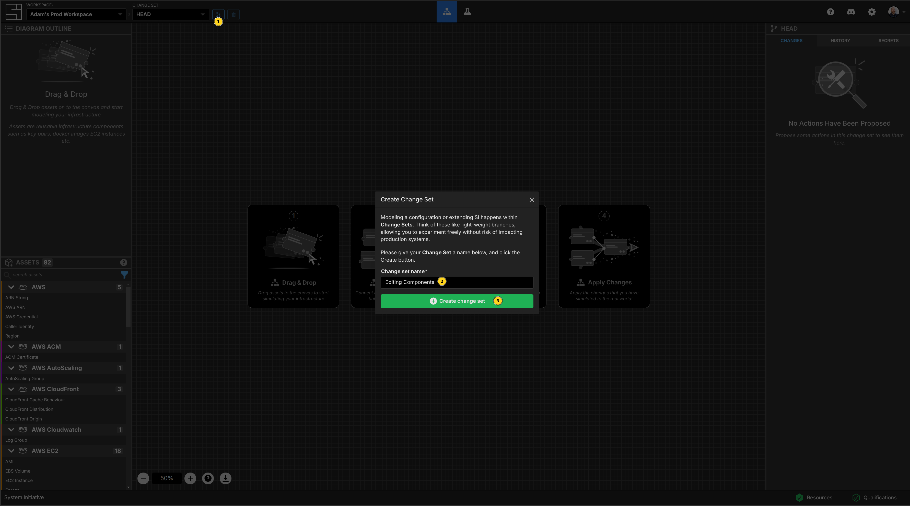
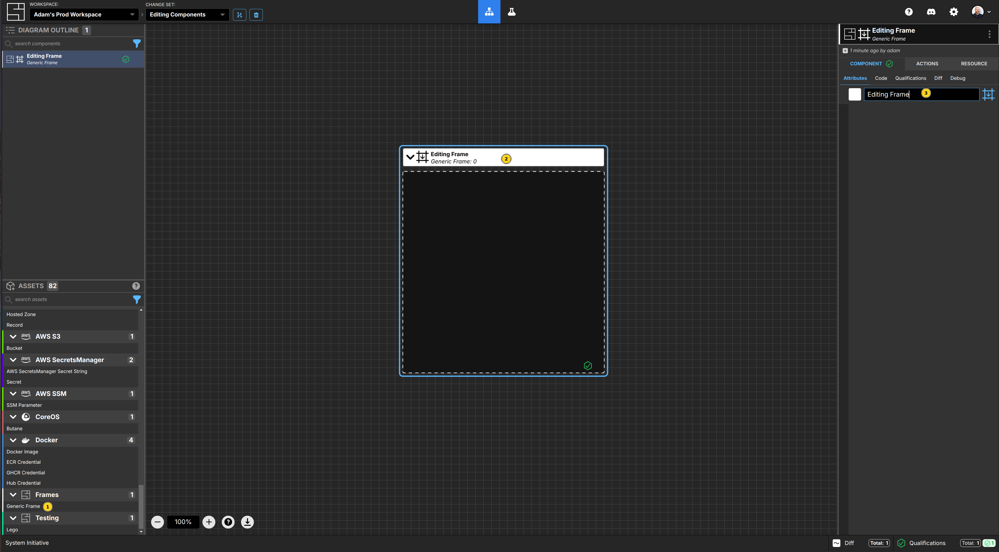
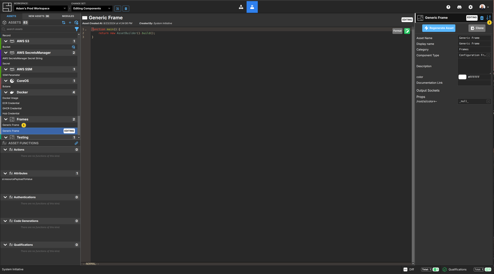
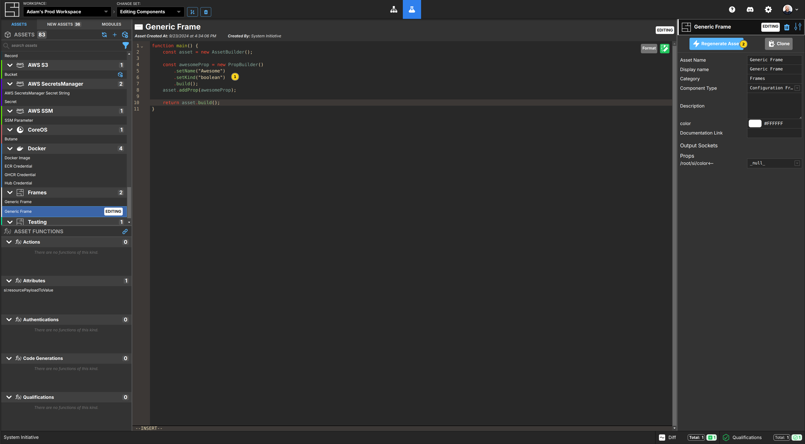
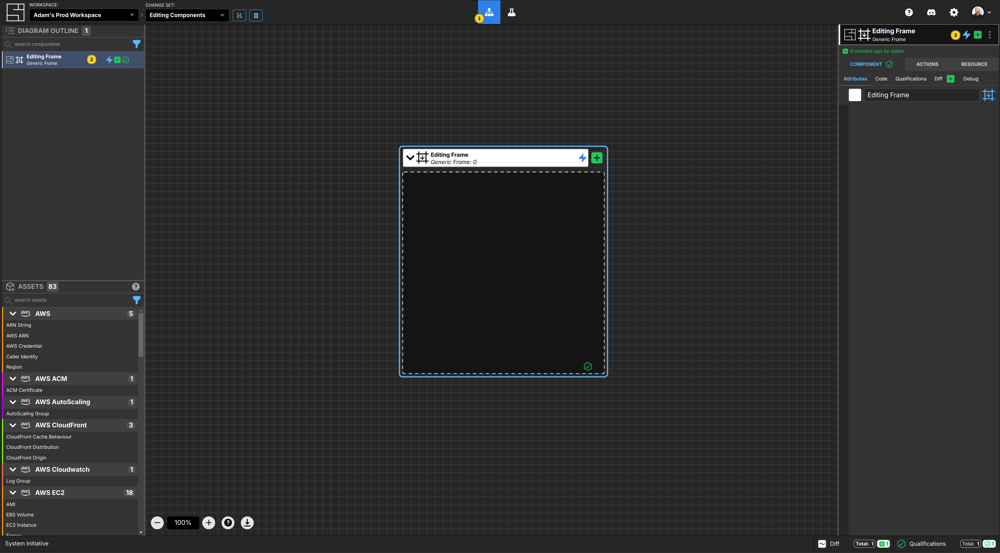
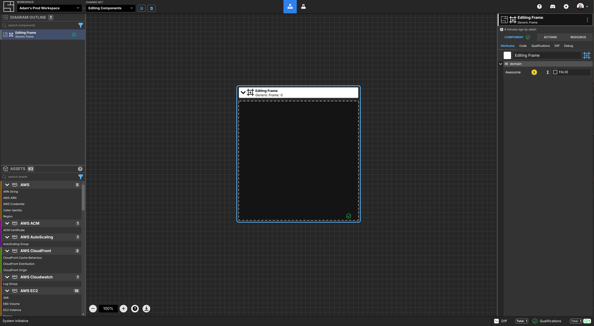
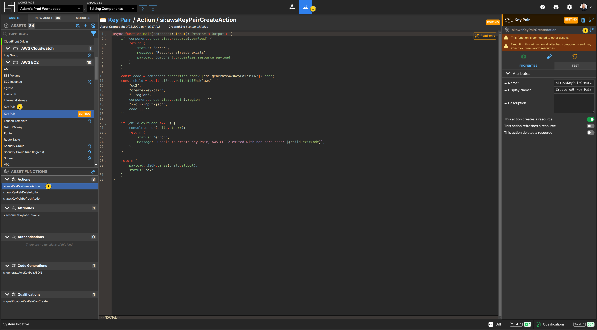
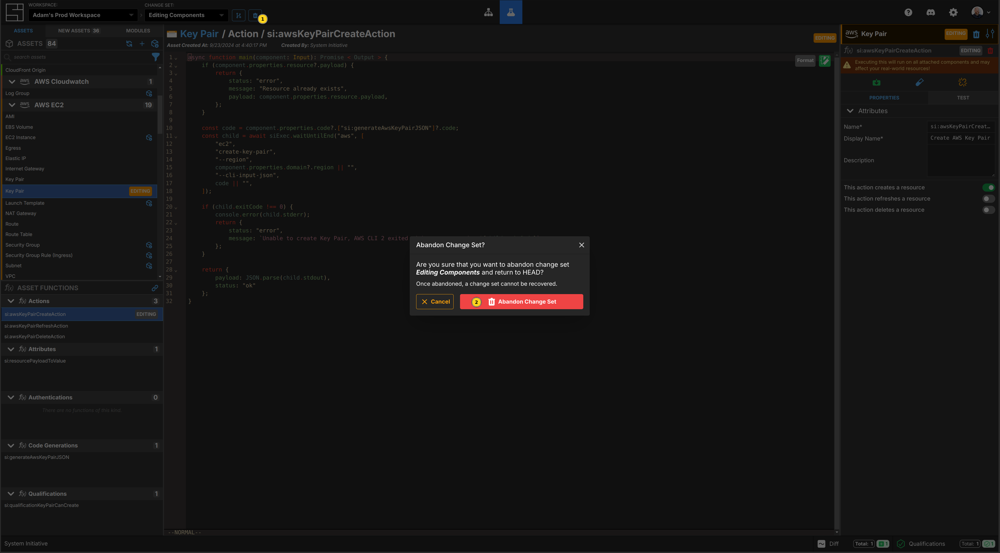
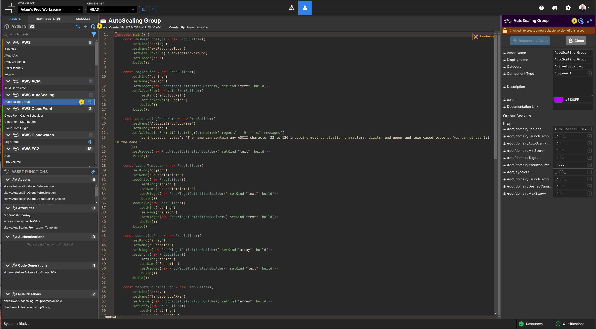
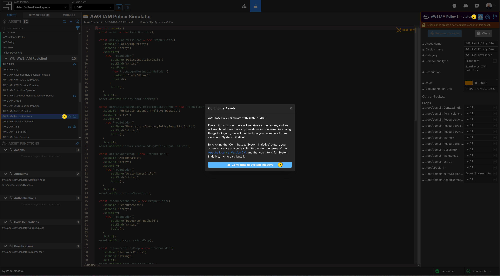

# Editing, Updating, Installing and Contributing Components

This tutorial will teach you how to create new
[Components](/reference/vocabulary#components).

To follow along, you should:

1. Finish the [Getting Started tutorial](./getting-started), to have basic
   knowledge of System Initiative.

2. Finished the [Creating Components tutorial](./creating-components.md).

3. You should have your System Initiative workspace open in another window.


This tutorial shows you how to edit existing Components and functions, and
contribute them back to the community. It's focus is on introducing you to the
user interface and various high level concepts. For deeper details on writing
specific function types, [see the reference guides](../reference/index.md).

## Create a Change Set



Click the create Change Set button.

Name your new Change Set `Editing Components`

Click the `Create Change Set` button.

## Create a Generic Frame



Click the `Generic Frame` from the Asset panel, then place it on the Diagram canvas.

Name it `Editing Frame`.

## Switch to the Customize Screen


Click the `Beaker` icon to switch to the customize screen.

## Edit the Generic Frame Schema



Select the `Generic Frame` Asset from the Assets panel in the left of the customize screen.

Click the `Edit` button, in the upper-right side of the meta-data.

This will create a new `Editing` version of the Generic Frame.

## Add a new property to the Generic Frame



Add a new `Awesome` boolean property to the `Generic Frame`.

The code will look like this when you are done:

```typescript
function main() {
    const asset = new AssetBuilder();

    const awesomeProp = new PropBuilder()
        .setName("Awesome")
        .setKind("boolean")
        .build();
    asset.addProp(awesomeProp);

    return asset.build();
}
```

Click `Regenerate Asset` when you are done.

## Upgrade to your new Generic Frame



Click the `Graph` icon to switch to the modeling screen.

Select your `Editing Frame` generic frame.

Notice that a `Lightning Bolt` icon appears next to your generic frame in the
diagram outliner, on the Diagram, and next to its title in the attribute panel.
This indicates that there is a new version of the Generic Frame asset which
this Component can be upgraded to.

Click the `Upgrade` icon in the attribute panel to upgrade your `Editing Frame`.



It will now have a property named `Awesome` with a true/false check-box!

## Edit a function



Click the `Beaker` icon to switch to the customize screen.

Select the `Key Pair` Asset from the AWS EC2 category.

Select the `si:awsKeyPairCreateAction`.

Click the `Edit` icon next to the functions name in the right side panel.

This will automatically create a new `Editing` version of the `Key Pair` Asset,
along with an `Editing` version of the function itself. Any changes made to
this function will only impact assets that have been upgraded to the editing
version of the Asset.

## Abandon your Change Set



Since both of these are useful working assets, abandon your Change Set to
ensure your edits are not persisted by clicking the `Abandon Change Set` button
(the trash can icon next to the Change Set selector.)

## Updating Assets from System Initiative



You can update assets as new versions are published from System Initiative from
the customize screen. If an Asset can be updated, you will see an `Update All`
button above the Asset list, and specific assets will have the same icon next
to their entry in the list, and next to their title in the right side panel, if
they have an update available.

## Install New Assets from System Initiative


New assets published by System Initiative can be installed by clicking the
`New Assets` sub-panel of the Assets tab on the customize screen.

Select the Asset you want to install from the list on the left. You can then
inspect its source code by clicking through the drop-downs in the center panel.
Install the Asset by clicking the `Install Module` button.

## Contributing Assets to System Initiative



If you have created or edited an Asset that you want to contribute to the community,
you can do so once you've applied it to your workspace.

The Asset will appear with a `Contribute` button (a cloud with an up arrow).
Select the Asset from the list, and click the icon next to the assets name in
the right side panel.

You'll be notified that the code will be reviewed, and agree that by clicking the
contribute button the code will be contributed under the Apache License.

If you do, we'll be in touch with some awesome swag for you. :)

## Congratulations

In this tutorial you learned:

- Edit existing assets
- Edit existing functions
- Upgrade Components to new versions
- Update assets from System Initiative
- Install new assets from System Initiative
- Contribute assets back to System Initiative

Thank you!

## Vocabulary
In this tutorial bits of System Initiative Vocabulary will be shown with a capital letter. 
All definitions for these can be found here: [System Initative - Vocabulary](https://docs.systeminit.com/reference/vocabulary) 