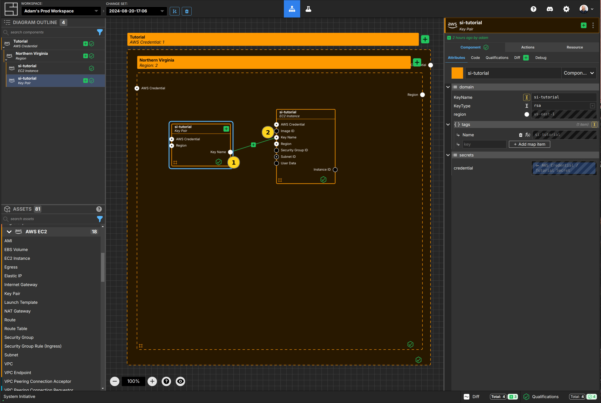
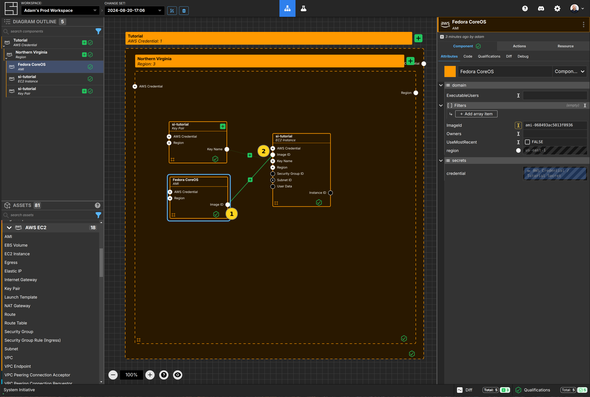
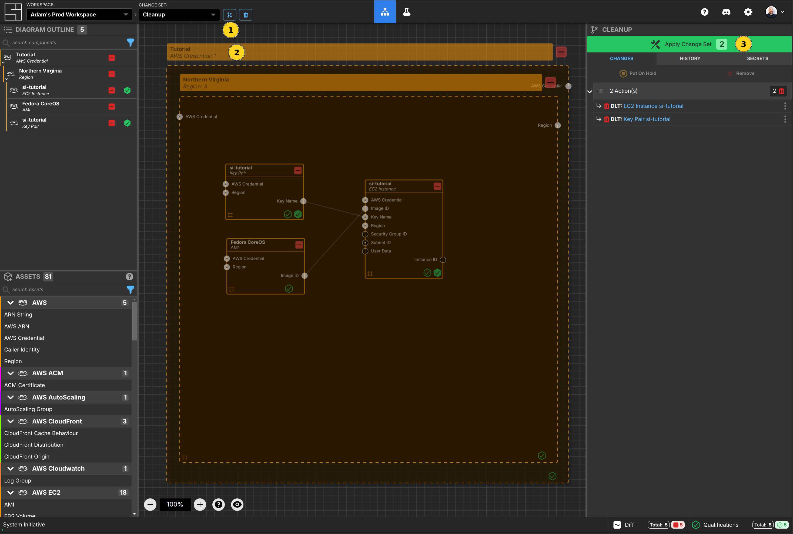

# Getting Started

<iframe width="560" height="315" src="https://www.youtube.com/embed/7vrIJmP49IE?si=GlRne9jG_l6FXSGX" title="YouTube video player" frameborder="0" allow="accelerometer; autoplay; clipboard-write; encrypted-media; gyroscope; picture-in-picture; web-share" referrerpolicy="strict-origin-when-cross-origin" allowfullscreen></iframe>

Welcome to System Initiative! This tutorial will teach you how to use System
Initiative to model your infrastructure. We will be deploying a single free-tier
EC2 instance in AWS, and cleaning it up. There should be no cost to you.

To follow along, you'll need three things:

1. [Sign up for System Initiative](https://auth.systeminit.com/signup).

2. An
   [AWS account that allows you to create free-tier resources](https://aws.amazon.com/free/),
   such as EC2 instances.

3. Your System Initiative workspace open in another window.

::: warning
Your AWS account must have a [Default VPC](https://docs.aws.amazon.com/vpc/latest/userguide/default-vpc.html) to complete the quick start guide. Most accounts do!
:::

## Creating a Change Set

Click the create [Change Set](../reference/vocabulary#change-set) button.

Name your new Change Set `Getting started`, and click the `Create Change Set`
button.

## Add an AWS Credential Component

Click `AWS Credential` from the AWS category of the Asset pallete, and drop it
on the Diagram canvas. This creates a new
[credential](../reference/vocabulary#credential)
[ Component](../reference/vocabulary#Component).

`Resize` the Component until it fills most of the visible canvas by dragging the
lower right corner of the frame.

## Name your Component

Click on the `AWS Credential` you just added to the canvas. The panel on the
right side of your screen will show its properties. It will have a default
name like `si-1234`.

Change the name to be `Tutorial`. Pressing enter or clicking outside the textbox
will update the Diagram with your new name.

## Add a secret

Click the `Select/Add Secret` button next to the AWS Credential property. Then
click `Add Secret`.

Name your Secret `Tutorial Secret`.

Fill in your AWS accounts `Access Key Id` and `Secret Access Key`.
[Refer to the AWS documentation if you do not know what they are](https://aws.amazon.com/blogs/security/how-to-find-update-access-keys-password-mfa-aws-management-console/).

Click `Store Secret` to securely encrypt and save your
[secret](../reference/vocabulary#secret).

:::tip
If you see a red hexagon in the lower corner of your AWS Credential frame (its [Qualification](/reference/vocabulary#qualification)) after
this step, it means that the credentials are invalid and need to be re-entered.

In some cases, you may need to also add your AWS Session Key.
:::

## Add an AWS Region Component and set its properties

Click on the `Region` from the AWS category of the Asset pallete, and drop it
inside your `Tutorial` Credential frame.

Resize the region to fill the space inside the `Tutorial` Credential frame.

Name your region `Northern Virginia`.

Set the `region` property to `us-east-1`.

## Add an AWS EC2 Key Pair and set its properties

Click on the `Key Pair` from the AWS EC2 category of the Asset pallete, and drop
it inside your `Northern Virginia` region frame.

Name your key pair `si-tutorial`.

Set the KeyName property to `si-tutorial`.

## Add an AWS EC2 Instance and set its properties

Click on the `EC2 Instance` from the AWS EC2 category of the Asset pallete, and
drop it inside your `Northern Virginia` region frame.

Name your EC2 Instance `si-tutorial`.

Set the `InstanceType` property to `t2.micro`.

## Connect the Key Pair to the EC2 Instance

Click the `Key Name` Output Socket of your `si-tutorial` Key Pair and connect it
to the `Key Name` Input Socket of your new EC2 Instance Component by dragging
the line between them.

## Add an AWS EC2 AMI Component and set its properties

Click on the `AMI` from the AWS EC2 category of the Asset pallete, and drop it
inside your `Northern Virginia` region frame.

Name your AMI `Fedora CoreOS`.

Set the `ImageId` property to `ami-068493ac5013f0936`.

## Connect the AMI to the EC2 Instance

Connect the `Image ID` Output Socket of your AMI Component to the `Image Id`
Input Socket of your EC2 Instance Component.

## Apply the Change Set

Press the Escape key, or click on the background of the canvas, to ensure the
workspace itself is selected.

You will see two actions enqueued in the right hand panel - one to create the
Key Pair, and the other to create your EC2 Instance.

Press the `Apply Change Set` button.

You'll be prompted with a dialog to confirm you want to take these two actions.
Press the `Apply Changes` button in the dialog to confirm.

## Create the Key Pair and EC2 Instance resources

Applying the Change Set redirects you to the `HEAD` Change Set, and enqueues
your actions. The proposed changes panel on the right side of the screen shows
your two pending actions. As the actions are run on AWS, their resulting
[resources](../reference/vocabulary#resource) are added to each Model. As this
happens, the actions will disappear from the proposed changes list.

Once both actions have been run, you'll see some confetti, and the changes panel
will be empty.

## Review the si-tutorial EC2 Instances resource data

Select the `si-tutorial` EC2 Instance. Then select the `Resource` sub-panel on
the right side panel. You will see all the information about the EC2 Instance we
created in AWS.

Congratulations! You have created your first resources with System Initiative.

## Clean up

Create a new Change Set called `Cleanup`.

Select the `Tutorial AWS Credential` Component. Press the delete key.

You'll be presented with a dialog confirming you want to delete the Components
we created previously. Click Confirm.

Press the escape key or click on the canvas background to select the workspace.

Click the Apply Change Set button to delete your EC2 Instance and Key Pair.
Confirm you want to apply the Change Set.

After the two delete actions are run, you will have a blank workspace, and no
more resources running in AWS.

## Congratulations

Congratulations - you've created your first resources with System Initiative.
You learned how to:

- Create new Change Sets
- Add a credentials and secrets
- Add Components to the Diagram canvas
- Configure Components by setting their properties
- Connect Components Input Sockets and Output Sockets to dynamically configure them
- Execute actions and create resources by applying a Change Set

## Vocabulary
In this tutorial bits of System Initiative Vocabulary will be shown with a capital letter. 
All definitions for these can be found here: [System Initative - Vocabulary](https://docs.systeminit.com/reference/vocabulary) 