# Getting Started

Welcome to System Initiative! This tutorial will teach you how to use System
Initiative to model your infrastructure. We will be deploying a single free-tier
EC2 instance in AWS, and cleaning it up. There should be no cost to you.

To follow along, you'll need three things:

1. [Sign up for System Initiative](https://auth.systeminit.com/signup).

2. An
   [AWS account that allows you to create free-tier resources](https://aws.amazon.com/free/),
   such as EC2 instances.

3. Your System Initiative workspace open in another window.

::: warning Your AWS account must have a [Default VPC](https://docs.aws.amazon.com/vpc/latest/userguide/default-vpc.html) to complete the quick start guide.
Most accounts do!
:::

::: info SI is developed in compliance with modern web standards, but the only officially supported browsers are Chrome and Firefox.
If you encounter issues while using another browser, we recommend switching to one of the supported options.
:::

## Keyboard Controls

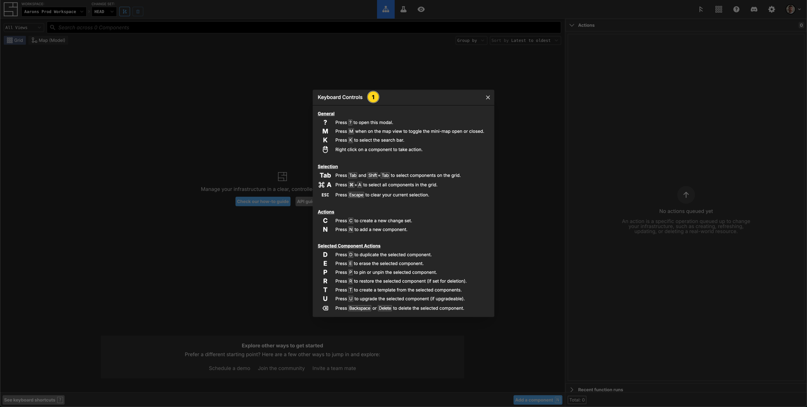

Press the `?` key to open and view the Keyboard Controls. Press `Esc` to close.

## Creating a Change Set

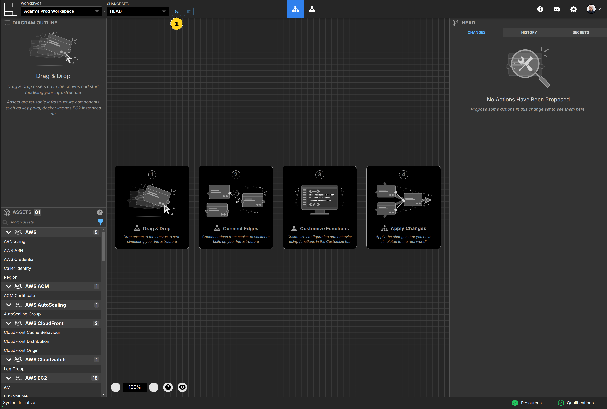

In your Workspace click the
[Create Change Set](../reference/vocabulary#change-set) button.

Name your new Change Set `Getting started`, and click the `Create change set`
button.

## Add an AWS Credential Component

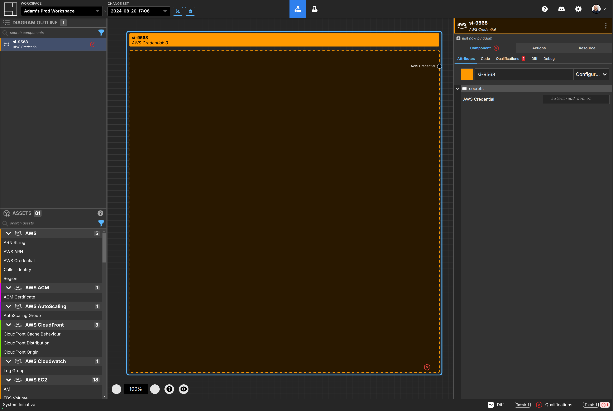

Press `N` or Click the `Add a component` button, then in the search bar type
`AWS Credential`, select the Component and press `Enter`. This creates a new
[AWS Credential](../reference/vocabulary#credential)
[Component](../reference/vocabulary#component).

## Configuring your AWS Credential Component

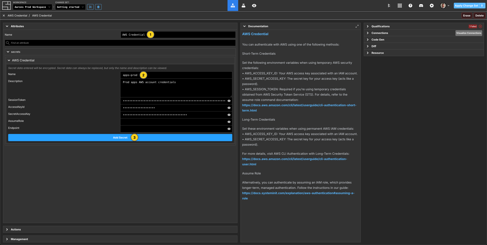

After creating your `AWS Credential` Component, you are navigated to the
Component details screen. The Attributes panel on the left will show the
credentials properties. It will have a default name like `si-1234`.

Change the name to `AWS Credential`. Pressing enter will update the Component
with your new name.

Look to the top right of the screen to `Qualifications`, notice that this
currently says `1 Failed`, open this section to see details of the failed
Qualification.

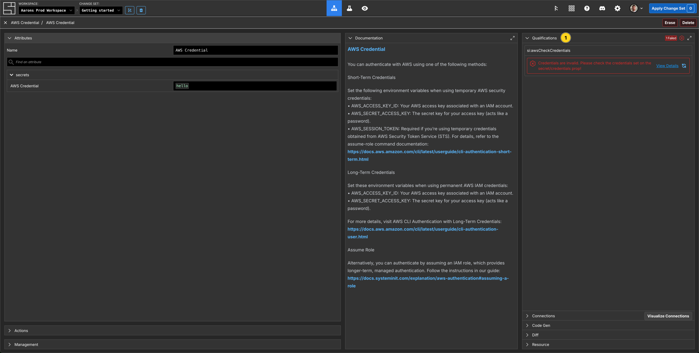

This Qualification is telling you that your AWS Credentials are invalid - so
lets add some valid credentials. Best practice here is to name your Secret after
the AWS account you are using, for example `apps-prod`, or the service you are
using the credentials to manage.

Fill in your AWS account's `Access Key Id`, `Secret Access Key`.
[Refer to the System Initiative AWS authentication documentation](https://docs.systeminit.com/explanation/aws-authentication).

Click `Add Secret` to securely encrypt and save your
[Secret](../reference/vocabulary#secret).

Notice that once you have configured valid credentials that the Qualification
has automatically re-run and changed the status to `Passed`.

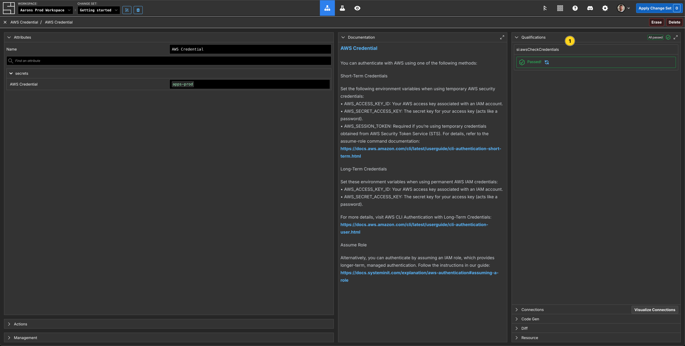

:::tip If you still see a red hexagon on the right panel (its
[Qualification](/reference/vocabulary#qualification)) after this step, it means
that the credentials are invalid and need to be re-entered.

:::

## Add a Region Component and set its properties

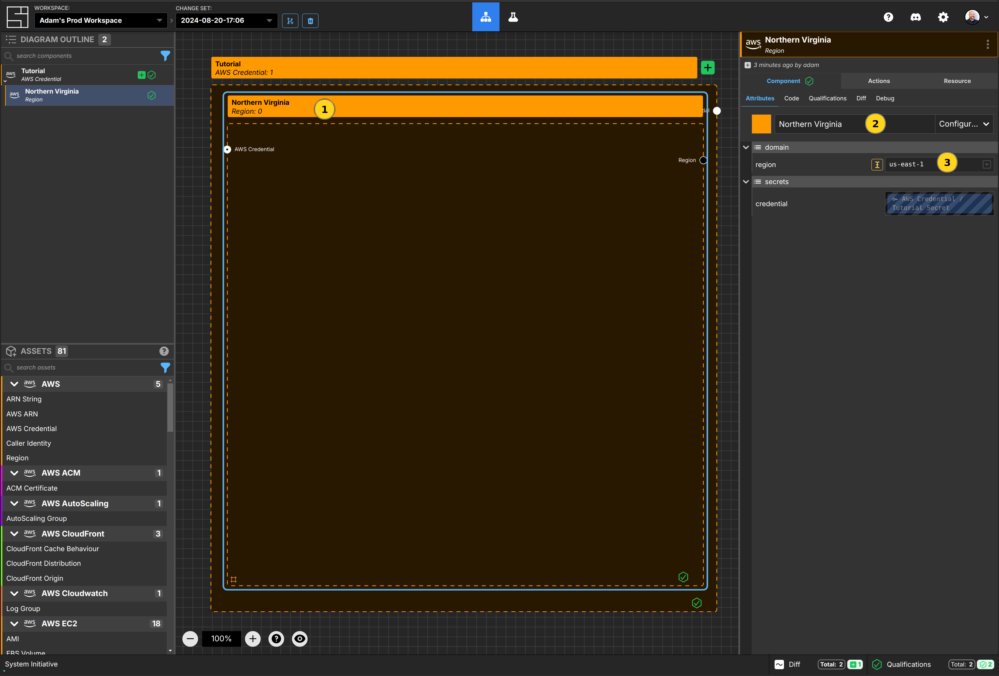

Close (`Esc`) your AWS Credential component, then `Add a component` (`N`), then
search for `Region` in the `AWS` category and then press `Enter`.

Name your region `AWS North Virginia`.

Set the `region` property to `us-east-1`.

Click the `credential` property field and select `AWS Credential apps-prod`.
This creates a Subscription to the credentials of the `AWS Credential`
Component, which are then evaluated by this Component's Qualification function.

Close (`Esc`) your Region component to return to the Grid.

## Add an AWS::EC2::KeyPair and set its properties

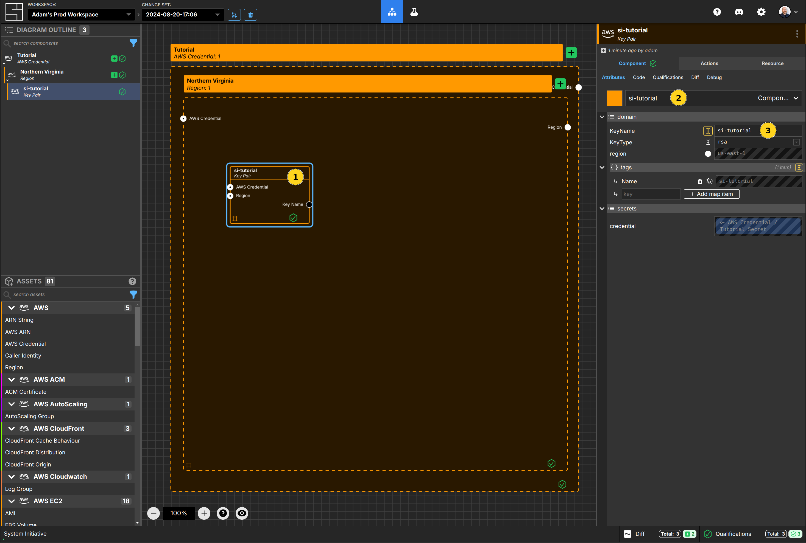

Click `Add a component` (or press `N`) and search for an `AWS::EC2::KeyPair`,
when selected hit `Enter`.

Name your key pair `si-tutorial`.

Set the KeyName property to `si-tutorial`.

Set the KeyType to `rsa`.

Observe the Tags property of this `AWS::EC2::KeyPair` component. This property
is an array of `Tag` objects. Each `Tag` object has a `Key` and `Value`
property.

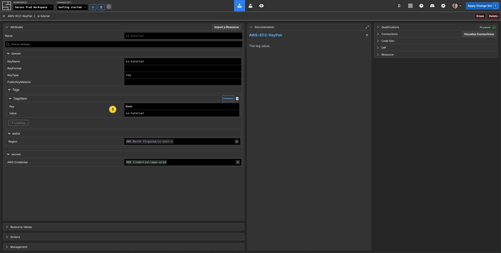

Click or tab into the property and select `Add "Tags" item`, then set `Key` as
`Name` and `Value` as `si-tutorial`. If you do not want to tag your key pair,
just click the trash can icon to remove the `Tags` item.

Subscribe to your `region` and `credential` properties.

## Import an AWS::EC2::Subnet

In your AWS account, your default VPC will have subnets for each availability
zone. Copy one of the `Subnet IDs` from the AWS Console.

Add an `AWS::EC2::Subnet` component. Name your Subnet `Imported Subnet`. Set the
Subscriptions to your `region` and `credential` properties, then in the
Attribute panel header, click the `Import a Resource` button, paste your
`Subnet ID` in and hit `Enter`.

:::info A [Subscription](/reference/vocabulary#subscription) is the method by
which you connect the value of a property from one Component to another,
ensuring that the value stays up to date across all subscribed Components.

:::

The Subnet will run a `Refresh` action to bring your asset under the management
of your System Initiative Workspace and your `Subnet` will now be populated:

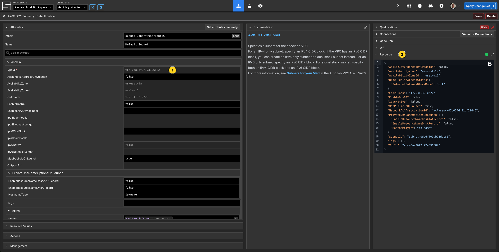

Now your subnet is imported and under System Initiative management, you can see
the CodeGen and Diff sections populated:

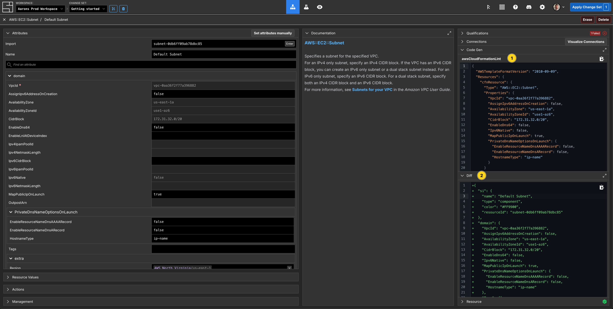

:::info CodeGen takes a representation of the Component and creates the correct
structure to pass the changes to the upstream provider API.

Diff is a comparison of the current state of the Component in your Change Set
compared to HEAD.

:::

Once this Change Set is applied, any further changes to your Components will be
reflected in the Diff. Close (`Esc`) your Subnet component and continue to the
next step.

## Add an AWS::EC2::Instance Component and set its properties

Add an `AWS::EC2::Instance` component.

Name your EC2 Instance Component `si-tutorial-ec2`.

Set the `ImageId` property to `ami-08a6efd148b1f7504`.

Set the `InstanceType` property to `t2.micro`.

Subscribe the `KeyName` property to your `si-tutorial` Key Pair components
`KeyName`.

Subscribe the `SubnetId` property to your `Default subnet` Subnet components
`SubnetId`.

Subscribe to your `region` and `credential` properties in this `si-tutorial-ec2`
EC2 Instance Component.

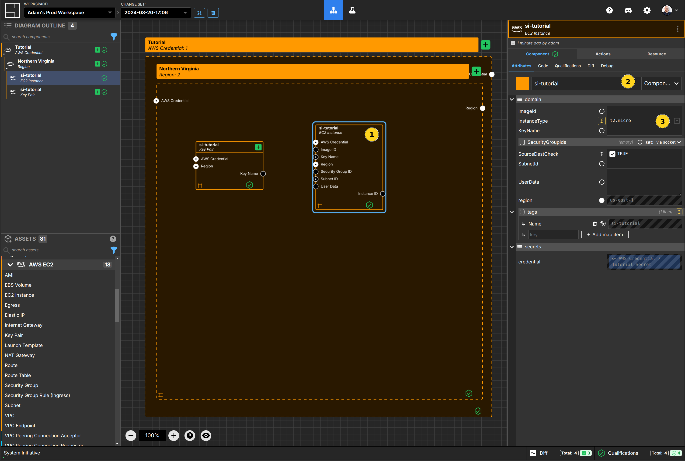

## A visual representation of your Components

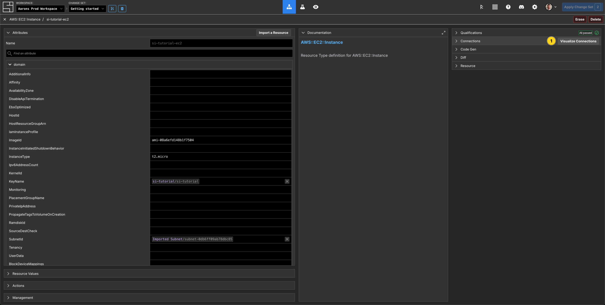

While in your AWS::EC2::Instance component, click the `Visualize Connections`
button (labelled above) to see a visual representation of your proposed AWS
infrastructure. To view an individual components subscribed properties in the
Map view, click or right click the Component:

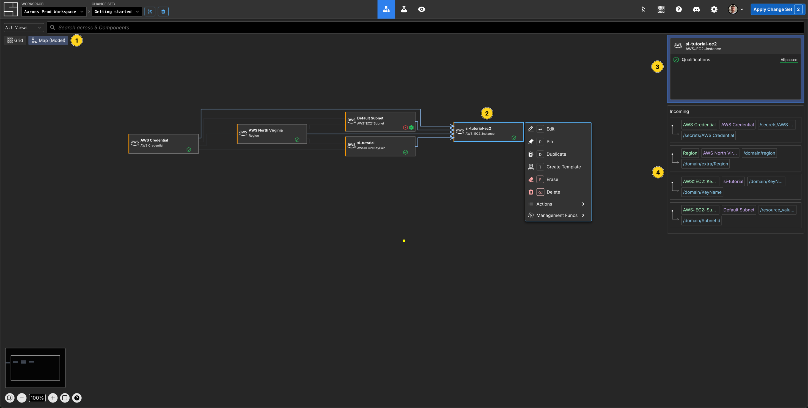

In this example you can see the `AWS::EC2::Instance` is selected. Its properties
are displayed both via the blue highlighted arrows, and the `Incoming` and
`Outgoing` subscriptions on the right hand side underneath the component
Qualification. If you right click the component, you can also take action e.g.
Edit, Duplicate, Delete from the Map.

## Apply the Change Set

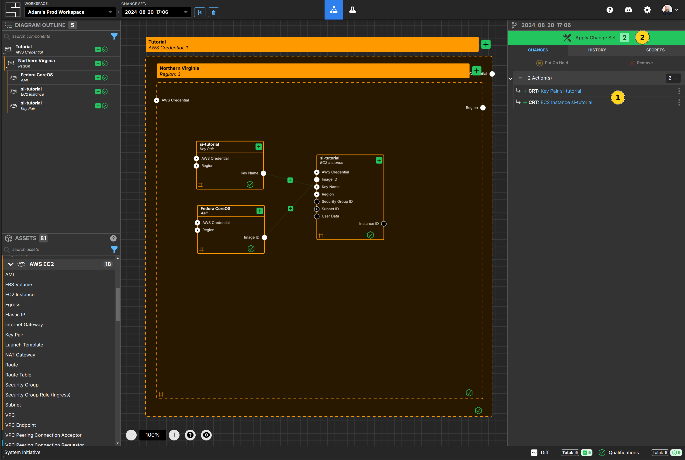

Press the `Apply Change Set` button.

You will see two actions enqueued in the Actions panel - one to create the
AWS::EC2::KeyPair and one to create the AWS::EC2::Instance.

You'll be prompted with a dialog to confirm you want to take these two actions.
Press the `Apply Changes` button in the dialog to confirm.

## Creating the Resources

Applying the Change Set redirects you to `HEAD`, and runs your actions. As the
actions are successfully completed, the resulting
[resources](../reference/vocabulary#resource) are added to each Component. In
the below example, see the Subnet has a green tick and with a Subnet ID.

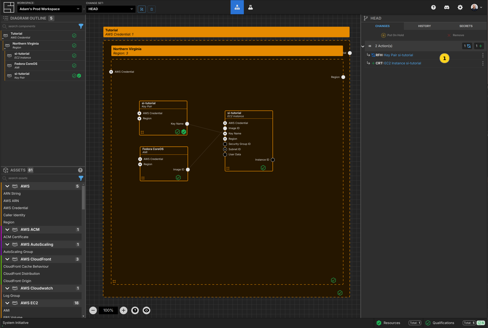

Once the Actions have completed, you'll see the Actions panel will be empty and
your tiles will have solid green ticks and resource ids where appropriate.

:::warning If you made a mistake, one of the two actions may fail, if this
happens, create a new Change Set, double check the values in your Components and
re-apply.

:::

## Search for a component with a specific property

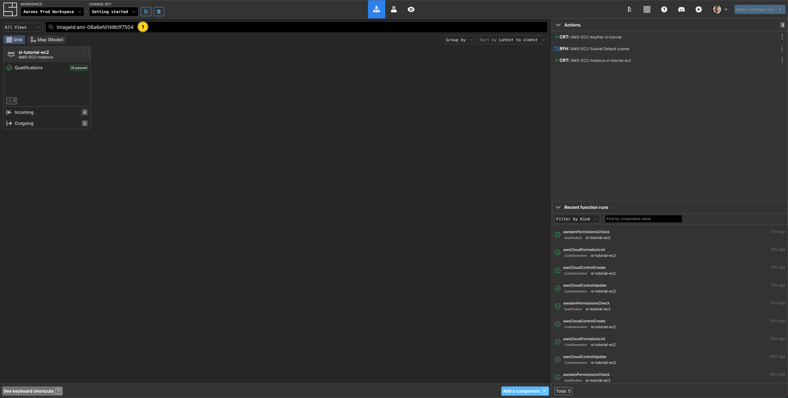

Across both the Grid and Map views you are able to search for components by
given name, Component type or even via a specific property. For example, you can
search for Components that contain a specific `ImageId`. In the search bar,
enter `ImageId:ami-08a6efd148b1f7504`.

:::info Some further useful search examples:

- To search for Components by schema - `schema:AWS::EC2::Instance` - returns all
  EC2 Instance Components.
- To search for multiple components by via different means -
  `schema:AWS::EC2::Instance | subnet | KeyName:si-tutorial` - this search would
  find all EC2 Instances, all subnets (fuzzy search) and Components that have a
  KeyName of si-tutorial.
- To return all Components that aren't an AWS::EC2::Instance -
  `!schema:AWS::EC2::Instance`
- Or to search for an EC2 Instance and Subnet via their regions -
  `Instance region:us-east-1 | Subnet region:us-east-1`

:::

Another useful feature here is the ability to `Pin` a component, right click,
select `Pin` or press `P`, now clear your search bar, the component is now
pinned to the top of your workspace:

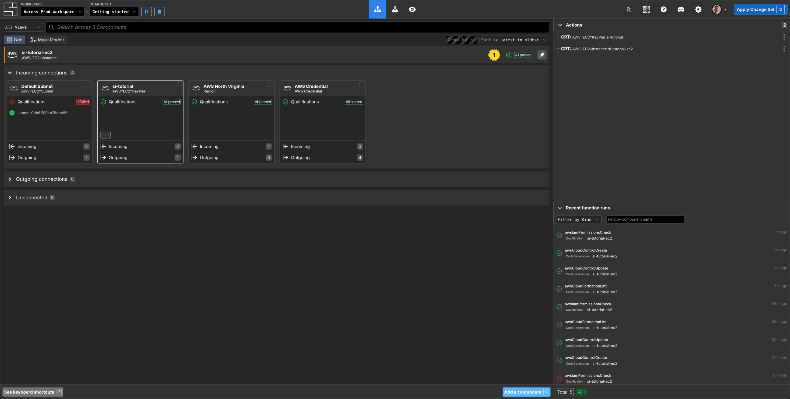

## Review the si-tutorial EC2 Instances resource data

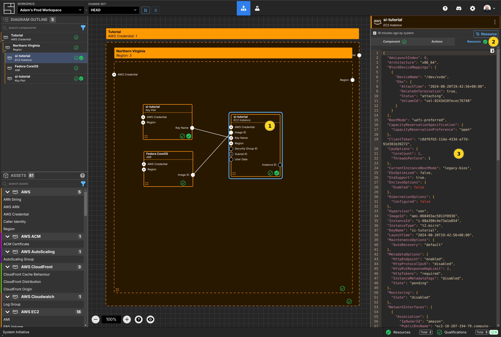

Click the `si-tutorial-ec2` EC2 Instance. Then in the right side panel click
`Resource`. You will see all the information about the EC2 Instance we created
in AWS.

Congratulations! You have created your first few resources with System
Initiative.

## Clean up

Create a new Change Set called `Cleanup`.

Search for everything but the Subnet by entering `!Subnet` in the Search bar and
press `Enter`. Press `Cmd`/`Ctrl`+`A` to select all returned Components, then in
the Context Menu, click `Delete`. This will present you with a Delete Component
dialog, click `Confirm`. You will now see two Delete actions queued in the
Actions panel. Clear the Search bar.

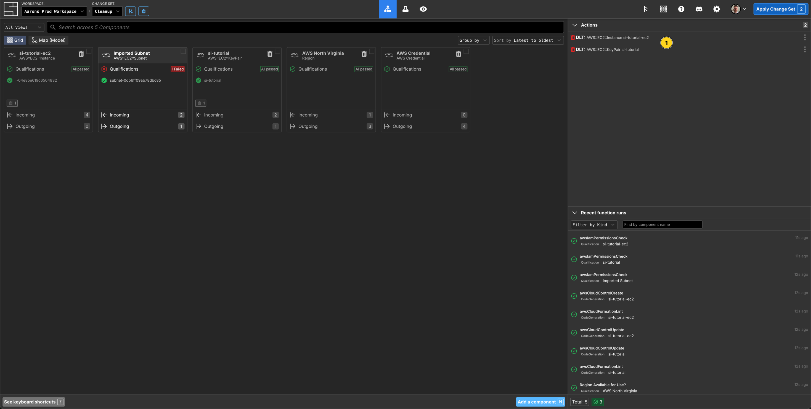

To remove a Component but not delete the resource, right-click the
AWS::EC2::Subnet Component and select `Erase`. This will delete the Component
from your Workspace but not from AWS. `Erase` immediately removes the Component
and all related data from both HEAD and the current change set. In the Erase
dialog, tick the confirmation checkbox and then click the `Confirm` button.

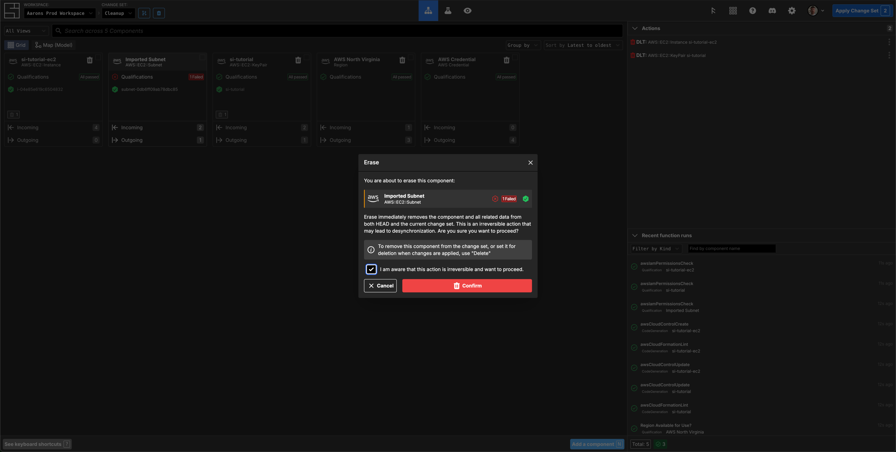

Click the `Apply Change Set` button to delete your AWS::EC2::Instance and
AWS::EC2::KeyPair. Confirm you want to apply the Change Set.

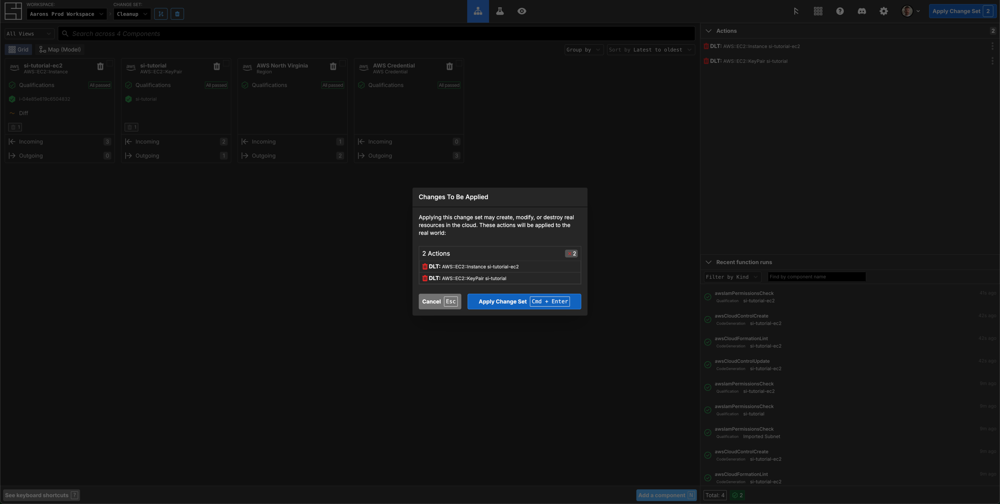

After the two delete actions are run, you will have a blank workspace, and no
compute resources running in AWS.

## Congratulations

Congratulations - you've created your first resources with System Initiative.
You learned how to:

- Create new Change Sets
- Add an AWS Credential and Region
- View and troubleshoot a Component Qualification
- Add Components to the Workspace
- Configure Components by setting their properties
- Connect Components via Prop to prop subscriptions
- Import existing infrastructure to your workspace
- View your proposed infrastructure and property subscriptions on the Map
- Search for Components via specific properties
- Pin a Component to the top of your workspace
- Execute actions and create resources by applying a Change Set
- Erase Components and Delete resources to tidy up your workspace

## Vocabulary

In this tutorial bits of System Initiative Vocabulary will be shown with a
capital letter. All definitions for these can be found here:
[System Initative - Vocabulary](https://docs.systeminit.com/reference/vocabulary)
