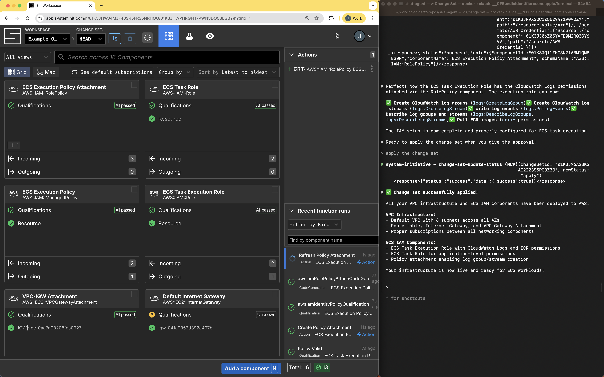

# Getting Started

Welcome to System Initiative! This tutorial will teach you how to use System
Initiative to model your infrastructure. We will be creating an ECS service and
cleaning it up with the SI AI Agent helping us. There should be < $1 USD cost to
you in AWS and some tokens in Claude Code, you can monitor in AWS directly and
by using the /cost tool in Claude at any time as you progress.

To follow along, you'll need a few things:

1. A Workspace with System Initiative -
   [Sign up](https://auth.systeminit.com/signup).

2. An
   [AWS account that allows you to create resources](https://aws.amazon.com/free/),
   such as ECS Clusters.

3. Claude Code installed locally -
   [See si-ai-agent.git for more details](https://github.com/systeminit/si-ai-agent)

:::info
SI is developed in compliance with modern web standards, but the only
officially supported browsers are Chrome and Firefox. If you encounter issues
while using another browser, we recommend switching to one of the supported
options.
:::

## Getting Started Guide

In this Getting Started guide, we are going to discover and leverage some
existing infrastructure within your AWS account and then build on top of it to
deploy an example app. System Initiative meets you where you are, not
prescribing you to start from green-field. If you have a totally empty AWS
account, that's ok! This Getting Started guide will totally work for you too.

We will also use the AI Agent to help us resolve real-world operational
problems:

1. Run Networking Security Review
2. Adhere to newly imposed organizational policies
3. Debugging Infrastructure Deployment Failures

### Initial Setup

When you log into your Workspace for the first time in the Web UI, you will be
prompted to set up your Workspace to authenticate to AWS and help you set up the
AI Agent:

<p align="center"></p>
<p align="center"><i><small>Figure 0 - Landing Screen</small></i></p><br/>

<p align="center"></p>
<p align="center"><i><small>Figure 1 - AWS Credentials Populated</small></i></p><br/>

You will need to follow the steps shown to get the si-ai-agent setup and
configured locally, the token you need will be shown once on screen:

<p align="center"></p>
<p align="center"><i><small>Figure 2 - Agent Setup Prompt</small></i></p><br/>

<p align="center"></p>
<p align="center"><i><small>Figure 3 - Authenticated Workspace</small></i></p><br/>

Your SI AI Agent session should be fully authenticated like this:

<p align="center"></p>
<p align="center"><i><small>Figure 4 - AI Agent Setup Authenticated</small></i></p><br/>

### Change Sets

All changes in System Initiative go through a "simulation" phase, coined a
Change Set. Change Sets are isolated, human-reviewable versions of reality with
full-fidelity real-time policy, provider validation which are fully
customisatable by the user. When the SI AI Agent suggests changes whether that
is create Actions or otherwise, you will always be in on the loop, unless you
specifically request or authorise the SI AI Agent to apply the Change Set
without a review.

### Discovery

We now have a Workspace with AWS Credential and Region Components in it. System
Initiative uses these to authenticate into your AWS account.

For the API surface of AWS itself, as natively configured, System Initiative
speaks 1:1 to AWS's Cloud Control API which supports the overwhelming majority
of AWS services in full fidelity.

Now we are going to reach into your AWS account and discover a networking stack
to bring into the model. Once the Components are in the model, the whole
cradle-to-grave lifecycle of those Components can be managed from within the
System Initiative model.

If you do not have a default VPC, the MCP server will create one from scratch,
for you, fully configured to AWS's Best Practices.

### Following Along

To follow along, we can use both the SI AI Agent output and the System
Initiative Web UI. If you're not sure what the Web UI URL you need is, you can
just ask. Ask the SI AI Agent:

```text
What's my workspace URL
```

or

```text
Where can I see the map view
```

<p align="center"></p>
<p align="center"><i><small>Figure 5 - Getting Workspace URL</small></i></p><br/>

In your Workspace you have two visual representations of the data model - you
can see the "Tile View" which is a monolithic actionable list of Component tiles
or the "Map View", which is more focused on the dependencies between Components.
They can be navigated between by using these buttons:

<p align="center"></p>
<p align="center"><i><small>Figure 6 - Tile/Map View Selector</small></i></p><br/>

This is an example of what the map view looks like in System Initiative:

<p align="center"></p>
<p align="center"><i><small>Figure 7 - Map View Interface</small></i></p><br/>

If you would like some help understanding how to navigate using your keyboard
press the `?` key to open and view the Keyboard Controls. Press `Esc` to close.

<p align="center"></p>
<p align="center"><i><small>Figure 8 - Keyboard Shortcuts Menu</small></i></p><br/>

## Discovering the VPC

First, we are going to ask the AI Agent to discover the existing default VPC
within your connected AWS account, if it doesn't find one, it'll create a brand
new one for you. As mentioned above, all changes go through a Change Set
mechanism therefore to do this, the SI AI Agent will have to create one to
propose this change.

Follow along via the SI AI Agent responses & the System Initiative UI.

```text
Reach into my AWS account and pull out the default VPC.
If additional VPCs are found, remove them from the model after discovery.
If there is no default VPC, create one in the AWS standard specification.
```

<p align="center"></p>
<p align="center"><i><small>Figure 9 - Change Set Created</small></i></p><br/>

Once the proposal is complete, you can use the review screen to review the
change, to see this press the `r` key. The review screen allows you audit every
single change made to any Component in a Change Set, in this case there is a
simple Component change which is brining the VPC into the model.

<p align="center"></p>
<p align="center"><i><small>Figure 10 - Proposed Change</small></i></p><br/>

<p align="center"></p>
<p align="center"><i><small>Figure 11 - Review Screen</small></i></p><br/>

SI AI Agent Output from my Session (yours will differ):

<p align="center"></p>
<p align="center"><i><small>Figure 12 - Claude Output Example</small></i></p><br/>

## Discovering its Children

System Initiative will now have a single AWS::EC2::VPC Component within the
model that we can start to pivot the rest of the discovery we need off. In this
case, we'll request the remaining parts of the networking stack we need to run
our application.

```text
Start from the VPC and discover related Subnets, Route tables,
NAT Gateways and VPC Gateway Attachments and Internet Gateways.
```

As the SI AI Agent works through the discovery, you can view the changes as they
come in from the System Initiative web UI:

<video width="100%" controls>
  <source src="./getting-started/7-real-time-discovery.mp4" type="video/mp4">
  Your browser does not support the video tag.
</video>
<p align="center"><i><small>Video 1 - Real-time Discovery</small></i></p><br/>

The Components which are pulled in are fully defined with all their API
attributes, you can see this if you drill into one of the Component tiles by
double clicking:

<p align="center"></p>
<p align="center"><i><small>Figure 13 - Full Fidelity Definition</small></i></p><br/>

To go back to the map or tile view, just hit `escape`

In my session, the SI AI Agent output from this prompt looked like this:

<p align="center"></p>
<p align="center"><i><small>Figure 14 - Full Discovery Output</small></i></p>

## Running some Analysis

System Initiative's AI Agent is here to help you understand, interpret and
manipulate your infrastructure and data model against internal or external
policies and procedures. For example, let's ask it to help us understand the
resiliency or security implications of using the selected VPC from the lens of
AWS Best Practices.

```text
Review the VPC against AWS Best Practices and suggest any
resiliency or security improvements.
Generate a 50 line or less summary.
```

Output from my session:

<p align="center"></p>
<p align="center"><i><small>Figure 15 - Network Analysis</small></i></p>

The more data that's in the System Initiative model the better recommendations
the SI AI Agent can make. For example, if an existing VPC Endpoint existed in
the model + AWS for S3, the recommendations would be modified appropriately.
Additionally, if the SI AI Agent had context about application-specific
internals, it would also supercharge the analysis.

## Create the ECS IAM

Now let's ask it to create the IAM necessary for an ECS task.

```text
I want to create the IAM Components necessary for an ECS task to run.
The execution role must be able to create the log group and stream.
Apply the change whenever it's ready.
```

As the SI AI Agent is building out, we can run complex search and filter queries
against the live data to find the pieces we are interested in, for example, as
it builds out the `AWS::IAM::Role`, we can query for `schema:AWS::IAM::Role` to
see only the Components that are of that type in the model and drill in if we
wish:

<video width="100%" controls>
  <source src="./getting-started/11-searching-and-filtering.mp4" type="video/mp4">
  Your browser does not support the video tag.
</video>
<p align="center"><i><small>Video 2 - Searching and Filtering</small></i></p><br/>

As per the prompt, the SI AI Agent will request permission to apply the Change
Set:

<p align="center"></p>
<p align="center"><i><small>Figure 16 - Applying IAM Role</small></i></p><br/>

On Apply, you will be moved to HEAD and if you switch to the tile view, you can
see the Actions that are running to create the relevant IAM resources we created
in the Change Set, all of the networking stack took no real-world action as they
were just data import/discovery:

<p align="center"></p>
<p align="center"><i><small>Figure 17 - Actions Applying on HEAD</small></i></p><br/>

SI AI Agent final output from this prompt in my session:

<p align="center"></p>
<p align="center"><i><small>Figure 18 - Apply Output</small></i></p><br/>

## Deploying an Application

Once all those actions have finished, we can deploy an application to ECS. You
can watch its progress within the map view and request a review before it
creates anything. To follow along, join the Change Set it creates.

```text
Deploy my keeb/si-logo docker image to ECS using my VPC and IAM roles from earlier.
I want all my SI friends to access it over the public internet on its load balancer address.
Can I have the link to review the infrastructure when it's ready?
```

To select the Change Set, use the drop down menu in the top navigation bar:

<p align="center"></p>
<p align="center"><i><small>Figure 19 - Change Set Deployment</small></i></p>

## Applying a Change Set

We can either apply it within the UI ourselves, or ask the AI Agent to do it for
us as we've reviewed the changes, let's ask the AI Agent to apply it for us.

```text
The change set looks good, apply it to HEAD to create the resources
and give me the ip/url to check it works ok
```

## Debugging the Failure

It looks like something went wrong during our application due to a dependency
misunderstanding, let's ask for some help debugging what went wrong by reviewing
the actions that have run:

```text
Something went wrong with the ECS Deployment/it's not serving me lovely
logo details, Can you debug what happened and suggest a fix? Maybe looking
and analysing the action logs on HEAD would be a good place to start.
Once it all works, give me the load balancer URL so I can see some lovely
logo animation
```

<p align="center"></p>
<p align="center"><i><small>Figure 20 - Debugging Issues Successfully</small></i></p>

## And we're up!

System Initiative has created, debugged and validated a deployment to ECS! In
the response from the AI Agent it will have the load balancer URL we can check
the logo out on.

## Validation Against Policy

Oh no, a new organizational policy has come into play that has complex rules
that I'm not sure the application I deployed adheres to, let's ask the SI AI
model to help us understand whether that's the case or not.

```text
A new organizational policy is being imposed for production readiness
which can be found here https://artifacts.systeminit.com/docs/getting-started/organizational-policy-08-26-25,
can you carefully validate what you deployed against those new rules
and give me a short summary?
```

This is what the policy looks like

```
** Mandatory Tagging Policy **
- Proposed: 2025-08-25T19:45:00Z
- Effective: Immediately
- Scope: All AWS accounts and resources managed by Example Organization

Every AWS resource must include the following tags at minimum:
- Environment (Production, Staging, Development, Sandbox)
- Owner (email responsible, initially set to creator email if unknown)
- CostCenter (internal accounting reference). One of:
    - ProjectApollo
    - ProjectOrigin
    - CustomerPortal
    - DevelopmentSandbox
    - TestingQA
  Default to DevelopmentSandbox for unallocated or unknown cases.
- Application (service, product, or project name) Create new name if unallocated or unknown cases

** Standardized Tag Keys and Values **
- All tag keys must use PascalCase (e.g., CostCenter, Application).
- All tag values must come from an approved list where applicable (e.g., Environment must be one of: Production, Staging, Development, Sandbox).

Free-form tags may be used for special cases, but should not conflict with organizational tags.

Resources without required tags may be automatically stopped, denied creation, or flagged for remediation.

Teams are accountable for maintaining tag accuracy; stale or incorrect tags will be flagged during audits.

Cost Allocation and Chargeback - The CostCenter tag is required on all billable resources (EC2, RDS, S3 buckets, Lambda, etc.). Untagged resources may be assigned to a default CostCenter and subject to higher internal chargeback rates.
```

## Drafting Updates

Ah, it has spotted some things that need updates, let's ask it to propose the
relevant changes to adhere to the new policy.

```text
Draft the changes required in a new Change Set and link me to
review the changes
```

The SI AI Agent can draft complex updates like mass-standarisation or policy
adhereance across and entire fleet of resources, in this case it's updated all
the data models in a Change Set and proposed to enqueue Update actions for all
affected Components, these are what will update the real-world resources to come
back into compliance:

<p align="center"></p>
<p align="center"><i><small>Figure 21 - Organizational Policy Updates</small></i></p><br/>

This is what the SI AI Agent output looked like for my prompt:

<p align="center"></p>
<p align="center"><i><small>Figure 22 - Agent Output from Fixing Tags</small></i></p><br/>

## Review Changes

Click the link provided by System Initiatives MCP server to review the changes
and apply the change set to HEAD to update the infrastructure to meet your
updated organizational policy requirements:

<p align="center"></p>
<p align="center"><i><small>Figure 23 - Review Updates</small></i></p><br/>

And then simply apply the Change Set, either manually or by prompting the SI AI
Agent. In HEAD, you'll see the update actions are quickly executed and the
real-world resources are brought back into compliance:

<p align="center"></p>
<p align="center"><i><small>Figure 24 - Fixing Tags Actions</small></i></p><br/>

Congratulations, you have seen the core of System Initiative as a platform & its
ability to actively respond to the real-world challenges of creating, running
and updating applications and services.

## Cleaning Up

Let's ask the AI Agent to clean up whatever we created to prevent spending money
unnecessarily. We must make sure we leave the Default VPC there, rather than
deleting that from AWS.

```text
Can you clean up all the infrastructure we created, make sure to just
erase the default VPC as it should remain in the AWS account.
Ask me to review when it's ready
```

Simply review the Change Set and apply when you're happy, in the review screen
you can see the proposed change at the Component level, so in this case all the
VPC Components should show `Erased Component` in their Component history:

<p align="center"></p>
<p align="center"><i><small>Figure 25 - Erasing Component</small></i></p><br/>

## Congratulations

Congratulations - you've experienced the power of System Initiative with
AI-driven infrastructure management!

In this tutorial, you learned how to:

- Use the SI AI Agent to discover and model existing AWS infrastructure
- Leverage AI to analyze infrastructure against best practices and security
  standards
- Deploy applications through conversational AI interactions
- Debug deployment failures with AI assistance
- Validate infrastructure against organizational policies
- Apply changes through Change Sets with AI guidance
- Clean up resources responsibly with AI help

You've seen how System Initiative meets you where you are - working with
existing infrastructure rather than requiring a greenfield approach, and how the
AI Agent can guide you through complex operational challenges from security
reviews to policy compliance.
