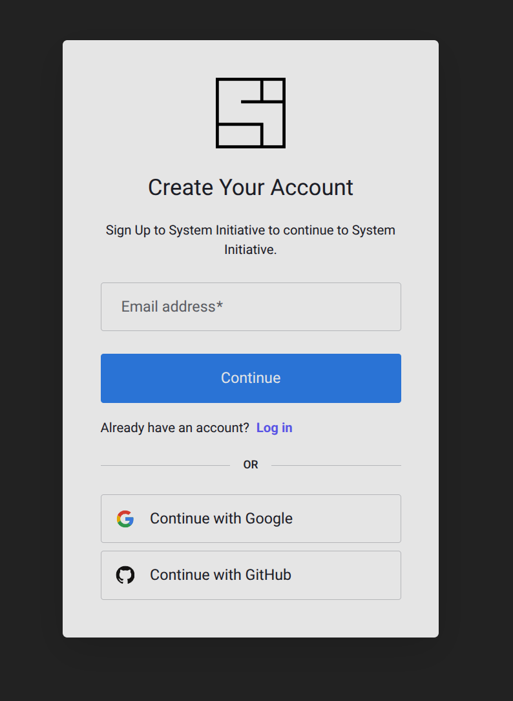

# Setting Up System Initiative

This tutorial will walk you through setting up System Initiative. You will be [signing up](https://auth.systeminit.com/signup) for an account, adding an AWS Credential, configuring a region, configure your AI Agent, and visit your workspace for the first time.

## Sign Up

To use System Initiative, you need to [sign up for an account](https://auth.systeminit.com/signup). To sign up, you need to provide an email or use GitHub or Google authentication.

<center>

</center>

:::tip
If you sign up with Google or GitHub, then you won't need to validate your email or provide a password.
:::

## Password (email only)

Provide a password:

<center>

</center>

## Email Validation (email only)

We will then send you an email to you from info@systeminit.com, asking you to validate your address. Click the 'Verify Your Account' button.


## Legal Review

You will then be presented with our:

- [Terms & Conditions](https://auth.systeminit.com/review-legal#1-tos) - our basic terms of service
- [Privacy Policy](https://auth.systeminit.com/review-legal#2-privary) - how we handle personal information
- [Cookie Notice](https://auth.systeminit.com/review-legal#3-cookie) - how we use cookies and similar technologies
- [Trademark Policy](https://auth.systeminit.com/review-legal#4-trademark) - rules around how our Trademark can be used
- [Open Source Software](https://auth.systeminit.com/review-legal#4-trademark) - our dependencies and their licenses


You must agree to our terms before you can continue setting up System Initiative by clicking 'I have read and agree to the terms above', then 'Agree & Continue'.

## Profile Information

We will then ask for some personal information:

- First & Last Name: your legal name.
- Nickname: the name you want us to refer to you as throughout the application.
- Discord Username: we use Discord extensively to communicate with our community and provide support - this is optional!
- GitHub Username: we use your GitHub username to help us understand our community and contributors - this is optional!


When you have entered your information, slick 'Save'.

## Setting up your workspace

A [workspace](../reference/workspaces.md) is where the information about your infrastructure is stored, and where you collaborate with other users and AI Agents.

### Cloud Provider Setup

To have a working workspace, you need to provide information such as credentials to an underlying cloud provider to securely discover, manage, and automate your infrastructure. No changes are made to the underlying infrastructure without your explicit approval.

<DocTabs tabs="AWS, Azure, Hetzner, DigitalOcean">
<TabPanel value="AWS">


#### Credentials

We ask for an AWS access key ID, secret access key, and a session token. We recommend you generate a token specifically for use with System Initiative in order to explore the product with a time-bound expiration, and move to using an Assume Role Policy for long term use.

If you have root account credentials, we recommend generating a shorter-lived token:

1. Follow the instructions to [get started with the AWS CLI](https://docs.aws.amazon.com/cli/latest/userguide/cli-chap-getting-started.html), and set it up to access your account
1. Use the [aws sts get-session-token](https://docs.aws.amazon.com/cli/latest/reference/sts/get-session-token.html) command to generate a valid token.
1. Paste the resulting AccessKeyId, SecretAccessKey, and SessionToken into System Initiative.

We recommend setting a 24 hour (86400 second) expiration on your tokens. This will ensure that the credentials will expire automatically without further intervention. For more information about how we [encrypt and store your credentials, read about our secrets subsystem](../reference/secrets.md)

If you authenticate to AWS using SSO Federation, you can get a short-lived session token from your portal.

#### Region

Select a region to get started by default.

</TabPanel>
<TabPanel value="Azure">


#### Credentials

We ask for an Azure Client ID, Client Secret, Tenant ID and Subscription ID. Follow the instructions to [get started with a service principal](https://learn.microsoft.com/en-us/entra/identity-platform/howto-create-service-principal-portal) and set it up so you can access your account.

#### Location

Select a location to get started by default.

</TabPanel>
<TabPanel value="Hetzner">


#### Credentials

We ask for an API Token for authentication. Follow the instructions to [generate a token](https://docs.hetzner.cloud/reference/cloud#authentication) and set it up so you can access your account.

</TabPanel>
<TabPanel value="DigitalOcean">


#### Credentials

We ask for a Personal Access Token for authentication. Follow the instructions to [generate a personal access token](https://docs.digitalocean.com/reference/api/create-personal-access-token/) and set it up so you can access your account.

</TabPanel>
</DocTabs>

### Connect the AI Agent


System Initiative is an AI Native Infrastructure Automation platform. Using the AI Agent allows you to work on your infrastructure automation in natural language.

Our [AI Agent](../reference/ai-agent.md) is built on a customized version of [Claude Code](https://www.claude.com/product/claude-code). Follow these steps to configure it:

#### Install NodeJS 18+

Ensure you have [NodeJS 18+ installed](https://nodejs.org/en/download).

#### Open a terminal window

The AI Agent runs in a terminal window, not within your web browser.

#### Install Claude Code

```bash [install claude]
npm install -g @anthropic-ai/claude-code
```

:::tip
Claude Code will require you to have an [account with Antrhopic](https://www.anthropic.com/). System Initiative does not mark up your token usage, and is not responsible for your consumption.
:::

<!--TODO PAUL to add the link to the si CLI reference guide -->
#### Set up the AI Agent

You will run the AI Agent via the SI CLI that sets up Claude Code to work well with System Initiative.

```bash [Initiatize Claude setup]
si ai-agent init --tool claude
```

This command will ensure that the API token generated during login to a workspace is available to the AI Agent.

#### Run the AI Agent

In your terminal, type:

```bash [Start the AI Agent]
si ai-agent start --tool claude
```


This will start the AI Agent in your terminal, and connect it to System Initiative.

## Finish

Click the 'Get Started' button to finish setting up System Initiative!

In this tutorial, you learned:

- How to Sign up to System Initiative
- Where to find our terms and conditions
- How to configure your workspace
- How to set up the AI Agent

## Dive Deeper

- [Users](../reference/users.md): learn more about how to manage your user profile and API tokens.
- [Workspaces](../reference/workspaces.md): learn more about how workspaces enable isolation, and how to manage them.
- [Secrets](../reference/secrets.md): learn more about how System Initiative handles secrets
- [AI Agent](../reference/ai-agent.md): learn more about how our AI Agent works
- [Authenticating with AWS](../explanation/cloud-providers/aws.md): more details about how to authenticate with AWS


