# Working with Components

This tutorial will teach you how to work more deeply with [Components](/reference/vocabulary#components) in System Initiative.

To follow along, you should:

1. Finish the [Getting Started tutorial](./getting-started), to have basic knowledge of System Initiative.

2. You should have your System Initiative workspace open in another window.

## Create a Change Set

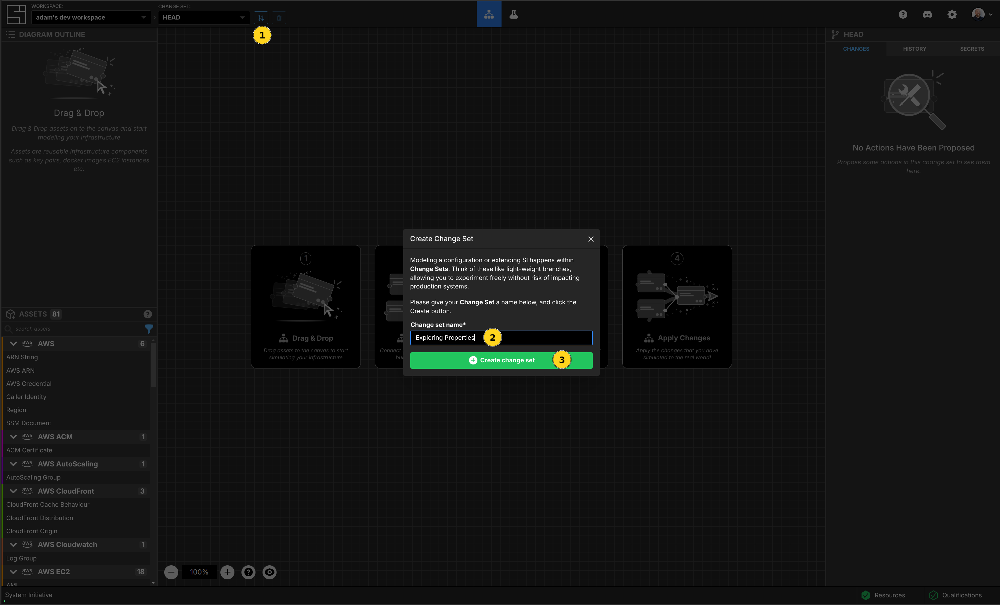

Click the create Change Set button.

Name your new Change Set `Exploring Properties`, and click the `Create Change Set` button.

## Add a Docker Image Component and set its properties

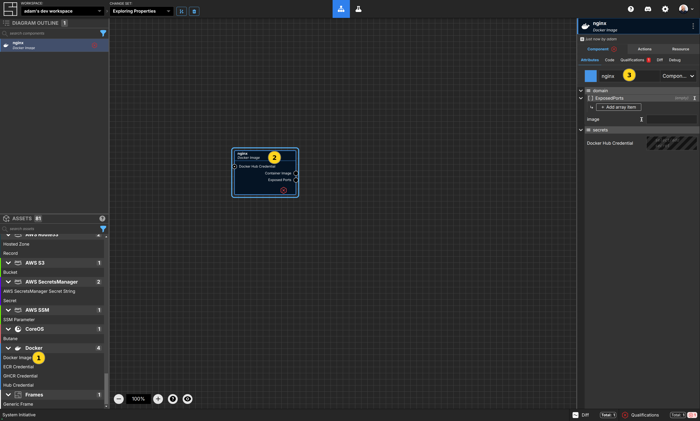

Click on `Docker Image` from the `Docker` category of the Asset pallete, and drop it inside your workspace.

Name your Docker Image Component `nginx`.

## Observe the Docker Images Qualification

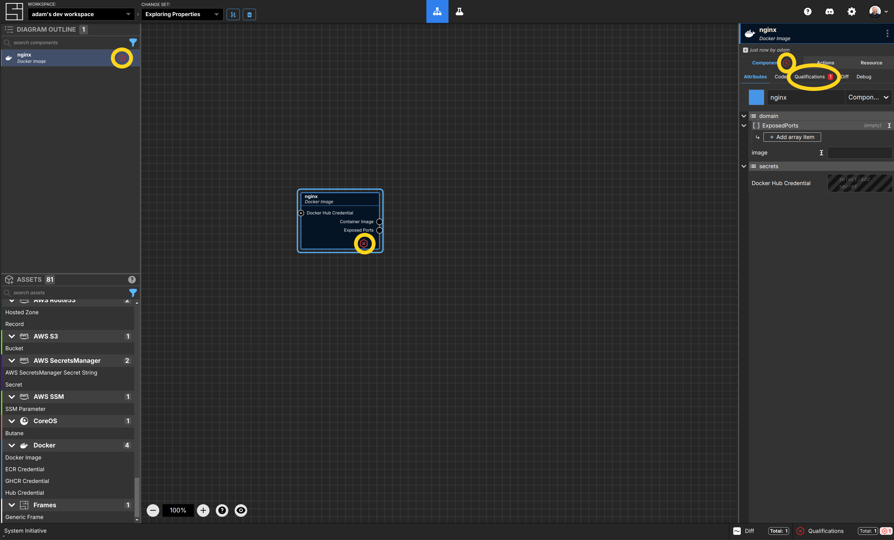

Notice the red hexagon in the lower right of your `nginx` Docker Image Component. This is the [qualification](/reference/vocabulary#qualification) icon - it is warning you that your Docker Image Component is misconfigured.

:::tip
You can also see a Components qualification status in the Diagram Outline, the Component panel, and the Qualifications sub-panel.
:::

## Investigate the Docker Images Failing Qualification

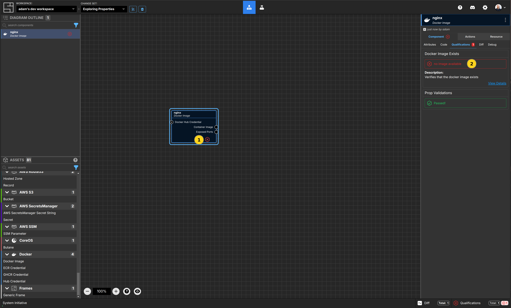

Click the red hexagon on you `nginx` Docker Image Component. The properties panel will change to the `Qualifications` sub-panel.

You will see that your Docker Image is failing the `Docker Image Exists` qualification, with the error message 'no image available'.

## Fixing the failing Qualification

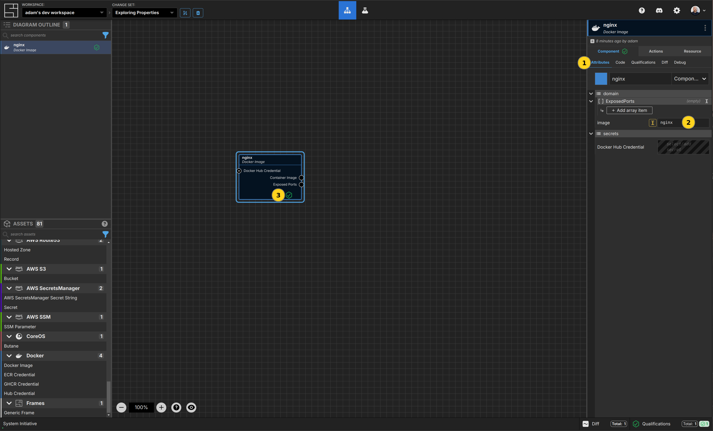

Select the `Attributes` sub-panel.

Set the `image` property to `nginx`.

The qualification icon will then turn green, confirming that a Docker Image named `nginx` exists in the Docker Hub.

## Add a Butane Component and set its properties

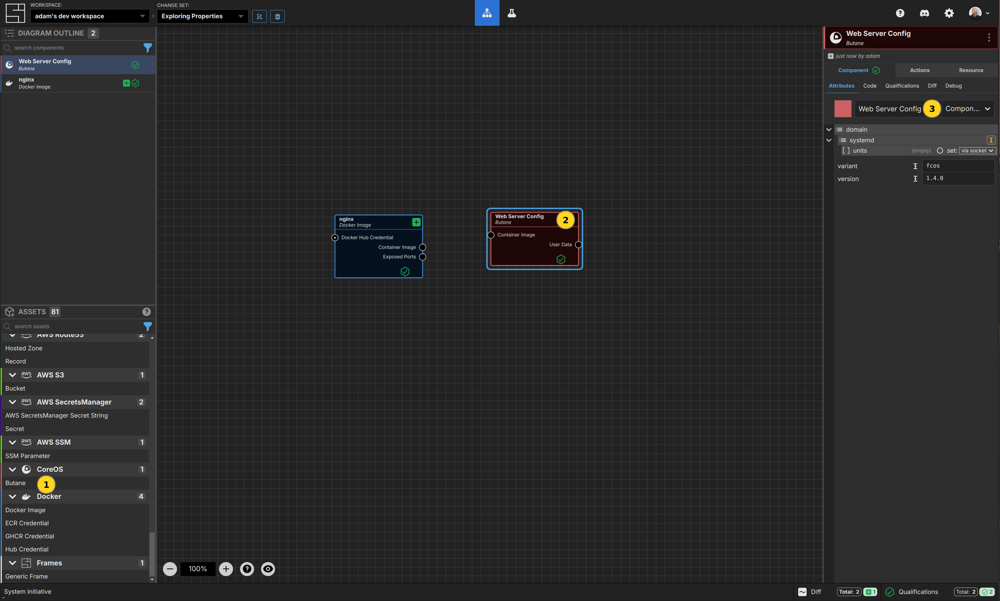

[Butane](https://coreos.github.io/butane/) is a configuration file format used by the [Fedora CoreOS](https://fedoraproject.org/coreos/) operating system.

Click on `Butane` from the `CoreOS` category of the Asset pallete, and drop it inside your workspace.

Name your Butane Component `Web Server Config`.

## Observe the systemd/units property of the Butane Component

The `systemd/units` property of the `Web Server Config` takes an array (as indicated by the `[ ]` symbol in front of it). It is currently empty, and configured to be automatically set via a socket.

## Manually setting the systemd/units property

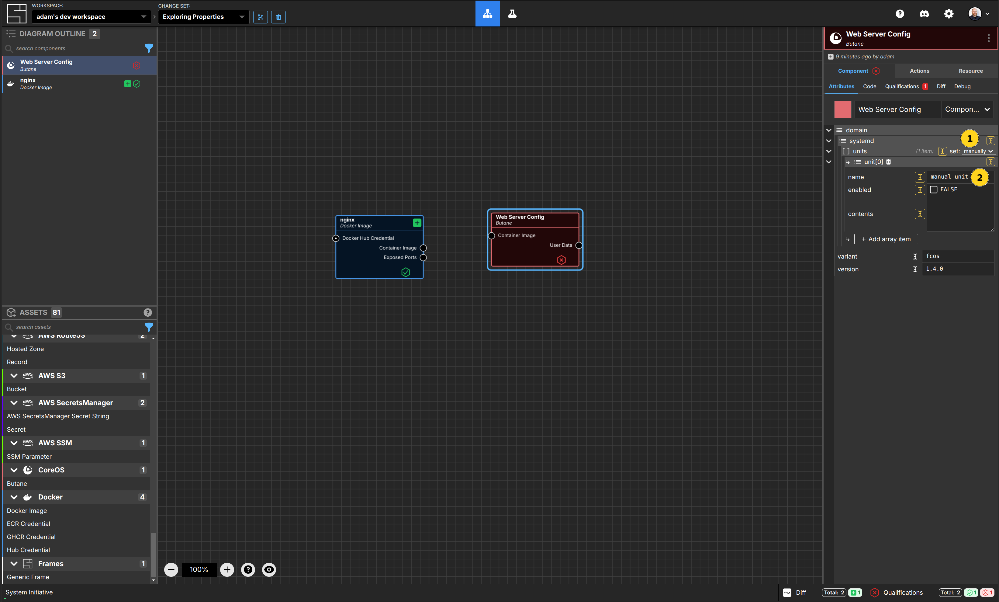

To manually set a property that would otherwise be configured by a socket, click the `set` dropdown, and select `manually`.

Click the `Add array item` button to add an entry titled `unit[0]` to the `systemd/units` array.

Set the `name` property of `unit[0]` to `manual-unit`.

:::tip
Notice that the `Web Server Config` is now failing its Qualification, as this is not a valid name for a Systemd unit file!
:::

## Deleting the system/units/unit[0] entry

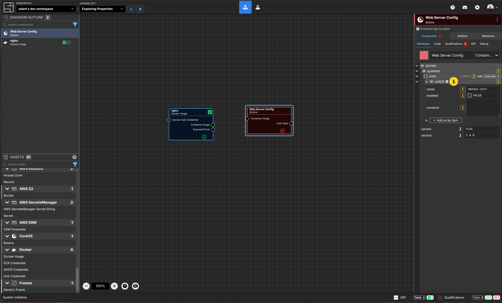

To delete the `unit[0]` entry, click the trash can icon in the header.

## Connect the Docker Image Component to the Butane Component

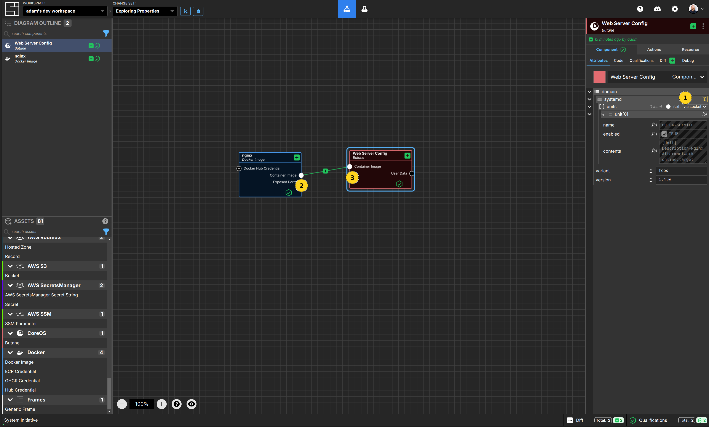

Switch the systemd/units property to be set `via socket`.

Connect the `Container Image` Output Socket of your `nginx` Docker Image Component to the `Container Image` Input Socket of your `Web Server Config` Butane Component.

## Observe the new system/units/unit[0] entry

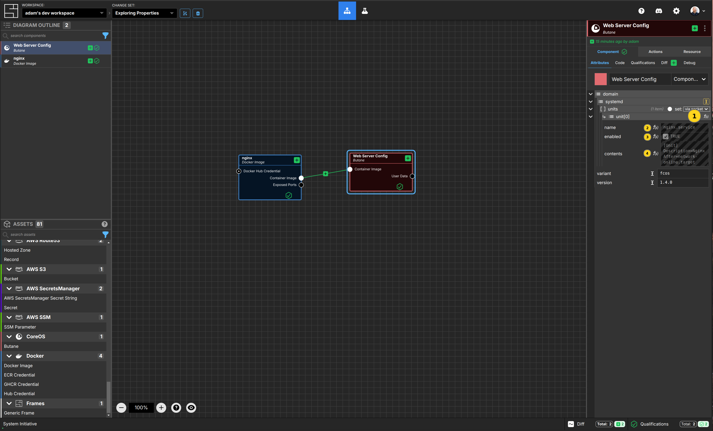

The new `unit[0]` entry is now set via a function, as indicated by the `f(x)` icon.

The `name`, `contents`, and `enabled` properties have their values inferred by the configuration of your `nginx` docker image.

## Viewing large properties

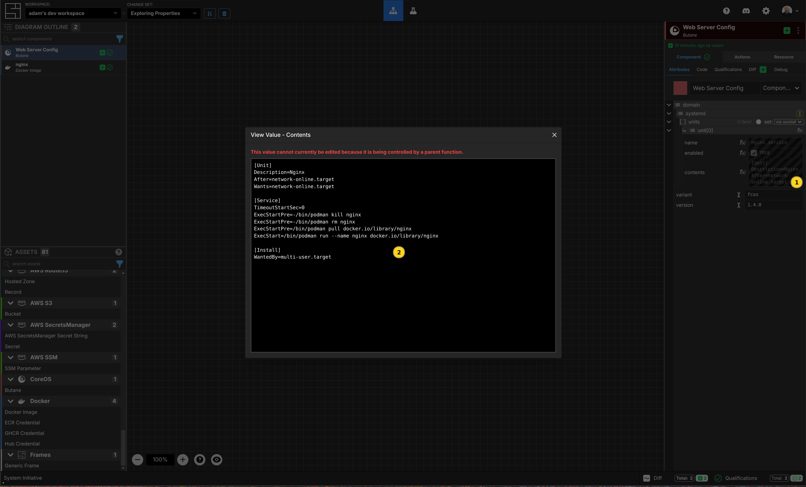

Some properties, such as `contents`, are too long to display in the panel. You can hover over the field and then click the icon to have them pop-out to a modal for easy viewing.

## Viewing generated code

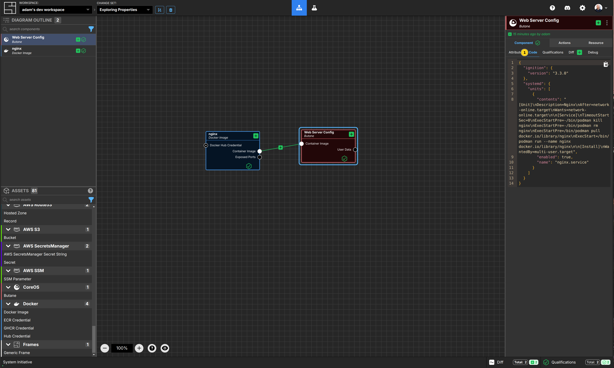

Click the `Code` sub-panel to see the JSON code as it would be processed by Butane.

## Apply the Change Set

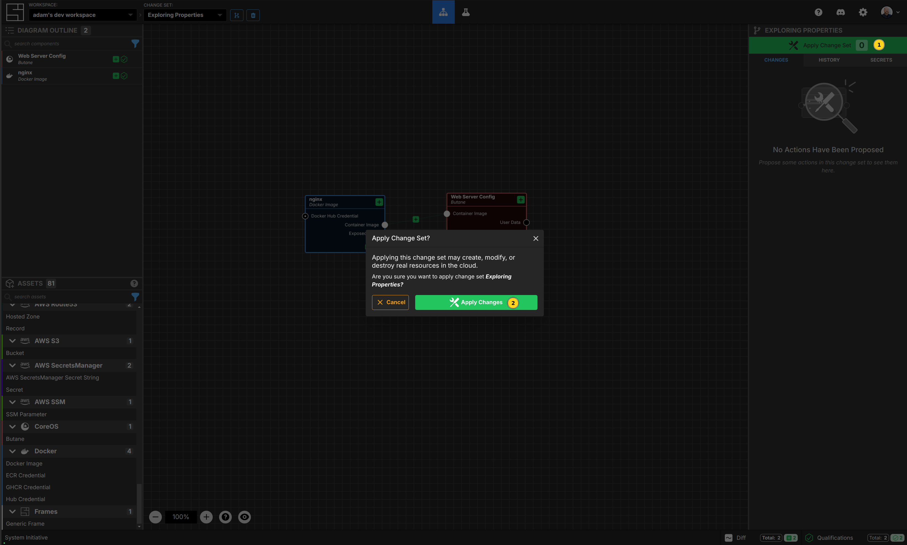

Press the Escape key, or click on the background of the canvas, to ensure the workspace itself is selected.

Click the `Apply Change Set` button.

Click the `Apply Changes` button in the modal to accept.

## Create another Change Set

Click the `Create Change Set` button.

Name your new Change Set `Exploring Part 2`, and click the `Create Change Set` button.

## Add an exposed port to your Docker Image

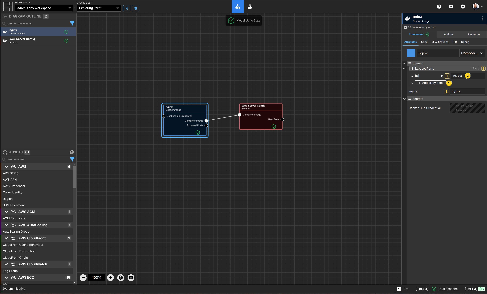

Click the `Add array item` button for the `ExposedPorts` property of your `nginx` Docker Image Component.

Set the `[0]` value to `80/tcp`.

## Check the Diff for your Docker Image and Butane Components

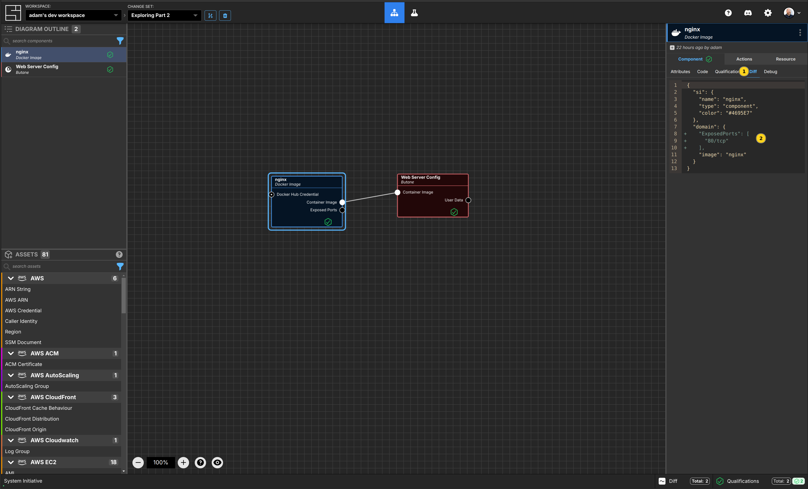

Click the `Diff` sub-panel for your `nginx` Docker Image Component. You'll see the currently set properties for the Component, and a visual diff of the changes made in this Change Set (compared to the values on HEAD).

Click your `Web Server Config` Butane Component, and you'll see that the entire systemd unit files contents have been updated.

## View the Debugging information

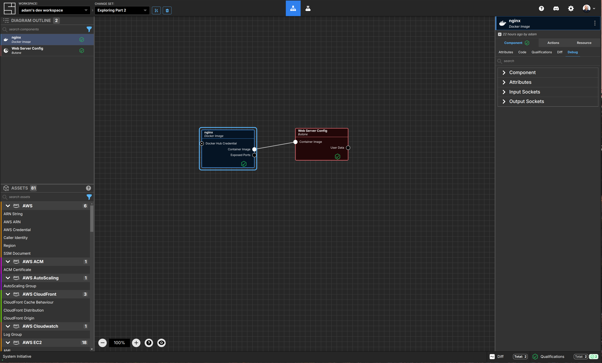

Click the `Debug` sub-panel for your `nginx` Docker Image Component. Here you will find detailed debugging information about the selected Components attributes, Input Sockets, and Output Sockets. This information is often useful when customizing or debugging System Initiative.

## Clean Up

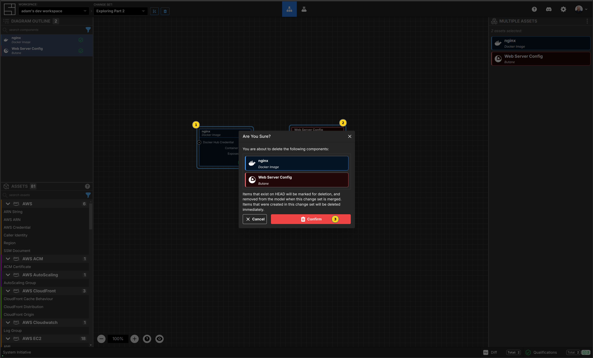

Clean up your workspace by highlighting the `nginx` Docker image and the `Web Server Config` Butane Components. Press the `Delete` key on your keyboard.

Click the `Confirm` button in the dialog to acknowledge you want to delete these two Components.

Click the `Apply Change Set` button. Your `nginx` and `Web Server Config` Components are now removed from your workspace.

## Congratulations

You've explored the properties panel! You learned how to:

- Investigate failing qualifications
- Change if properties are set automatically by sockets or manually
- Adding items to arrays and maps
- Delete items from arrays and maps
- View large properties in a modal
- See generated code for a Component
- View the diff between a Component on a Change Set and HEAD.
- View detailed debugging information about your Components

## Vocabulary
In this tutorial bits of System Initiative Vocabulary will be shown with a capital letter. 
All definitions for these can be found here: [System Initative - Vocabulary](https://docs.systeminit.com/reference/vocabulary) 