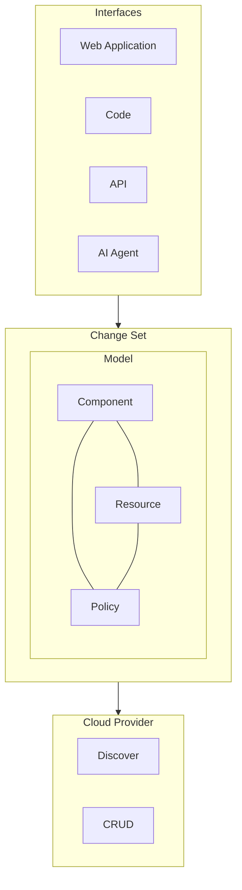

# What is System Initiative?

System Initiative is an AI Native Infrastructure Automation platform. To break that down:

- *AI Native*: Built from the ground up with artificial intelligence at the core of how you work with the system.

- *Infrastructure Automation*: It manages, provisions, configures, and monitors computing infrastructure (such as servers, networking, storage, clusters, etc.).

Anything you can do with Infrastructure as Code (Terraform, Pulumi, etc.), you can do with System Initiative: create new infrastructure, make re-usable templates, etc. In addition, System Initiative allows you to start from working infrastructure, integrate cleanly into third-party systems, embed your own policy directly, work in safe simulations that are always up to date, and leverage AI to accelerate everything.

## How does it work?

System Initiative works by making a high fidelity model of your infrastructure, and then allowing you (or an AI Agent) to build automation on top of the model. A good way to think about it is that we build a giant database of both the actual state of your infrastructure (what we call your *resources*), and what you think the configuration should be (what we call a *component*). Then we allow you to *program* changes to that model inside a safe, simulated environment called a *change set*. We keep track of every proposed change (and the actions needed to make that change in the real world) allow you to review them, and then *apply* them as needed.

These changes might be small - updating a single configuration option and updating the configuration. They might be large - deploying an entire new environment from scratch. They might represent deploying a new application or updating the version of an existing one. For any operation you need performed on infrastructure, you can do it through System Initiative.

A superpower of System Initiative is that it cares about *working infrastructure*, not about *how you got there*. For example, if you have an application already deployed and need to deploy it again in another region, the first step is to *discover* your existing application using System Initiative. That allows us to build the underlying *model* of your environment. Once we have that, it's trivial to propose rebuilding it in a new availability zone: all we need to do is make a *duplicate* of your model, change your region on the duplicate, review the change set, and apply.

Compare that with traditional infrastructure as code, where you would need to write the code primarily by hand, figure out how to integrate it into source control, set up a deployment pipeline, manage state files, etc.

Another example of this power is in day-two tasks, such as deploying new versions of an application to a cluster. With services like the AWS Elastic Container Service or Kubernetes, this is usually handled outside of your Infrastructure as Code loop, because there is no straightforward way to performa a surgical update of something like a tag. In System Initiative, this becomes a simple API call to update that component's configuration, and then apply the change set. It's a couple of lines of code.

We make this easy for you to do directly, either as code with our API or through our Web Application - but as an AI Native Infrastructure Automation platform, we also enable you to harness the power of modern AI Agents. Rather than having to manually do everything in System Initiative, you can ask your AI Agent to do it for you, using natural language. This opens up a new level of productivity - if you know what you want, you can ask the Agent to do it for you, and then review its work. If you know what you want, but don't remember exactly how to do it, no problem - just tell the agent, and it'll likely figure out the rest. Once you realize how powerful, flexible, and fast it is to do this kind of work with AI, you won't want to do it any other way.

System Initiative is an order of magnitude better at working with Infrastructure than using AI to work on infrastructure code alone, or using MCP Servers to make first-party API calls. When using AI with Infrastructure as Code, the underlying LLMs need to understand the syntax of the language at hand, how it translates to the underlying cloud provider's own guidance, how you laid out your repository, any relationships it has to other repositories, and more. The result is that it works when things are small, but breaks down badly at scale without considerable effort. When you make direct API calls to the cloud provider, you are YOLO-ing your infrastructure - asking the agent to work directly in the cloud on your behalf, which is an incredible risk.

A typical onboarding to System Initiative looks like:

- Discovering an existing application's infrastructure
- Looking at the map of the components and how they relate to each other
- Asking for a summary of how the architecture works
- Making updates to a component's configuration in a change set
- Reviewing the changes
- Applying the change set and taking the appropriate actions to update the underlying resources

It's dramatically more straightforward, takes far less time, and doesn't care at all about how you showed up. Come as you are, and focus on what needs to get done.

::: tip
Still not sure? Let's try an analogy. When you do Infrastructure Automation with Infrastructure as Code, you are writing code that gets applied to the cloud provider. It only works in one direction - you write code, it gets compiled, and the provider gets updated. You store state in a state file, which can get out of sync with the far side.

System Initiative is more like a programmable database, that models all the information 1:1. When you want to make a change, you make it directly in the database, which keeps track of it. So rather than embedding all the infrastructure declarations as 'code', they are 'data', and you can then write programs that manipulate that data.
:::

## Use Cases

### Automating Existing Infrastructure

System Initiative thrives when you start from working infrastructure. Discover what you already have, and then start making improvements. Create templates from working examples to enable re-deployment, utilize our API to simplify continuous delivery, or use the AI Agent to perform maintenance or migrate between architectures.

### Create new infrastructure

Start from the network, or from existing application code. Tell the AI Agent what you need, and iterate your way to a working, best-practice infrastructure.

### Review proposed changes

Everything that happens in System Initiative starts in a simulated Change Set. Everything is reviewable, with a full audit trail of every action taken. Changes are never stale because we automatically update every open change set as changes are applied to production.

### Manage complex, multi-environment deployments

If you have applications deployed across multiple environments, you know that managing them safely can be complex. System Initiative focuses you on automating *how* your environments change, rather than always forcing you to re-create them from scratch. Use templates to lay down flexible baseline environments, then manage their evolution through a combination of point changes, scripts, and AI assistance.

### Migrate between architectures

Start with your existing architecture, then ask the AI agent to examine it and translate it to the new architecture. For example, have the system discover an existing deployment on servers in EC2, and then translate that deployment to use AWS ECS, or write Kubernetes declarations.

### Automate application deployment

A typical continuous delivery pipeline will create an application artifact and then update the deployment with the new revision. This is very straightforward in System Initiative - you write a script with our API to take the new artifact, update the attribute of the component that deploys the application, and then apply the change set.

### Re-deploy applications in new environments, regions, etc.

Start from a working version in one region or environment. Then select all the infrastructure you want to duplicate, update the region, and apply the change set.

### Troubleshoot configuration problems

Provide the AI Agent with context about the problems you are seeing, and then let it inspect your infrastructure to find configuration errors.

### Recommend security and architecture improvements

Ask the Agent to review your existing infrastructure for security or architecture, and propose improvements. You can then review its recommendations, and take the ones that make sense.

## Learn More

- [Understand the System Initiative Architecture](./reference/architecture/index.md).
- [Leverage your Infrastructure as Code knowledge to learn System Initiative](./reference/iac-comparison.md).
- [Follow the Getting Started Tutorial](./tutorials/getting-started.md).
