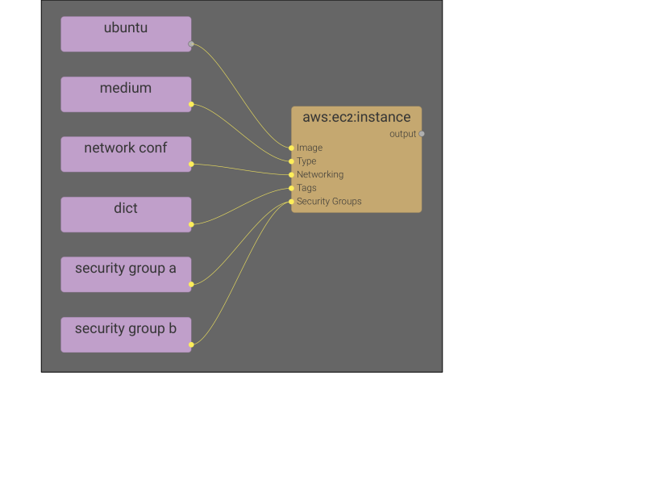

## Definitions

### System
* A system is a collection of components.
* A system is represented as a graph.
* A system has different views
   * Networking relationships.
   * Attachment relationships.
   * Dependencies relationships.

###Component
* A component has attribute(s).
* A component has state(s).
* Components have relationship(s).
* A component is represented as a node type.

### Entity
* An entinty is an instance of a component
* Entities have state(s).
* Entities have relationship(s).

### Operation
* An operation is an action performed on a component.
* An operation has input(s) and an output.
* Operations can be applied to components.
* The execution of an operation can be triggered by the user as needed.
* An operation is represented as a node.

### Action
* Actions are performed by the user.
* Actions are performed on objects via an interface (web or cli)
* Manually triggering the execution of an operation on a component would be an action.

### Graph
* A graph is a collection of nodes.

### Node
* A node is an item of a graph.
* A node has parameter(s).
* A node has an output.
* Parameters can be set explicitly.
* Parameters can be set by the output of a node.
* A node is connected to another node via a connection.

### Connection
* A connection represent a relationship between nodes.

### Provider
* A provider provides resources and functionalities through an integration.
* Ressources and functionalities are specific to each provider.

### Resource
* A resource is a primitive that implements a provider resource.
* A node can be of different kind of resource.

### Operator
* An operator is a primitive that implements a provider operation on a resource.
* An operation can be of different kind of operator.

 

## Design Principles

### Nodes

#### Component Graph Authoring
When authoring a components graph, the connections are on the left and right side of each node. This is a better design than top and bottom because it allows us to display all parameters on a node. Some nodes will be taller than others based on the amount of parameters they have.

Nodes can be collapsed so that we only see a connection from one node to the other without showing what paramerst it is connected to. 

