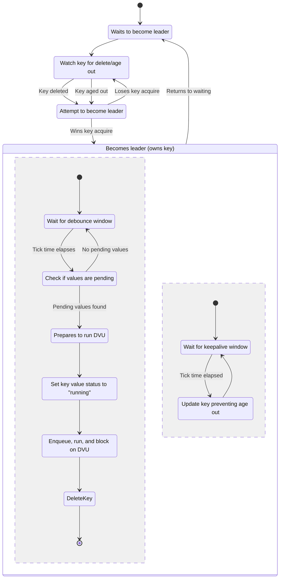

# Dependent Values Update Debouncer

## High Level Algorithm

The debouncer task coordinates with other debouncer tasks via a NATS KV store
which acts as a distributed lock (or could be though of as a leader election).
Each key corresponds to a unique change set within a workspace. That is, the
key is of the form `{workspace_pk}.{change_set_id}`. Additionally, there is a
`max_age` set for all keys which will naturally age out if no
update/delete/purge operations are performed. This "aging out" of a key should
only happen when a debouncer task crashes or panics without properly cleaning
up its state *or* when a Rebaser service is disconnected from its network or
connection to NATS (i.e. a network partition).

The general algorithm for each debouncer task is as follows:

